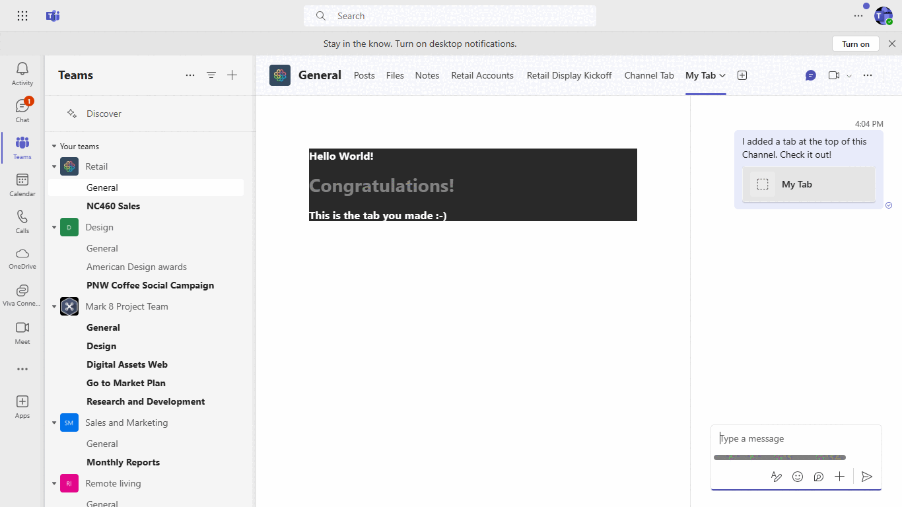
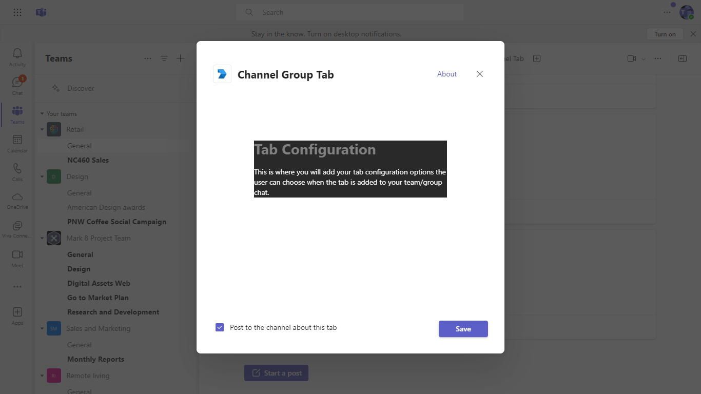
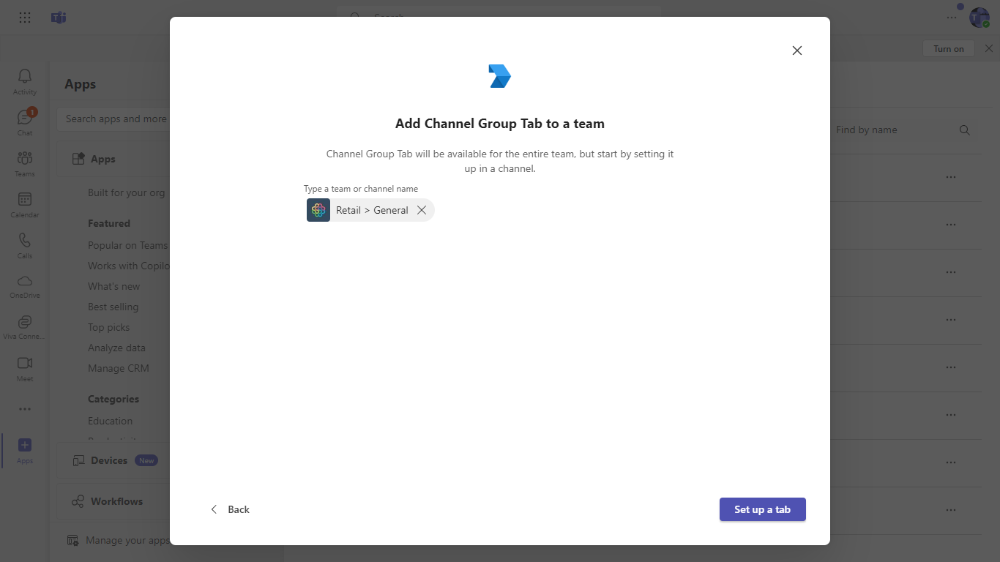
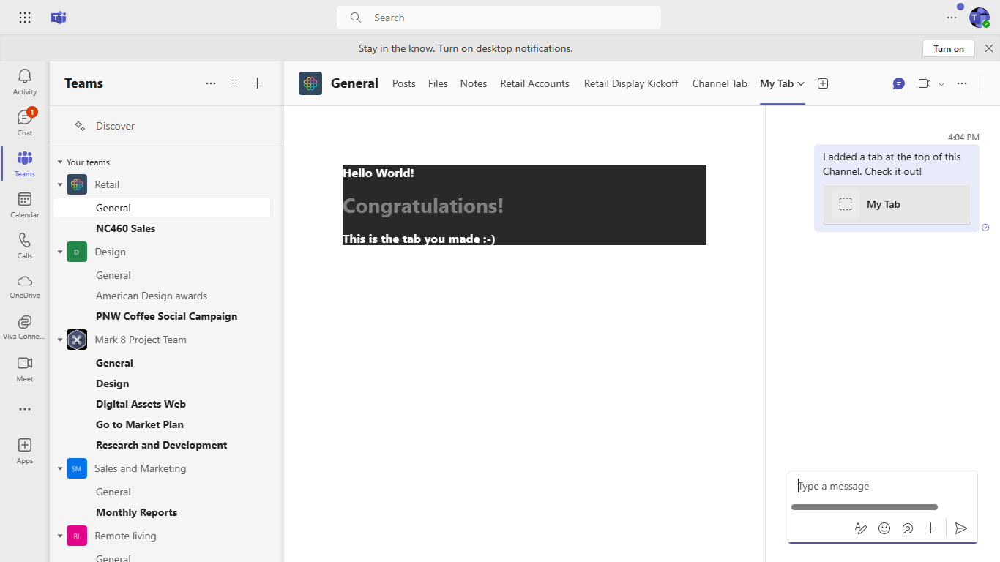

# Tabs quick start

Tabs are Teams-aware webpages embedded in Microsoft Teams. A channel/group tab delivers content to channels and group chats, and are a great way to create collaborative spaces around dedicated web-based content.

## Interaction with app.



## Prerequisites
-  [NodeJS](https://nodejs.org/en/)

-  [M365 developer account](https://docs.microsoft.com/en-us/microsoftteams/platform/concepts/build-and-test/prepare-your-o365-tenant) or access to a Teams account with the appropriate permissions to install an app.

## Setup.
Run ngrok - point to port 3978

    ```bash
    ngrok http --host-header=rewrite 3978
    ```

In the project directory, execute:

`npm install`

`npm start`

## Azure app Registration.

In Azure portal, Create a[App Registration](https://learn.microsoft.com/en-us/power-apps/developer/data-platform/walkthrough-register-app-azure-active-directory

## Setup for Bot

   In Azure portal, create a [Azure Bot resource](https://docs.microsoft.com/en-us/azure/bot-service/bot-service-quickstart-registration).
    - For bot handle, make up a name.
    - Select "Use existing app registration" (Create the app registration in Azure Active Directory beforehand.)
    - __*If you don't have an Azure account*__ create an [Azure free account here](https://azure.microsoft.com/en-us/free/)
    
   In the new Azure Bot resource in the Portal, 
    - Ensure that you've [enabled the Teams Channel](https://learn.microsoft.com/en-us/azure/bot-service/channel-connect-teams?view=azure-bot-service-4.0)
    - In Settings/Configuration/Messaging endpoint, enter the current `https` URL you were given by running ngrok.
    
## Deploy to Teams
Start debugging the project by hitting the `F5` key or click the debug icon in Visual Studio Code and click the `Start Debugging` green arrow button.

### NOTE: First time debug step
On the first time running and debugging your app you need allow the localhost certificate.  After starting debugging when Chrome is launched and you have installed your app it will fail to load.

- Open a new tab `in the same browser window that was opened`
- Navigate to `https://localhost:3000/tab`
- Click the `Advanced` button
- Select the `Continue to localhost`

### NOTE: Debugging
Ensure you have the Debugger for Chrome/Edge extension installed for Visual Studio Code from the marketplace.

### Build for production
`npm run build`

Builds the app for production to the `build` folder.\
It correctly bundles React in production mode and optimizes the build for the best performance.

The build is minified and the filenames include the hashes.\
Your app is ready to be deployed!

## Running the sample.







See the section about [deployment](https://facebook.github.io/create-react-app/docs/deployment) for more information.


