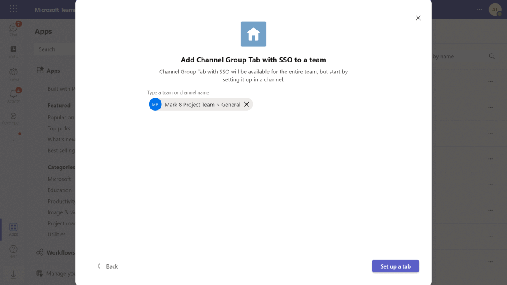
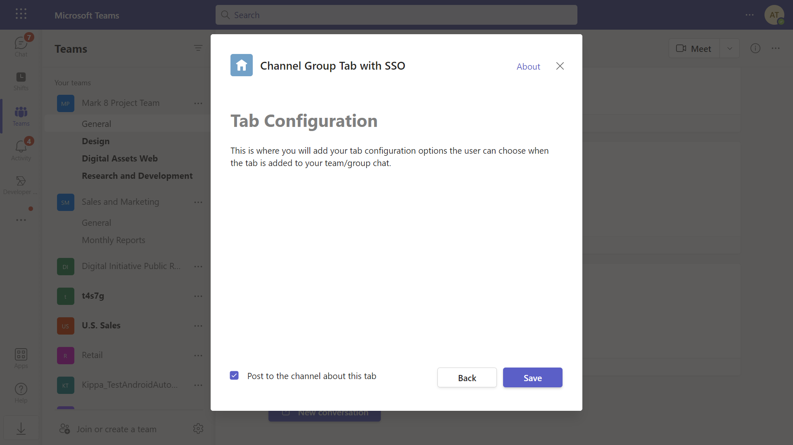
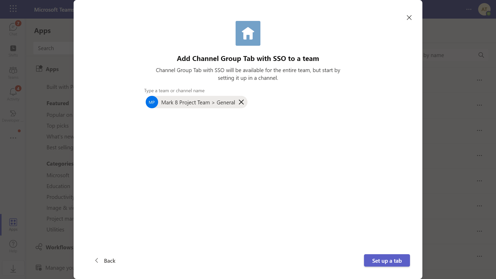
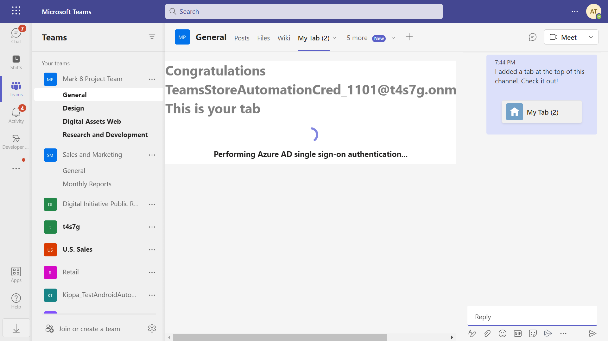

# Teams Tab SSO Authentication Sample Node.js

Explore this sample application that showcases Microsoft Entra SSO authentication within personal tabs in Microsoft Teams, allowing users to securely access their profiles and application APIs. With detailed setup guidance, including app registration, permissions configuration, and deployment using Microsoft 365 Agents Toolkit for Visual Studio, this sample is ideal for developers aiming to enhance their Teams applications with robust authentication features.

## Interaction with app



## Try it yourself - experience the App in your Microsoft Teams client
Please find below demo manifest which is deployed on Microsoft Azure and you can try it yourself by uploading the app package (.zip file link below) to your teams and/or as a personal app. (Sideloading must be enabled for your tenant; [see steps here](https://docs.microsoft.com/microsoftteams/platform/concepts/build-and-test/prepare-your-o365-tenant#enable-custom-teams-apps-and-turn-on-custom-app-uploading).).

**Channel and group tab with SSO quick-start:** [Manifest](/samples/tab-channel-group-sso-quickstart/csharp_dotnetcore/demo-manifest/tab-channel-group-sso-quickstart.zip)

## Prerequisites
-  [NodeJS](https://nodejs.org/en/)

- [dev tunnel](https://learn.microsoft.com/en-us/azure/developer/dev-tunnels/get-started?tabs=windows) or [Ngrok](https://ngrok.com/download) (For local environment testing) latest version (any other tunneling software can also be used)

-  [M365 developer account](https://docs.microsoft.com/en-us/microsoftteams/platform/concepts/build-and-test/prepare-your-o365-tenant) or access to a Teams account with the appropriate permissions to install an app.

- [Microsoft 365 Agents Toolkit for VS Code](https://marketplace.visualstudio.com/items?itemName=TeamsDevApp.ms-teams-vscode-extension) or [TeamsFx CLI](https://learn.microsoft.com/microsoftteams/platform/toolkit/teamsfx-cli?pivots=version-one)

## Run the app (Using Microsoft 365 Agents Toolkit for Visual Studio Code)

The simplest way to run this sample in Teams is to use Microsoft 365 Agents Toolkit for Visual Studio Code.

1. Ensure you have downloaded and installed [Visual Studio Code](https://code.visualstudio.com/docs/setup/setup-overview)
1. Install the [Microsoft 365 Agents Toolkit extension](https://marketplace.visualstudio.com/items?itemName=TeamsDevApp.ms-teams-vscode-extension)
1. Select **File > Open Folder** in VS Code and choose this samples directory from the repo
1. Using the extension, sign in with your Microsoft 365 account where you have permissions to upload custom apps
1. Select **Debug > Start Debugging** or **F5** to run the app in a Teams web client.
1. In the browser that launches, select the **Add** button to install the app to Teams.

> If you do not have permission to upload custom apps (uploading), Microsoft 365 Agents Toolkit will recommend creating and using a Microsoft 365 Developer Program account - a free program to get your own dev environment sandbox that includes Teams.
  
## Setup

1. Register a new application in the [Microsoft Entra ID – App Registrations](https://go.microsoft.com/fwlink/?linkid=2083908) portal.

  - On the overview page, copy and save the **Application (client) ID, Directory (tenant) ID**. You’ll need those later when updating your Teams application manifest and in the .env file at both client and server.
  - Navigate to the **Certificates & secrets**. In the Client secrets section, click on "+ New client secret". Add a description (Name of the secret) for the secret and select “Never” for Expires. Click "Add". Once the client secret is created, copy its value, it need to be placed in the appsettings.json file.
  - Navigate to **API Permissions**, and make sure to add the follow permissions:
   Select Add a permission
      * Select Add a permission
      * Select Microsoft Graph -\> Delegated permissions.
      * `User.Read` (enabled by default)
      * Click on Add permissions. Please make sure to grant the admin consent for the required permissions.
  - Navigate to **Authentication**
    If an app hasn't been granted IT admin consent, users will have to provide consent the first time they use an app.

    Set a redirect URI:
    * Select **Add a platform**.
    * Select **web**.
    * Enter the **redirect URI** for your app. This will be the page where a successful implicit grant flow will redirect the user. 
    Set it as `https://Base_Url/auth-end`, ex:`https://f631****.ngrok-free.app/auth-end` 

    Next, enable implicit grant by checking the following boxes:  
    ✔ ID Token  
    ✔ Access Token

 - Under **Manage**, select **Expose an API**. 
    - Select the **Set** link to generate the Application ID URI in the form of `api://{AppID}`. Insert your fully qualified domain name (with a forward slash "/" appended to the end) between the double forward slashes and the GUID. The entire ID should have the form of: `api://fully-qualified-domain-name.com/{AppID}`
        * ex: `api://subdomain.example.com/00000000-0000-0000-0000-000000000000`.
        
        The fully qualified domain name is the human readable domain name from which your app is served. If you are using a tunneling service such as ngrok, you will need to update this value whenever your ngrok subdomain changes.
        * ex: `api://f631****.ngrok-free.app/9051a142-901a-4384-a83c-556c2888b071`.
 
    - Select the **Add a scope** button. In the panel that opens, enter `access_as_user` as the **Scope name**.
    - Set **Who can consent?** to `Admins and users`
    - Fill in the fields for configuring the admin and user consent prompts with values that are appropriate for the `access_as_user` scope:
        * **Admin consent display name:** Teams can access the user’s profile.
        * **Admin consent description**: Allows Teams to call the app’s web APIs as the current user.
    - Ensure that **State** is set to **Enabled**
    - Select the **Add scope** button to save 
        * The domain part of the **Scope name** displayed just below the text field should automatically match the **Application ID** URI set in the previous step, with `/access_as_user` appended to the end:
            * `api://subdomain.example.com/00000000-0000-0000-0000-000000000000/access_as_user`
    - In the **Authorized client applications** section, identify the applications that you want to authorize for your app’s web application. Select *Add a client application*. Enter each of the following client IDs and select the authorized scope you created in the previous step:
        * `1fec8e78-bce4-4aaf-ab1b-5451cc387264` (Teams mobile/desktop application)
        * `5e3ce6c0-2b1f-4285-8d4b-75ee78787346` (Teams web application)
        
 2. Setup for Bot

   In Azure portal, create a [Azure Bot resource](https://docs.microsoft.com/en-us/azure/bot-service/bot-service-quickstart-registration).
    - For bot handle, make up a name.
    - Select "Use existing app registration" (Create the app registration in Microsoft Entra ID beforehand.)
    - __*If you don't have an Azure account*__ create an [Azure free account here](https://azure.microsoft.com/en-us/free/)
    
   In the new Azure Bot resource in the Portal, 
    - Ensure that you've [enabled the Teams Channel](https://learn.microsoft.com/en-us/azure/bot-service/channel-connect-teams?view=azure-bot-service-4.0)
    - In Settings/Configuration/Messaging endpoint, enter the current `https` URL you were given by running the tunnelling application. Append with the path `/api/messages`
    
 3. Setup NGROK
 - Run ngrok - point to port 3978

   ```bash
   ngrok http 3978 --host-header="localhost:3978"
   ```  

   Alternatively, you can also use the `dev tunnels`. Please follow [Create and host a dev tunnel](https://learn.microsoft.com/en-us/azure/developer/dev-tunnels/get-started?tabs=windows) and host the tunnel with anonymous user access command as shown below:

   ```bash
   devtunnel host -p 3978 --allow-anonymous
   ```

 4. Setup for code
   - Clone the repository
    ```bash
    git clone https://github.com/OfficeDev/Microsoft-Teams-Samples.git
    ```
  - Update the `.env` configuration for the bot to use the `REACT_APP_AZURE_APP_REGISTRATION_ID` and `REACT_APP_BASE_URL`, `BaseUrl` with application base url. For e.g., your ngrok or dev tunnels url. (Note the MicrosoftAppId is the REACT_APP_AZURE_APP_REGISTRATION_ID created in step 1.

 - In a terminal, navigate to `tab-channel-group-sso-quickstart/js`
 - Install modules

    ```bash
    npm install
    ```
- Run Client
    - Run `npm start` command in terminal
    - The client will start running on 3000 port
- Run Server
    - Open new terminal
    - Change directory to `api-server` folder with command i.e. `cd api-server`
    - Install pacakge with npm install
    - npm start
    - The server will start running on 5000 port
    
5. Setup Manifest for Teams

- **This step is specific to Teams.**
    - Edit the `manifest.json` contained in the `appManifest/` folder to replace with your MicrosoftAppId (that was created in step1.1 and is the same value of MicrosoftAppId in `.env` file) *everywhere* you see the place holder string `{MicrosoftAppId}` (depending on the scenario the Microsoft App Id may occur multiple times in the `manifest.json`)
    - - **Edit** the `manifest.json` for validDomains and REACT_APP_BASE_URL replace `{{domain-name}}` with base Url of your domain. E.g. if you are using ngrok it would be `https://1234.ngrok-free.app` then your domain-name will be `1234.ngrok-free.app` and if you are using dev tunnels then your domain will be like: `12345.devtunnels.ms`.
    
     - **Edit** the `manifest.json` for `webApplicationInfo` resource `""api://<<REACT_APP_BASE_URL>>/<<REACT_APP_AZURE_APP_REGISTRATION_ID>>""` with MicrosoftAppId. E.g. `""api://<<ngrok-free.app>><<XXXXXXXXXXXXXXXXXXXxx>>
     
    - Zip up the contents of the `appManifest/` folder to create a `manifest.zip`
    - Upload the `manifest.zip` to Teams (in the left-bottom *Apps* view, click "Upload a custom app")

## Running the sample







## Further Reading.
[Tab-channel-group-sso-quickstart](https://learn.microsoft.com/en-us/microsoftteams/platform/tabs/how-to/create-channel-group-tab?pivots=node-java-script)


