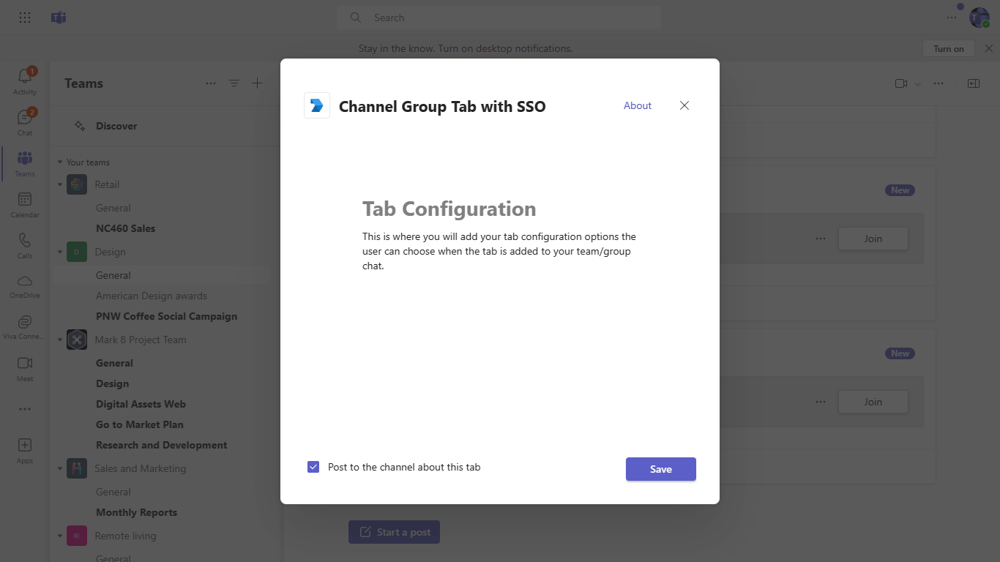

# Teams Tab SSO Authentication

Tabs are Teams-aware webpages embedded in Microsoft Teams. Personal tabs are scoped to a single user. They can be pinned to the left navigation bar for easy access.

## Prerequisites
-  [NodeJS](https://nodejs.org/en/)

-  [ngrok](https://ngrok.com/)

-  [M365 developer account](https://docs.microsoft.com/en-us/microsoftteams/platform/concepts/build-and-test/prepare-your-o365-tenant) or access to a Teams account with the appropriate permissions to install an app.

## ngrok

Teams needs to access your tab from a publically accessible URL. If you are running your app in localhost, you will need to use a tunneling service like ngrok. Run ngrok and point it to localhost.
  `ngrok http -host-header=rewrite 3000`

### Register your application with Azure AD

1. Register a new application in the [Azure Active Directory – App Registrations](https://go.microsoft.com/fwlink/?linkid=2083908) portal.
2. On the overview page, copy and save the **Application (client) ID, Directory (tenant) ID**. You’ll need those later when updating your Teams application manifest and in the .env file at both client and server.
3. Navigate to the **Certificates & secrets**. In the Client secrets section, click on "+ New client secret". Add a description (Name of the secret) for the secret and select “Never” for Expires. Click "Add". Once the client secret is created, copy its value, it need to be placed in the appsettings.json file.
4. Navigate to **Authentication**
    If an app hasn't been granted IT admin consent, users will have to provide consent the first time they use an app.

    Set a redirect URI:
    * Select **Add a platform**.
    * Select **web**.
    * Enter the **redirect URI** for your app. This will be the page where a successful implicit grant flow will redirect the user. 
    Set it as `https://Base_Url/auth-end`, ex:`https://f631****.ngrok.io/auth-end` 

    Next, enable implicit grant by checking the following boxes:  
    ✔ ID Token  
    ✔ Access Token

5. Under **Manage**, select **Expose an API**. 
    - Select the **Set** link to generate the Application ID URI in the form of `api://{AppID}`. Insert your fully qualified domain name (with a forward slash "/" appended to the end) between the double forward slashes and the GUID. The entire ID should have the form of: `api://fully-qualified-domain-name.com/{AppID}`
        * ex: `api://subdomain.example.com/00000000-0000-0000-0000-000000000000`.
        
        The fully qualified domain name is the human readable domain name from which your app is served. If you are using a tunneling service such as ngrok, you will need to update this value whenever your ngrok subdomain changes.
        * ex: `api://f631****.ngrok.io/9051a142-901a-4384-a83c-556c2888b071`.
 
    - Select the **Add a scope** button. In the panel that opens, enter `access_as_user` as the **Scope name**.
    - Set **Who can consent?** to `Admins and users`
    - Fill in the fields for configuring the admin and user consent prompts with values that are appropriate for the `access_as_user` scope:
        * **Admin consent display name:** Teams can access the user’s profile.
        * **Admin consent description**: Allows Teams to call the app’s web APIs as the current user.
    - Ensure that **State** is set to **Enabled**
    - Select the **Add scope** button to save 
        * The domain part of the **Scope name** displayed just below the text field should automatically match the **Application ID** URI set in the previous step, with `/access_as_user` appended to the end:
            * `api://subdomain.example.com/00000000-0000-0000-0000-000000000000/access_as_user`
    - In the **Authorized client applications** section, identify the applications that you want to authorize for your app’s web application. Select *Add a client application*. Enter each of the following client IDs and select the authorized scope you created in the previous step:
        * `1fec8e78-bce4-4aaf-ab1b-5451cc387264` (Teams mobile/desktop application)
        * `5e3ce6c0-2b1f-4285-8d4b-75ee78787346` (Teams web application)

## Set up the client .env with the following keys:
    - `"REACT_APP_AZURE_APP_REGISTRATION_ID"` : Application ID of the Azure AD application
    - `"REACT_APP_BASE_URL"` : Ngrok URL you get after running the ngrok command.

## Set up the `api-server` .env with the following keys:
Go to the folder `api-server` and update following values in .env files

    - `"CLIENT_ID"` : Application ID of the Azure AD application
    - `"CLIENT_SECRET"` : Application secret of the Azure AD application

## Build and Run
You can build and run the project from the command line or an IDE:

1. Navigate to the Project root folder
2. Build Client
    - Open terminal
    - Install pacakge with npm install
    - npm run build
3. Run Client
    - Open new terminal
    - npm start
    - The client will start running on 3000 port
4. Run Server
    - Open new terminal
    - Change directory to `api-server` folder with command i.e. `cd api-server`
    - Install pacakge with npm install
    - npm start
    - The server will start running on 5000 port
5. Update the manifest's `<<REACT_APP_AZURE_APP_REGISTRATION_ID>>` & `<<REACT_APP_BASE_URL>>` with their repective values and zip it under appPackage folder
6. Now your application is running and ready to upload
