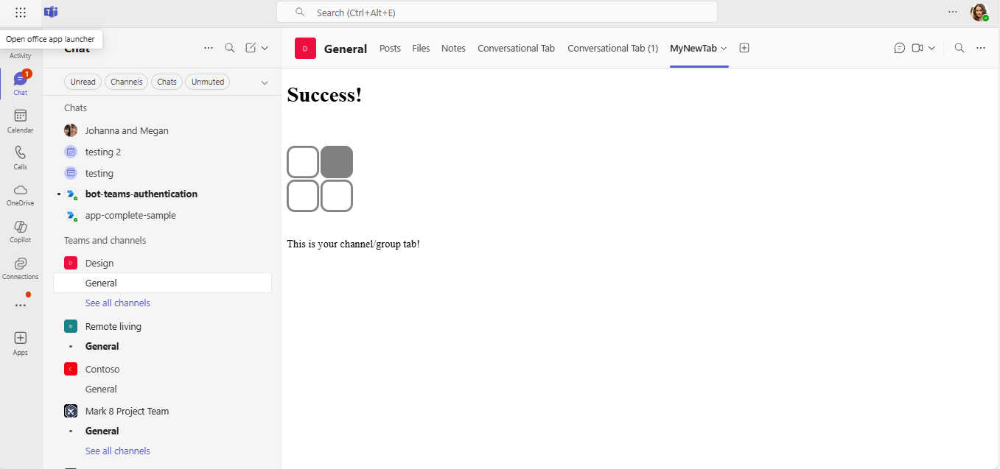

# Channel and group tabs in Python Flask

Explore how to create custom channel and group tabs for Microsoft Teams using Python Flask in this comprehensive sample application. This guide provides detailed steps for setting up your development environment, configuring the app manifest, and testing the integration with local tunneling solutions like dev tunnels, enabling seamless interaction within Teams.

## Interaction with app


## Included Features
* Tabs
* Channel and Group Tab Configuration

## Prerequisites

- [Python](https://www.python.org/downloads/) version 3.8 or higher

  Check Python version:
  ```bash
  python --version
  ```

- [pip](https://pip.pypa.io/en/stable/installation/) (Python package installer)

- [dev tunnel](https://learn.microsoft.com/en-us/azure/developer/dev-tunnels/get-started?tabs=windows) or [Ngrok](https://ngrok.com/download) (For local environment testing) latest version (any other tunneling software can also be used)
  
- [Teams](https://teams.microsoft.com) Microsoft Teams is installed and you have an account

- [Microsoft 365 Agents Toolkit for VS Code](https://learn.microsoft.com/en-us/microsoftteams/platform/toolkit/teams-toolkit-fundamentals) (Optional but recommended)

## Run the app (Using Microsoft 365 Agents Toolkit for VS Code)

The simplest way to run this sample in Teams is to use Microsoft 365 Agents Toolkit for VS Code.

1. Install [Visual Studio Code](https://code.visualstudio.com/download)
2. Install [Microsoft 365 Agents Toolkit extension](https://marketplace.visualstudio.com/items?itemName=TeamsDevApp.ms-teams-vscode-extension)
3. Open the project folder in VS Code
4. Press F5 or select **Run and Debug** > **Debug in Teams (Chrome)**
5. Sign in to Microsoft 365 Agents Toolkit with a **Microsoft 365 work or school account**
6. The toolkit will automatically:
   - Start the dev tunnel
   - Install Python dependencies
   - Start the Flask application
   - Launch Teams with your app

> If you do not have permission to upload custom apps (sideloading), Microsoft 365 Agents Toolkit will recommend creating and using a Microsoft 365 Developer Program account - a free program to get your own dev environment sandbox that includes Teams.

## Manual Setup

1. **Clone the repository**
   ```bash
   git clone https://github.com/OfficeDev/Microsoft-Teams-Samples.git
   cd Microsoft-Teams-Samples/samples/tab-channel-group/python
   ```

2. **Set up Python virtual environment**
   ```bash
   python -m venv .venv
   
3. **Install dependencies**
   ```bash
   pip install flask
   ```

4. **Start dev tunnel** (point to port 3978)
   ```bash
   devtunnel host -p 3978 --allow-anonymous
   ```
   
   Note the tunnel URL (e.g., `https://abc123.devtunnels.ms`)

5. **Update environment configuration**
   
   ## App Registration

   ### Register your application with Azure AD

   1. Register a new application in the [Microsoft Entra ID – App Registrations](https://go.microsoft.com/fwlink/?linkid=2083908) portal.
   2. Select **New Registration** and on the *register an application page*, set following values:
         * Set **name** to your app name.
         * Choose the **supported account types** (any account type will work)
         * Leave **Redirect URI** empty.
         * Choose **Register**.
   3. On the overview page, copy and save the **Application (client) ID, Directory (tenant) ID**. You'll need those later when updating your Teams application manifest and in the appsettings.json.
   4. Navigate to **API Permissions**, and make sure to add the follow permissions:
         * Select Add a permission
         * Select Microsoft Graph -> Delegated permissions.
         * `User.Read` (enabled by default)
         * Click on Add permissions. Please make sure to grant the admin consent for the required permissions.

   Update `env/.env.local` with your tunnel domain:
   ```
   TAB_DOMAIN=abc123.devtunnels.ms
   TAB_ENDPOINT=https://abc123.devtunnels.ms
   ```

6. **Update the manifest**
   
   In `appManifest/build/manifest.local.json`, replace:
   - All instances of `localhost:3978` with your tunnel domain
   - Update `validDomains` to include your tunnel domain

7. **Run the Flask application**
   ```bash
   python app.py
   ```
   
   The app will start on `https://localhost:3978`

8. **Create Teams app package**
   ```bash
   python create_package.py
   ```

9. **Upload to Teams**
   - Go to Microsoft Teams
   - From the lower left corner, select **Apps**
   - Choose **Upload a custom App**
   - Navigate to `appManifest/build/` folder
   - Select `appManifest.local.zip` and choose **Open**


### Useful Commands

```bash
# Check if app is running
curl -k https://localhost:3978/health

# Sync domains automatically
python sync_domains.py

# Create new app package
python create_package.py

# Check tunnel status
devtunnel show

# SSL Certificate Commands
# Check if SSL certificates exist
dir "%USERPROFILE%\.fx\certificate\" 

# View SSL certificate details (requires OpenSSL)

openssl x509 -in "%USERPROFILE%\.fx\certificate\localhost.crt" -text -noout # Windows

# Test HTTPS connection
curl -k https://localhost:3978/health

# Generate new localhost SSL certificate (if needed)
# Note: Teams Toolkit automatically generates these certificates
```

## Configuration

### Environment Variables (`.env.local`)
```bash
TEAMSFX_ENV=local
TEAMS_APP_ID=your-app-id
TAB_DOMAIN=your-tunnel-domain
TAB_ENDPOINT=https://your-tunnel-domain
SSL_CRT_FILE=%USERPROFILE%\.fx\certificate\localhost.crt
SSL_KEY_FILE=%USERPROFILE%\.fx\certificate\localhost.key
```

### SSL Certificate Configuration
The app automatically uses SSL certificates for HTTPS, which is required by Microsoft Teams:

**Certificate Location:**
```bash
%USERPROFILE%\.fx\certificate\localhost.crt  # SSL Certificate (Windows)
%USERPROFILE%\.fx\certificate\localhost.key  # Private Key (Windows)
$HOME/.fx/certificate/localhost.crt         # SSL Certificate (macOS/Linux)
$HOME/.fx/certificate/localhost.key         # Private Key (macOS/Linux)
```

**Automatic Behavior:**
- If certificates exist: Runs on `https://localhost:3978`
- If certificates missing: Falls back to `http://localhost:3978`
- Teams Toolkit automatically generates certificates during setup

### Manifest Configuration
The manifest supports environment variable substitution:
- `${{TEAMS_APP_ID}}` - Your Teams app ID
- `${{TAB_DOMAIN}}` - Your tunnel domain
- Automatic processing during deployment

## Running the sample

The app allows users to configure custom tabs in Microsoft Teams channels and group chats, with options to select between Gray and Red themed tabs.

### Configuration Flow

**Step 1: Configure Teams**


**Step 2: Setup Tab**


**Step 3: Gray Tab Configuration**


**Step 4: Gray Tab Result**


**Step 5: Red Tab Configuration**


**Step 6: Red Tab Result**


## Development Tips

1. **Auto-restart during development**: Use Flask's debug mode for automatic reloading
2. **Domain changes**: When tunnel domain changes, run `sync_domains.py` and recreate the app package
3. **Testing**: Test both configuration page (`/tab`) and content pages (`/gray`, `/red`)
4. **Debugging**: Check browser developer tools and Flask console for errors

## Further Reading

- [Microsoft Teams Tabs Documentation](https://learn.microsoft.com/microsoftteams/platform/tabs/what-are-tabs)
- [Create a Custom Channel and Group Tab](https://docs.microsoft.com/microsoftteams/platform/tabs/how-to/create-channel-group-tab)
- [Teams JavaScript SDK](https://learn.microsoft.com/microsoftteams/platform/tabs/how-to/using-teams-client-sdk)
- [Flask Documentation](https://flask.palletsprojects.com/)
- [Dev Tunnels Documentation](https://learn.microsoft.com/en-us/azure/developer/dev-tunnels/)

## License

This project is licensed under the MIT License - see the LICENSE file for details.


