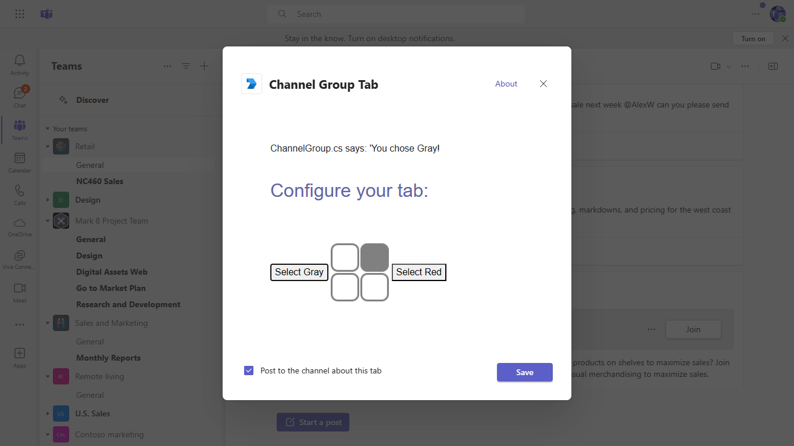
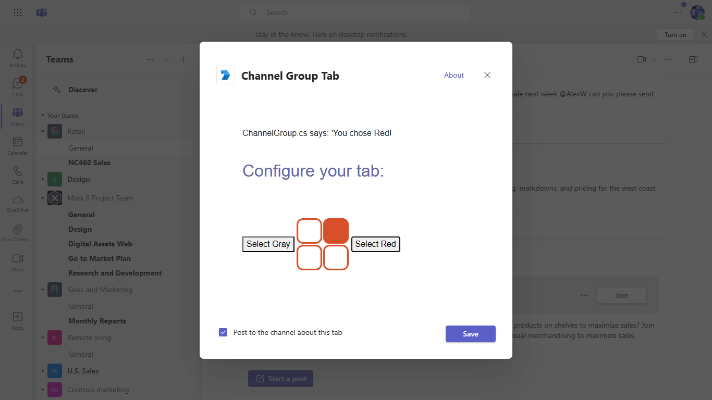
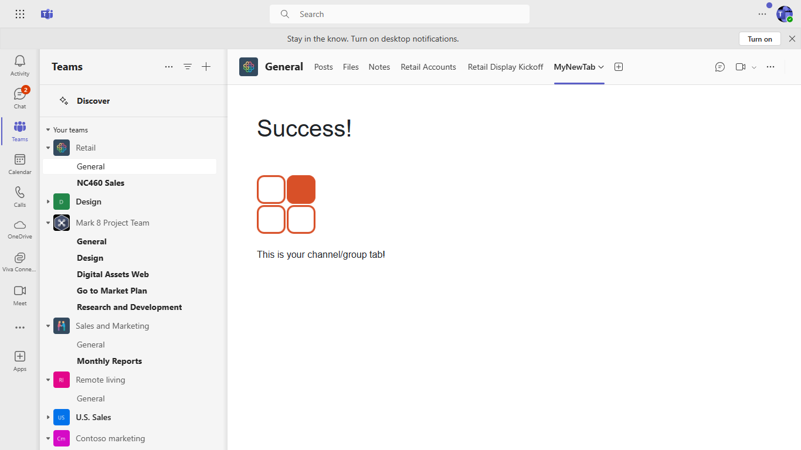

# Channel and group tabs in ASP.NET Core with Razor pages

In this quickstart we'll walk-through creating a custom channel/group tab with C# and ASP.Net Core Razor page. We'll also use App Studio for Microsoft Teams to finalize your app manifest and deploy your tab to Teams.

## Running the sample

For complete instructions on running this sample see:

[Create a Custom Channel and Group Tab with ASP.NET Core](https://docs.microsoft.com/microsoftteams/platform/tabs/quickstarts/create-channel-group-tab-dotnet-core)
