# teams-tab-spfx

## Summary

# Build Microsoft Teams tab using SharePoint Framework

Starting with the SharePoint Framework v1.8, you can implement your Microsoft Teams tabs using SharePoint Framework. Using SharePoint Framework significantly simplifies Teams tab development process as Teams tabs can be automatically hosted within SharePoint without any need for external services.

## Used SharePoint Framework Version


## Applies to

- [SharePoint Framework](https://aka.ms/spfx)
- [Microsoft 365 tenant](https://docs.microsoft.com/en-us/sharepoint/dev/spfx/set-up-your-developer-tenant)

> Get your own free development tenant by subscribing to [Microsoft 365 developer program](http://aka.ms/o365devprogram)

## Prerequisites

- [App Catalog site](https://docs.microsoft.com/en-us/sharepoint/dev/spfx/set-up-your-developer-tenant#create-app-catalog-site)
- [Node.js](https://nodejs.org/en/download/releases/) version 10.X
- Install [glup](https://docs.microsoft.com/en-us/sharepoint/dev/spfx/set-up-your-development-environment#install-gulp)
- Install [Yeoman](https://docs.microsoft.com/en-us/sharepoint/dev/spfx/set-up-your-development-environment#install-yeoman)
- Install [Yeoman SharePoint generator](https://docs.microsoft.com/en-us/sharepoint/dev/spfx/set-up-your-development-environment#install-yeoman-sharepoint-generator)


## Minimal Path to Awesome

1) Clone this repository

    ```bash
    git clone https://github.com/Trinetra-MSFT/Teams-SPFx-Tab.git
    ```

1) If you are using Visual Code
   - Launch Visual Studio Code
   - File -> Open Folder -> Project/Solution
   
1) Ensure that you are at the solution folder
1) in the command-line run:
1) **npm install**
1) **gulp serve**

## Package and deploy your web part to SharePoint

Ensure that your console is activated in the root folder of the solution where was created.

1. Execute the following commands to build bundle your solution. This executes a release build of your project by using a dynamic label as the host URL for your assets.

    ```console
    gulp bundle --ship
    ```

1. Execute the following task to package your solution. This creates an updated **teams-tab-webpart.sppkg** package on the **sharepoint/solution** folder.

    ```console
    gulp package-solution --ship
    ```

1. Next, you need to deploy the package that was generated to the tenant App Catalog.

    Go to your tenant's SharePoint App Catalog.

1. Upload or drag and drop the **teams-tab-webpart.sppkg** to the App Catalog.

    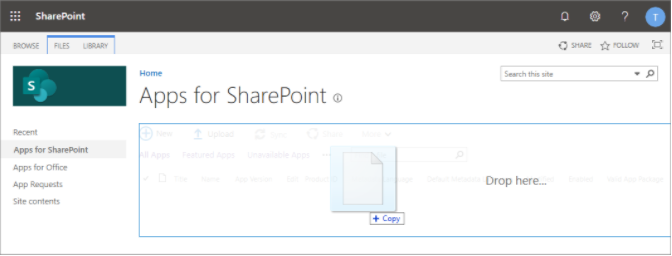

    This deploys the client-side solution package. Because this is a full trust client-side solution, SharePoint displays a dialog and asks you to trust the client-side solution to deploy.

    Notice how the **domain** list in the prompt includes **SharePoint Online**. This is because the content is either served from the Microsoft 365 CDN or from the App Catalog, depending on the tenant settings.

    Ensure that the **Make this solution available to all sites in the organization** option is selected, so that the web part can be used from the Microsoft Teams side.

    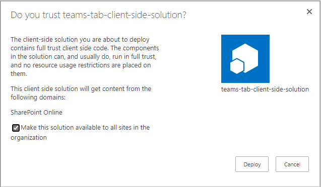

1. Select **Deploy**.

    Notice that you can see if there's any exceptions or issues in the package by looking the **App Package Error Message** column in the App Catalog.

At this point, the web part is deployed and is automatically available cross the SharePoint Online sites.

> [!NOTE]
> In this tutorial, we're using tenant wide deployment option of the SharePoint Framework solution. This will ensure that the development and usage experience is as easy as possible.
>
> You could also deploy the solution as site scope, but in that case you'd need to ensure that the solution is deployed on the SharePoint site behind of the Microsoft Teams before you can use it.

## Make the web part available in Microsoft Teams

To make your web part available in Microsoft Teams, you'll have synchronize your solution with teams.

> [!NOTE]
> In this tutorial, we're using the automatic deployment option for the solution from the SharePoint app catalog. You can also perform these steps manually, if you want to provide alternative settings for your solutions. For more information, see: [Create Microsoft Teams manifest manually for a web part and deploy it to Microsoft Teams](../guidance/creating-team-manifest-manually-for-webpart.md).

1. Select the **teams-tab-client-side-solution** package in the SharePoint tenant App Catalog and select the **Sync to Teams** button at in the ribbon in the **Files** tab.

   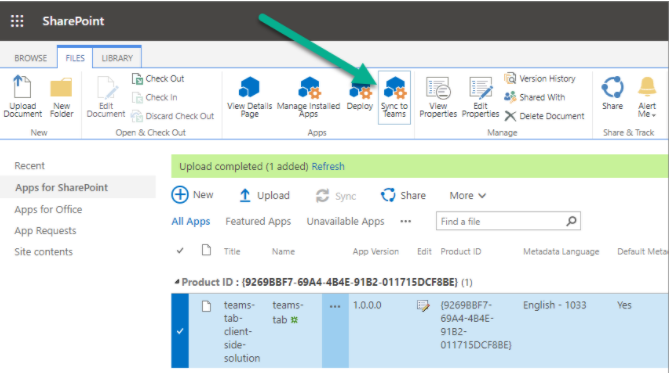

1. Confirm that you can see the status message on the top-right corner.

    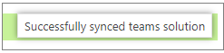

    > [!IMPORTANT]
    > If the synchronization isn't successful, please ensure that you have deleted possible previous version from the Microsoft Team App Catalog. This is the most common reason why the synchronization would fail as existing solution is not overridden currently.

1. Move to the Microsoft Teams side and check the App Catalog status by selecting **Apps** from the left navigation

    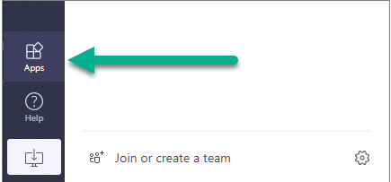

1. Wait until your tenant-specific apps selection is visible:

    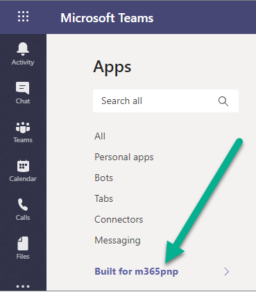

    > [!NOTE]
    > This can take few minutes based due to caching.

1. Confirm that you can see **MyFirstTeamsTab** app in the catalog:

    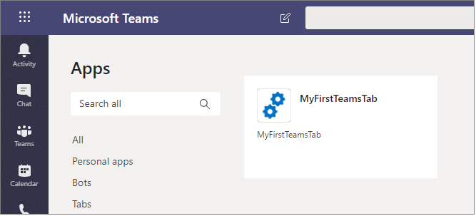

    > [!NOTE]
    > This can take few minutes based due to caching.

1. Move to a channel in a team where you want to test the solution. In the below picture, we have activated **General** channel in **Team**:

    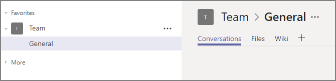

1. Select **+** to add a new tab on the channel.
1. Select your custom tab called **MyFirstTeamTab** in the list. You can use the search capability if needed to find your custom tab:

    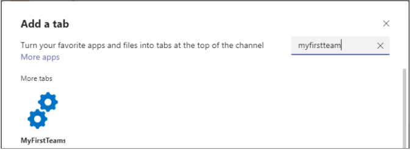

1. Select **Add** to confirm the tab to be selected.
1. Select **Save** to confirm the tab to be installed on the channel:

    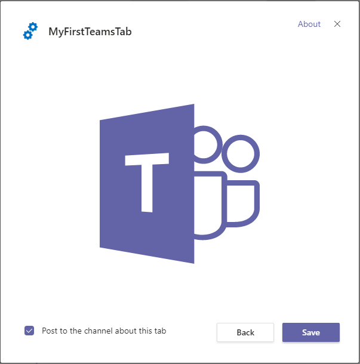

Your custom tab has been added on the Microsoft Teams channel and you can see how the code is reacting that it's in Microsoft Teams context. Theme of the web part is by default coming from the underlying SharePoint site.

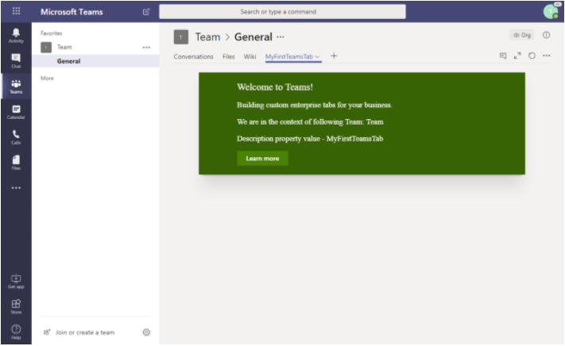

> [!NOTE]
> You can control the initial configuration option visibility from the web part manifest by setting `canUpdateConfiguration` property as `false`. By default this setting is `true` which is taken into account when the Teams manifest is automatically created as part of the *Sync* process.

## Update your app package

When you make changes to your app and create a new package, you might find an error when selecting **Sync to Teams**.

A notification **Failed to sync solution to teams** might appear on the top right of your page.

If this happens follow these steps to delete your app from Microsoft Teams, and then try to sync it again:

1. Open Microsoft Teams.
1. When viewing your team channel, click + to **Add a tab**.
1. Select the **More apps** link at the top.
1. Find your app in the list, and click on the **...** menu.
1. Select **Delete** to remove the app from Microsoft Teams.

You can now sync your new version to Microsoft Teams.

> Share your web part with others through Microsoft 365 Patterns and Practices program to get visibility and exposure. More details on the community, open-source projects and other activities from http://aka.ms/m365pnp.

## References

- [Getting started with SharePoint Framework](https://docs.microsoft.com/en-us/sharepoint/dev/spfx/set-up-your-developer-tenant)
- [Building for Microsoft teams](https://docs.microsoft.com/en-us/sharepoint/dev/spfx/build-for-teams-overview)
- [Use Microsoft Graph in your solution](https://docs.microsoft.com/en-us/sharepoint/dev/spfx/web-parts/get-started/using-microsoft-graph-apis)
- [Publish SharePoint Framework applications to the Marketplace](https://docs.microsoft.com/en-us/sharepoint/dev/spfx/publish-to-marketplace-overview)
- [Microsoft 365 Patterns and Practices](https://aka.ms/m365pnp) - Guidance, tooling, samples and open-source controls for your Microsoft 365 development
