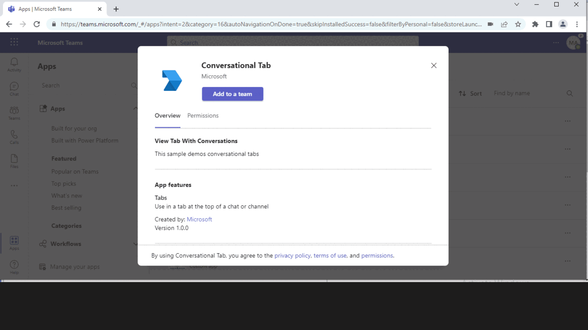
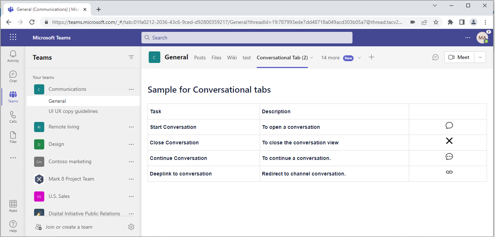
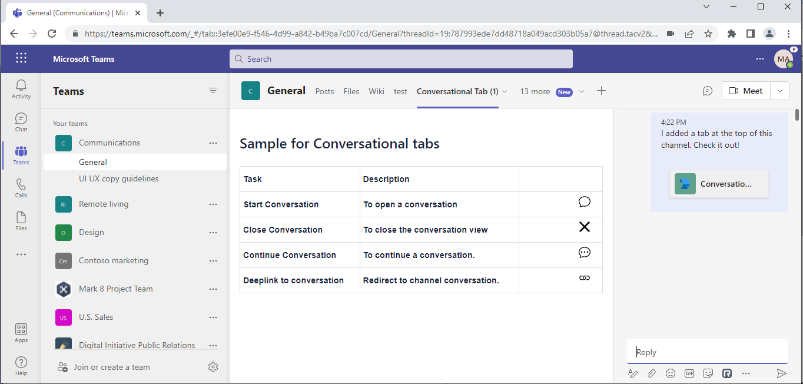
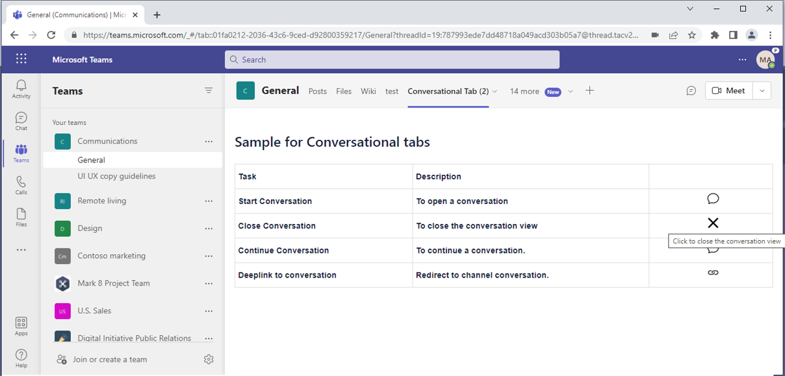
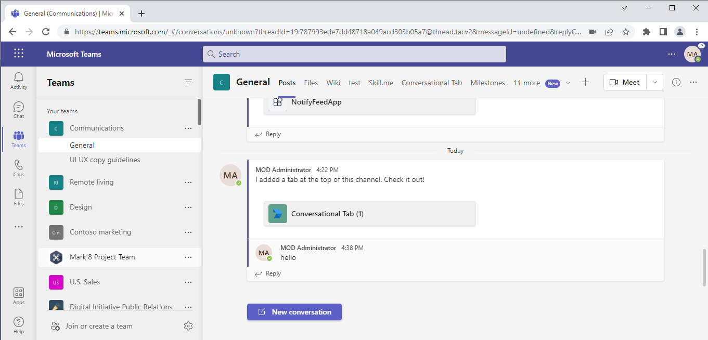

# Conversational Tabs

This Teams tab app provides a way to allow users to have conversations about sub-entities in the tab [Create conversational tabs](https://docs.microsoft.com/microsoftteams/platform/tabs/how-to/conversational-tabs?view=msteams-client-js-latest#continue-a-conversation)

## Included Features
* Conversational Tabs

## Interaction with app



## Try it yourself - experience the App in your Microsoft Teams client
Please find below demo manifest which is deployed on Microsoft Azure and you can try it yourself by uploading the app package (.zip file link below) to your teams and/or as a personal app. (Sideloading must be enabled for your tenant, [see steps here](https://docs.microsoft.com/microsoftteams/platform/concepts/build-and-test/prepare-your-o365-tenant#enable-custom-teams-apps-and-turn-on-custom-app-uploading)).

**Conversational Tabs:** [Manifest](/samples/tab-conversations/csharp/demo-manifest/tab-conversations.zip)

## Prerequisites

- [.NET Core SDK](https://dotnet.microsoft.com/download) version 6.0

  ```bash
  # determine dotnet version
  dotnet --version
  ```

## Setup
1. Register a new application in the [Azure Active Directory – App Registrations](https://go.microsoft.com/fwlink/?linkid=2083908) portal.

> NOTE: When you create your app registration, you will create an App ID and App password - make sure you keep these for later.

2. Setup NGROK
- Run ngrok - point to port 3978

```bash
# ngrok http 3978 --host-header="localhost:3978"
```
3. Setup for code

- Clone the repository

    ```bash
    git clone https://github.com/OfficeDev/Microsoft-Teams-Samples.git
    ```
- Run the bot from a terminal or from Visual Studio:

  A) From a terminal, navigate to `samples/tab-conversations/csharp`

  ```bash
  # run the bot
  dotnet run
  ```
  B) Or from Visual Studio
     - Launch Visual Studio
     - File -> Open -> Project/Solution
     - Navigate to `tab-conversations` folder
     - Select `TabConversation.csproj` file
     - Press `F5` to run the project

4. Setup Manifest for Teams
- __*This step is specific to Teams.*__
    - **Edit** the `manifest.json` contained in the ./AppManifest folder to replace your Microsoft App Id (that was created when you registered your app registration earlier) *everywhere* you see the place holder string `{{Microsoft-App-Id}}` (depending on the scenario the Microsoft App Id may occur multiple times in the `manifest.json`)
    - **Edit** the `manifest.json` for `validDomains` and replace `{{domain-name}}` with base Url of your domain. E.g. if you are using ngrok it would be `https://1234.ngrok-free.app` then your domain-name will be `1234.ngrok-free.app`.
    - **Zip** up the contents of the `AppManifest` folder to create a `manifest.zip` (Make sure that zip file does not contains any subfolder otherwise you will get error while uploading your .zip package)

- Upload the manifest.zip to Teams (in the Apps view click "Upload a custom app")
   - Go to Microsoft Teams. From the lower left corner, select Apps
   - From the lower left corner, choose Upload a custom App
   - Go to your project directory, the ./AppManifest folder, select the zip folder, and choose Open.
   - Select Add in the pop-up dialog box. Your app is uploaded to Teams.

## Running the sample

- Tab showing actions that can be performed



- Open Conversation - opens a new conversation



- Close Conversation - closes the conversation view




> NOTE: We should save the subEntityId and conversationId to continue an existing conversartion.
- Deeplink to Conversation - opens the conversation in channel



# Related Samples
- [Proactive Tab Conversations, using a bot to create conversational tabs programmatically.](.\\..\\..\\bot-tab-conversations\csharp\README.md)

## Further reading

-[Create conversational tabs](https://learn.microsoft.com/microsoftteams/platform/tabs/how-to/conversational-tabs)


