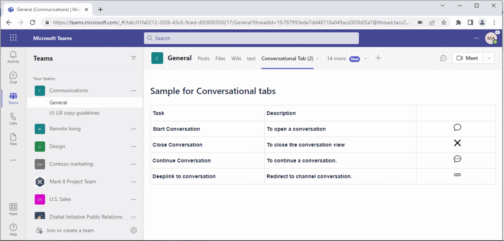

# Conversational Tabs

This Teams tab app provides a way to allow users to have conversations about sub-entities in the tab [Create conversational tabs](https://docs.microsoft.com/en-us/microsoftteams/platform/tabs/how-to/conversational-tabs?view=msteams-client-js-latest#continue-a-conversation)

## Interaction with app

- Full Features of the sample



## Prerequisites

- Office 365 tenant. You can get a free tenant for development use by signing up for the [Office 365 Developer Program](https://developer.microsoft.com/en-us/microsoft-365/dev-program).

- Publicly addressable https url or tunnel such as [ngrok](https://ngrok.com/) or [Tunnel Relay](https://github.com/OfficeDev/microsoft-teams-tunnelrelay) 

## To try this sample

- Clone the repository

    ```bash
    git clone https://github.com/OfficeDev/Microsoft-Teams-Samples.git
    ```

- In a console, navigate to `samples/tab-conversations/csharp`

    ```bash
    cd samples/tab-conversations/ch
    ```

- Run ngrok - point to port `3978`

    ```bash
    ngrok http -host-header=localhost 3978
    ```
 ## Setup
 
- Register a new application in the [Azure Active Directory – App Registrations](https://go.microsoft.com/fwlink/?linkid=2083908) portal.
- Setup for Bot

   In Azure portal, create a [Azure Bot resource](https://docs.microsoft.com/en-us/azure/bot-service/bot-service-quickstart-registration).
    - For bot handle, make up a name.
    - Select "Use existing app registration" (Create the app registration in Azure Active Directory beforehand.)
    - __*If you don't have an Azure account*__ create an [Azure free account here](https://azure.microsoft.com/en-us/free/)
    
   In the new Azure Bot resource in the Portal, 
    - Ensure that you've [enabled the Teams Channel](https://learn.microsoft.com/en-us/azure/bot-service/channel-connect-teams?view=azure-bot-service-4.0)
    - In Settings/Configuration/Messaging endpoint, enter the current `https` URL you were given by running ngrok. Append with the path `/api/messages
- __*This step is specific to Teams.*__
    - **Edit** the `manifest.json` contained in the  `appPackage` folder to replace `<<your base url>>` with your ngrok url or hosted app url and also update the `<<DOMAIN-NAME>>` for allowed domains.
    - **Zip** up the contents of the `appPackage` folder to create a `manifest.zip`
    - **Upload** the `manifest.zip` to Teams (in the Apps view click "Upload a custom app")
         - Go to Microsoft Teams. From the lower left corner, select Apps
         - From the lower left corner, choose Upload a custom App
         - Go to your project directory, the ./appPackage folder, select the zip folder, and choose Open.
         - Select Add in the pop-up dialog box. Your tab is uploaded to Teams.
         
## Running the sample

- Tab showing actions that can be performed


- Open Conversation - opens a new conversation


- Close Conversation - closes the conversation view


> NOTE: We should save the subEntityId and conversationId to continue an existing conversartion.
- Deeplink to Conversation - opens the conversation in channel


# Related Samples
- [Proactive Tab Conversations, using a bot to create conversational tabs programmatically.](.\\..\\..\\bot-tab-conversations\csharp\README.md)

## Further reading

- [Bot Framework Documentation](https://docs.botframework.com)
- [Bot Basics](https://docs.microsoft.com/azure/bot-service/bot-builder-basics?view=azure-bot-service-4.0)
- [User Specific Views](https://docs.microsoft.com/en-us/microsoftteams/platform/task-modules-and-cards/cards/universal-actions-for-adaptive-cards/user-specific-views)
- [Sequential Workflows](https://docs.microsoft.com/en-us/microsoftteams/platform/task-modules-and-cards/cards/universal-actions-for-adaptive-cards/sequential-workflows)
- [Up to date cards](https://docs.microsoft.com/en-us/microsoftteams/platform/task-modules-and-cards/cards/universal-actions-for-adaptive-cards/up-to-date-views)
- [Universal Bot Action Model](https://docs.microsoft.com/en-us/adaptive-cards/authoring-cards/universal-action-model#actionexecute)
- [Azure Portal](https://portal.azure.com)
- [Activity processing](https://docs.microsoft.com/en-us/azure/bot-service/bot-builder-concept-activity-processing?view=azure-bot-service-4.0)
- [Azure Bot Service Introduction](https://docs.microsoft.com/azure/bot-service/bot-service-overview-introduction?view=azure-bot-service-4.0)
- [Azure Bot Service Documentation](https://docs.microsoft.com/azure/bot-service/?view=azure-bot-service-4.0)
- [Azure CLI](https://docs.microsoft.com/cli/azure/?view=azure-cli-latest)
- [Azure Portal](https://portal.azure.com)
- [Language Understanding using LUIS](https://docs.microsoft.com/en-us/azure/cognitive-services/luis/)
- [Channels and Bot Connector Service](https://docs.microsoft.com/en-us/azure/bot-service/bot-concepts?view=azure-bot-service-4.0)
- [dotenv](https://www.npmjs.com/package/dotenv)
- [Microsoft Teams Developer Platform](https://docs.microsoft.com/en-us/microsoftteams/platform/)

