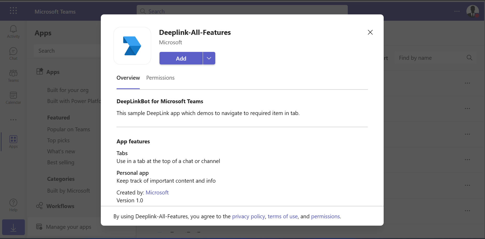
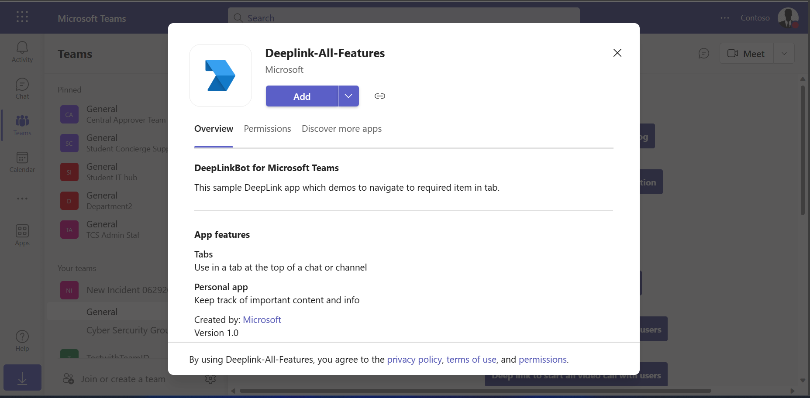
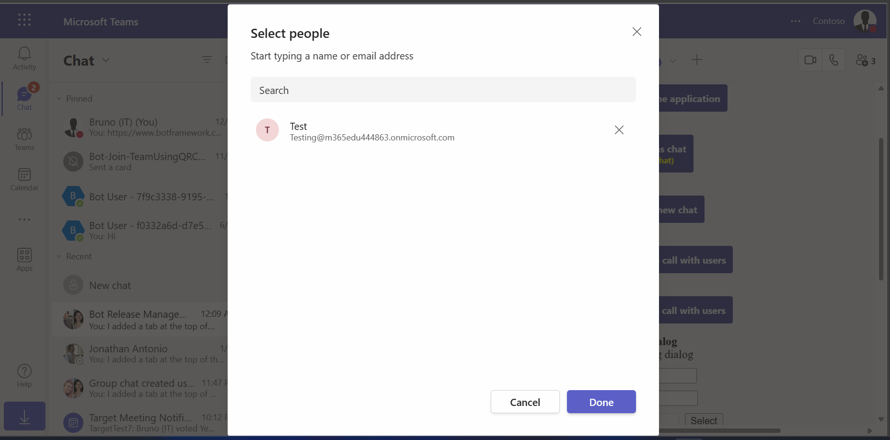
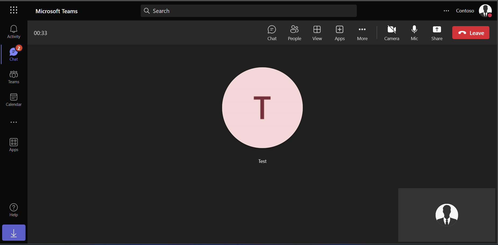
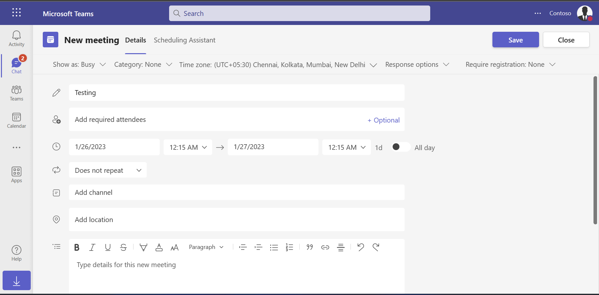

 ## Deep-Link Features

 This sample app for demonstrating for deep-link features using tab.

- **Interaction with App**

 

## Try it yourself - experience the App in your Microsoft Teams client
Please find below demo manifest which is deployed on Microsoft Azure and you can try it yourself by uploading the app package (.zip file link below) to your teams and/or as a personal app. (Sideloading must be enabled for your tenant, [see steps here](https://docs.microsoft.com/microsoftteams/platform/concepts/build-and-test/prepare-your-o365-tenant#enable-custom-teams-apps-and-turn-on-custom-app-uploading)).

**Deep-Link Features:** [Manifest](/samples/tab-deeplink-features/csharp/demo-manifest/tab-deeplink-features.zip)

 ## Prerequisites

- Microsoft Teams is installed and you have an account (not a guest account)
- [.NET Core SDK](https://dotnet.microsoft.com/download) version 6.0

  ```bash
  # determine dotnet version
  dotnet --version
  ```
- [ngrok](https://ngrok.com/download) or equivalent tunneling solution
- [M365 developer account](https://docs.microsoft.com/en-us/microsoftteams/platform/concepts/build-and-test/prepare-your-o365-tenant) or access to a Teams account with the 

 ## Setup

 > Note these instructions are for running the sample on your local machine, the tunnelling solution is required because
 the Teams service needs to call into the bot.

1. Register a new application in the [Azure Active Directory – App Registrations](https://go.microsoft.com/fwlink/?linkid=2083908) portal.

**NOTE:** When you create app registration, you will create an App ID and App password - make sure you keep these for later.

2. Setup NGROK
  - Run ngrok - point to port 3978

	```bash
	# ngrok http -host-header=rewrite 3978
	```

3. Setup for code

  - Clone the repository

    ```bash
    git clone https://github.com/OfficeDev/Microsoft-Teams-Samples.git
    ```

  - If you are using Visual Studio
    - Launch Visual Studio
    - File -> Open -> Project/Solution
    - Navigate to `samples/tab-deeplink-features/csharp` folder
    - Select `DeeplinkFeatures.csproj` or `DeeplinkFeatures.sln` file
	- Navigate to `wwwroot/js/env.js` file and update MicrosoftAppID at placeholer `<<Microsoft-App-ID>>` which you have generated in Step 1 (App Registration creation) and update your AppId at placeholder `<<App-ID>>` (You can get it manually frrm [teams admin portal](https://admin.teams.microsoft.com/).
    - [TeamsAdminPortal-AppID](DeeplinkFeatures/Images/11.TeamsAdminPortal.png)
    - Run your app, either from Visual Studio with `F5` or using `dotnet run` in the appropriate folder.

4. __*This step is specific to Teams.*__
    - **Edit** the `manifest.json` contained in the  `AppManifest` folder to replace your Microsoft App Id (that was created when you registered your bot earlier) *everywhere* 
	  you see the place holder string `<<YOUR-MICROSOFT-APP-ID>>` value(depending on the scenario the Microsoft App Id may occur multiple times in the `manifest.json` and `{{domain-name}}` with base Url domain. E.g. if you are using ngrok it would be `1234.ngrok.io`) 
    - **Zip** up the contents of the `Manifest` folder to create a `Manifest.zip` or `Manifest_Hub` folder into a `Manifest_Hub.zip`. (Make sure that zip file does not contains any subfolder otherwise you will get error while uploading your .zip package)
    - **Upload** the `manifest.zip` to Teams (In Teams Apps/Manage your apps click "Upload an app". Browse to and Open the .zip file. At the next dialog, click the Add button.)
    - Add the app to personal/team/groupChat scope (Supported scopes)

 ## Running the sample

**Application Setup**


**DeeplinkTab**


**AppProfilePage**


**AudioCallSelectPeople**


**AudioCallStart**


**AudioCallStarted**


**ScheduleMeeting**


**ScheduleMeetingDeeplink**


**StartNewChat**


**VideoCall**


 ## Further reading

- [Deep link to an application](https://learn.microsoft.com/en-us/microsoftteams/platform/concepts/build-and-test/deep-link-application?tabs=teamsjs-v2)
- [Deep link to Teams chat](https://learn.microsoft.com/en-us/microsoftteams/platform/concepts/build-and-test/deep-link-teams)

