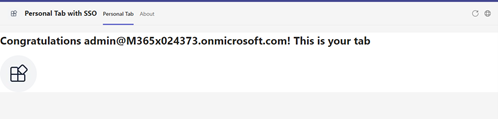

# Teams Tab SSO Authentication

Tabs are Teams-aware webpages embedded in Microsoft Teams. A channel/group tab delivers content to channels and group chats, and are a great way to create collaborative spaces around dedicated web-based content.

## Prerequisites
-  [NodeJS](https://nodejs.org/en/)

-  [M365 developer account](https://docs.microsoft.com/en-us/microsoftteams/platform/concepts/build-and-test/prepare-your-o365-tenant) or access to a Teams account with the appropriate permissions to install an app.

## ngrok

Teams needs to access your tab from a publically accessible URL. If you are running your app in localhost, you will need to use a tunneling service like ngrok.

-  Run ngrok and point it to localhost:
-  `ngrok http https://localhost:3000`

Note: It may be worth purchasing a basic subscription to ngrok so you can get a fixed subdomain ( see the --subdomain ngrok parameter)

**IMPORTANT**: If you don't have a paid subscription to ngrok, you will need to update your Azure AD app registration application ID URI and redirect URL ( See steps 5 and 13 [here](https://docs.microsoft.com/en-us/microsoftteams/platform/tabs/how-to/authentication/auth-aad-sso#steps) ) everytime you restart ngrok.

## Build and Run

In the project directory, execute:

`npm install`

`npm start`

## Deploy to Teams
Start debugging the project by hitting the `F5` key or click the debug icon in Visual Studio Code and click the `Start Debugging` green arrow button.

### NOTE: First time debug step
On the first time running and debugging your app you need allow the localhost certificate.  After starting debugging when Chrome is launched and you have installed your app it will fail to load.

- Open a new tab `in the same browser window that was opened`
- Navigate to `https://localhost:3000/tab`
- Click the `Advanced` button
- Select the `Continue to localhost`
- You may also need to enable popups in the browser to see the auth consent page.

### NOTE: Debugging
Ensure you have the Debugger for Chrome/Edge extension installed for Visual Studio Code from the marketplace.

### Build for production
`npm run build`

Builds the app for production to the `build` folder.\
It correctly bundles React in production mode and optimizes the build for the best performance.

The build is minified and the filenames include the hashes.\
Your app is ready to be deployed!

See the section about [deployment](https://facebook.github.io/create-react-app/docs/deployment) for more information.

