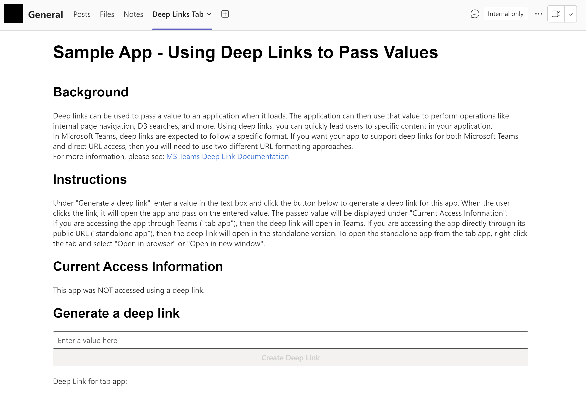
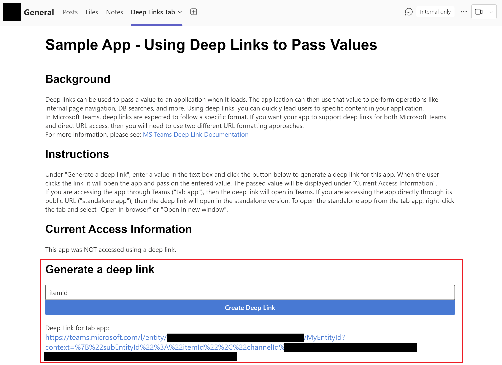
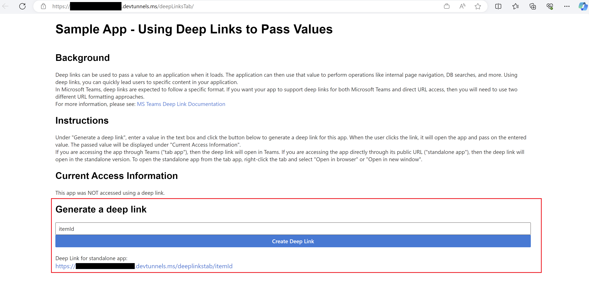
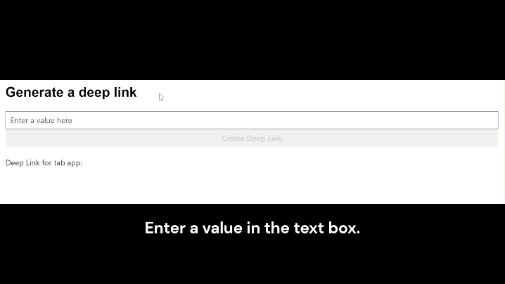

# Passing Values with Deep Links for Tab Apps and Standalone Web Apps

Explore this Microsoft Teams sample app that demonstrates how to utilize dynamic deep links for passing values to both tab and standalone web applications. With comprehensive setup instructions and features like deep link generation, this app enables developers to enhance user interactions by providing context-specific information directly through deep links.

 ## Included Features
* Tabs
* Deep Links

## Interaction with app
### Initial state of tab app


### Generating a deep link with tab app


### Initial state of tab app accessed through deep link


### Generating deep link with standalone web app


## Prerequisites
- Microsoft Teams is installed and you have an account (not a guest account)
- To test locally, [NodeJS](https://nodejs.org/en/download/) must be installed on your development machine (version 16.14.2  or higher)
- [dev tunnel](https://learn.microsoft.com/en-us/azure/developer/dev-tunnels/get-started?tabs=windows) or [ngrok](https://ngrok.com/) latest version or equivalent tunneling solution

## Setup

**Note**: This app was created using Yo Teams, the Microsoft Teams app generator: [YoTeams Documentation](https://pnp.github.io/generator-teams/)

All required source code are located in the `./src` folder:

* `client` client side code
* `server` server side code
* `public` static files for the web site
* `manifest` for the Microsoft Teams app manifest

1. Setup NGROK
    - Run ngrok - point to port 3007

        ```bash
        ngrok http 3007 --host-header="localhost:3007"
        ```  

        Alternatively, you can also use the `dev tunnels`. Please follow [Create and host a dev tunnel](https://learn.microsoft.com/en-us/azure/developer/dev-tunnels/get-started?tabs=windows) and host the tunnel with anonymous user access command as shown below:

        ```bash
        devtunnel host -p 3007 --allow-anonymous
        ```

2. App Registration

### Register your application with Azure AD

1. Register a new application in the [Microsoft Entra ID – App Registrations](https://go.microsoft.com/fwlink/?linkid=2083908) portal.
2. Select **New Registration** and on the *register an application page*, set following values:
    * Set **name** to your app name.
    * Choose the **supported account types** (any account type will work)
    * Leave **Redirect URI** empty.
    * Choose **Register**.
3. On the overview page, copy and save the **Application (client) ID, Directory (tenant) ID**. You'll need those later when updating your Teams application manifest and in the appsettings.json.
4. Navigate to **API Permissions**, and make sure to add the follow permissions:
    * Select Add a permission
    * Select Microsoft Graph -> Delegated permissions.
    * `User.Read` (enabled by default)
    * Click on Add permissions. Please make sure to grant the admin consent for the required permissions.

3. Setup code
    - Clone the repository

        ```bash
        git clone https://github.com/OfficeDev/Microsoft-Teams-Samples.git
        ```

    - Create a `.env` file under `samples/tab-deeplink-pass-values/ts`, and copy/paste the contents of `.env_sample` into it. Then, update the below configurations:
      - `PUBLIC_HOSTNAME` should point to your tunnel url (e.g., 124.ngrok-free.app)
      - `APPLICATION_ID` should be the ID of your Microsoft Teams application

    - In a terminal, navigate to `samples/tab-deeplink-pass-values/ts`

        ```bash
        cd samples/tab-deeplink-pass-values/ts
        ```

    - Install npm modules

        ```bash
        npm install
        ```

    - Start the app

        ```
        npm start
        ```

4. Upload tab app to Teams
    - Go to Teams and select Apps
    - Select Manage your apps > Upload an app > Upload a custom app
    - Go to your project directory, browse to the ./package folder, select the app package zip folder, and choose Open.
    - Select Add in the pop-up dialog box. Your app is uploaded to Teams.

To access the app, you can either open the tab in Microsoft Teams, or you can access it directly in the browser through your tunnel's public URL.

## Interacting with the app

**Note**: When you first load the app (without using a deep link), it says "This app was NOT accessed using a deep link" under the "Current Access Information" section. This section tells you the state of the app and how it was accessed.

### Generate a deep link
1. Enter a value in the text box and click the "Create Deep Link" button to generate a deep link for this app.
   - The generated deep link will contain the information required to not only open the app, but also to pass on the entered value. In a real scenario, the app can then use that text value to perform operations like DB searches, navigation, etc.
   - If you are currently accessing the app through Teams (as a "tab app"), then the generated deep link will be configured to open in Teams. If you are accessing the app directly through its public URL (as a "standalone app"), then the deep link will be configured to open the standalone version. 
2. Click the deep link to open the app in a new window.
    - When the app loads using the deep link, you can see that the text you entered in the textbox was successfully passed on to the app by checking the status under "Current Access Information".

### View the standalone web app
1. To switch to the standalone app from the tab app, right-click the tab and select "Open in browser" or "Open in new window". Or, you can also enter your tunnel's public URL directly in the browser.

### Deep Link Generation Demo



## Further Reading
- [Using deep links in Teams](https://learn.microsoft.com/en-us/microsoftteams/platform/concepts/build-and-test/deep-link-application?tabs=teamsjs-v2)
- [Tab Context - Microsoft Teams JavaScript library](https://learn.microsoft.com/en-us/microsoftteams/platform/tabs/how-to/access-teams-context?tabs=Json-v2%2Cteamsjs-v2%2Cdefault#getting-context-by-using-the-microsoft-teams-javascript-library)
- [React Hook - useEffect](https://react.dev/reference/react/useEffect)
- [JS String match](https://developer.mozilla.org/en-US/docs/Web/JavaScript/Reference/Global_Objects/String/match)

### Useful links

* [Debugging with Visual Studio Code](https://github.com/pnp/generator-teams/blob/master/docs/docs/user-guide/vscode.md)
* [Developing with ngrok](https://github.com/pnp/generator-teams/blob/master/docs/docs/concepts/ngrok.md)
* [Developing with Github Codespaces](https://github.com/pnp/generator-teams/blob/master/docs/docs/user-guide/codespaces.md)

### Additional build options

You can use the following flags for the `serve`, `ngrok-serve` and build commands:

* `--no-linting` or `-l` - skips the linting of Typescript during build to improve build times
* `--debug` - builds in debug mode and significantly improves build time with support for hot reloading of client side components
* `--env <filename>.env` - use an alternate set of environment files
* `--publish` - automatically publish the application to the Teams App store

### Deployment

The solution can be deployed to Azure using any deployment method.

* For Azure Devops see [How to deploy a Yo Teams generated project to Azure through Azure DevOps](https://www.wictorwilen.se/blog/deploying-yo-teams-and-node-apps/)
* For Docker containers, see the included `Dockerfile`

### Logging

To enable logging for the solution you need to add `msteams` to the `DEBUG` environment variable. See the [debug package](https://www.npmjs.com/package/debug) for more information. By default this setting is turned on in the `.env` file.

Example for Windows command line:

``` bash
SET DEBUG=msteams
```

If you are using Microsoft Azure to host your Microsoft Teams app, then you can add `DEBUG` as an Application Setting with the value of `msteams`.

## Further reading

- [Extend Teams apps across Microsoft 365](https://learn.microsoft.com/en-us/microsoftteams/platform/m365-apps/overview)
- [Deep links in teams](https://learn.microsoft.com/microsoftteams/platform/concepts/build-and-test/deep-links)


