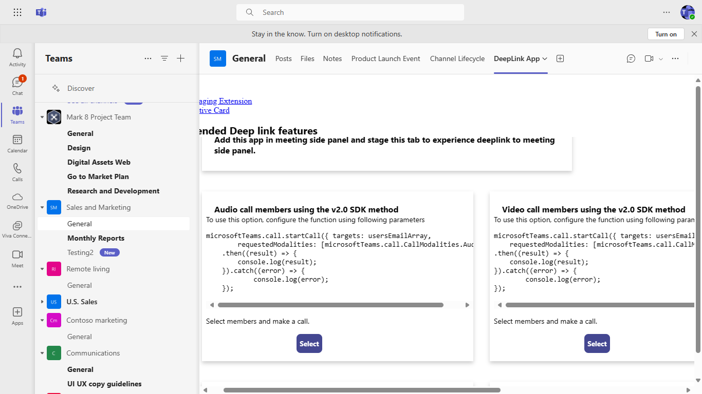

# DeepLink

This sample displays how to consume SubEntity Id to DeepLink from Bot to Tab and Tab to Tab.

## Prerequisites

### Tools

- [.NET Core SDK](https://dotnet.microsoft.com/download) version 3.1
  ```bash
  # determine dotnet version
  dotnet --version
  ```
  
- [Ngrok](https://ngrok.com/download) (Only for devbox testing) Latest (any other tunneling software can also be used)
  ```bash
  # run ngrok locally
  ngrok http -host-header=localhost 3978
  ```
- [Teams](https://teams.microsoft.com) Microsoft Teams is installed and you have an account

1. Clone the repository
   ```bash
   git clone https://github.com/OfficeDev/Microsoft-Teams-Samples.git
   ```
2. If you are using Visual Studio
- Launch Visual Studio
- File -> Open -> Project/Solution
- Navigate to ```samples\DeepLinkBot-SubEntityID\csharp``` folder
- Select ```DeepLinkBot.sln``` file
3. Run ngrok - point to port 3978
   ```ngrok http -host-header=rewrite 3978```
4. Create a new Bot by following steps mentioned in [Build a bot](https://docs.microsoft.com/en-us/microsoftteams/platform/bots/what-are-bots?view=msteams-client-js-latest#build--a-bot-for-teams-with-the-microsoft-bot-framework) documentation.
- Ensure that you've [enabled the Teams Channel](https://docs.microsoft.com/en-us/azure/bot-service/channel-connect-teams?view=azure-bot-service-4.0)
5. Go to appsettings.json and add ```MicrosoftAppId``` and  ```MicrosoftAppPassword``` information.
6. Update DeepLink Urls with ```MicrosoftAppID``` and  ```EntityID``` with respective values in DeepLinkHelper class and HomeController.
7. Run your app, either from Visual Studio with ```F5``` or using ```dotnet run``` in the appropriate folder.
8. Update the manifest.json file with ```Microsoft-App-ID```,```ContentUrl```, ```WebsiteUrl``` and ```EntityID``` value.
9. Install the app in Teams.

## Interacting with the app in Teams
1. Interact with DeepLink bot by pinging it in either personal scope or channel by @mentioning bot. 


1. Select the option from the options displayed in the adaptive card. This will redirect to the respective Task in the static tab/ channel tab.
**Static Tab:**


**Channel Tab:**


1. Click on Back to List to view all the options. User can select an option which will redirect to the respective Task in static tab/ channel tab.

**Additional Deep link features using Microsoft Teams SDK v2.0.0**




