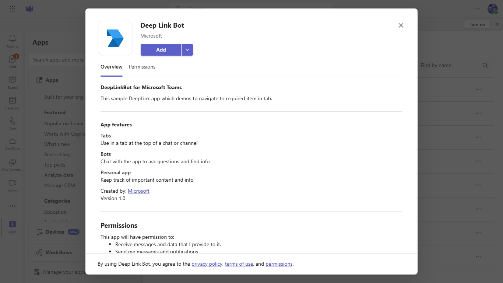
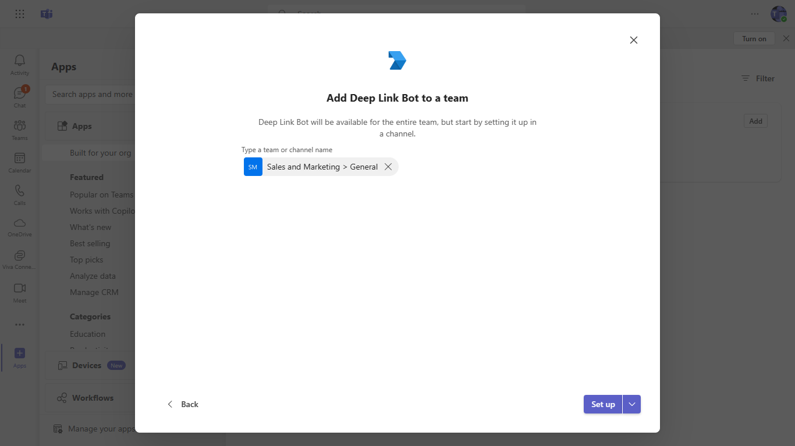
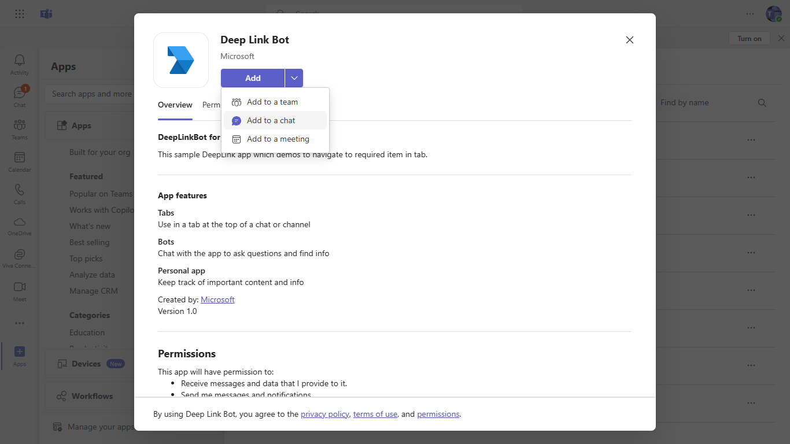
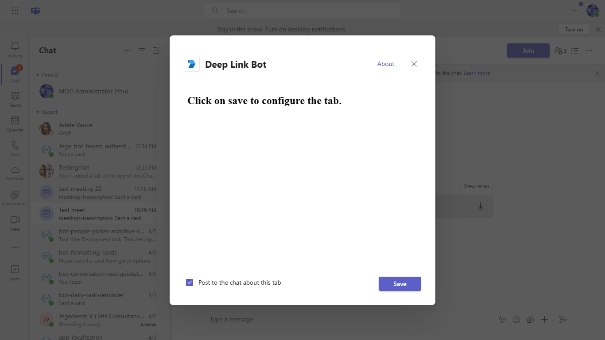
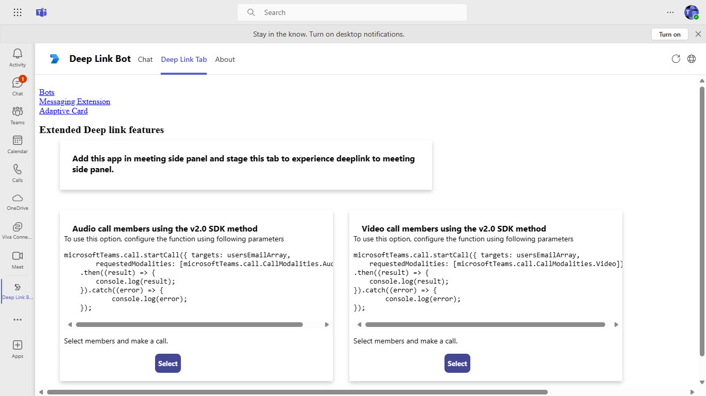
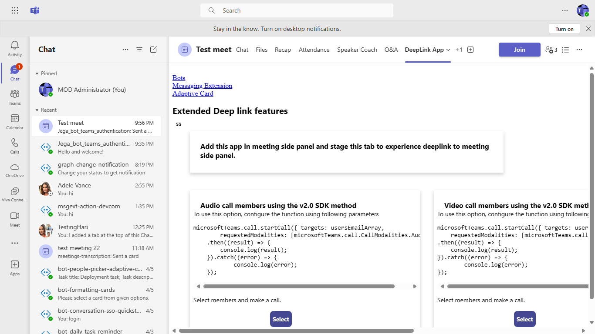

 # DeepLink

 This sample displays how to consume SubEntity Id to DeepLink from Bot to Tab and Tab to Tab.

- **Interaction with bot**

 ##### Welcome Card Flow

 

 ##### Deeplink Tab Flow

 


 ## Prerequisites

- Microsoft Teams is installed and you have an account (not a guest account)
- To test locally, [NodeJS](https://nodejs.org/en/download/) must be installed on your development machine (version 16.14.2  or higher)
- [ngrok](https://ngrok.com/download) or equivalent tunneling solution
- [M365 developer account](https://docs.microsoft.com/en-us/microsoftteams/platform/concepts/build-and-test/prepare-your-o365-tenant) or access to a Teams account with the 

 ## Setup

 > Note these instructions are for running the sample on your local machine, the tunnelling solution is required because
 the Teams service needs to call into the bot.

1. Register a new application in the [Azure Active Directory – App Registrations](https://go.microsoft.com/fwlink/?linkid=2083908) portal.
    
2. Setup for Bot
  - Register a AAD aap registration in Azure portal.
  - Also, register a bot with Azure Bot Service, following the instructions [here](https://docs.microsoft.com/en-us/azure/bot-service/bot-service-quickstart-registration?view=azure-bot-service-3.0).
  - Ensure that you've [enabled the Teams Channel](https://docs.microsoft.com/en-us/azure/bot-service/channel-connect-teams?view=azure-bot-service-4.0)
  - While registering the bot, use `https://<your_ngrok_url>/api/messages` as the messaging endpoint.

    > NOTE: When you create your app registration, you will create an App ID and App password - make sure you keep these for later.

3. Setup NGROK
  - Run ngrok - point to port 3978

	```bash
	# ngrok http -host-header=rewrite 3978
	```

4. Setup for code

  - Clone the repository

    ```bash
    git clone https://github.com/OfficeDev/Microsoft-Teams-Samples.git
    ```
   - Update channelID placeholer `<AddYourTeamsChannelId>` value in your `DeepLinkBot.cs` file with your particular channel id from any Team in Teams. (You can get it manually by clicking on 3 dots in any team's channel and fetch it's link and extract the channel id ) like `General` channel) Example: `19:cbe3683f25094106b826c9cada3afbe0@thread.skype`
   
   - Update the `appsettings.json` configuration for the bot to use the MicrosoftAppId, MicrosoftAppPassword, BaseURL ,
	ChannelEntityId is a unique identifier ,TabEntityId as EntityId from Manifest file ,MannifestAppId as manifest ID from manifest file,
	generated in Step 1 (App Registration creation). (Note the App Password is referred to as the "client secret" 
	in the azure portal and you can always create a new client secret anytime.)
    - Also, set MicrosoftAppType in the `appsettings.json`. (**Allowed values are: MultiTenant(default), SingleTenant, UserAssignedMSI**)

  - If you are using Visual Studio
    - Launch Visual Studio
    - File -> Open -> Project/Solution
    - Navigate to `samples/Tab-deeplink/csharp` folder
    - Select `DeeplinkBot.csproj` or `DeeplinkBot.sln`file
    - Run your bot, either from Visual Studio with `F5` or using `dotnet run` in the appropriate folder.

5. __*This step is specific to Teams.*__
    - **Edit** the `manifest.json` contained in the  `Manifest` folder to replace your Microsoft App Id (that was created when you registered your bot earlier) *everywhere* 
	  you see the place holder string `<<YOUR-MICROSOFT-APP-ID>>` ,`<<Content-Url>>`, `<<Website-Url>>` and `<<Entity-ID>>` value(depending on the scenario the Microsoft App Id may occur multiple times in the `manifest.json`)
    - **Edit** the `manifest.json` for `validDomains` with base Url domain. E.g. if you are using ngrok it would be `https://1234.ngrok.io` then your domain-name will be `1234.ngrok.io`.
    - **Zip** up the contents of the `Manifest` folder to create a `manifest.zip` (Make sure that zip file does not contains any subfolder otherwise you will get error while uploading your .zip package)
    - **Upload** the `manifest.zip` to Teams (In Teams Apps/Manage your apps click "Upload an app". Browse to and Open the .zip file. At the next dialog, click the Add button.)
    - Add the app to personal/team/groupChat scope (Supported scopes)

 ## Running the sample

You can interact with this bot in Teams by sending it a message, or selecting a command from the command list. The bot will respond to the following strings.

1. **Show Welcome**

  - **Result:** The bot will send the welcome card for you to interact with
  - **Valid Scopes:** personal, Team, chat, Meeting

	- **Personal Scope Interactions:**

		**Adding bot UI:**
    
		

		**Added bot UI:**
    
		

		**Show Welcome command interaction:**
    
		

		**Show Deeplink Tab:**
    
		


	- **Teams Scope Interactions:**

		**Adding bot UI:**
   
		

		**Team Selection for app:**
   
		

		**App Setup for the specific Team:**
   
		

		**Show instraction for the team:**

		
   
		**Show Deeplink Tab:**
   
		


	- **Chat Scope Interactions:**

		**Adding bot UI:**
   
		

		**Chat User Selection:**
   
		

		**App setup for the specific chat user:**
   
		

		**Show user instraction tab:**
   
		


	- **Meeting Scope Interactions:**

		**Adding bot UI:**
   
		

		**Meeting Selection:**
   
		

		**App setup for the specific chat sser:**
   
		

		**Show user instraction tab:**
   
		

 ## Deploy the bot to Azure

To learn more about deploying a bot to Azure, see [Deploy your bot to Azure](https://aka.ms/azuredeployment) for a complete list of deployment instructions.

 ## Further reading

- [How Microsoft Teams bots work](https://docs.microsoft.com/en-us/azure/bot-service/bot-builder-basics-teams?view=azure-bot-service-4.0&tabs=javascript)

