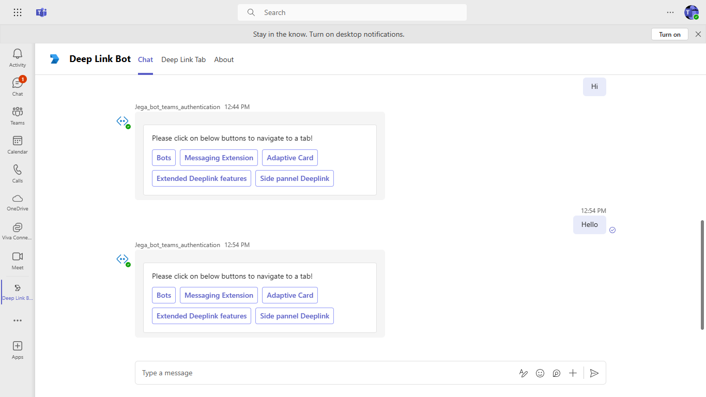
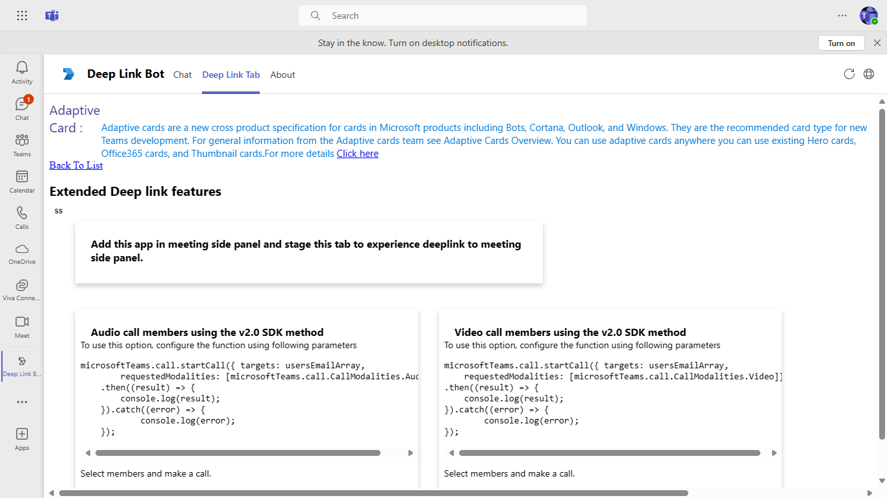
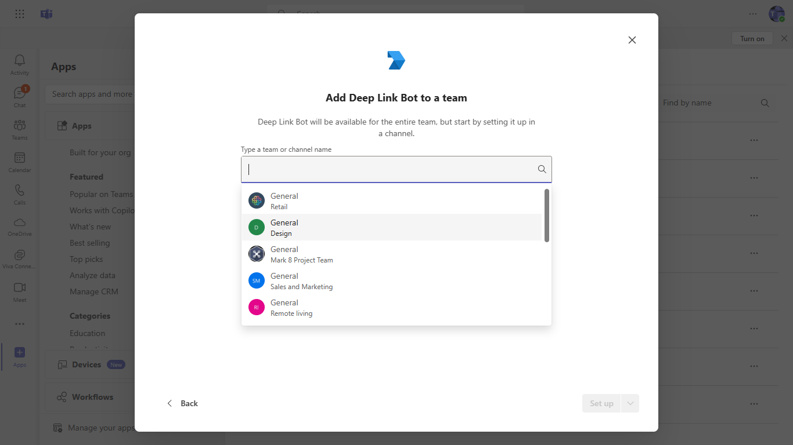
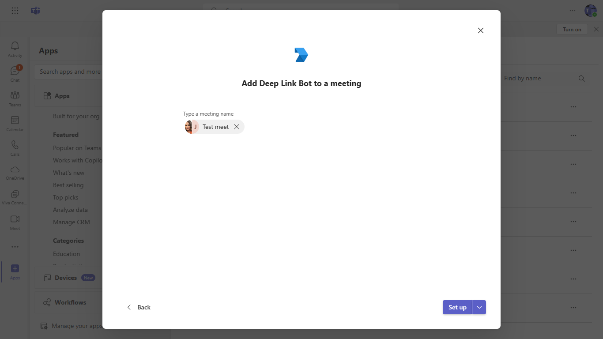
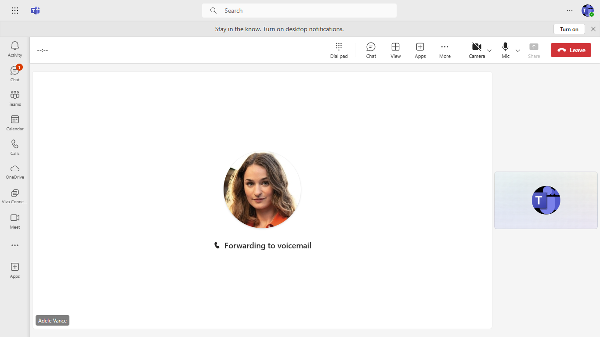
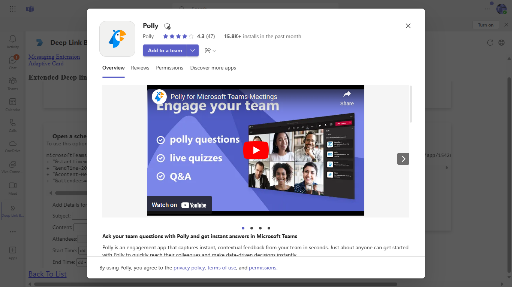
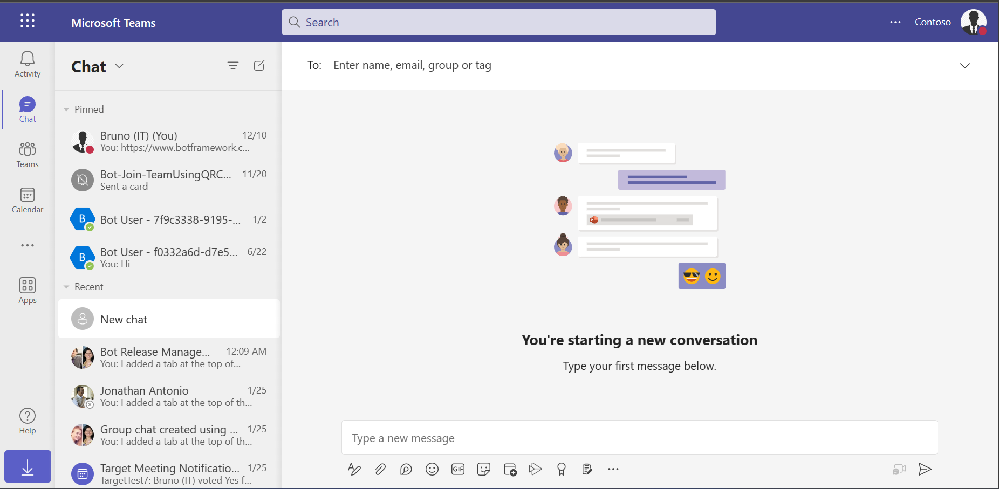

 # DeepLink

 This sample displays deeplinks for call, video, chat, navigate to app and navigate within tab pages which are supported for tab and bot.

 ## Included Features
* Tabs
* Bots
* Deep Links

## Interaction with bot

 ##### Welcome Card Flow

 

 ##### Deeplink Tab Flow

 


 ## Prerequisites

- Microsoft Teams is installed and you have an account (not a guest account)
- [.NET Core SDK](https://dotnet.microsoft.com/download) version 6.0

  ```bash
  # determine dotnet version
  dotnet --version
  ```
- [ngrok](https://ngrok.com/download) or equivalent tunneling solution
- [M365 developer account](https://docs.microsoft.com/en-us/microsoftteams/platform/concepts/build-and-test/prepare-your-o365-tenant) or access to a Teams account with the 

 ## Setup

 > Note these instructions are for running the sample on your local machine, the tunnelling solution is required because
 the Teams service needs to call into the bot.

1. Register a new application in the [Azure Active Directory – App Registrations](https://go.microsoft.com/fwlink/?linkid=2083908) portal.
    
2. Setup for Bot
  - Register a AAD aap registration in Azure portal.
  - Also, register a bot with Azure Bot Service, following the instructions [here](https://docs.microsoft.com/en-us/azure/bot-service/bot-service-quickstart-registration?view=azure-bot-service-3.0).
  - Ensure that you've [enabled the Teams Channel](https://docs.microsoft.com/en-us/azure/bot-service/channel-connect-teams?view=azure-bot-service-4.0)
  - While registering the bot, use `https://<your_ngrok_url>/api/messages` as the messaging endpoint.

    > NOTE: When you create your app registration, you will create an App ID and App password - make sure you keep these for later.

3. Setup NGROK
  - Run ngrok - point to port 3978

	```bash
	# ngrok http 3978 --host-header="localhost:3978"
	```

4. Setup for code

  - Clone the repository

    ```bash
    git clone https://github.com/OfficeDev/Microsoft-Teams-Samples.git
    ```
   - Update channelID placeholer `<AddYourTeamsChannelId>` value in your `DeepLinkBot.cs` file with your particular channel id from any Team in Teams. (You can get it manually by clicking on 3 dots in any team's channel and fetch it's link and extract the channel id ) like `General` channel) Example: `19:cbe3683f25094106b826c9cada3afbe0@thread.skype`

   - Navigate to `wwwroot/js/env.js` file and update your AppId at placeholder `<<App-ID>>` (You can get it manually frrm [teams admin portal](https://admin.teams.microsoft.com/).
	- 
   
   - Update the `appsettings.json` configuration for the bot to use the MicrosoftAppId, MicrosoftAppPassword, BaseURL ,
	ChannelEntityId is a unique identifier ,TabEntityId as EntityId from Manifest file ,MannifestAppId as manifest ID from manifest file,
	generated in Step 1 (App Registration creation). (Note the App Password is referred to as the "client secret" 
	in the azure portal and you can always create a new client secret anytime.)
    - Also, set MicrosoftAppType in the `appsettings.json`. (**Allowed values are: MultiTenant(default), SingleTenant, UserAssignedMSI**)

  - If you are using Visual Studio
    - Launch Visual Studio
    - File -> Open -> Project/Solution
    - Navigate to `samples/Tab-deeplink/csharp` folder
    - Select `DeeplinkBot.csproj` or `DeeplinkBot.sln`file
    - Run your bot, either from Visual Studio with `F5` or using `dotnet run` in the appropriate folder.

5. __*This step is specific to Teams.*__
    - **Edit** the `manifest.json` contained in the  `Manifest` folder to replace your Microsoft App Id (that was created when you registered your bot earlier) *everywhere* 
	  you see the place holder string `<<YOUR-MICROSOFT-APP-ID>>` value(depending on the scenario the Microsoft App Id may occur multiple times in the `manifest.json` and `{{domain-name}}` with base Url domain. E.g. if you are using ngrok it would be `1234.ngrok-free.app`) 
    - **Edit** the `manifest.json` for `validDomains` with base Url domain. E.g. if you are using ngrok it would be `https://1234.ngrok-free.app` then your domain-name will be `1234.ngrok-free.app`.
	**Note:** If you want to test your app across multi hub like: Outlook/Office.com, please update the `manifest.json` in the `tab-deeplink\csharp\DeepLinkBot\Manifest_Hub` folder with the required values.
    - **Zip** up the contents of the `Manifest` folder to create a `Manifest.zip` or `Manifest_Hub` folder into a `Manifest_Hub.zip`. (Make sure that zip file does not contains any subfolder otherwise you will get error while uploading your .zip package)
    - **Upload** the `manifest.zip` to Teams (In Teams Apps/Manage your apps click "Upload an app". Browse to and Open the .zip file. At the next dialog, click the Add button.)
    - Add the app to personal/team/groupChat scope (Supported scopes)

**Note**: If you are facing any issue in your app, please uncomment [this](https://github.com/OfficeDev/Microsoft-Teams-Samples/blob/main/samples/tab-deeplink/csharp/DeepLinkBot/AdapterWithErrorHandler.cs#L26) line and put your debugger for local debug.

 ## Running the sample

You can interact with this bot in Teams by sending it a message, or selecting a command from the command list. The bot will respond to the following strings.

1. **Show Welcome**

  - **Result:** The bot will send the welcome card for you to interact with
  - **Valid Scopes:** personal, Team, chat, Meeting

	- **Personal Scope Interactions:**

		**Adding bot UI:**
    
		

		**Added bot UI:**
    
		

		**Show Welcome command interaction:**
    
		

		**Show Deeplink Tab:**
    
		


	- **Teams Scope Interactions:**

		**Adding bot UI:**
   
		

		**Team Selection for app:**
   
		

		**App Setup for the specific Team:**
   
		

		**Show instraction for the team:**

		
   
		**Show Deeplink Tab:**
   
		


	- **Chat Scope Interactions:**

		**Adding bot UI:**
   
		

		**Chat User Selection:**
   
		

		**App setup for the specific chat user:**
   
		

		**Show user instraction tab:**
   
		


	- **Meeting Scope Interactions:**

		**Adding tab UI:**
   
		

		**Meeting Selection:**
   
		

		**App setup for the specific chat user:**
   
		

		**Show user instraction tab:**
   
		

	 - **Deeplink to meeting side panel:**

	   `@mention` bot in meeting chat to get adaptive card.

	   

	   Click on `Side Panel Deeplink` which will redirect to meeting side panel.

	   

	- **Tab Interactions:**
   
		**Deeplink to Audio Call:**

		

		**Deeplink to Video Call:**
   
		

		**Deeplink to Meeting schedule:**
   
		

		**Deeplink to Polly app install dialog:**
   
		

		**Deeplink to start new chat:**
   
		

		

		**Deeplink to channel conversation:**
   
		
   
		


## Outlook on the web

- To view your app in Outlook on the web.

- Go to [Outlook on the web](https://outlook.office.com/mail/)and sign in using your dev tenant account.

**On the side bar, select More Apps. Your sideloaded app title appears among your installed apps**


**Select your app icon to launch and preview your app running in Outlook on the web**


**Note:** Similarly, you can test your application in the Outlook desktop app as well.

## Office on the web

- To preview your app running in Office on the web.

- Log into office.com with test tenant credentials

**Select the Apps icon on the side bar. Your sideloaded app title appears among your installed apps**


**Select your app icon to launch your app in Office on the web**

   

**Note:** Similarly, you can test your application in the Office 365 desktop app as well.

 ## Deploy the bot to Azure

To learn more about deploying a bot to Azure, see [Deploy your bot to Azure](https://aka.ms/azuredeployment) for a complete list of deployment instructions.

 ## Further reading

- [How Microsoft Teams bots work](https://docs.microsoft.com/en-us/azure/bot-service/bot-builder-basics-teams?view=azure-bot-service-4.0&tabs=javascript)

- [Extend Teams apps across Microsoft 365](https://learn.microsoft.com/en-us/microsoftteams/platform/m365-apps/overview)


