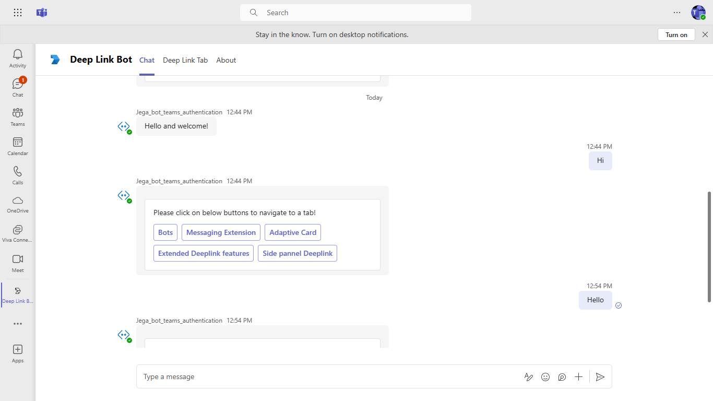
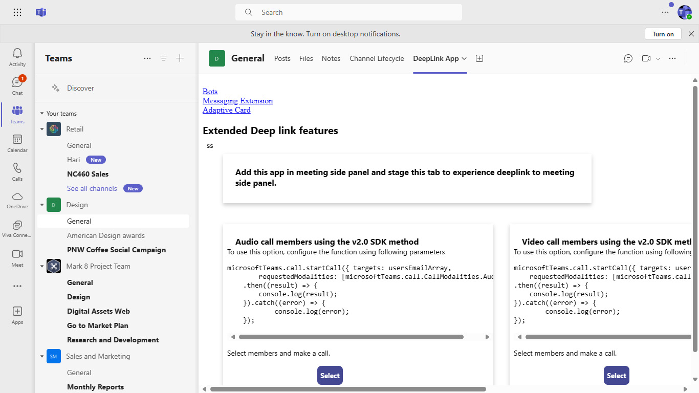
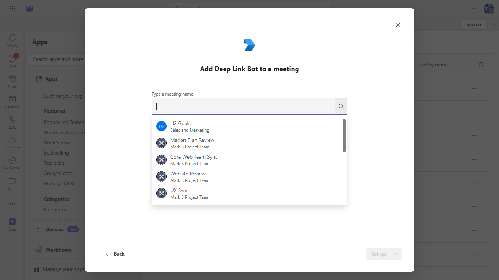
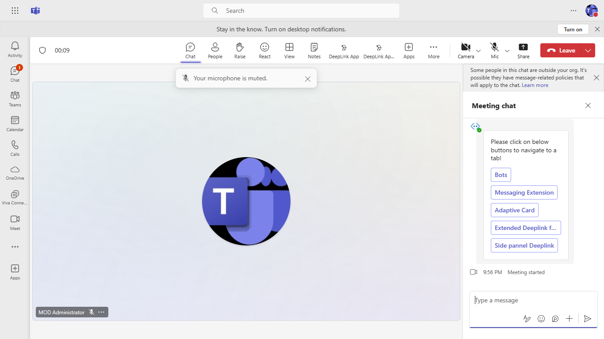

 # DeepLink

Discover this Microsoft Teams sample app designed to demonstrate deeplinks for seamless interactions, including calls, chats, and navigation within tabs and applications. With robust features such as bot integration, a welcome card flow, and detailed setup instructions, this app empowers developers to enhance user experiences and streamline communication within Teams.

 ## Included Features
* Tabs
* Bots
* Deep Links

## Interaction with bot

 ##### Welcome Card Flow

 

 ##### Deeplink Tab Flow

 


## Try it yourself - experience the App in your Microsoft Teams client
Please find below demo manifest which is deployed on Microsoft Azure and you can try it yourself by uploading the app package (.zip file link below) to your teams and/or as a personal app. (Uploading must be enabled for your tenant; [see steps here](https://docs.microsoft.com/microsoftteams/platform/concepts/build-and-test/prepare-your-o365-tenant#enable-custom-teams-apps-and-turn-on-custom-app-uploading).).

**Tab Deeplink:** [Manifest](/samples/tab-deeplink/csharp/demo-manifest/tab-deeplink.zip)

 ## Prerequisites

- Microsoft Teams is installed and you have an account (not a guest account)
- [.NET Core SDK](https://dotnet.microsoft.com/download) version 6.0

  ```bash
  # determine dotnet version
  dotnet --version
  ```
- [dev tunnel](https://learn.microsoft.com/en-us/azure/developer/dev-tunnels/get-started?tabs=windows) or [ngrok](https://ngrok.com/) latest version or equivalent tunneling solution
- [M365 developer account](https://docs.microsoft.com/en-us/microsoftteams/platform/concepts/build-and-test/prepare-your-o365-tenant) or access to a Teams account with the 
- [Microsoft 365 Agents Toolkit for Visual Studio](https://learn.microsoft.com/en-us/microsoftteams/platform/toolkit/toolkit-v4/install-teams-toolkit-vs?pivots=visual-studio-v17-7)

## Run the app (Using Microsoft 365 Agents Toolkit for Visual Studio)

The simplest way to run this sample in Teams is to use Microsoft 365 Agents Toolkit for Visual Studio.
1. Install Visual Studio 2022 **Version 17.14 or higher** [Visual Studio](https://visualstudio.microsoft.com/downloads/)
1. Install Microsoft 365 Agents Toolkit for Visual Studio [Microsoft 365 Agents Toolkit extension](https://learn.microsoft.com/en-us/microsoftteams/platform/toolkit/toolkit-v4/install-teams-toolkit-vs?pivots=visual-studio-v17-7)
1. In the debug dropdown menu of Visual Studio, select Dev Tunnels > Create A Tunnel (set authentication type to Public) or select an existing public dev tunnel.
1. In the debug dropdown menu of Visual Studio, select default startup project > **Microsoft Teams (browser)**
1. Right-click the 'M365Agent' project in Solution Explorer and select **Microsoft 365 Agents Toolkit > Select Microsoft 365 Account**
1. Sign in to Microsoft 365 Agents Toolkit with a **Microsoft 365 work or school account**
1. Set `Startup Item` as `Microsoft Teams (browser)`.
1. Press F5, or select Debug > Start Debugging menu in Visual Studio to start your app
    </br>
1. In the opened web browser, select Add button to install the app in Teams

> If you do not have permission to upload custom apps (uploading), Microsoft 365 Agents Toolkit will recommend creating and using a Microsoft 365 Developer Program account - a free program to get your own dev environment sandbox that includes Teams.

 ## Setup

 > Note these instructions are for running the sample on your local machine, the tunnelling solution is required because
 the Teams service needs to call into the bot.

1) App Registration

### Register your application with Azure AD

1. Register a new application in the [Microsoft Entra ID – App Registrations](https://go.microsoft.com/fwlink/?linkid=2083908) portal.
2. Select **New Registration** and on the *register an application page*, set following values:
    * Set **name** to your app name.
    * Choose the **supported account types** (any account type will work)
    * Leave **Redirect URI** empty.
    * Choose **Register**.
3. On the overview page, copy and save the **Application (client) ID, Directory (tenant) ID**. You'll need those later when updating your Teams application manifest and in the appsettings.json.
4. Navigate to **API Permissions**, and make sure to add the follow permissions:
    * Select Add a permission
    * Select Microsoft Graph -> Delegated permissions.
    * `User.Read` (enabled by default)
    * Click on Add permissions. Please make sure to grant the admin consent for the required permissions.

2) Setup for Bot
  - Register a Microsoft Entra ID aap registration in Azure portal.
  - Also, register a bot with Azure Bot Service, following the instructions [here](https://docs.microsoft.com/en-us/azure/bot-service/bot-service-quickstart-registration?view=azure-bot-service-3.0).
  - Ensure that you've [enabled the Teams Channel](https://docs.microsoft.com/en-us/azure/bot-service/channel-connect-teams?view=azure-bot-service-4.0)
  - While registering the bot, use `https://<your_tunnel_domain>/api/messages` as the messaging endpoint.

    > NOTE: When you create your app registration, you will create an App ID and App password - make sure you keep these for later.

3. Setup NGROK
 - Run ngrok - point to port 3978

   ```bash
   ngrok http 3978 --host-header="localhost:3978"
   ```  

   Alternatively, you can also use the `dev tunnels`. Please follow [Create and host a dev tunnel](https://learn.microsoft.com/en-us/azure/developer/dev-tunnels/get-started?tabs=windows) and host the tunnel with anonymous user access command as shown below:

   ```bash
   devtunnel host -p 3978 --allow-anonymous
   ```

4. Setup for code

  - Clone the repository

    ```bash
    git clone https://github.com/OfficeDev/Microsoft-Teams-Samples.git
    ```
   - Update channelID placeholer `<AddYourTeamsChannelId>` value in your `DeepLinkBot.cs` file with your particular channel id from any Team in Teams. (You can get it manually by clicking on 3 dots in any team's channel and fetch it's link and extract the channel id ) like `General` channel) Example: `19:cbe3683f25094106b826c9cada3afbe0@thread.skype`

   - Navigate to `wwwroot/js/env.js` file and update your AppId at placeholder `<<App-ID>>` (You can get it manually frrm [teams admin portal](https://admin.teams.microsoft.com/).
	- 
   
   - Update the `appsettings.json` configuration for the bot to use the MicrosoftAppId, MicrosoftAppPassword, BaseURL ,
	ChannelEntityId is a unique identifier ,TabEntityId as EntityId from Manifest file ,MannifestAppId as manifest ID from manifest file,
	generated in Step 1 (App Registration creation). (Note the App Password is referred to as the "client secret" 
	in the azure portal and you can always create a new client secret anytime.)
    - Also, set MicrosoftAppType in the `appsettings.json`. (**Allowed values are: SingleTenant, UserAssignedMSI**)

  - If you are using Visual Studio
    - Launch Visual Studio
    - File -> Open -> Project/Solution
    - Navigate to `samples/Tab-deeplink/csharp` folder
    - Select `DeeplinkBot.csproj` or `DeeplinkBot.sln`file
    - Run your bot, either from Visual Studio with `F5` or using `dotnet run` in the appropriate folder.

5. __*This step is specific to Teams.*__
    - **Edit** the `manifest.json` contained in the  `appPackage` folder to replace your Microsoft App Id (that was created when you registered your bot earlier) *everywhere* 
	  you see the place holder string `<<YOUR-MICROSOFT-APP-ID>>` value(depending on the scenario the Microsoft App Id may occur multiple times in the `manifest.json` and `${{BOT_DOMAIN}}` with base Url domain. E.g. if you are using ngrok it would be `1234.ngrok-free.app` and if you are using dev tunnels then your domain will be `12345.devtunnels.ms`.
    - **Edit** the `manifest.json` for `validDomains` with base Url domain. E.g. if you are using ngrok it would be `https://1234.ngrok-free.app` then your domain-name will be `1234.ngrok-free.app` and if you are using dev tunnels then your domain will be like: `12345.devtunnels.ms`.
	**Note:** If you want to test your app across multi hub like: Outlook/Office.com, please update the `manifest.json` in the `tab-deeplink\csharp\DeepLinkBot\AppManifest_Hub` folder with the required values.
    - **Zip** up the contents of the `Manifest` folder to create a `Manifest.zip` or `AppManifest_Hub` folder into a `AppManifest_Hub.zip`. (Make sure that zip file does not contains any subfolder otherwise you will get error while uploading your .zip package)
    - **Upload** the `manifest.zip` to Teams (In Teams Apps/Manage your apps click "Upload an app". Browse to and Open the .zip file. At the next dialog, click the Add button.)
    - Add the app to personal/team/groupChat scope (Supported scopes)

**Note**: If you are facing any issue in your app, please uncomment [this](https://github.com/OfficeDev/Microsoft-Teams-Samples/blob/main/samples/tab-deeplink/csharp/DeepLinkBot/AdapterWithErrorHandler.cs#L26) line and put your debugger for local debug.

 ## Running the sample

You can interact with this bot in Teams by sending it a message, or selecting a command from the command list. The bot will respond to the following strings.

1. **Show Welcome**

  - **Result:** The bot will send the welcome card for you to interact with
  - **Valid Scopes:** personal, Team, chat, Meeting

	- **Personal Scope Interactions:**

		**Adding bot UI:**
    
		

		**Added bot UI:**
    
		

		**Show Welcome command interaction:**
    
		

		**Show Deeplink Tab:**
    
		


	- **Teams Scope Interactions:**

		**Adding bot UI:**
   
		

		**Team Selection for app:**
   
		

		**App Setup for the specific Team:**
   
		

		**Show instraction for the team:**

		
   
		**Show Deeplink Tab:**
   
		


	- **Chat Scope Interactions:**

		**Adding bot UI:**
   
		

		**Chat User Selection:**
   
		

		**App setup for the specific chat user:**
   
		

		**Show user instraction tab:**
   
		


	- **Meeting Scope Interactions:**

		**Adding tab UI:**
   
		

		**Meeting Selection:**
   
		

		**App setup for the specific chat user:**
   
		

		**Show user instraction tab:**
   
		

	 - **Deeplink to meeting side panel:**

	   `@mention` bot in meeting chat to get adaptive card.

	   

	   Click on `Side Panel Deeplink` which will redirect to meeting side panel.

	   

	- **Tab Interactions:**
   
		**Deeplink to Audio Call:**

		

		**Deeplink to Video Call:**
   
		

		**Deeplink to Meeting schedule:**
   
		

		**Deeplink to Polly app install dialog:**
   
		

		**Deeplink to start new chat:**
   
		

		

		**Deeplink to channel conversation:**
   
		
   
		


## Outlook on the web

- To view your app in Outlook on the web.

- Go to [Outlook on the web](https://outlook.office.com/mail/)and sign in using your dev tenant account.

**On the side bar, select More Apps. Your uploaded app title appears among your installed apps**


**Select your app icon to launch and preview your app running in Outlook on the web**


**Note:** Similarly, you can test your application in the Outlook desktop app as well.

## Office on the web

- To preview your app running in Office on the web.

- Log into office.com with test tenant credentials

**Select the Apps icon on the side bar. Your uploaded app title appears among your installed apps**


**Select your app icon to launch your app in Office on the web**

   

**Note:** Similarly, you can test your application in the Office 365 desktop app as well.

 ## Deploy the bot to Azure

To learn more about deploying a bot to Azure, see [Deploy your bot to Azure](https://aka.ms/azuredeployment) for a complete list of deployment instructions.

 ## Further reading

- [How Microsoft Teams bots work](https://docs.microsoft.com/en-us/azure/bot-service/bot-builder-basics-teams?view=azure-bot-service-4.0&tabs=javascript)

- [Extend Teams apps across Microsoft 365](https://learn.microsoft.com/en-us/microsoftteams/platform/m365-apps/overview)


