# DeepLink

Explore this Microsoft Teams sample app designed to demonstrate the use of deeplinks for seamless interactions, including calls, chats, and navigation across tabs and applications. Featuring bot integration and comprehensive setup guidance, this app empowers developers to create engaging and efficient communication experiences within Teams.[DeepLink](https://learn.microsoft.com/microsoftteams/platform/concepts/build-and-test/deep-links)

 ## Included Features
* Tabs
* Bots
* Deep Links

## Interaction with app.

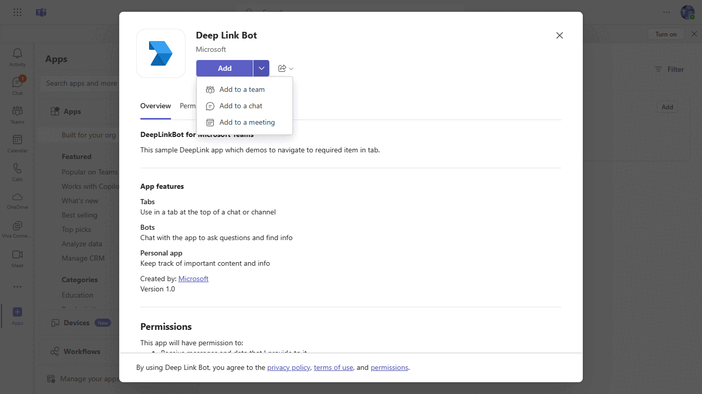

## Prerequisites
- Microsoft Teams is installed and you have an account (not a guest account)
- To test locally, [NodeJS](https://nodejs.org/en/download/) must be installed on your development machine (version 16.14.2  or higher)
- [dev tunnel](https://learn.microsoft.com/en-us/azure/developer/dev-tunnels/get-started?tabs=windows) or [ngrok](https://ngrok.com/) latest version or equivalent tunneling solution
- [M365 developer account](https://docs.microsoft.com/en-us/microsoftteams/platform/concepts/build-and-test/prepare-your-o365-tenant) or access to a Teams account with the 
- [Microsoft 365 Agents Toolkit for VS Code](https://marketplace.visualstudio.com/items?itemName=TeamsDevApp.ms-teams-vscode-extension) or [TeamsFx CLI](https://learn.microsoft.com/microsoftteams/platform/toolkit/teamsfx-cli?pivots=version-one)

## Run the app (Using Microsoft 365 Agents Toolkit for Visual Studio Code)

The simplest way to run this sample in Teams is to use Microsoft 365 Agents Toolkit for Visual Studio Code.

1. Ensure you have downloaded and installed [Visual Studio Code](https://code.visualstudio.com/docs/setup/setup-overview)
1. Install the [Microsoft 365 Agents Toolkit extension](https://marketplace.visualstudio.com/items?itemName=TeamsDevApp.ms-teams-vscode-extension)
1. Select **File > Open Folder** in VS Code and choose this samples directory from the repo
1. Using the extension, sign in with your Microsoft 365 account where you have permissions to upload custom apps
1. Select **Debug > Start Debugging** or **F5** to run the app in a Teams web client.
1. In the browser that launches, select the **Add** button to install the app to Teams.

> If you do not have permission to upload custom apps (uploading), Microsoft 365 Agents Toolkit will recommend creating and using a Microsoft 365 Developer Program account - a free program to get your own dev environment sandbox that includes Teams.

## Setup.

1) App Registration

### Register your application with Azure AD

1. Register a new application in the [Microsoft Entra ID – App Registrations](https://go.microsoft.com/fwlink/?linkid=2083908) portal.
2. Select **New Registration** and on the *register an application page*, set following values:
    * Set **name** to your app name.
    * Choose the **supported account types** (any account type will work)
    * Leave **Redirect URI** empty.
    * Choose **Register**.
3. On the overview page, copy and save the **Application (client) ID, Directory (tenant) ID**. You'll need those later when updating your Teams application manifest and in the appsettings.json.
4. Navigate to **API Permissions**, and make sure to add the follow permissions:
    * Select Add a permission
    * Select Microsoft Graph -> Delegated permissions.
    * `User.Read` (enabled by default)
    * Click on Add permissions. Please make sure to grant the admin consent for the required permissions.

2) Setup for Bot
- In Azure portal, create a [Azure Bot resource](https://docs.microsoft.com/en-us/azure/bot-service/bot-builder-authentication?view=azure-bot-service-4.0&tabs=csharp%2Caadv2).
- Ensure that you've [enabled the Teams Channel](https://docs.microsoft.com/en-us/azure/bot-service/channel-connect-teams?view=azure-bot-service-4.0)
- While registering the bot, use `https://<your_tunnel_domain>/api/messages` as the messaging endpoint.
**NOTE:** When you create app registration, you will create an App ID and App password - make sure you keep these for later.

3. Setup NGROK
 - Run ngrok - point to port 3978

   ```bash
   ngrok http 3978 --host-header="localhost:3978"
   ```  

   Alternatively, you can also use the `dev tunnels`. Please follow [Create and host a dev tunnel](https://learn.microsoft.com/en-us/azure/developer/dev-tunnels/get-started?tabs=windows) and host the tunnel with anonymous user access command as shown below:

   ```bash
   devtunnel host -p 3978 --allow-anonymous
   ```

4. Setup for code

  - Clone the repository

    ```bash
    git clone https://github.com/OfficeDev/Microsoft-Teams-Samples.git
    ```
  - Update the `.env` configuration for the bot to use the `YOUR-MICROSOFT-APP-ID`, `YOUR-MICROSOFT-APP-PASSWORD` and `BASE-URL` is tunnel url eg. 124.ngrok-free.app. (Note the MicrosoftAppId is the AppId created in step 1 (Setup for Bot), the MicrosoftAppPassword is referred to as the "client secret" in step 1 (Setup for Bot) and you can always create a new client secret anytime.)

  - navigate to `Deeplink.html` page at line number `58` Update the `data-app-id` attribute with your application id.
    
    ```bash
    data-app-id="{{Your-App-Id}}"
    ```

    - In a terminal, navigate to `samples/tab-deeplink/nodejs`

        ```bash
        cd samples/tab-deeplink/nodejs
        ```

    - Install modules

        ```bash
        npm install
        ```

    - Navigate to `env.js` file and update your AppId at placeholder `<<App-ID>>` (You can get it manually frrm [teams admin portal](https://admin.teams.microsoft.com/).
    - 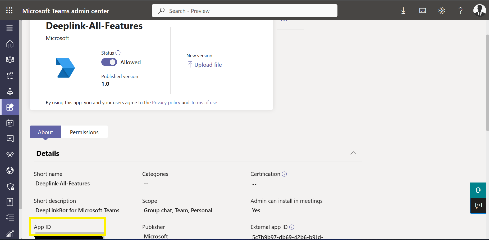

    - Start the bot

        ```bash
        npm start
        ```
    - If you are using Visual Studio code
     - Launch Visual Studio code
     - Folder -> Open -> Project/Solution
     - Navigate to ```samples/tab-deeplink/nodejs``` folder
     - Select ```nodejs``` Folder
     
     - To run the application required  node modules.Please use this command to install modules npm i.

5. Setup Manifest for Teams
- __*This step is specific to Teams.*__
    - **Edit** the `manifest.json` contained in the ./appManifest folder to replace your Microsoft App Id (that was created when you registered your app registration earlier) *everywhere* you see the place holder string `<<YOUR-MICROSOFT-APP-ID>>` (depending on the scenario the Microsoft App Id may occur multiple times in the `manifest.json`)
    - **Edit** the `manifest.json` for `validDomains` and replace `{{domain-name}}` with base Url of your domain. E.g. if you are using ngrok it would be `https://1234.ngrok-free.app` then your domain-name will be `1234.ngrok-free.app` and if you are using dev tunnels then your domain will be like: `12345.devtunnels.ms`.
    **Note:** If you want to test your app across multi hub like: Outlook/Office.com, please update the `manifest.json` in the `tab-deeplink\nodejs\appManifest_Hub` folder with the required values.
    - **Zip** up the contents of the `appManifest` folder to create a `appManifest.zip` or `appManifest_Hub` folder to create a `appManifest_Hub.zip`(Make sure that zip file does not contains any subfolder otherwise you will get error while uploading your .zip package)

- Upload the manifest.zip to Teams (in the Apps view click "Upload a custom app")
   - Go to Microsoft Teams. From the lower left corner, select Apps
   - From the lower left corner, choose Upload a custom App
   - Go to your project directory, the ./appManifest folder, select the zip folder, and choose Open.
   - Select Add in the pop-up dialog box. Your app is uploaded to Teams.

**Note**: If you are facing any issue in your app, please uncomment [this](https://github.com/OfficeDev/Microsoft-Teams-Samples/blob/main/samples/tab-deeplink/nodejs/index.js#L62) line and put your debugger for local debug.

## Interacting with the bot

Enter text in the emulator.  The text will be echoed back by the bot.
1. Interact with DeepLink bot by pinging it in personal or channel scope. 

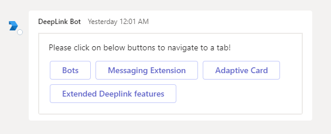

2. Select the option from the options displayed in the adaptive card. This will redirect to the respective Task in the Tab.

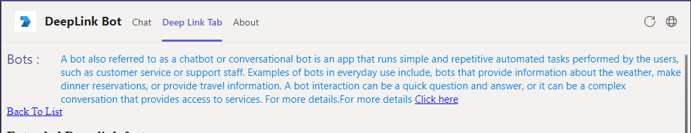

3. Click on Back to List to view all the options and additional features of deep link using Microsoft teams SDK v2.0.0. User can select an option which will redirect to the respective Task in the Tab.

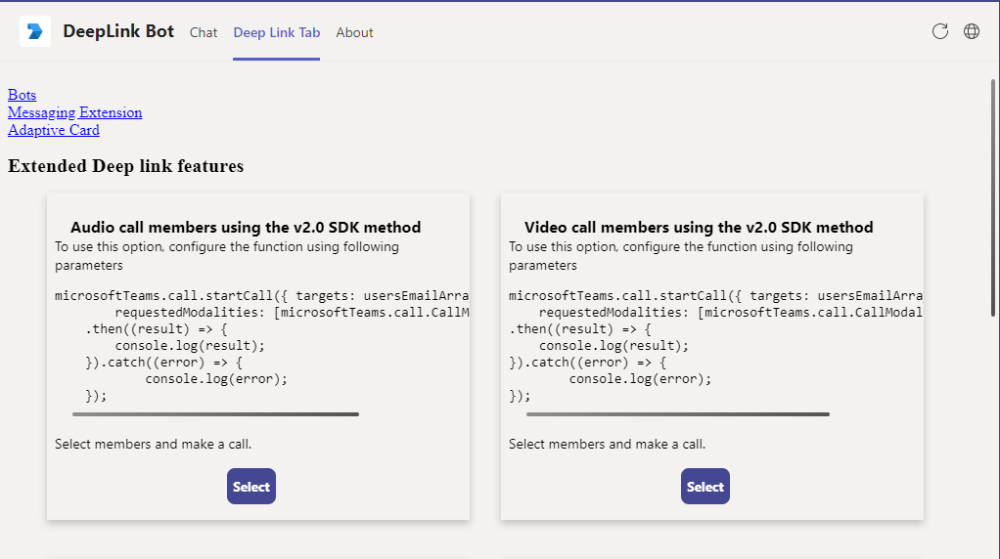

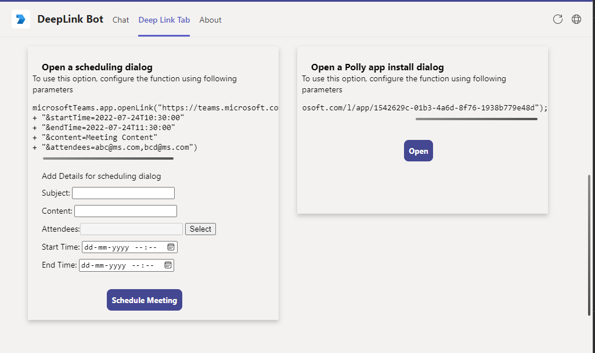

4. Add this application in live meeting and stage the content.

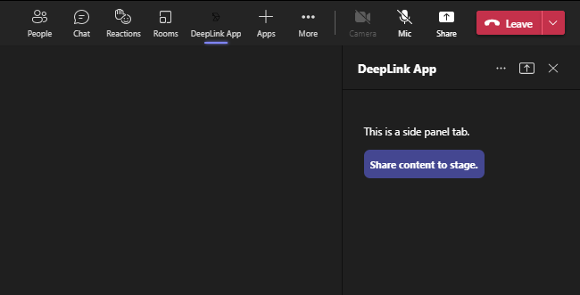

5. While it's in stage view, using same [deeplink to open tab](https://docs.microsoft.com/en-us/microsoftteams/platform/concepts/build-and-test/deep-links?tabs=teamsjs-v2#generate-a-deep-link-to-your-tab) will open the meeting side panel tab.

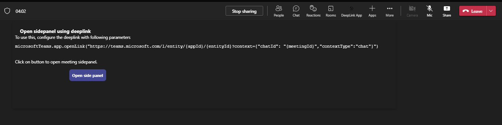

6. **Deeplink to meeting side panel:**

`@mention` bot in meeting chat to get an adaptive card.

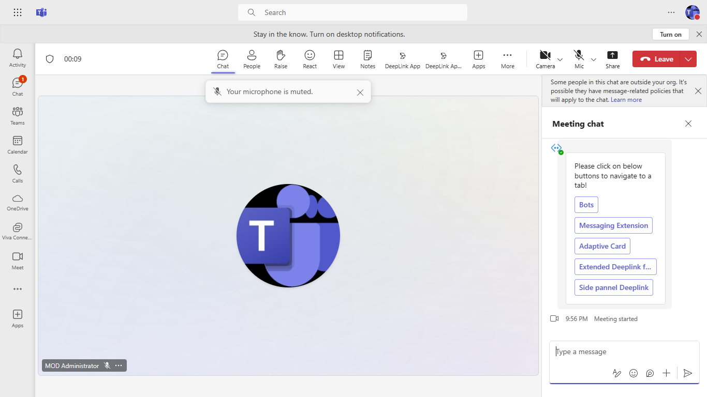

Click on `Side Panel Deeplink` which will redirect to the meeting side panel.
**Note:** When the deeplink is opened outside meeting, it will redirect to meeting details tab.


**Tab interaction:**
   
**Deeplink to Audio Call:**

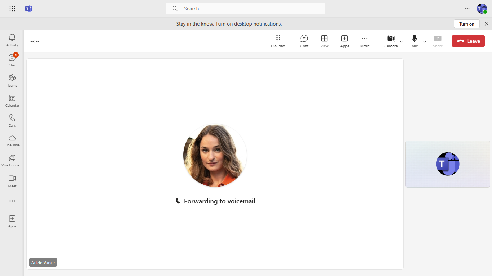

**Deeplink to Video Call:**
   
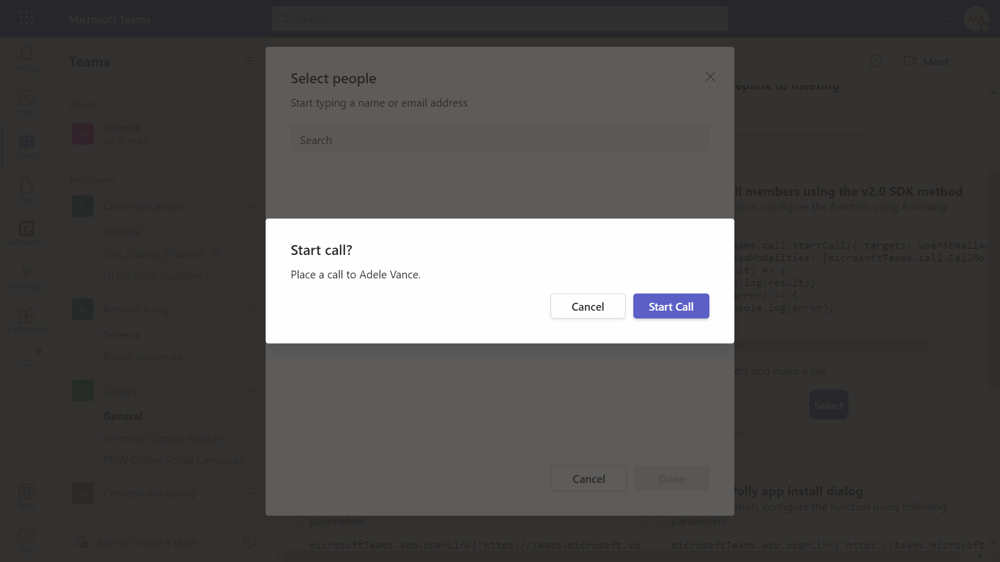

**Deeplink to Meeting schedule:**
   
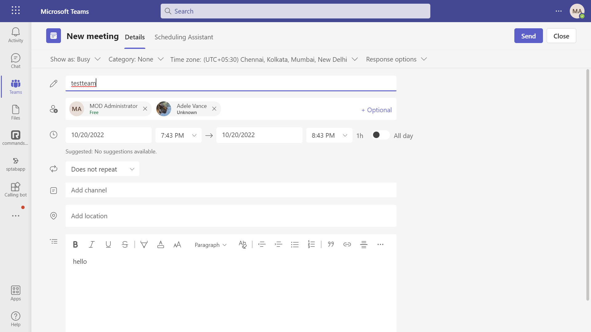

**Deeplink to Polly app install dialog:**
   
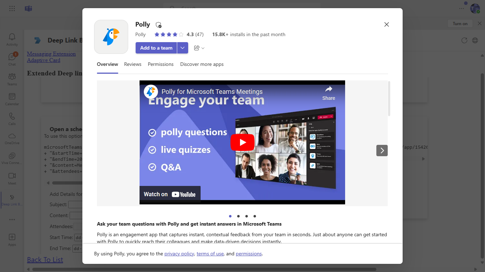

**Deeplink to start new chat:**
   


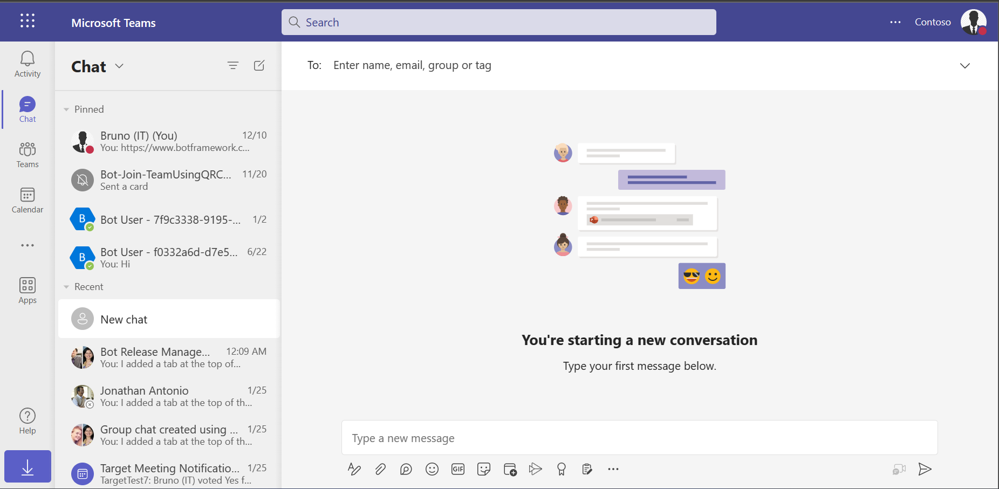

**Deeplink to channel conversation:**
   

   
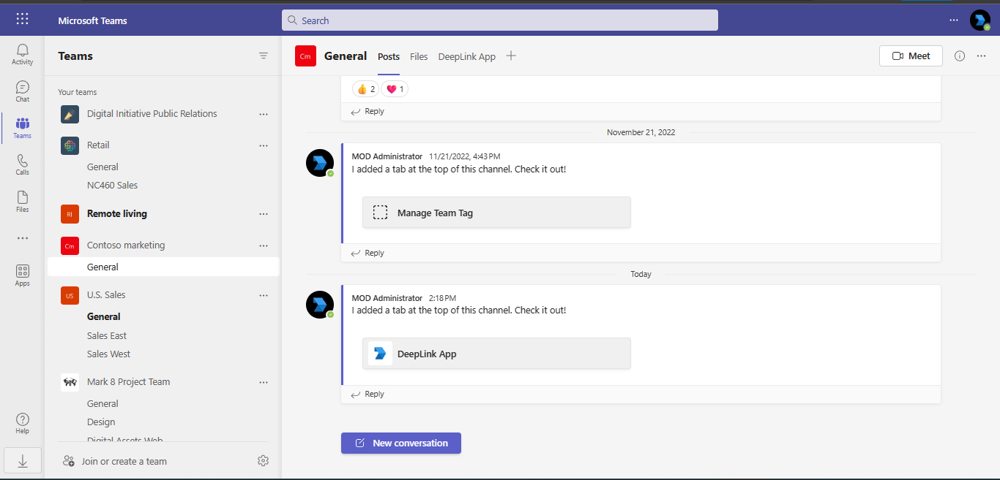

**Share To Teams Web Apps:**

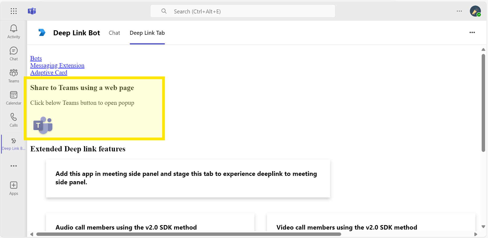

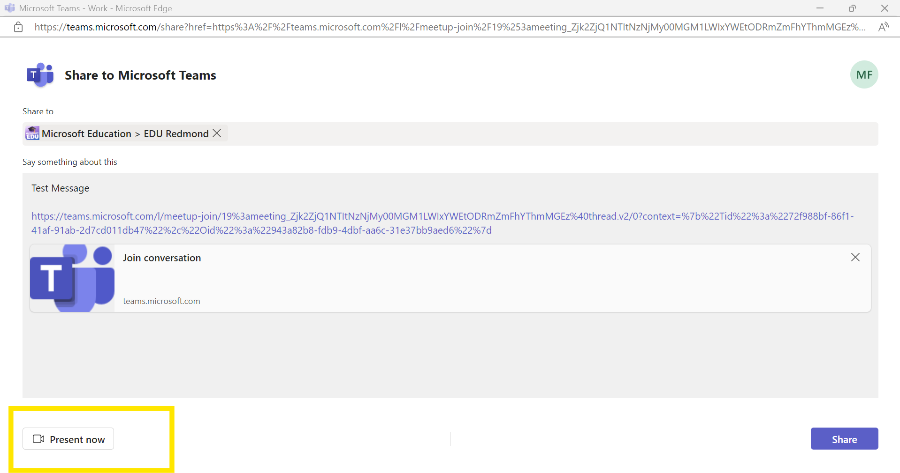
   
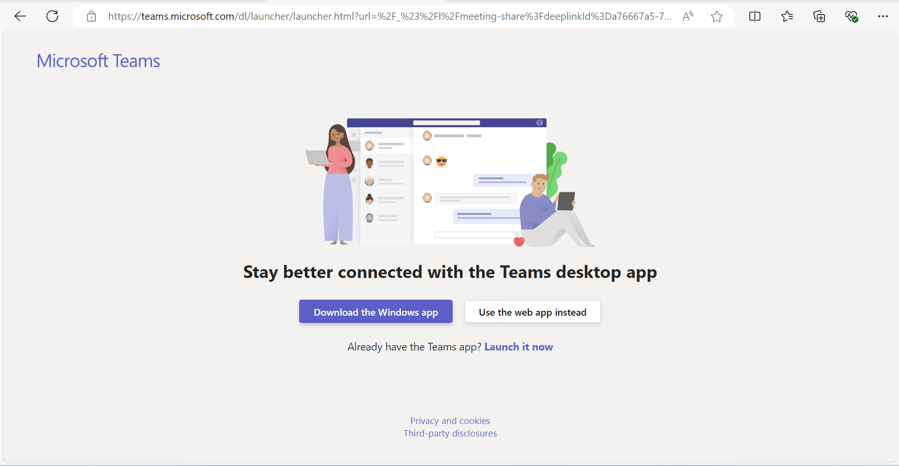

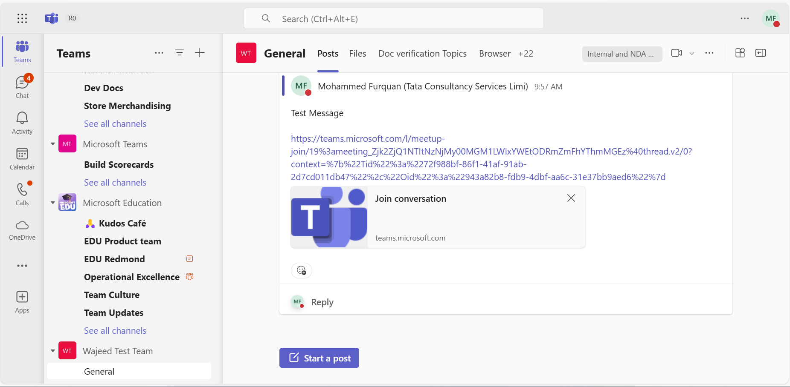

## Outlook on the web

- To view your app in Outlook on the web.

- Go to [Outlook on the web](https://outlook.office.com/mail/)and sign in using your dev tenant account.

**On the side bar, select More Apps. Your uploaded app title appears among your installed apps**

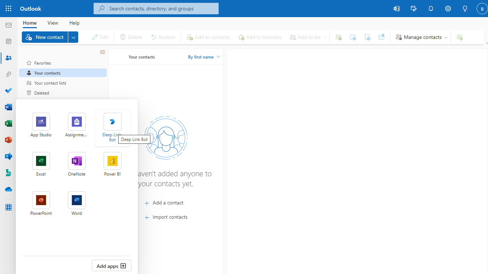

**Select your app icon to launch and preview your app running in Outlook on the web**

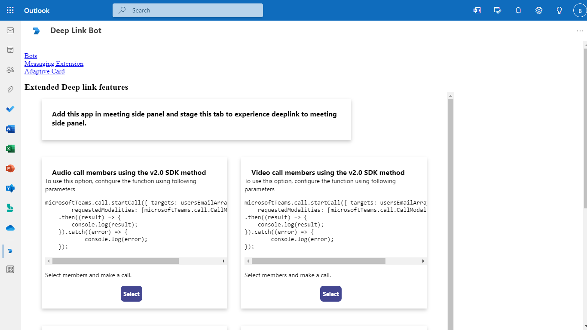

**Note:** Similarly, you can test your application in the Outlook desktop app as well.

## Office on the web

- To preview your app running in Office on the web.

- Log into office.com with test tenant credentials

**Select the Apps icon on the side bar. Your uploaded app title appears among your installed apps**

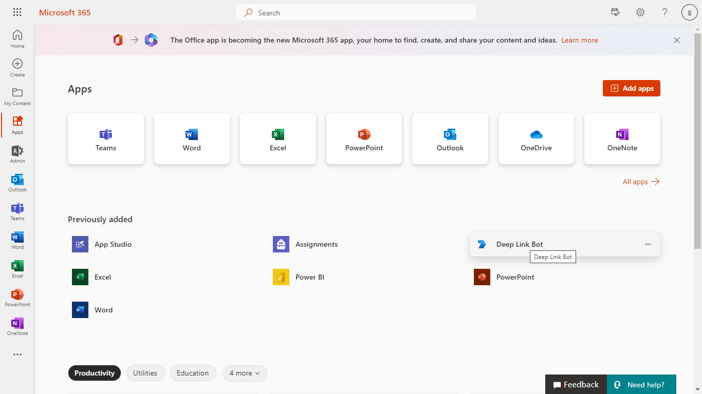

**Select your app icon to launch your app in Office on the web**

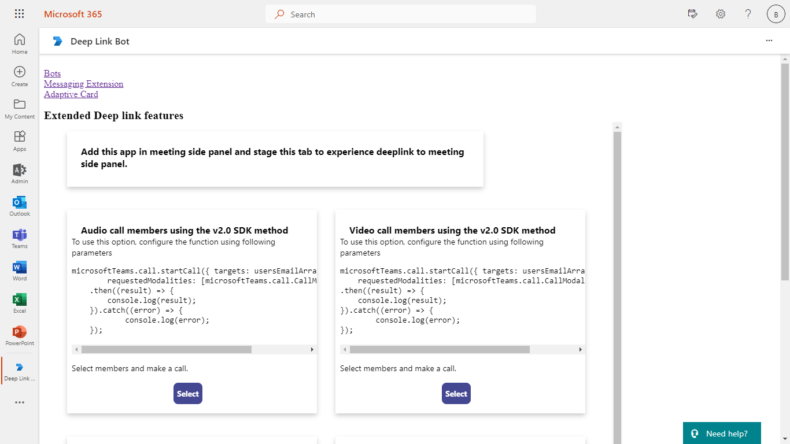 

**Note:** Similarly, you can test your application in the Office 365 desktop app as well.

 ## Further reading

- [Extend Teams apps across Microsoft 365](https://learn.microsoft.com/en-us/microsoftteams/platform/m365-apps/overview)

- [Share to teams web apps](https://learn.microsoft.com/en-us/microsoftteams/platform/concepts/build-and-test/share-to-teams-from-web-apps?branch=pr-en-us-10824&tabs=method1)


