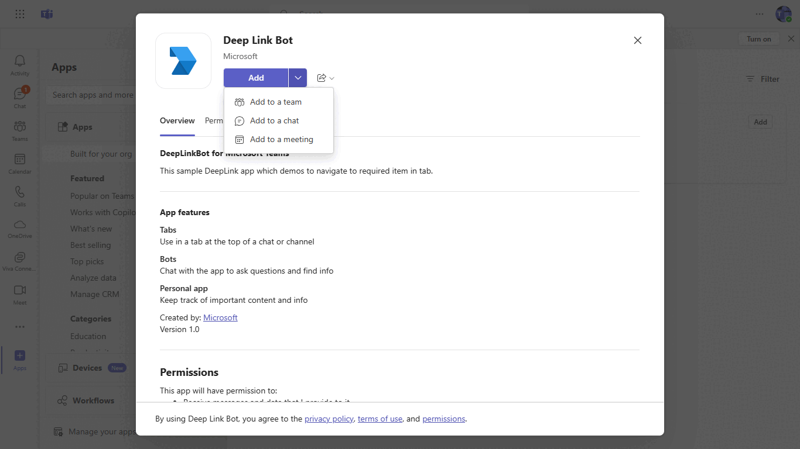
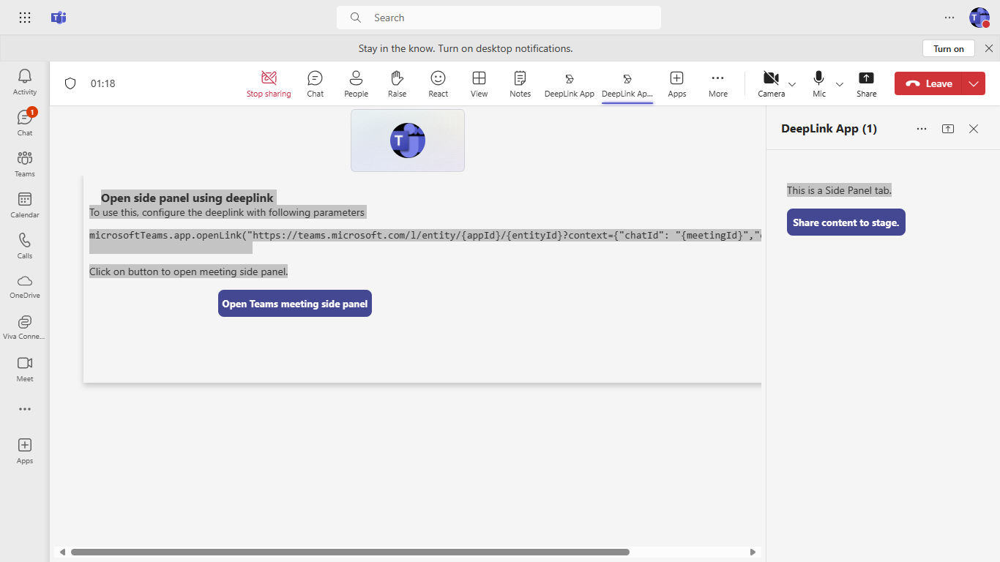
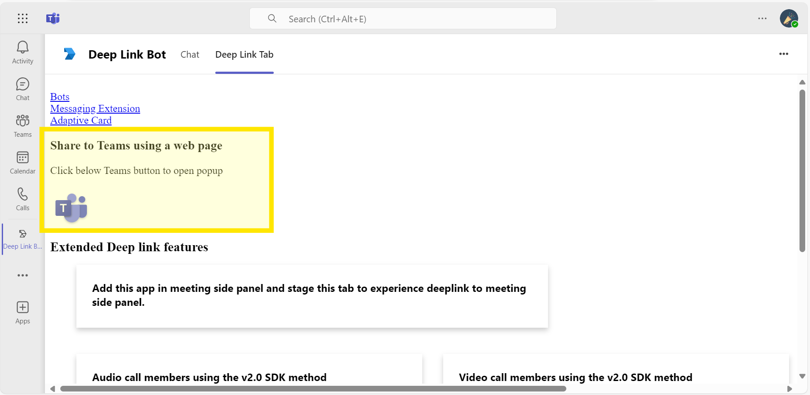
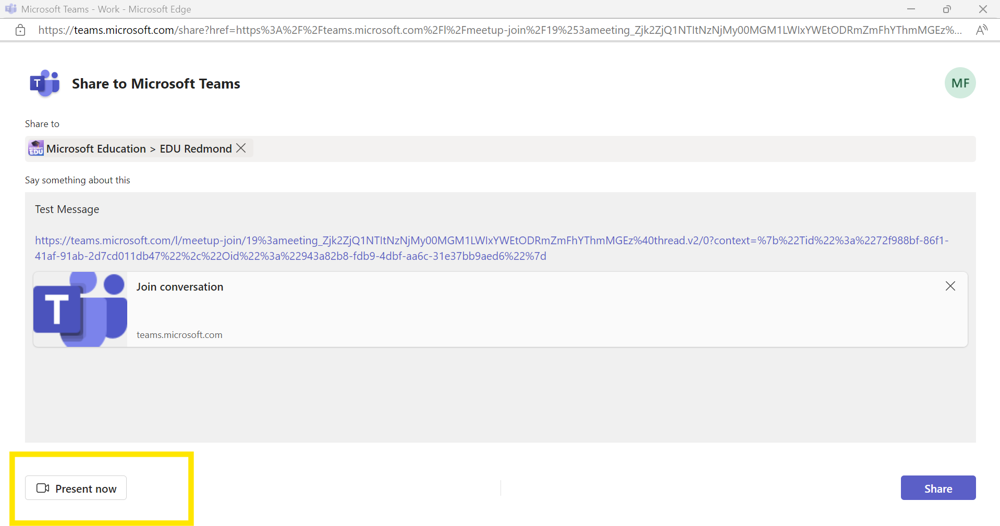
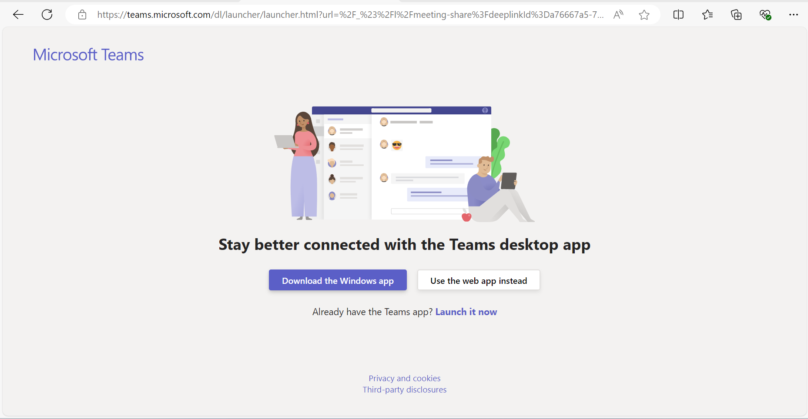
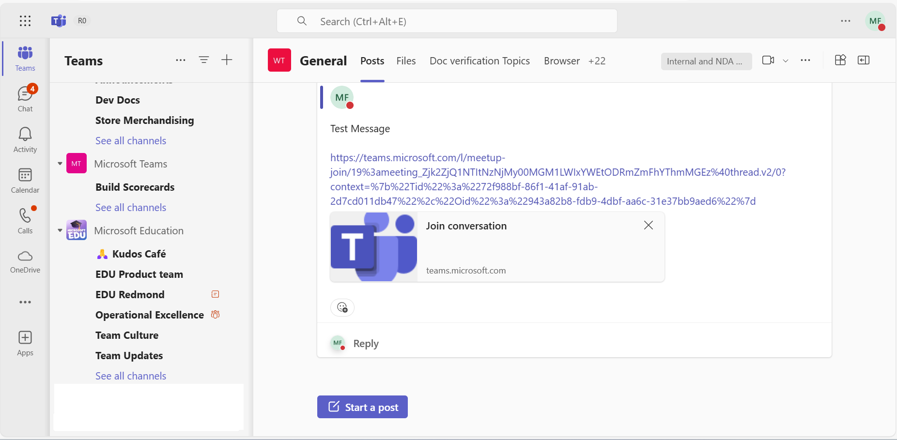
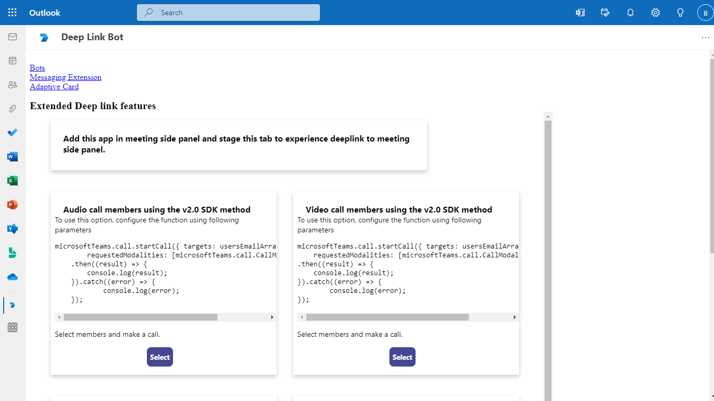
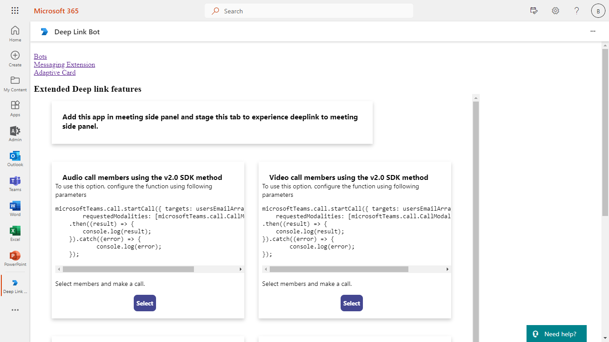

# DeepLink

Explore this Microsoft Teams sample app designed to demonstrate the use of deeplinks for seamless interactions, including calls, chats, and navigation across tabs and applications. Featuring bot integration and comprehensive setup guidance, this app empowers developers to create engaging and efficient communication experiences within Teams.[DeepLink](https://learn.microsoft.com/microsoftteams/platform/concepts/build-and-test/deep-links)

 ## Included Features
* Tabs
* Bots
* Deep Links

## Interaction with app.



## Prerequisites

- Microsoft Teams is installed and you have an account
- [Python SDK](https://www.python.org/downloads/) min version 3.6
- [dev tunnel](https://learn.microsoft.com/en-us/azure/developer/dev-tunnels/get-started?tabs=windows) or [ngrok](https://ngrok.com/) latest version or equivalent tunnelling solution


## Run the app (Using Microsoft 365 Agents Toolkit for Visual Studio Code)

The simplest way to run this sample in Teams is to use Microsoft 365 Agents Toolkit for Visual Studio Code.

1. Ensure you have downloaded and installed [Visual Studio Code](https://code.visualstudio.com/docs/setup/setup-overview)
1. Install the [Microsoft 365 Agents Toolkit extension](https://marketplace.visualstudio.com/items?itemName=TeamsDevApp.ms-teams-vscode-extension) and [Python Extension](https://marketplace.visualstudio.com/items?itemName=ms-python.python)
1. Select **File > Open Folder** in VS Code and choose this samples directory from the repo
1. Press **CTRL+Shift+P** to open the command box and enter **Python: Create Environment** to create and activate your desired virtual environment. Remember to select `requirements.txt` as dependencies to install when creating the virtual environment.
1. Using the extension, sign in with your Microsoft 365 account where you have permissions to upload custom apps
1. Select **Debug > Start Debugging** or **F5** to run the app in a Teams web client.
1. In the browser that launches, select the **Add** button to install the app to Teams.

> If you do not have permission to upload custom apps (uploading), Microsoft 365 Agents Toolkit will recommend creating and using a Microsoft 365 Developer Program account - a free program to get your own dev environment sandbox that includes Teams.

## Run the app (Manually Uploading to Teams)

> Note these instructions are for running the sample on your local machine, the tunnelling solution is required because
the Teams service needs to call into the bot.

1) Clone the repository

    ```bash
    git clone https://github.com/OfficeDev/Microsoft-Teams-Samples.git
    ```

2) Run ngrok - point to port 3978

   ```bash
   ngrok http 3978 --host-header="localhost:3978"
   ```  

   Alternatively, you can also use the `dev tunnels`. Please follow [Create and host a dev tunnel](https://learn.microsoft.com/en-us/azure/developer/dev-tunnels/get-started?tabs=windows) and host the tunnel with anonymous user access command as shown below:

   ```bash
   devtunnel host -p 3978 --allow-anonymous
   ```

3) App Registration

### Register your application with Azure AD

1. Register a new application in the [Microsoft Entra ID – App Registrations](https://go.microsoft.com/fwlink/?linkid=2083908) portal.
2. Select **New Registration** and on the *register an application page*, set following values:
    * Set **name** to your app name.
    * Choose the **supported account types** (any account type will work)
    * Leave **Redirect URI** empty.
    * Choose **Register**.
3. On the overview page, copy and save the **Application (client) ID, Directory (tenant) ID**. You'll need those later when updating your Teams application manifest and in the appsettings.json.
4. Navigate to **API Permissions**, and make sure to add the follow permissions:
    * Select Add a permission
    * Select Microsoft Graph -> Delegated permissions.
    * `User.Read` (enabled by default)
    * Click on Add permissions. Please make sure to grant the admin consent for the required permissions.

4) Create [Azure Bot resource resource](https://docs.microsoft.com/azure/bot-service/bot-service-quickstart-registration) in Azure
    - Use the current `https` URL you were given by running the tunneling application. Append with the path `/api/messages` used by this sample
    - Ensure that you've [enabled the Teams Channel](https://docs.microsoft.com/azure/bot-service/channel-connect-teams?view=azure-bot-service-4.0)
    - __*If you don't have an Azure account*__ you can use this [Azure free account here](https://azure.microsoft.com/free/)

5) In a terminal, go to `samples\tab-deeplink`

6) Activate your desired virtual environment

7) Install dependencies by running ```pip install -r requirements.txt``` in the project folder.

8) Update the `config.py` configuration for the bot to use the Microsoft App Id and App Password from the Bot Framework registration. (Note the App Password is referred to as the "client secret" in the azure portal and you can always create a new client secret anytime.)

9)  - navigate to `Deeplink.html` page at line number `58` Update the `data-app-id` attribute with your application id.
    - Navigate to `env.js` file and update your AppId at placeholder `<<App-ID>>` (You can get it manually from [teams admin portal](https://admin.teams.microsoft.com/).
    - 


10) __*This step is specific to Teams.*__
    - **Edit** the `manifest.json` contained in the `appManifest` folder to replace your Microsoft App Id (that was created when you registered your bot earlier) *everywhere* you see the place holder string `${{AAD_APP_CLIENT_ID}}` and `${{TEAMS_APP_ID}}` (depending on the scenario the Microsoft App Id may occur multiple times in the `manifest.json`)
    - **Zip** up the contents of the `appManifest` folder to create a `manifest.zip`
    - **Upload** the `manifest.zip` to Teams (in the Apps view click "Upload a custom app")

11) Run your bot with `python app.py`

## Interacting with the bot

Enter text in the emulator.  The text will be echoed back by the bot.
1. Interact with DeepLink bot by pinging it in personal or channel scope. 


2. Select the option from the options displayed in the adaptive card. This will redirect to the respective Task in the Tab.


3. Click on Back to List to view all the options and additional features of deep link using Microsoft teams SDK v2.0.0. User can select an option which will redirect to the respective Task in the Tab.


4. Add this application in live meeting and stage the content.


5. While it's in stage view, using same [deeplink to open tab](https://docs.microsoft.com/en-us/microsoftteams/platform/concepts/build-and-test/deep-links?tabs=teamsjs-v2#generate-a-deep-link-to-your-tab) will open the meeting side panel tab.



6. **Deeplink to meeting side panel:**

`@mention` bot in meeting chat to get an adaptive card.


Click on `Side Panel Deeplink` which will redirect to the meeting side panel.
**Note:** When the deeplink is opened outside meeting, it will redirect to meeting details tab.


**Tab interaction:**
   
**Deeplink to Audio Call:**


**Deeplink to Video Call:**
   


**Deeplink to Meeting schedule:**
   


**Deeplink to Polly app install dialog:**
   


**Deeplink to start new chat:**
   


**Deeplink to channel conversation:**
   

   


**Share To Teams Web Apps:**




   




## Outlook on the web

- To view your app in Outlook on the web.

- Go to [Outlook on the web](https://outlook.office.com/mail/)and sign in using your dev tenant account.

**On the side bar, select More Apps. Your uploaded app title appears among your installed apps**


**Select your app icon to launch and preview your app running in Outlook on the web**



**Note:** Similarly, you can test your application in the Outlook desktop app as well.

## Office on the web

- To preview your app running in Office on the web.

- Log into office.com with test tenant credentials

**Select the Apps icon on the side bar. Your uploaded app title appears among your installed apps**


**Select your app icon to launch your app in Office on the web**

 

**Note:** Similarly, you can test your application in the Office 365 desktop app as well.

 ## Further reading

- [Extend Teams apps across Microsoft 365](https://learn.microsoft.com/en-us/microsoftteams/platform/m365-apps/overview)

- [Share to teams web apps](https://learn.microsoft.com/en-us/microsoftteams/platform/concepts/build-and-test/share-to-teams-from-web-apps?branch=pr-en-us-10824&tabs=method1)

