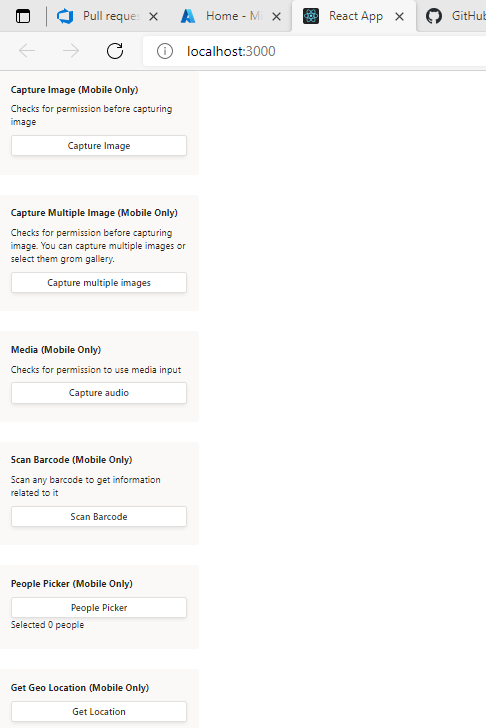
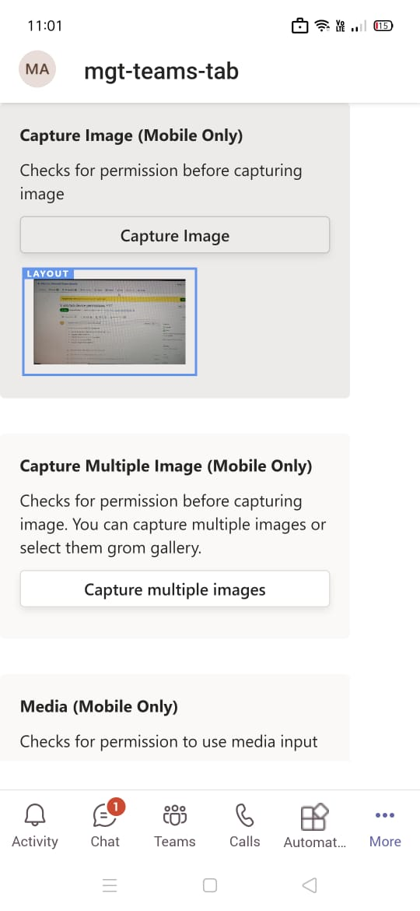

# Tab Device Permission Demo
This is demo app to for [tab device permissions](https://docs.microsoft.com/microsoftteams/platform/concepts/device-capabilities/device-capabilities-overview).
## Getting started
1. Install some sort of tunnelling service. These instructions assume you are using ngrok: https://ngrok.com/
1. Begin your tunnelling service to get an https endpoint. For this example ngrok is used. Start an ngrok tunnel with the following command (you'll need the https endpoint for the bot registration):<br>
    ```bash
    ngrok http 3000 --host-header=localhost
    ```
1. Create an app manifest. Navigate to the file, manifest/manifest.json - Change:
    1. <<BASE_URI_DOMAIN>> change to your https endpoint from ngrok excluding the "https://" part
    1. Save the file and zip this file along with both the png icons (located next to it) together to create a manifest.zip file
## See it running
1. Clone the sample and open it in Visual Studio Code. (Look at [similar steps if you are not sure](https://docs.microsoft.com/en-us/microsoftteams/platform/get-started/get-started-nodejs-app-studio?tabs=AS#download-the-sample))

## Build and Run
In the project directory, execute:
`npm install`
`npm start`


1. [Upload an app package](https://docs.microsoft.com/microsoftteams/platform/concepts/deploy-and-publish/apps-upload) (Zip file created in step 3 above) to Microsoft Teams

1. Go to Device permission tab.
1. Click on respective button to test the scenario. You will get prompt to accept permission request.

1. Try this on Mobile. Screenshot of available features: <br/> 




Similary, you can try out for other features.
> [!IMPORTANT]
  > Please take a look at [notes section in Device Permissions](https://docs.microsoft.com/microsoftteams/platform/concepts/device-capabilities/native-device-permissions?tabs=desktop) documentation as not all devices support these permissions.
# Contributing
This project welcomes contributions and suggestions.  Most contributions require you to agree to a
Contributor License Agreement (CLA) declaring that you have the right to, and actually do, grant us
the rights to use your contribution. For details, visit https://cla.microsoft.com.
When you submit a pull request, a CLA-bot will automatically determine whether you need to provide
a CLA and decorate the PR appropriately (e.g., label, comment). Simply follow the instructions
provided by the bot. You will only need to do this once across all repos using our CLA.
This project has adopted the [Microsoft Open Source Code of Conduct](https://opensource.microsoft.com/codeofconduct/).
For more information see the [Code of Conduct FAQ](https://opensource.microsoft.com/codeofconduct/faq/) or
contact [opencode@microsoft.com](mailto:opencode@microsoft.com) with any additional questions or comments.
