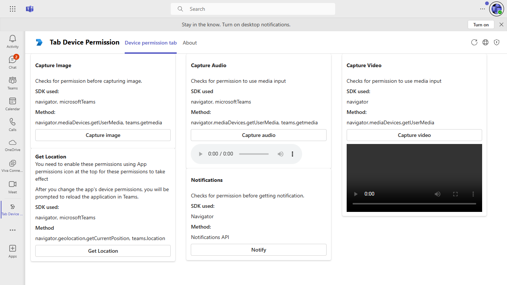
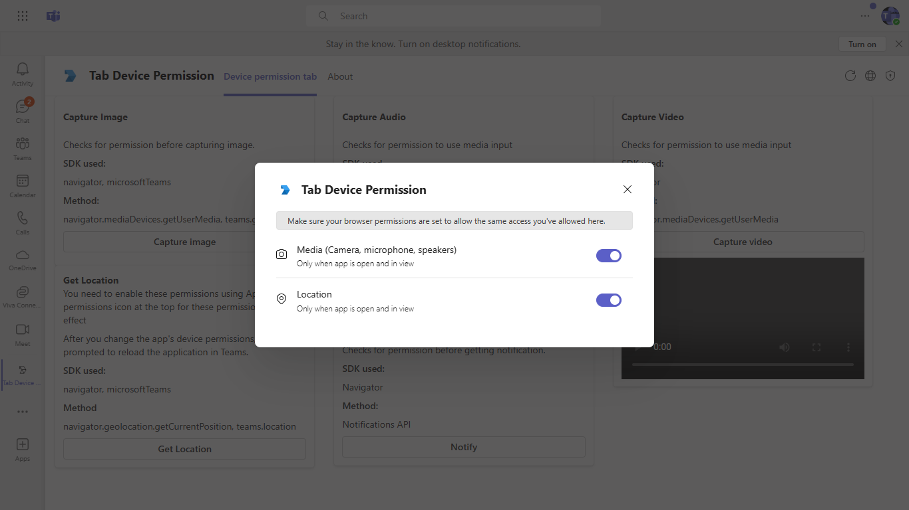

# Tab Device Permission

This sample shows [tab device permissions](https://docs.microsoft.com/microsoftteams/platform/concepts/device-capabilities/device-capabilities-overview).

It also shows Device permissions for the browser. Please refer [Device permissions for browser](https://docs.microsoft.com/microsoftteams/platform/concepts/device-capabilities/browser-device-permissions) for more information.

```
Currently only capture image is supported in Teams Desktop client.
```

 ## Included Features
* Tabs
* Device Permissions (geolocation, media)

## Interaction with app - Desktop View

 

## Interaction with app - Mobile View


## Try it yourself - experience the App in your Microsoft Teams client
Please find below demo manifest which is deployed on Microsoft Azure and you can try it yourself by uploading the app package (.zip file link below) to your teams and/or as a personal app. (Sideloading must be enabled for your tenant, [see steps here](https://docs.microsoft.com/microsoftteams/platform/concepts/build-and-test/prepare-your-o365-tenant#enable-custom-teams-apps-and-turn-on-custom-app-uploading)).

**Tab Device Permission:** [Manifest](/samples/tab-device-permissions/nodejs/demo-manifest/tab-device-permissions.zip)

## Prerequisites
 To test locally, [NodeJS](https://nodejs.org/en/download/) must be installed on your development machine (version 16.14.2  or higher).

    ```bash
    # determine node version
    node --version
    ```
- To test locally, you'll need [Ngrok](https://ngrok.com/) installed on your development machine.
Make sure you've downloaded and installed Ngrok on your local machine. ngrok will tunnel requests from the Internet to your local computer and terminate the SSL connection from Teams.

- [M365 developer account](https://docs.microsoft.com/microsoftteams/platform/concepts/build-and-test/prepare-your-o365-tenant) or access to a Teams account with the appropriate permissions to install an app.
    
## Setup
 NOTE: The free ngrok plan will generate a new URL every time you run it, which requires you to update your Azure AD registration, the Teams app manifest, and the project configuration. A paid account with a permanent ngrok URL is recommended.
1. Register a new application in the [Azure Active Directory – App Registrations](https://go.microsoft.com/fwlink/?linkid=2083908) portal.


2. Setup NGROK
    - Run ngrok - point to port `3000`

    ```bash
    ngrok http 3000 --host-header="localhost:3000"
    ```
3. Setup for code   
- Clone the repository

    ```bash
    git clone https://github.com/OfficeDev/Microsoft-Teams-Samples.git
    ```
 - In a terminal, navigate to `samples/tab-device-permissions/nodejs`

- Install modules

    ```bash
    npm install
    ```
- Start the bot

    ```bash
    npm start
    ```
 4. Setup Manifest for Teams
- __*This step is specific to Teams.*__
    - **Edit** the `manifest.json` contained in the ./AppPackage folder to replace your Microsoft App Id (that was created when you registered your app registration earlier) *everywhere* you see the place holder string `{{Microsoft-App-Id}}` (depending on the scenario the Microsoft App Id may occur multiple times in the `manifest.json`)
    - **Edit** the `manifest.json` for `validDomains` and replace `{{domain-name}}` with base Url of your domain. E.g. if you are using ngrok it would be `https://1234.ngrok-free.app` then your domain-name will be `1234.ngrok-free.app`.
    - **Zip** up the contents of the `AppPackage` folder to create a `manifest.zip` (Make sure that zip file does not contains any subfolder otherwise you will get error while uploading your .zip package) 

## Running the sample - Desktop View

- [Install the App in Teams Meeting](https://docs.microsoft.com/microsoftteams/platform/apps-in-teams-meetings/teams-apps-in-meetings?view=msteams-client-js-latest#meeting-lifecycle-scenarios)

**Install app:** 


**Device permission tab: (Web View)** 



**Device permission tab: (Desktop View)** 


**Tab device permission:** 



## Running the sample - Mobile View

**Tab device permission(Capture Image and Media):** 


**Tab device permission(Scan Barcode):** 


**Tab device permission(People Picker and Get Location):** 


**Device permission popup:** 


Similary, you can try out for other features.
> [!IMPORTANT]
  > Please take a look at [notes section in Device Permissions](https://docs.microsoft.com/microsoftteams/platform/concepts/device-capabilities/native-device-permissions?tabs=desktop) documentation as not all devices support these permissions.

# Contributing
This project welcomes contributions and suggestions.  Most contributions require you to agree to a
Contributor License Agreement (CLA) declaring that you have the right to, and actually do, grant us
the rights to use your contribution. For details, visit https://cla.microsoft.com.
When you submit a pull request, a CLA-bot will automatically determine whether you need to provide
a CLA and decorate the PR appropriately (e.g., label, comment). Simply follow the instructions
provided by the bot. You will only need to do this once across all repos using our CLA.
This project has adopted the [Microsoft Open Source Code of Conduct](https://opensource.microsoft.com/codeofconduct/).
For more information see the [Code of Conduct FAQ](https://opensource.microsoft.com/codeofconduct/faq/) or
contact [opencode@microsoft.com](mailto:opencode@microsoft.com) with any additional questions or comments.

# Further reading

- [Teams tabs](https://learn.microsoft.com/microsoftteams/platform/tabs/what-are-tabs)
- [Integrate media Capabilities inside your app](https://learn.microsoft.com/microsoftteams/platform/concepts/device-capabilities/media-capabilities?tabs=mobile)

