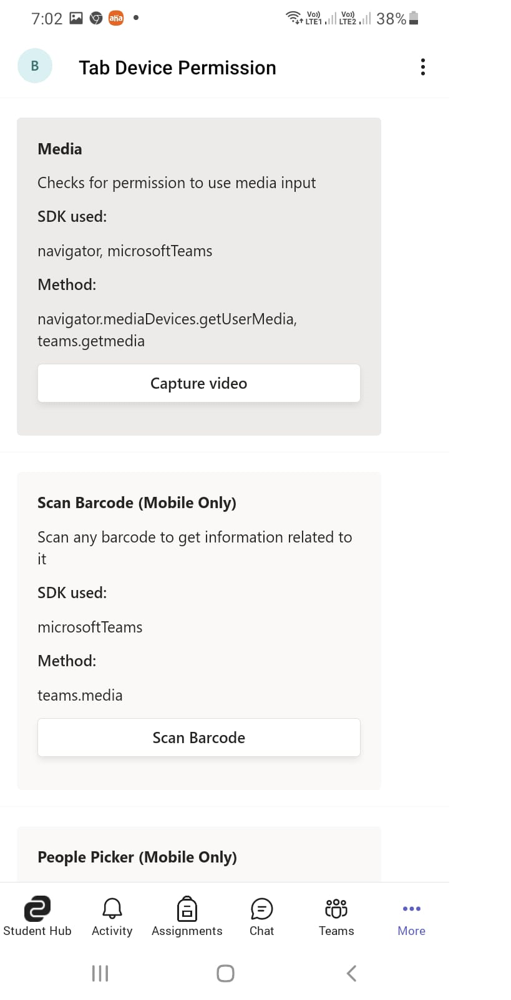

# Tab Device Permission Demo

This sample shows [tab device permissions](https://docs.microsoft.com/microsoftteams/platform/concepts/device-capabilities/device-capabilities-overview).

It also shows Device permissions for the browser. Please refer [Device permissions for browser](https://docs.microsoft.com/en-us/microsoftteams/platform/concepts/device-capabilities/browser-device-permissions) for more information.

**Mobile View**





**Desktop View**


```
The latest update on how device permissions are handled in the browser is currently available in public developer preview
only.

This update will be generally available (GA) by February 01, 2022
```
## Prerequisites
- Microsoft Teams is installed and you have an account (not a guest account)
-  [NodeJS](https://nodejs.org/en/)
-  [ngrok](https://ngrok.com/) or equivalent tunneling solution
-  [M365 developer account](https://docs.microsoft.com/en-us/microsoftteams/platform/concepts/build-and-test/prepare-your-o365-tenant) or access to a Teams account with the 
   appropriate permissions to install an app.
    
## To try this sample
1) Clone the repository

    ```bash
    git clone https://github.com/OfficeDev/Microsoft-Teams-Samples.git
    ```

2) In the folder where repository is cloned navigate to `samples/tab-device-permissions/nodejs`.

3) Install modules

   Inside node js folder, open your local terminal and run the below command to install node modules. 
   You can do the same in Visual studio code terminal by opening the project in Visual studio code 

    ```bash
    npm install
    ```

    If you face any dependency error while installing node modules, try using below command

    ```bash
    npm install --legacy-peer-deps
    ```

 4) Run the application in your local terminal (or Visual Studio Code terminal) using following command 
    
     ```bash
    npm start
    ```
 5) Begin your tunnelling service to get an https endpoint. For this example ngrok is used. Start an ngrok tunnel with the following command (you'll need the https endpoint     to update the manifest file):<br>
    ```bash
    ngrok http 3000 --host-header=localhost
    ```
 6) Create an app manifest. Navigate to the file, appPackage/manifest.json and change the following:
    1. <<BASE_URI_DOMAIN>> to your https endpoint from ngrok excluding the "https://" part
    2. Save the file and zip this file along with both the png icons (located next to it) together to create a manifest.zip file.
 
 6) Upload the `manifest.zip` to Teams (in the left-bottom *Apps* view, click "Upload a custom app") ans start using the app.

Local Running App:

1. [Upload an app package](https://docs.microsoft.com/microsoftteams/platform/concepts/deploy-and-publish/apps-upload) (Zip file created in step 3 above) to Microsoft Teams

1. Go to Device permission tab.
1. Click on respective button to test the scenario. You will get prompt to accept permission request.

1. Try this on Mobile. Screenshot of available features: <br/> 


1. Device permissions on browser


Similary, you can try out for other features.
> [!IMPORTANT]
  > Please take a look at [notes section in Device Permissions](https://docs.microsoft.com/microsoftteams/platform/concepts/device-capabilities/native-device-permissions?tabs=desktop) documentation as not all devices support these permissions.
# Contributing
This project welcomes contributions and suggestions.  Most contributions require you to agree to a
Contributor License Agreement (CLA) declaring that you have the right to, and actually do, grant us
the rights to use your contribution. For details, visit https://cla.microsoft.com.
When you submit a pull request, a CLA-bot will automatically determine whether you need to provide
a CLA and decorate the PR appropriately (e.g., label, comment). Simply follow the instructions
provided by the bot. You will only need to do this once across all repos using our CLA.
This project has adopted the [Microsoft Open Source Code of Conduct](https://opensource.microsoft.com/codeofconduct/).
For more information see the [Code of Conduct FAQ](https://opensource.microsoft.com/codeofconduct/faq/) or
contact [opencode@microsoft.com](mailto:opencode@microsoft.com) with any additional questions or comments.
