# Tab external auth - C#

This Microsoft Teams sample app illustrates the implementation of Google authentication using OAuth2, enabling seamless user sign-in via external providers. It includes a tab interface for easy interaction, showcasing best practices for integrating authentication within Teams applications.

## Included Features
* External Auth (Google Oauth2)
* Tabs

## Interaction with app

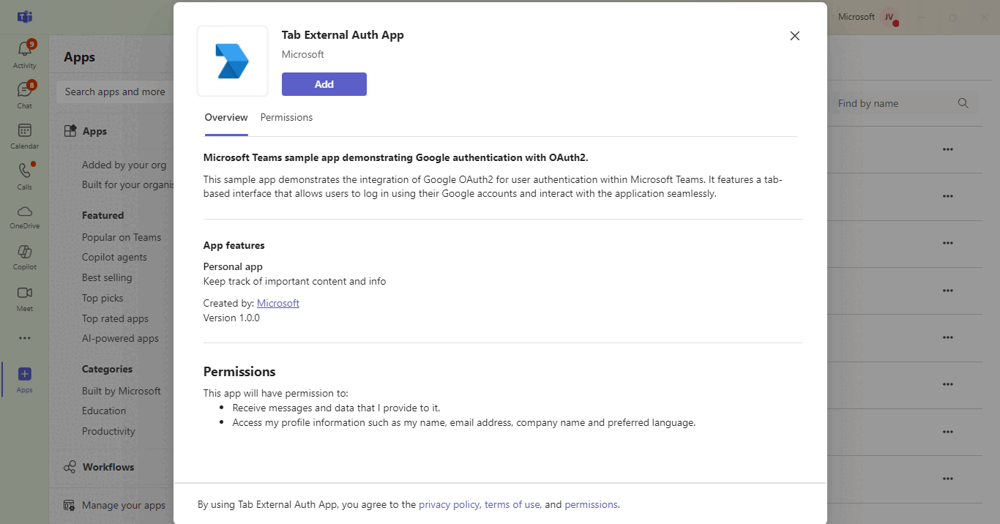

## Prerequisites

- [.NET Core SDK](https://dotnet.microsoft.com/download) version 6.0

  determine dotnet version
  ```bash
  dotnet --version
  ```
- [devtunnel](https://aka.ms/TunnelsCliDownload/win-x64) or [ngrok](https://ngrok.com/download) (For local environment testing) latest version (any other tunneling software can also be used)

- [Teams](https://teams.microsoft.com) Microsoft Teams is installed and you have an account

## Setup

1. Create Google OAuth app [Google API Console](https://console.developers.google.com/)
 - Create project
  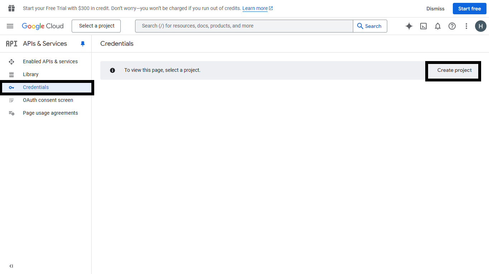
 
  - Enter project name
  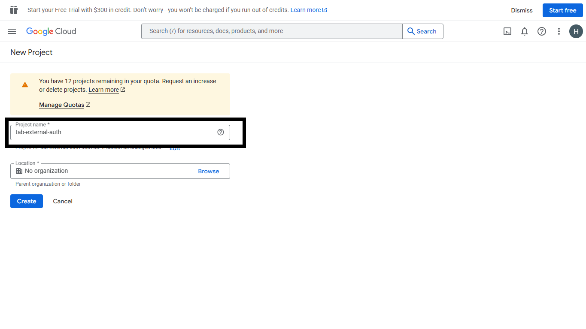
 
  - Click configure consent screen
  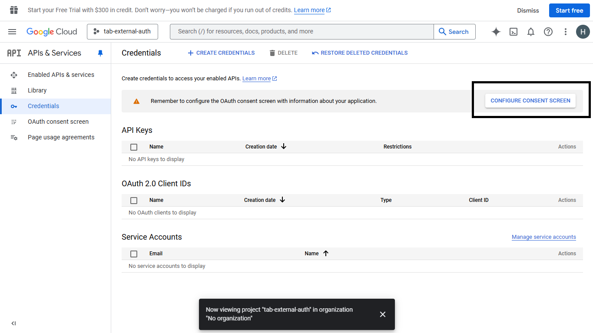
 
  - Select Oauth client Id for app creation
   
 
  - Select application type as `Web application` and give a suitable app name
  
 
  - For authorized javascript url, provide your app's base URL
  
 
  - For redirect url, give the URL in the format below `https://<<base-url>>/Auth/GoogleEnd` where `base-url` is your application's base url. For eg,
  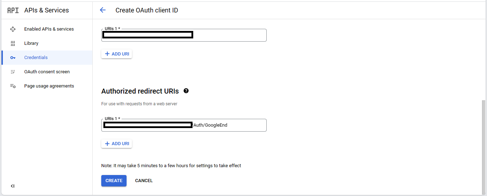
 
  - Once the app is created, copy the client id and client secret
  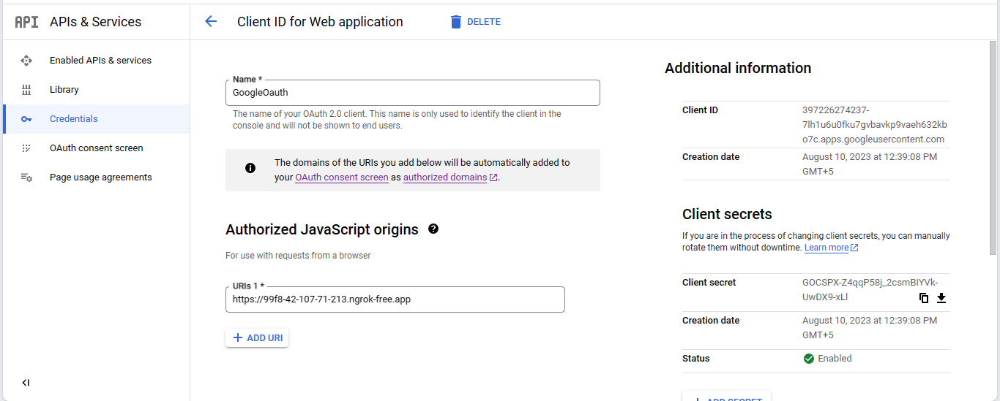
 
   - OAuth Created
  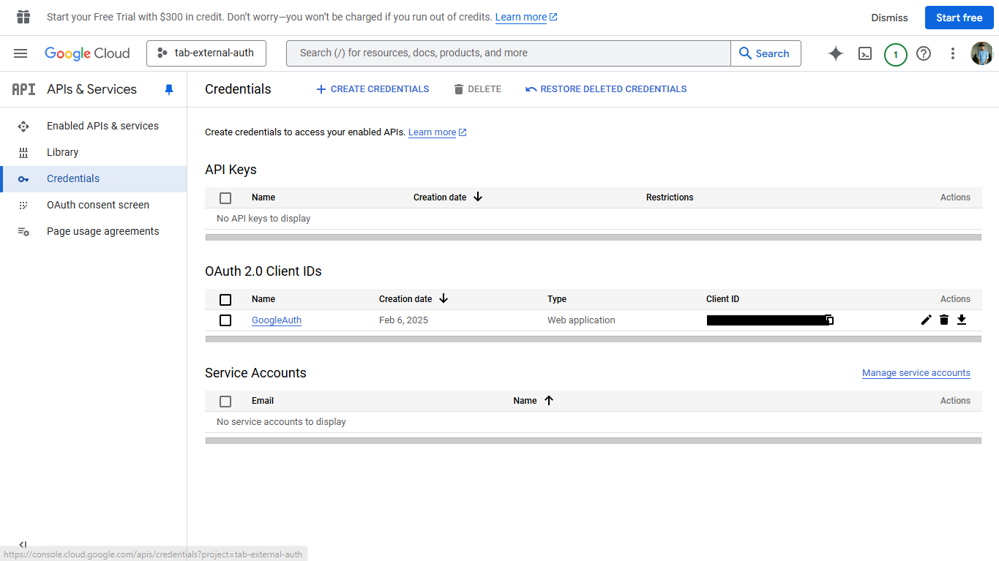 
 
  - Enable access to the [Google People API](https://developers.google.com/people/).
  
 
   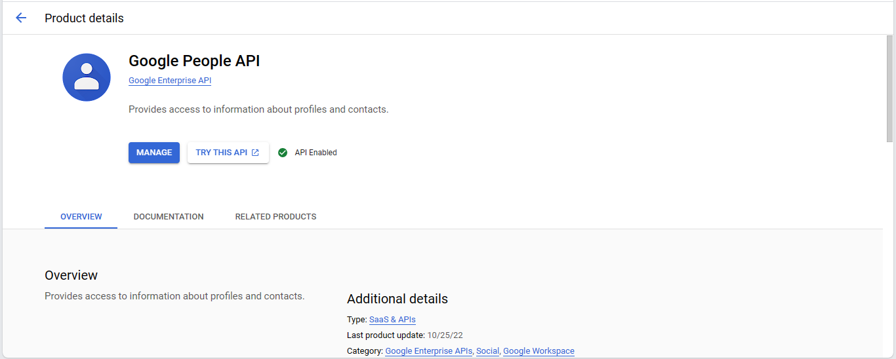

2. Setup NGROK
- Run ngrok - point to port 3978

```bash
   ngrok http 3978 --host-header="localhost:3978"
   ```  

   Alternatively, you can also use the `dev tunnel`. Please follow [Create and host a Dev tunnel](https://learn.microsoft.com/en-us/azure/developer/dev-tunnels/get-started?tabs=windows) and host the tunnel with anonymous user access command as shown below:

   ```bash
   devtunnel host -p 3978 --allow-anonymous
   ```

3) App Registration

### Register your application with Azure AD

1. Register a new application in the [Microsoft Entra ID – App Registrations](https://go.microsoft.com/fwlink/?linkid=2083908) portal.
2. Select **New Registration** and on the *register an application page*, set following values:
    * Set **name** to your app name.
    * Choose the **supported account types** (any account type will work)
    * Leave **Redirect URI** empty.
    * Choose **Register**.
3. On the overview page, copy and save the **Application (client) ID, Directory (tenant) ID**. You'll need those later when updating your Teams application manifest and in the appsettings.json.
4. Navigate to **API Permissions**, and make sure to add the follow permissions:
    * Select Add a permission
    * Select Microsoft Graph -> Delegated permissions.
    * `User.Read` (enabled by default)
    * Click on Add permissions. Please make sure to grant the admin consent for the required permissions.

4. Setup for code

- Clone the repository

    ```bash
    git clone https://github.com/OfficeDev/Microsoft-Teams-Samples.git
    ```

- Modify the `/appsettings.json` and fill in the following details:
  - `{{GoogleAppId}}` - Generated from Step 1, while registrating google oauth app.
  - `{{GoogleAppPassword}}` - Generated from Step 1, while registrating google oauth app.
  - `{{ApplicationBaseUrl}}` - Your application's base url. For eg `https://123.ngrok.io`.


 - If you are using Visual Studio
  - Launch Visual Studio
  - File -> Open -> Project/Solution
  - Navigate to `/samples/tab-external-auth/csharp/TabExternalAuth` folder
  - Select `TabExternalAuth.csproj` file


5. Setup Manifest for App
    - **Edit** the `manifest.json` contained in the ./AppManifest folder to replace placeholder `{{GUID-ID}}` with any guid id.
    - **Edit** the `manifest.json` for `validDomains` and replace `{{domain-name}}` with base Url of your domain. E.g. if you are using ngrok it would be `https://1234.ngrok-free.app` then your domain-name will be `1234.ngrok-free.app`. And if you are using dev tunnel, your URL will be https://12345.devtunnels.ms.
    - **Zip** up the contents of the `Manifest` folder to create a `Manifest.zip`  (Make sure that zip file does not contains any subfolder otherwise you will get error while uploading your .zip package)

- Upload the manifest.zip to Teams (in the Apps view click "Upload a custom app")
   - Go to Microsoft Teams. From the lower left corner, select Apps
   - From the lower left corner, choose Upload a custom App
   - Go to your project directory, the ./Manifest folder, select the zip folder, and choose Open.
   - Select Add in the pop-up dialog box. Your app is uploaded to Teams.
    
## Running the sample

**Note:** Supported on Teams, Outlook, and Office for Desktop, as well as Outlook and Office for Mobile.
Not supported on Teams Mobile or on Teams, Outlook, and Office for Web.

## Google OAuth 2.0 -Teams desktop

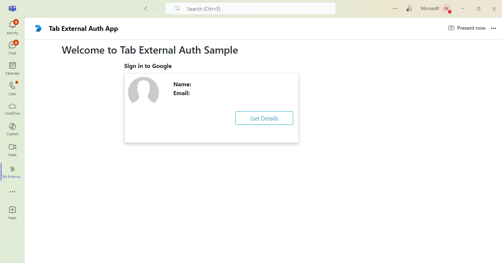

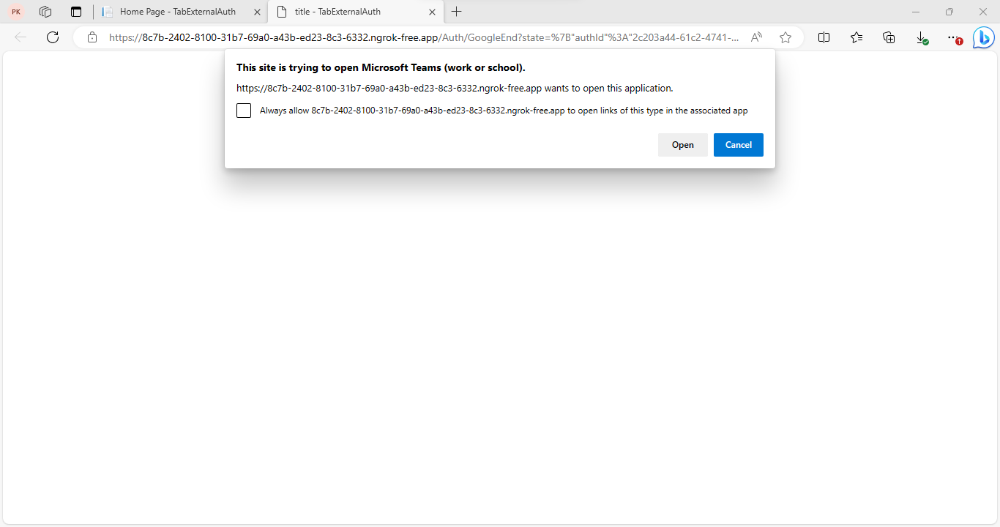

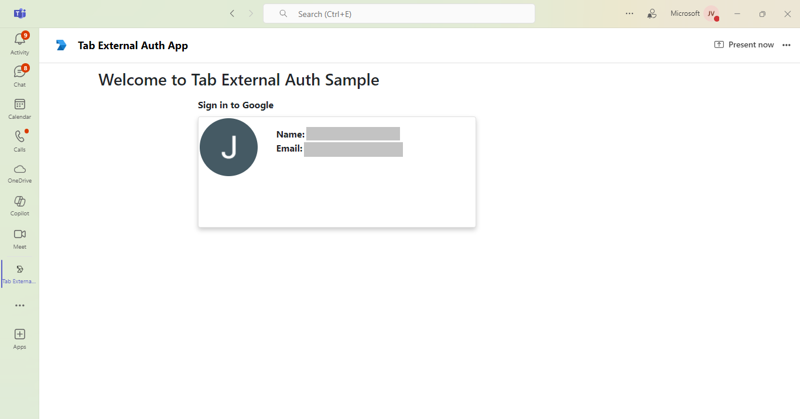

## Outlook on the desktop

- To view your app in Outlook on the desktop.

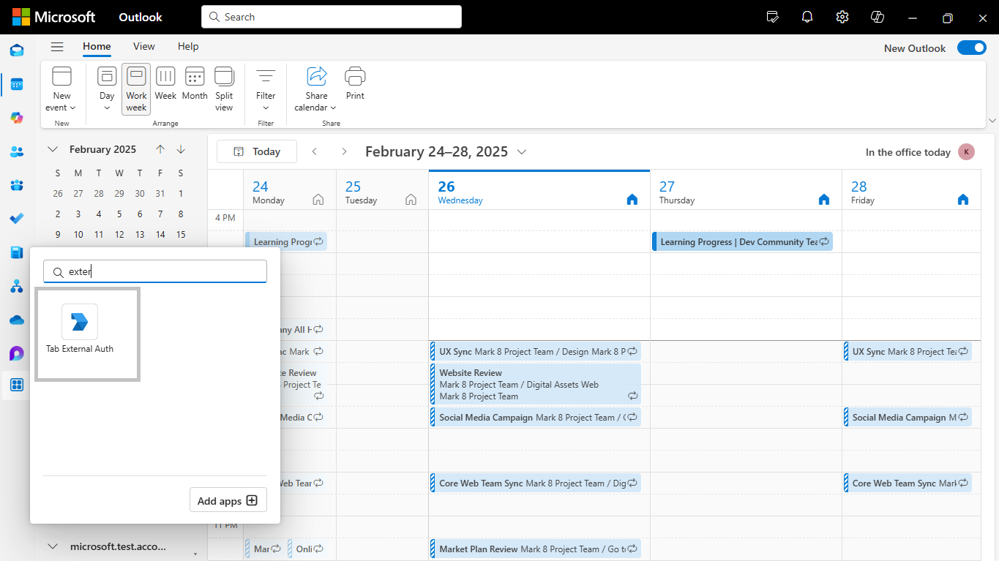

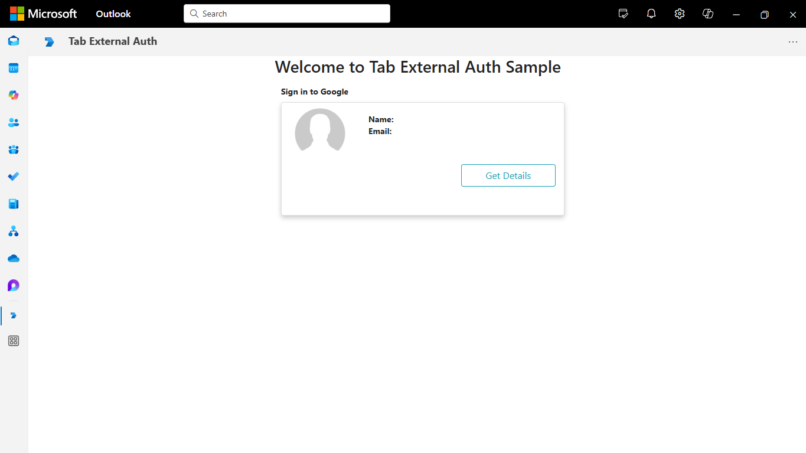

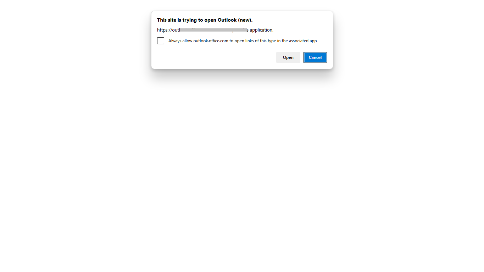

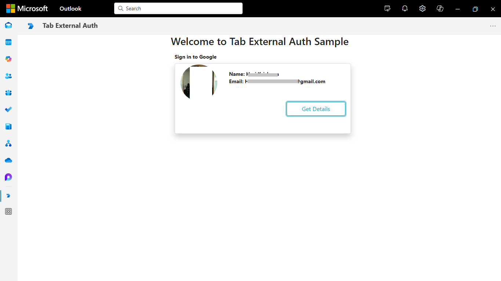

## Office on the desktop

- To preview your app running in Office on the desktop.

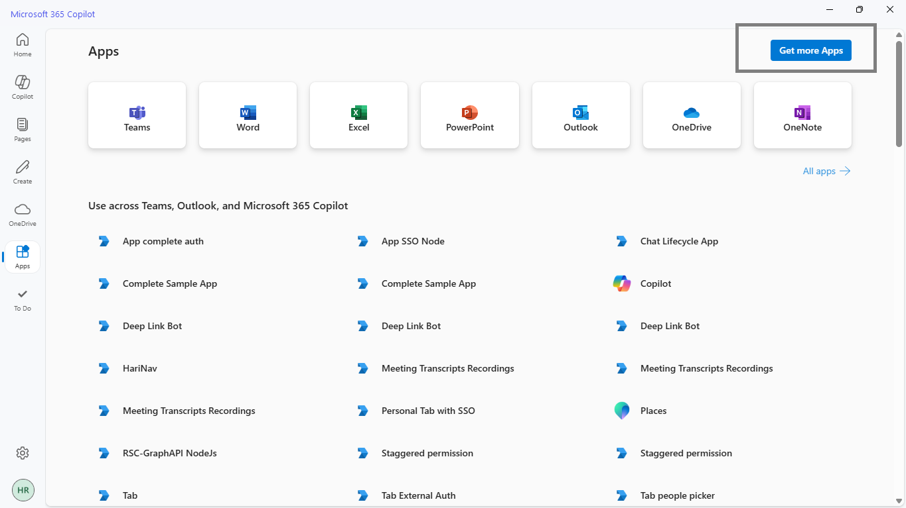


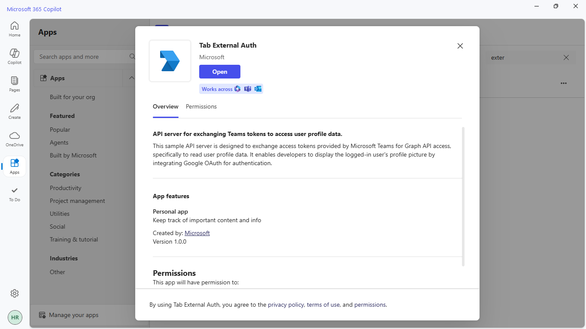

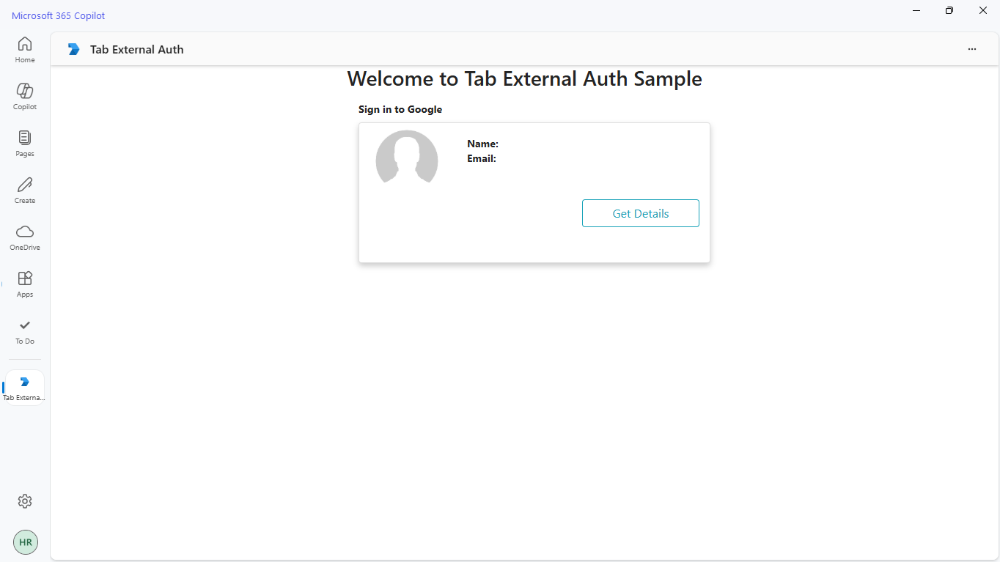

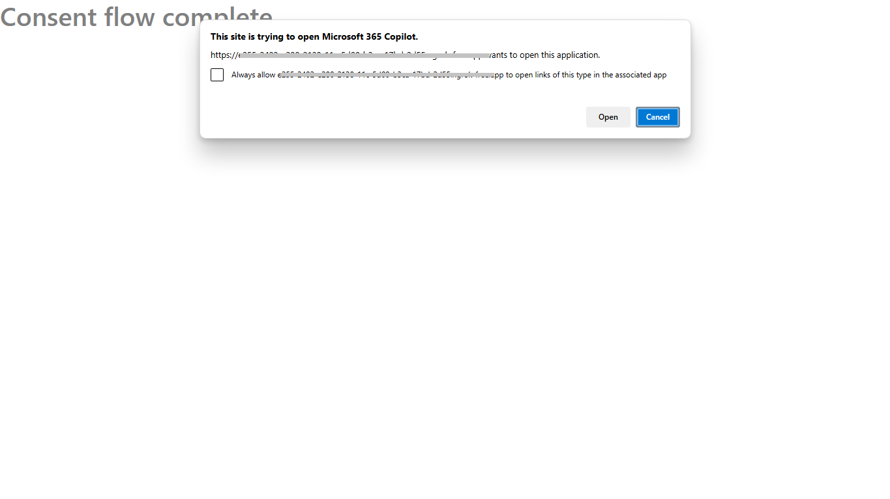

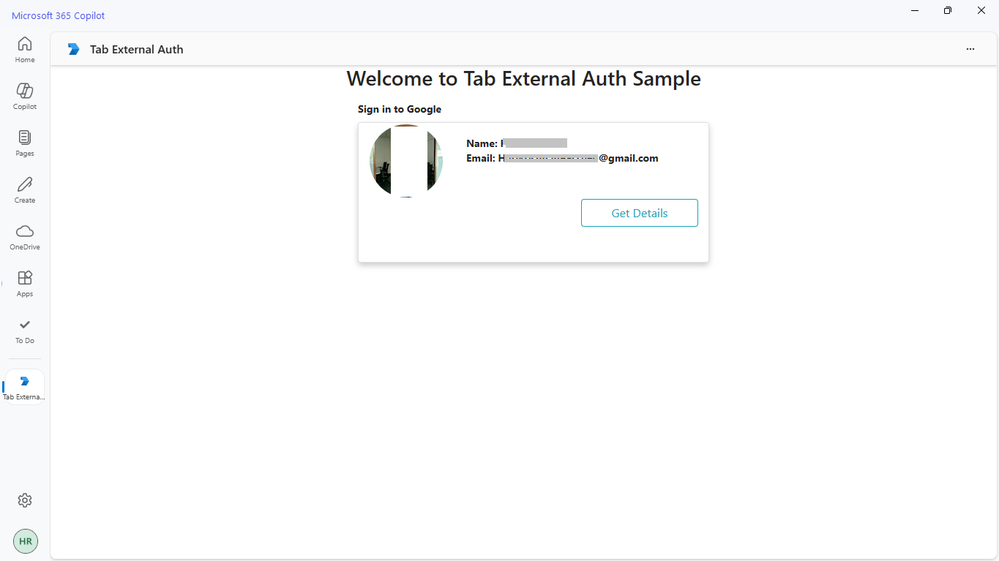

## Outlook on the mobile

- To view your app in Outlook on the mobile.

**On the side bar, select More Apps. Your uploaded app title appears among your installed apps**

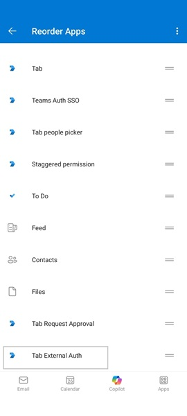

**Select your app icon to launch and preview your app running in Outlook on the mobile**

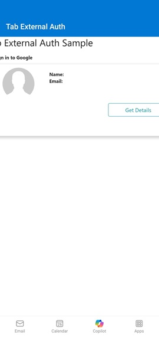

**Click get Details**


## Office on the mobile

- To preview your app running in Office on the mobile.

**Select the Apps icon on the side bar. Your uploaded app title appears among your installed apps**

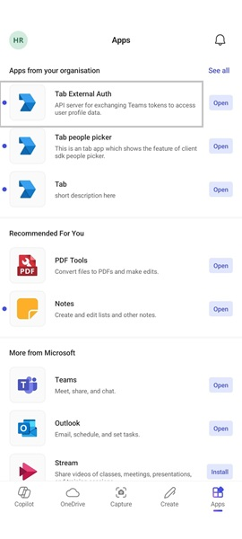

**Select your app icon to launch your app in Office on the mobile**

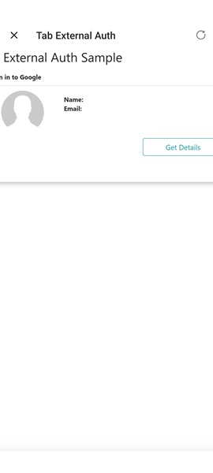

**Click get Details**

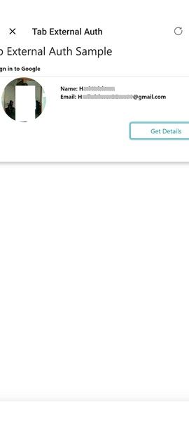

## Further Reading.
[External-auth](https://learn.microsoft.com/microsoftteams/platform/tabs/how-to/authentication/auth-oauth-provider#add-authentication-to-external-browsers)


