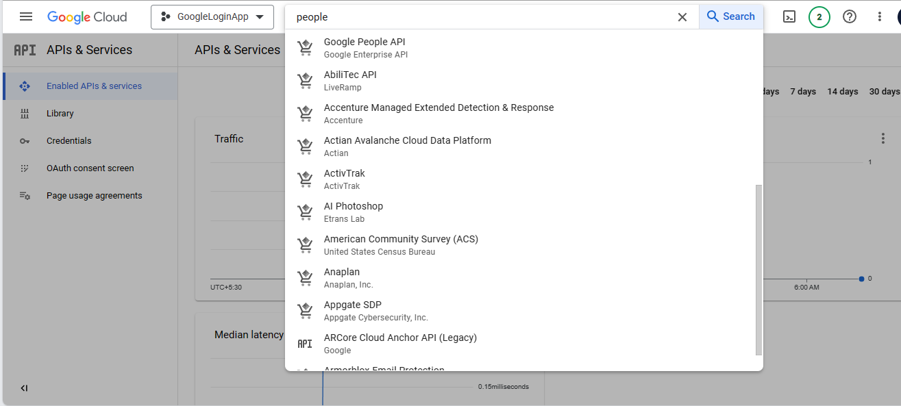

# Tab external auth - C#

This sample illustrates how to implement google auth using external auth providers.

## Included Features
* External Auth (Google Oauth2)
* Tabs

## Interaction with app


## Prerequisites

- [.NET Core SDK](https://dotnet.microsoft.com/download) version 6.0

  determine dotnet version
  ```bash
  dotnet --version
  ```
- [Ngrok](https://ngrok.com/download) (For local environment testing) Latest (any other tunneling software can also be used)
  
- [Teams](https://teams.microsoft.com) Microsoft Teams is installed and you have an account

## Setup

1. Create Google Ouath app [Google API Console](https://console.developers.google.com/)
 - Select Oauth client Id for app creation
 

 - Select application type as `Web application` and give a suitable app name
 

 - For authorized javascript url, give your app's base url
 

 - For redirect url, give url in below format `https://<<base-url>>/Auth/GoogleEnd` where `base-url` is your application's base url. For eg,
 

 - Once the app is created, copy the client id and client seret
 

 - Enable access to the [Google People API](https://developers.google.com/people/).
 

  

2. Setup NGROK
- Run ngrok - point to port 3978

```bash
# ngrok http 3978 --host-header="localhost:3978"
```

3. Setup for code

- Clone the repository

    ```bash
    git clone https://github.com/OfficeDev/Microsoft-Teams-Samples.git
    ```

- Modify the `/appsettings.json` and fill in the following details:
  - `{{GoogleAppId}}` - Generated from Step 1, while registrating google oauth app.
  - `{{GoogleAppPassword}}` - Generated from Step 1, while registrating google oauth app.
  - `{{ApplicationBaseUrl}}` - Your application's base url. For eg `https://123.ngrok.io`.


 - If you are using Visual Studio
  - Launch Visual Studio
  - File -> Open -> Project/Solution
  - Navigate to `/samples/tab-external-auth/csharp/TabExternalAuth` folder
  - Select `TabExternalAuth.csproj` file


4. Setup Manifest for Teams
- __*This step is specific to Teams.*__
    - **Edit** the `manifest.json` contained in the ./Manifest folder to replace placeholder `{{GUID-ID}}` with any guid id.
    - **Edit** the `manifest.json` for `validDomains` and replace `{{domain-name}}` with base Url of your domain. E.g. if you are using ngrok it would be `https://1234.ngrok-free.app` then your domain-name will be `1234.ngrok-free.app`.
    - **Zip** up the contents of the `Manifest` folder to create a `Manifest.zip`  (Make sure that zip file does not contains any subfolder otherwise you will get error while uploading your .zip package)

- Upload the manifest.zip to Teams (in the Apps view click "Upload a custom app")
   - Go to Microsoft Teams. From the lower left corner, select Apps
   - From the lower left corner, choose Upload a custom App
   - Go to your project directory, the ./Manifest folder, select the zip folder, and choose Open.
   - Select Add in the pop-up dialog box. Your app is uploaded to Teams.
    
## Running the sample

### Google OAuth 2.0


## Further Reading.
[Google-Oauth](https://learn.microsoft.com/microsoftteams/platform/tabs/how-to/authentication/auth-oauth-provider#add-authentication-to-external-browsers)


