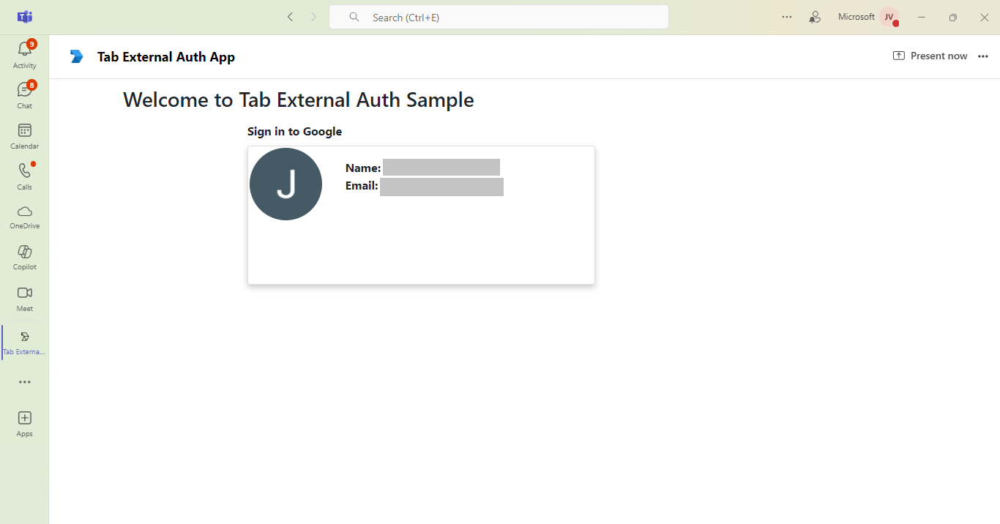

### API Server
This sample API server is designed to exchange access tokens provided by Microsoft Teams for Graph API access, specifically to read user profile data. It enables developers to display the logged-in user's profile picture by integrating Google OAuth for authentication.

### Prerequisites
- NodeJS
- Google developer account

## Setup

1. Create Google Ouath app [Google API Console](https://console.developers.google.com/)
 
 - Create project
 

 - Enter project name
 

 - Click configure consent screen
 

 - Select Oauth client Id for app creation
  

 - Select application type as `Web application` and give a suitable app name
 

 - For authorized javascript url, give your app's base url
 

 - For redirect url, give url in below format `https://<<base-url>>/auth-end` where `base-url` is your application's base url. For eg,
 

 - Once the app is created, copy the client id and client seret
 

  - OAuth Created
  

 - Enable access to the [Google People API](https://developers.google.com/people/).
 

 

2. Setup NGROK
- Run ngrok - point to port 3978

```bash
   ngrok http 3978 --host-header="localhost:3978"
   ```  

   Alternatively, you can also use the `dev tunnel`. Please follow [Create and host a Dev tunnel](https://learn.microsoft.com/en-us/azure/developer/dev-tunnels/get-started?tabs=windows) and host the tunnel with anonymous user access command as shown below:

   ```bash
   devtunnel host -p 3978 --allow-anonymous
   ```

3. Setup Manifest for App
    - **Edit** the `manifest.json` contained in the ./appManifest folder to replace placeholder `{{GUID-ID}}` with any guid id.
    - **Edit** the `manifest.json` for `validDomains` and replace `{{domain-name}}` with base Url of your domain. E.g. if you are using ngrok it would be `https://1234.ngrok-free.app` then your domain-name will be `1234.ngrok-free.app`. And if you are using dev tunnel, your URL will be https://12345.devtunnels.ms.
    - **Zip** up the contents of the `Manifest` folder to create a `Manifest.zip`  (Make sure that zip file does not contains any subfolder otherwise you will get error while uploading your .zip package)

- Upload the manifest.zip to Teams (in the Apps view click "Upload a custom app")
   - Go to Microsoft Teams. From the lower left corner, select Apps
   - From the lower left corner, choose Upload a custom App
   - Go to your project directory, the ./Manifest folder, select the zip folder, and choose Open.
   - Select Add in the pop-up dialog box. Your app is uploaded to Teams.

### Update the env files
In the api-server directory, open the .env file and update the GoogleAppId, GoogleAppPassword and ApplicationBaseUrl variables with the client ID and secret from your google app registration.

### Build and Run
In the root directory, execute:

`npm install`

`npm start`

## Running the sample

### Google OAuth 2.0




## Further Reading.
[External-auth](https://learn.microsoft.com/microsoftteams/platform/tabs/how-to/authentication/auth-oauth-provider#add-authentication-to-external-browsers)

