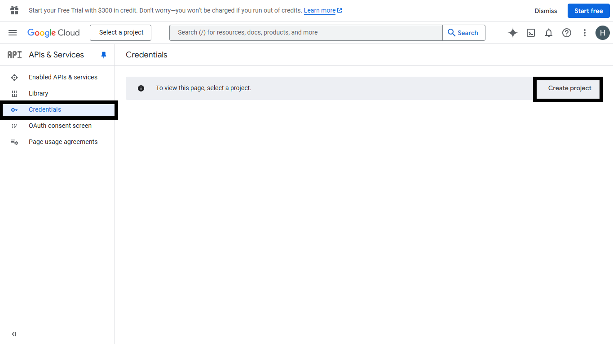

### API Server
This sample API server is designed to exchange access tokens provided by Microsoft Teams for Graph API access, specifically to read user profile data. It enables developers to display the logged-in user's profile picture by integrating Google OAuth for authentication.

### Prerequisites
- NodeJS
- Google developer account

## Setup

1. Create Google OAuth app [Google API Console](https://console.developers.google.com/)
 
 - Create project
 

 - Enter project name
 

 - Click configure consent screen
 

 - Select Oauth client Id for app creation
  

 - Select application type as `Web application` and give a suitable app name
 

 - For authorized javascript url, give your app's base url
 

 - For redirect url, give the URL in the format below `https://<<base-url>>/auth-end` where `base-url` is your application's base url. For eg,
 

 - Once the app is created, copy the client id and client secret
 

  - OAuth Created
  

 - Enable access to the [Google People API](https://developers.google.com/people/).
 

 

2. Setup NGROK
- Run ngrok - point to port 3978

```bash
   ngrok http 3978 --host-header="localhost:3978"
   ```  

   Alternatively, you can also use the `dev tunnel`. Please follow [Create and host a Dev tunnel](https://learn.microsoft.com/en-us/azure/developer/dev-tunnels/get-started?tabs=windows) and host the tunnel with anonymous user access command as shown below:

   ```bash
   devtunnel host -p 3978 --allow-anonymous
   ```

2) App Registration

### Register your application with Azure AD

1. Register a new application in the [Microsoft Entra ID – App Registrations](https://go.microsoft.com/fwlink/?linkid=2083908) portal.
2. Select **New Registration** and on the *register an application page*, set following values:
    * Set **name** to your app name.
    * Choose the **supported account types** (any account type will work)
    * Leave **Redirect URI** empty.
    * Choose **Register**.
3. On the overview page, copy and save the **Application (client) ID, Directory (tenant) ID**. You'll need those later when updating your Teams application manifest and in the appsettings.json.
4. Navigate to **API Permissions**, and make sure to add the follow permissions:
    * Select Add a permission
    * Select Microsoft Graph -> Delegated permissions.
    * `User.Read` (enabled by default)
    * Click on Add permissions. Please make sure to grant the admin consent for the required permissions.

3. Setup Manifest for App
    - **Edit** the `manifest.json` contained in the ./appManifest folder to replace placeholder `{{GUID-ID}}` with any guid id.
    - **Edit** the `manifest.json` for `validDomains` and replace `{{domain-name}}` with base Url of your domain. E.g. if you are using ngrok it would be `https://1234.ngrok-free.app` then your domain-name will be `1234.ngrok-free.app`. And if you are using dev tunnel, your URL will be https://12345.devtunnels.ms.
    - **Zip** up the contents of the `Manifest` folder to create a `Manifest.zip`  (Make sure that zip file does not contains any subfolder otherwise you will get error while uploading your .zip package)

- Upload the manifest.zip to Teams (in the Apps view click "Upload a custom app")
   - Go to Microsoft Teams. From the lower left corner, select Apps
   - From the lower left corner, choose Upload a custom App
   - Go to your project directory, the ./Manifest folder, select the zip folder, and choose Open.
   - Select Add in the pop-up dialog box. Your app is uploaded to Teams.

### Update the env files
In the api-server directory, open the .env file and update the GoogleAppId, GoogleAppPassword and ApplicationBaseUrl variables with the client ID and secret from your google app registration.

### Build and Run
In the root directory, execute:

`npm install`

`npm start`

## Running the sample

**Note:** Supported on Teams, Outlook, and Office for Desktop, as well as Outlook and Office for Mobile.
Not supported on Teams Mobile or on Teams, Outlook, and Office for Web.

## Google OAuth 2.0 -Teams desktop


## Outlook on the desktop

- To view your app in Outlook on the desktop.


## Office on the desktop

- To preview your app running in Office on the desktop.


## Outlook on the mobile

- To view your app in Outlook on the mobile.

**On the side bar, select More Apps. Your uploaded app title appears among your installed apps**


**Select your app icon to launch and preview your app running in Outlook on the mobile**


**Click get Details**


## Office on the mobile

- To preview your app running in Office on the mobile.

**Select the Apps icon on the side bar. Your uploaded app title appears among your installed apps**


**Select your app icon to launch your app in Office on the mobile**


**Click get Details**


## Further Reading.
[External-auth](https://learn.microsoft.com/microsoftteams/platform/tabs/how-to/authentication/auth-oauth-provider#add-authentication-to-external-browsers)

