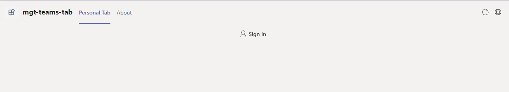
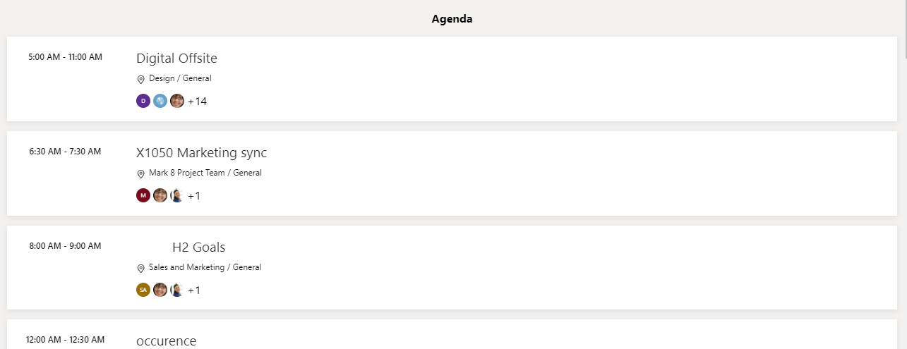
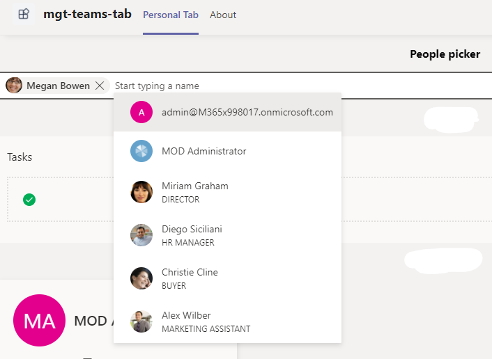
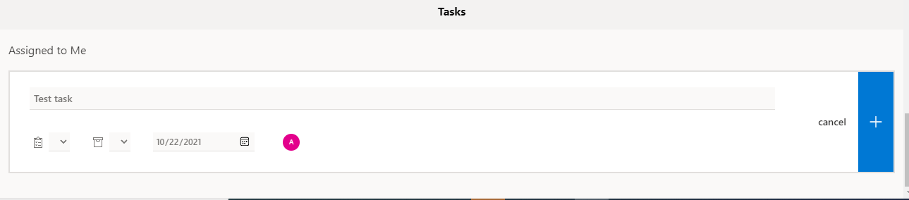
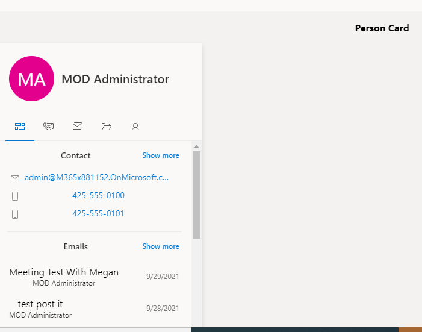
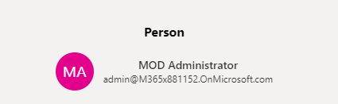

# Teams tab with microsoft graph toolkit

This is the demo app for [Teams tab using miscrosoft graph toolkit](https://docs.microsoft.com/en-us/graph/toolkit/get-started/build-a-microsoft-teams-tab?tabs=unpkg%2Cjs)














## Prerequisites

- [.NET Core SDK](https://dotnet.microsoft.com/download) version 3.1

  determine dotnet version
  ```bash
  dotnet --version
  ```
- [Ngrok](https://ngrok.com/download) (For local environment testing) Latest (any other tunneling software can also be used)
  
  run ngrok locally
   ```bash
  ngrok http -host-header=rewrite 3978
  ```
  
-  [NodeJS](https://nodejs.org/en/)

-  [M365 developer account](https://docs.microsoft.com/en-us/microsoftteams/platform/concepts/build-and-test/prepare-your-o365-tenant) or access to a Teams account with the appropriate permissions to install an app.

## To try this sample

 1) Configuring MSAL2.0 Auth Provider
 - Register your app with Microsoft identity platform via the Azure AD portal
 - Your app must be registered in the Azure AD portal to integrate with the Microsoft identity platform. See [Register an application with the Microsoft identity platform](https://docs.microsoft.com/en-us/graph/auth-register-app-v2).
 - Click on Add a Platform in redirect URI section.
 - Select Single Page Application and add following URL `<<base-url>>/tabauth`
 - Save and register.
 - Once App is registerd copy the `client_Id` for your app and update in the app.

2) Clone the repository
   ```bash
   git clone https://github.com/OfficeDev/Microsoft-Teams-Samples.git
   ```
   
3) In a terminal, navigate to `samples/tab-graph-toolkit/csharp`

    change into project folder
    ```bash
    cd # TabGraphToolkit
    ```
4) Install modules
 navigate to `samples/tab-graph-toolkit/csharp/TabGraphToolkit/ClientApp`

    ```bash
    npm install
    ```
5) Update `client_Id` copied from step 1 in index.tsx file.  
 
6) Modify the `manifest.json` in the `/appPackage` folder and replace the following details:
  - `{{Microsoft-App-Id}}` with Application id generated from Step 1
  - `{{base-URl}}` with base Url domain. E.g. if you are using ngrok it would be `1234.ngrok.io`

7) Zip the contents of `appPackage` folder into a `manifest.zip`, and use the `manifest.zip` to deploy in app store or add to Teams using step 9.

8) Run the bot from a terminal or from Visual Studio, choose option A or B.
 
   A) From a terminal
     ```bash
     # run the bot
     dotnet run
     ```

   B) Or from Visual Studio
     - Launch Visual Studio
     - File -> Open -> Project/Solution
     - Navigate to `TabGraphToolkit` folder
     - Select `TabGraphToolkit.csproj` file
     - Press `F5` to run the project 

9) Upload the manifest.zip to Teams (in the Apps view click "Upload a custom app")
   - Go to Microsoft Teams. From the lower left corner, select Apps
   - From the lower left corner, choose Upload a custom App
   - Go to your project directory, the ./appPackage folder, select the zip folder, and choose Open.
   - Select Add in the pop-up dialog box. Your app is uploaded to Teams.
   
## Features of this sample
Once you access the Tab within your app you will be able to see following microsoft-graph-toolkit component. 

- `<mgt-login>`


- `<mgt-agenda>`


- `<mgt-people-picker>`


- `<mgt-tasks>`


- `<mgt-todo>`


- `<mgt-person-card>`


- `<mgt-person>`


