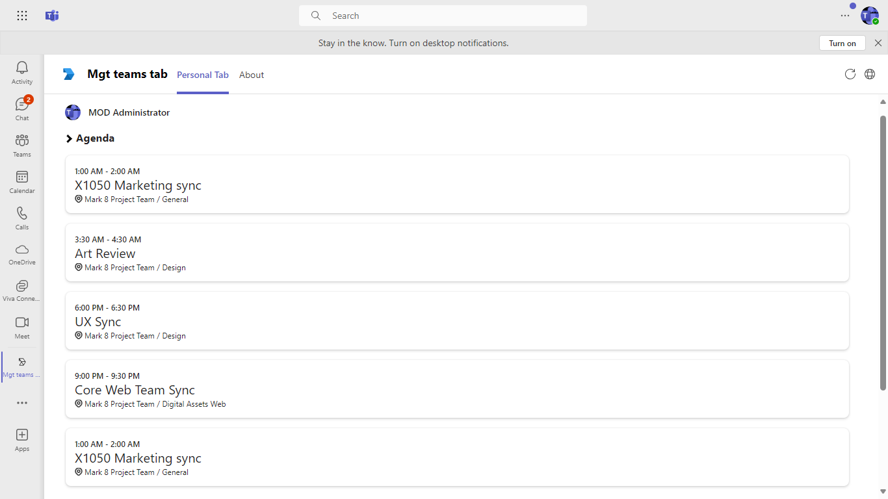
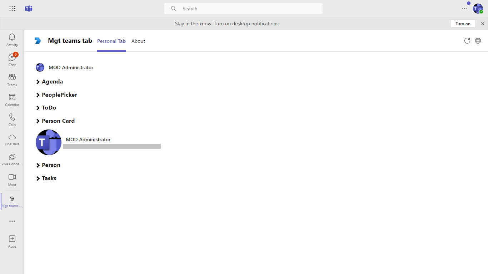

# Teams tab with microsoft graph toolkit

This sample app demonstrates the integration of the Microsoft Graph Toolkit within a Microsoft Teams tab, allowing developers to easily access and display user data. With features such as tabs and API interactions, it serves as a practical guide for leveraging the Microsoft Graph API to enhance your Teams applications.

This is the demo app for [Teams tab using miscrosoft graph toolkit](https://docs.microsoft.com/en-us/graph/toolkit/get-started/build-a-microsoft-teams-tab?tabs=unpkg%2Cjs)

 ## Included Features
* Tabs
* Graph Toolkit

## Interaction with app


## Prerequisites

- [.NET Core SDK](https://dotnet.microsoft.com/download) version 6.0

  determine dotnet version
  ```bash
  dotnet --version
  ```
- [dev tunnel](https://learn.microsoft.com/en-us/azure/developer/dev-tunnels/get-started?tabs=windows) or [Ngrok](https://ngrok.com/download) (For local environment testing) latest version (any other tunneling software can also be used)
  
- [Teams](https://teams.microsoft.com) Microsoft Teams is installed and you have an account

- [Teams Toolkit for Visual Studio](https://learn.microsoft.com/en-us/microsoftteams/platform/toolkit/toolkit-v4/install-teams-toolkit-vs?pivots=visual-studio-v17-7)

## Run the app (Using Teams Toolkit for Visual Studio)

The simplest way to run this sample in Teams is to use Teams Toolkit for Visual Studio.
1. Install Visual Studio 2022 **Version 17.10 Preview 4  or higher** [Visual Studio](https://visualstudio.microsoft.com/downloads/)
1. Install Teams Toolkit for Visual Studio [Teams Toolkit extension](https://learn.microsoft.com/en-us/microsoftteams/platform/toolkit/toolkit-v4/install-teams-toolkit-vs?pivots=visual-studio-v17-7)
1. In the debug dropdown menu of Visual Studio, select default startup project > **Microsoft Teams (browser)**
1. In Visual Studio, right-click your **TeamsApp** project and **Select Teams Toolkit > Prepare Teams App Dependencies**
1. Using the extension, sign in with your Microsoft 365 account where you have permissions to upload custom apps.
1. Select **Debug > Start Debugging** or **F5** to run the menu in Visual Studio.
1. In the browser that launches, select the **Add** button to install the app to Teams.
> If you do not have permission to upload custom apps (uploading), Teams Toolkit will recommend creating and using a Microsoft 365 Developer Program account - a free program to get your own dev environment sandbox that includes Teams.

## Setup

### Register you app with Azure AD.

  1. Register a new application in the [Microsoft Entra ID – App Registrations](https://go.microsoft.com/fwlink/?linkid=2083908) portal.
  2. Select **New Registration** and on the *register an application page*, set following values:
      * Set **name** to your app name.
      * Choose the **supported account types** (any account type will work)
      * Leave **Redirect URI** empty.
      * Choose **Register**.
  3. On the overview page, copy and save the **Application (client) ID, Directory (tenant) ID**. You’ll need those later when updating your Teams application manifest and in the .env.
  4. Under **Manage**, select **Expose an API**. 
  5. Select the **Set** link to generate the Application ID URI in the form of `api://{base-url}/{AppID}`. Insert your fully qualified domain name (with a forward slash "/" appended to the end) between the double forward slashes and the GUID. The entire ID should have the form of: `api://fully-qualified-domain-name/{AppID}`
      * ex: `api://%ngrokDomain%.ngrok-free.app/00000000-0000-0000-0000-000000000000`.
  6. Select the **Add a scope** button. In the panel that opens, enter `access_as_user` as the **Scope name**.
  7. Set **Who can consent?** to `Admins and users`
  8. Fill in the fields for configuring the admin and user consent prompts with values that are appropriate for the `access_as_user` scope:
      * **Admin consent title:** Teams can access the user’s profile.
      * **Admin consent description**: Allows Teams to call the app’s web APIs as the current user.
      * **User consent title**: Teams can access the user profile and make requests on the user's behalf.
      * **User consent description:** Enable Teams to call this app’s APIs with the same rights as the user.
  9. Ensure that **State** is set to **Enabled**
  10. Select **Add scope**
      * The domain part of the **Scope name** displayed just below the text field should automatically match the **Application ID** URI set in the previous step, with `/access_as_user` appended to the end:
          * `api://[ngrokDomain].ngrok-free.app/00000000-0000-0000-0000-000000000000/access_as_user.
  11. In the **Authorized client applications** section, identify the applications that you want to authorize for your app’s web application. Each of the following IDs needs to be entered:
      * `1fec8e78-bce4-4aaf-ab1b-5451cc387264` (Teams mobile/desktop application)
      * `5e3ce6c0-2b1f-4285-8d4b-75ee78787346` (Teams web application)
  12. Navigate to **API Permissions**, and make sure to add the follow permissions:
  -   Select Add a permission
  -   Select Microsoft Graph -\> Delegated permissions.
      - `User.Read` (enabled by default)
  -   Click on Add permissions. Please make sure to grant the admin consent for the required permissions.
  13. Navigate to **Authentication**
      If an app hasn't been granted IT admin consent, users will have to provide consent the first time they use an app.
  - Set a redirect URI:
      * Select **Add a platform**.
      * Select **Web**.
      * Enter the **redirect URI** for the app in the following format: `https://{Base_Url}/auth-end.html`.
  - Set a redirect URI:
      * Select **Add a platform**.
      * Select **Single-page application**.
      * Enter the **redirect URI** for the app in the following format: `https://{Base_Url}/blank-auth-end.html` and `https://{Base_Url}/auth-end.html?clientId={AppID}`.

      

  14.  Navigate to the **Certificates & secrets**. In the Client secrets section, click on "+ New client secret". Add a description(Name of the secret) for the secret and select “Never” for Expires. Click "Add". Once the client secret is created, copy its value, it need to be placed in the .env.

2. Setup NGROK
1) Run ngrok - point to port 3978

   ```bash
   ngrok http 3978 --host-header="localhost:3978"
   ```  

   Alternatively, you can also use the `dev tunnels`. Please follow [Create and host a dev tunnel](https://learn.microsoft.com/en-us/azure/developer/dev-tunnels/get-started?tabs=windows) and host the tunnel with anonymous user access command as shown below:

   ```bash
   devtunnel host -p 3978 --allow-anonymous
   ```

3. Setup for code

- Clone the repository

    ```bash
    git clone https://github.com/OfficeDev/Microsoft-Teams-Samples.git
    ```

  - In a terminal, navigate to `samples/tab-graph-toolkit/csharp`

    change into project folder
    ```bash
    cd # TabGraphToolkit
    ```
 - Install modules
   navigate to `samples/tab-graph-toolkit/csharp/TabGraphToolkit/ClientApp`

    ```bash
    npm install
    ```
   A) From a terminal
     ```bash
     # run the bot
     dotnet run
     ```

   B) Or from Visual Studio
     - Launch Visual Studio
     - File -> Open -> Project/Solution
     - Navigate to `TabGraphToolkit` folder
     - Select `TabGraphToolkit.csproj` file
     - Press `F5` to run the project 

4. Modify the .env file in your project folder (or in Visual Studio) and fill in below details:
   - `{{Microsoft-App-id}}` - Generated from Step 1 (Application (client) ID)is the application app id
   - Replace `{{domain-name}}` with base Url of your domain. E.g. if you are using ngrok it would be `https://1234.ngrok-free.app` then your domain-name will be `1234.ngrok-free.app` and if you are using dev tunnels then your domain will be like: `12345.devtunnels.ms`.
     
5. Setup Manifest for Teams
- __*This step is specific to Teams.*__
    - **Edit** the `manifest.json` contained in the ./appPackage folder to replace your Microsoft App Id (that was created when you registered your app registration earlier) *everywhere* you see the place holder string `{{Microsoft-App-Id}}` (depending on the scenario the Microsoft App Id may occur multiple times in the `manifest.json`)
    - **Edit** the `manifest.json` for `validDomains` and replace `{{domain-name}}` with base Url of your domain. E.g. if you are using ngrok it would be `https://1234.ngrok-free.app` then your domain-name will be `1234.ngrok-free.app` and if you are using dev tunnels then your domain will be like: `12345.devtunnels.ms`.
    - **Note:** If you want to test your app across multi hub like: Outlook/Office.com, please update the `manifest.json` in the `tab-graph-toolkit\csharp\TabGraphToolkit` folder with the required values.
    - **Zip** up the contents of the `appPackage` folder to create a `manifest.zip` or `AppManifest_Hub` folder into a `manifest.zip`.(Make sure that zip file does not contains any subfolder otherwise you will get error while uploading your .zip package) 
 - Upload the manifest.zip to Teams (in the Apps view click "Upload a custom app")
   - Go to Microsoft Teams. From the lower left corner, select Apps
   - From the lower left corner, choose Upload a custom App
   - Go to your project directory, the ./appPackage folder, select the zip folder, and choose Open.
   - Select Add in the pop-up dialog box. Your app is uploaded to Teams. 
   
## Running the sample

**Install App**


**Login**


**Consent Page**


**Home Page**


**Agenda**


**PeoplePicker**


**Todo**


**Person**



**People**


**Tasks**


## Outlook on the web

- To view your app in Outlook on the web.

- Go to [Outlook on the web](https://outlook.office.com/mail/)and sign in using your dev tenant account.

**On the side bar, select More Apps. Your uploaded app title appears among your installed apps**


**Select your app icon to launch and preview your app running in Outlook on the web**


**Note:** Similarly, you can test your application in the Outlook desktop app as well.

## Office on the web

- To preview your app running in Office on the web.

- Log into office.com with test tenant credentials

**Select the Apps icon on the side bar. Your uploaded app title appears among your installed apps**


**Select your app icon to launch your app in Office on the web**

 

 

 

**Note:** Similarly, you can test your application in the Office 365 desktop app as well.

## Further Reading
[Tab-graph-toolkit](https://learn.microsoft.com/en-us/graph/toolkit/get-started/build-a-microsoft-teams-tab?tabs=unpkg%2Chtml)
[Extend Teams apps across Microsoft 365](https://learn.microsoft.com/en-us/microsoftteams/platform/m365-apps/overview)


