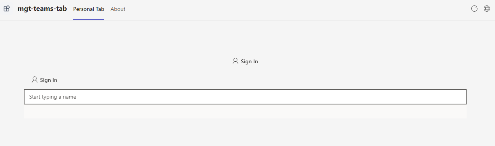
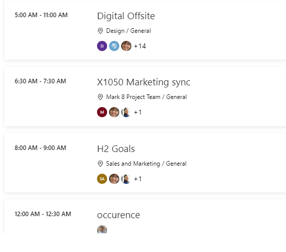
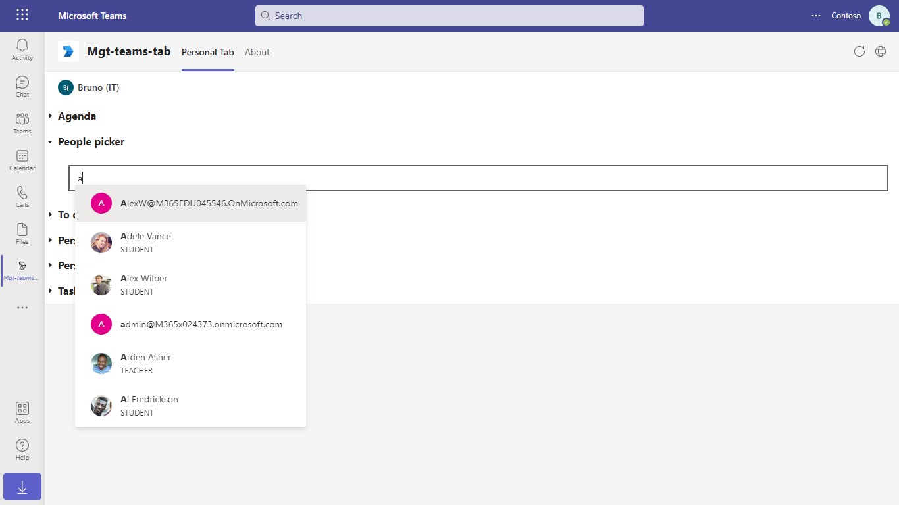
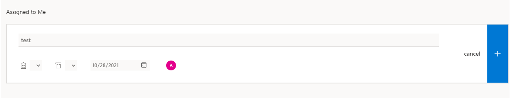

# Teams tab with microsoft graph toolkit

Tabs are Teams-aware webpages embedded in Microsoft Teams. A channel/group tab delivers content to channels and group chats, and are a great way to create collaborative spaces around dedicated web-based content.

## Prerequisites
-  [NodeJS](https://nodejs.org/en/)

-  [M365 developer account](https://docs.microsoft.com/en-us/microsoftteams/platform/concepts/build-and-test/prepare-your-o365-tenant) or access to a Teams account with the appropriate permissions to install an app.

## Configuring MSAL2.0 Auth Provider
- Register an App in Azure. Navigate to App registeration click on New registeration.
- Update your App Name `mgtteamstab`
- Click on Add a Platform in redirect URI section.
- Select Single Page Application and add following URL `https://localhost:3000/`
- Save and register.
- Once App is registerd copy the `client_Id` for your app and update in the app.

## Build and Run

In the project directory, execute:

`npm install`

`npm start`

## User Interaction
- Update tab url within your appPackage `manifest.json` file.
- Upload the appPackage to Teams
- Once you access the Tab within your app you will be able to see following microsoft-graph-toolkit component. 
-<mgt-login>, <mgt-agenda>, <mgt-people-picker>, <mgt-tasks>

## Deploy to Teams
Start debugging the project by hitting the `F5` key or click the debug icon in Visual Studio Code and click the `Start Debugging` green arrow button.

### NOTE: First time debug step
On the first time running and debugging your app you need allow the localhost certificate.  After starting debugging when Chrome is launched and you have installed your app it will fail to load.

- Open a new tab `in the same browser window that was opened`
- Navigate to `https://localhost:3000/`
- Click the `Advanced` button
- Select the `Continue to localhost`

### NOTE: Debugging
Ensure you have the Debugger for Chrome/Edge extension installed for Visual Studio Code from the marketplace.

### Build for production
`npm run build`

Builds the app for production to the `build` folder.\
It correctly bundles React in production mode and optimizes the build for the best performance.

The build is minified and the filenames include the hashes.\
Your app is ready to be deployed!

See the section about [deployment](https://facebook.github.io/create-react-app/docs/deployment) for more information.

