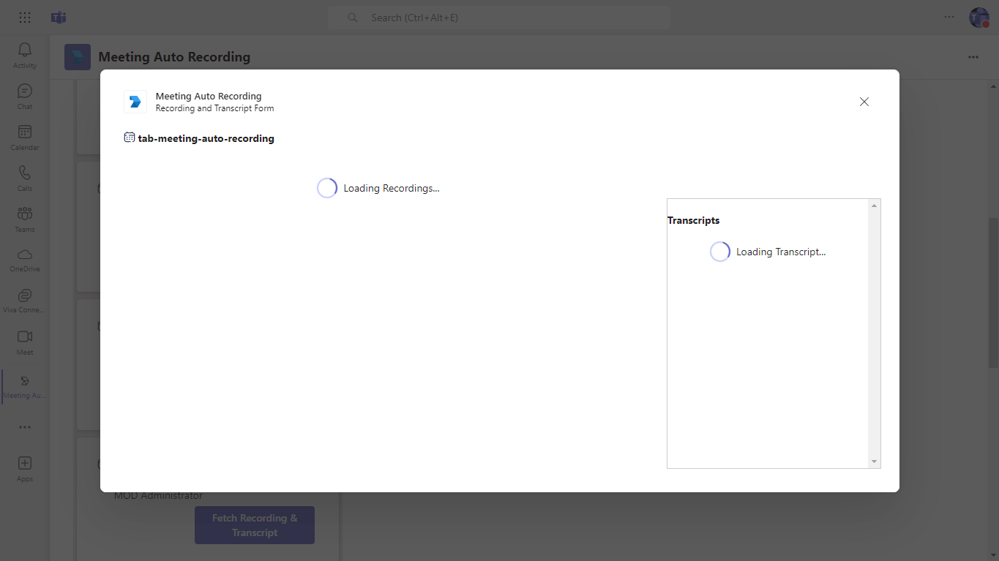

## Tab Meeting Recording and transcript with auto recording

This feature ensures that meetings initiated from a specific Teams tab are automatically recorded and transcribed by leveraging Microsoft Graph API and event subscriptions. 

It detects when a meeting starts from the tab and uses the API to control recording settings, providing seamless management of the recording process. Additionally, it enables real-time transcription of the meeting content, offering both audio/video recordings and searchable text. 

This integration enhances accessibility, improves content retrieval, and ensures valuable documentation for future reference.

**Interaction with app**


## Prerequisites

- [.NET Core SDK](https://dotnet.microsoft.com/download) version 6.0

  determine dotnet version
  ```bash
  dotnet --version
  ```
- [dev tunnel](https://learn.microsoft.com/en-us/azure/developer/dev-tunnels/get-started?tabs=windows) or [ngrok](https://ngrok.com/) latest version or equivalent tunnelling solution.
- [Teams](https://teams.microsoft.com) Microsoft Teams is installed and you have an account
- [Teams Toolkit for Visual Studio](https://learn.microsoft.com/en-us/microsoftteams/platform/toolkit/toolkit-v4/install-teams-toolkit-vs?pivots=visual-studio-v17-7)

## Setup and use the sample 

> Note these instructions are for running the sample on your local machine.

1. Run ngrok - point to port 3978

   ```bash
   ngrok http https://localhost:44302
   ```  

   Alternatively, you can also use the `dev tunnels`. Please follow [Create and host a dev tunnel](https://learn.microsoft.com/en-us/azure/developer/dev-tunnels/get-started?tabs=windows) and host the tunnel with anonymous user access command as shown below:

   ```bash
   devtunnel host -p 44302 --allow-anonymous
   ```

2. Clone the repository

    ```bash
    git clone https://github.com/OfficeDev/Microsoft-Teams-Samples.git
    ```
    
3. Run the app from a terminal or from Visual Studio, choose option A or B.

    A) From a terminal, navigate to `samples/tab-meeting-auto-recording/csharp`

    ```bash
    # run the app
    dotnet run
    ```
    B) Or from Visual Studio

    - Launch Visual Studio
    - File -> Open -> Project/Solution
    - Navigate to `samples/tab-meeting-auto-recording/csharp` folder
    - Select `MeetingAutoRecording.sln` file
    - Press `F5` to run the project

4. In a terminal, navigate to `samples/tab-meeting-auto-recording/csharp/MeetingAutoRecording/ClientApp`

    - Inside ClientApp folder execute the below command.

        ```bash
        # npm install
        # npm start

        ```

5. Open .env file from this path folder `samples/tab-meeting-auto-recording/csharp/MeetingAutoRecording/ClientApp` and update:
   - `{{MicrosoftAppId}}` - Generated from Step 1 (Application (client) ID)is the application app id
   

6. Modify the `/appsettings.json` and fill in the following details:
   - `{{BaseUrlNgrok}}` - With base Url domain. E.g. if you are using ngrok it would be 1234.ngrok-free.app and if you are using dev tunnels then your domain will be 12345.devtunnels.ms.
   > Make sure to manually update `{{BaseUrlNgrok}}` with the ngrok or dev-tunnel URL. Otherwise, notifications will not function correctly.
  
## Run the app (Using Teams Toolkit for Visual Studio)

The simplest way to run this sample in Teams is to use Teams Toolkit for Visual Studio.
1. Install Visual Studio 2022 **Version 17.10 Preview 4  or higher** [Visual Studio](https://visualstudio.microsoft.com/downloads/)
1. Install Teams Toolkit for Visual Studio [Teams Toolkit extension](https://learn.microsoft.com/en-us/microsoftteams/platform/toolkit/toolkit-v4/install-teams-toolkit-vs?pivots=visual-studio-v17-7)
1. In the debug dropdown menu of Visual Studio, select default startup project > **Microsoft Teams (browser)**
1. In Visual Studio, right-click your **TeamsApp** project and **Select Teams Toolkit > Prepare Teams App Dependencies**
1. Using the extension, sign in with your Microsoft 365 account where you have permissions to upload custom apps.
1. Select **Debug > Start Debugging** or **F5** to run the menu in Visual Studio.
1. In the browser that launches, select the **Add** button to install the app to Teams.
> If you do not have permission to upload custom apps (sideloading), Teams Toolkit will recommend creating and using a Microsoft 365 Developer Program account - a free program to get your own dev environment sandbox that includes Teams.

### Setup and use the sample locally

1) Create a policy for a demo tenant user for creating the online meeting on behalf of that user using the following PowerShell script
  -  Follow this link- [Configure application access policy](https://docs.microsoft.com/en-us/graph/cloud-communication-online-meeting-application-access-policy)
    
  
     
1) In Azure [App Registration](https://ms.portal.azure.com/) Under left menu, navigate to **API Permissions**, and make sure to add the following permissions of Microsoft Graph API > Application permissions:

      

## Running the sample

You can interact with Teams Tab meeting sidepanel.

**Install app:**


**Click Sign-In:**


**Click Consent:**


**Permissions Requested:**


**Sign-In Loading:**


**Meeting Detail Page:**


**Get Notification:**


**Loading Meetings, Fetching Transcript and Recordings:**



**Recording and Transcript Form:**


## Further reading

- [Azure AD application using Microsoft Graph](https://learn.microsoft.com/en-us/graph/tutorial-applications-basics?tabs=http)
- [Receive change notifications through webhooks](https://learn.microsoft.com/en-us/graph/change-notifications-delivery-webhooks?tabs=http)
- [Designing your Microsoft Teams app with basic Fluent UI components](https://learn.microsoft.com/en-us/microsoftteams/platform/concepts/design/design-teams-app-basic-ui-components)


