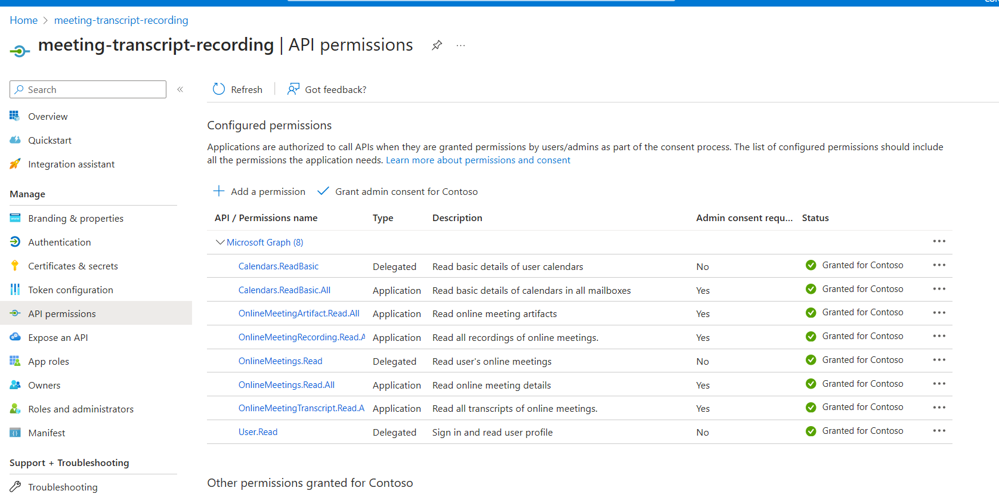
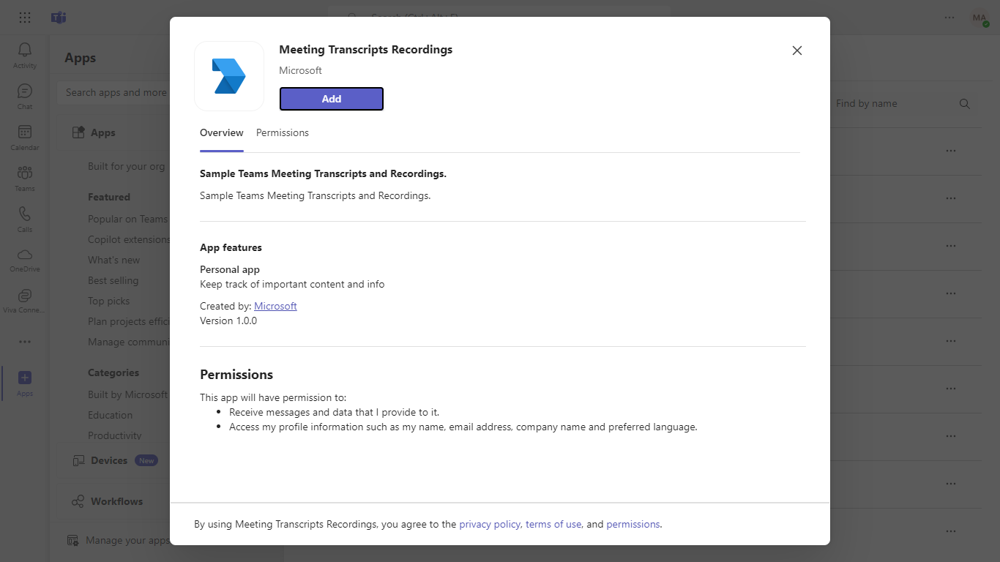
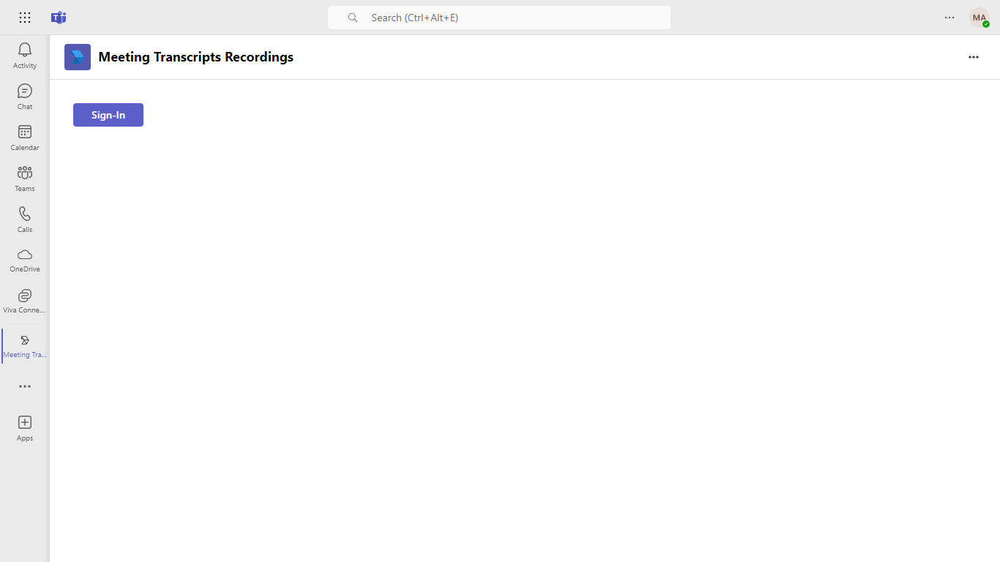
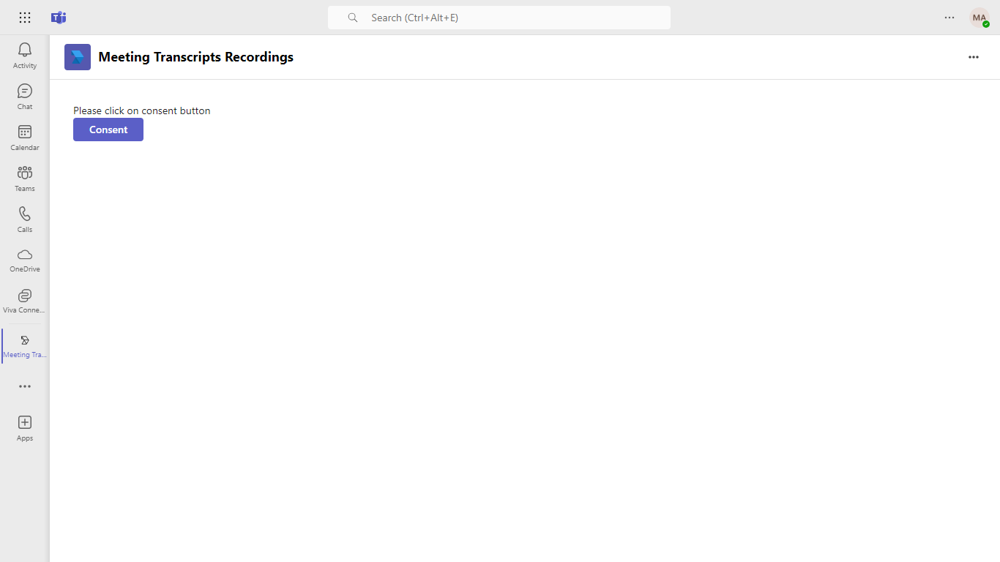
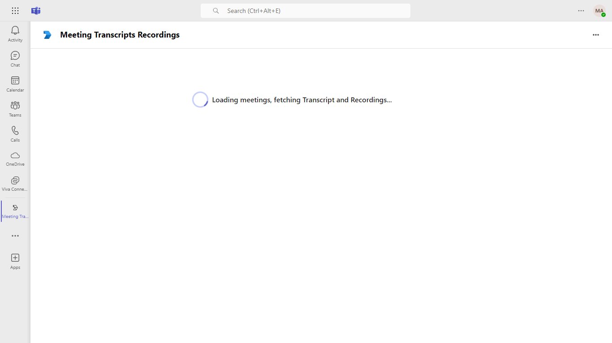
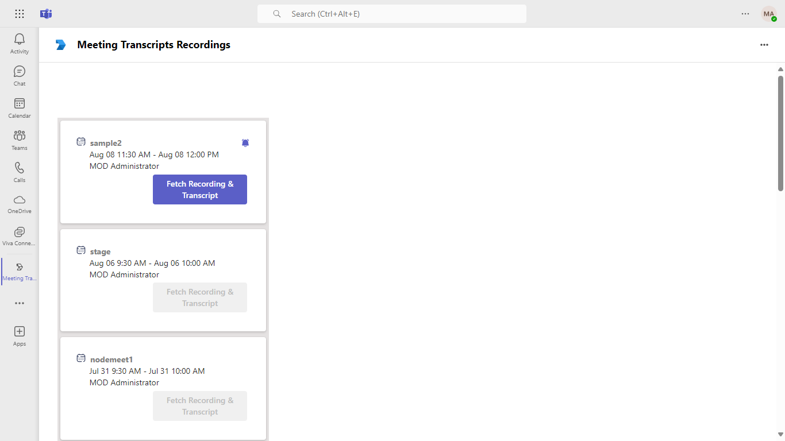
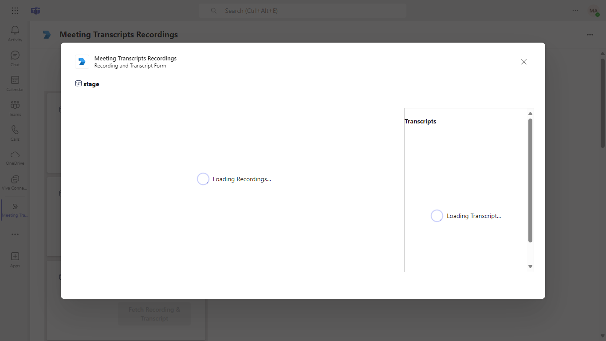
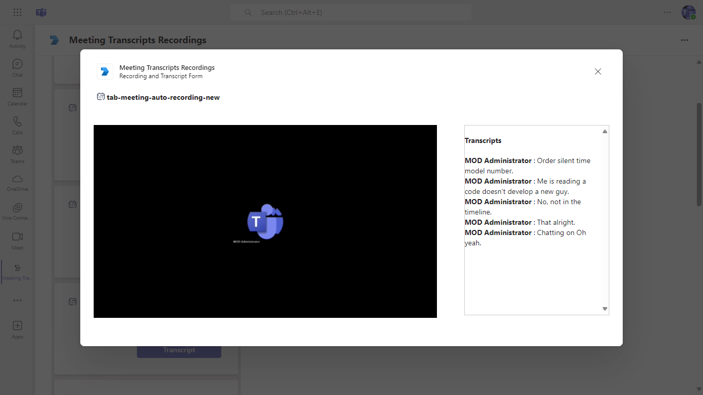

## Meeting Transcripts Recordings

This Microsoft Teams sample application provides a robust solution for capturing meeting transcripts and recordings, streamlining the process of documentation and review. Featuring an intuitive interface and easy integration with .NET and the Microsoft 365 Agents Toolkit, it empowers users to enhance collaboration and maintain accurate records of their meetings.

**Interaction with app**


## Prerequisites

- [.NET Core SDK](https://dotnet.microsoft.com/download) version 6.0

  determine dotnet version
  ```bash
  dotnet --version
  ```
- [dev tunnel](https://learn.microsoft.com/en-us/azure/developer/dev-tunnels/get-started?tabs=windows) or [ngrok](https://ngrok.com/) latest version or equivalent tunnelling solution.
- [Teams](https://teams.microsoft.com) Microsoft Teams is installed and you have an account
- [Microsoft 365 Agents Toolkit for Visual Studio](https://learn.microsoft.com/en-us/microsoftteams/platform/toolkit/toolkit-v4/install-teams-toolkit-vs?pivots=visual-studio-v17-7)

## Run the app (Using Microsoft 365 Agents Toolkit for Visual Studio)

The simplest way to run this sample in Teams is to use Microsoft 365 Agents Toolkit for Visual Studio.
1. Install Visual Studio 2022 **Version 17.14 or higher** [Visual Studio](https://visualstudio.microsoft.com/downloads/)
1. Install Microsoft 365 Agents Toolkit for Visual Studio [Microsoft 365 Agents Toolkit extension](https://learn.microsoft.com/en-us/microsoftteams/platform/toolkit/toolkit-v4/install-teams-toolkit-vs?pivots=visual-studio-v17-7)
1. In the debug dropdown menu of Visual Studio, select default startup project > **Microsoft Teams (browser)**
1. Right-click the 'M365Agent' project in Solution Explorer and select **Microsoft 365 Agents Toolkit > Select Microsoft 365 Account**
1. Sign in to Microsoft 365 Agents Toolkit with a **Microsoft 365 work or school account**
1. Set `Startup Item` as `Microsoft Teams (browser)`.
1. Press F5, or select Debug > Start Debugging menu in Visual Studio to start your app
    </br>
1. In the opened web browser, select Add button to install the app in Teams

> If you do not have permission to upload custom apps (uploading), Microsoft 365 Agents Toolkit will recommend creating and using a Microsoft 365 Developer Program account - a free program to get your own dev environment sandbox that includes Teams.

### Setup Register you app with Azure AD.

  1. Register a new application in the [Microsoft Entra ID – App Registrations](https://go.microsoft.com/fwlink/?linkid=2083908) portal.
  2. Select **New Registration** and on the *register an application page*, set following values:
      * Set **name** to your app name.
      * Choose the **supported account types** (any account type will work)
      * Leave **Redirect URI** empty.
      * Choose **Register**.
  3. On the overview page, copy and save the **Application (client) ID, Directory (tenant) ID**. You’ll need those later when updating your Teams application manifest and in the appsettings.json.
  4. Under **Manage**, select **Expose an API**. 
  5. Select the **Set** link to generate the Application ID URI in the form of `api://{base-url}/{AppID}`. Insert your fully qualified domain name (with a forward slash "/" appended to the end) between the double forward slashes and the GUID. The entire ID should have the form of: `api://fully-qualified-domain-name/{AppID}`
      * ex: `api://%ngrokDomain%.ngrok-free.app/00000000-0000-0000-0000-000000000000`.
  6. Select the **Add a scope** button. In the panel that opens, enter `access_as_user` as the **Scope name**.
  7. Set **Who can consent?** to `Admins and users`
  8. Fill in the fields for configuring the admin and user consent prompts with values that are appropriate for the `access_as_user` scope:
      * **Admin consent title:** Teams can access the user’s profile.
      * **Admin consent description**: Allows Teams to call the app’s web APIs as the current user.
      * **User consent title**: Teams can access the user profile and make requests on the user's behalf.
      * **User consent description:** Enable Teams to call this app’s APIs with the same rights as the user.
  9. Ensure that **State** is set to **Enabled**
  10. Select **Add scope**
      * The domain part of the **Scope name** displayed just below the text field should automatically match the **Application ID** URI set in the previous step, with `/access_as_user` appended to the end:
          * `api://[ngrokDomain].ngrok-free.app/00000000-0000-0000-0000-000000000000/access_as_user.
  11. In the **Authorized client applications** section, identify the applications that you want to authorize for your app’s web application. Each of the following IDs needs to be entered:
      * `1fec8e78-bce4-4aaf-ab1b-5451cc387264` (Teams mobile/desktop application)
      * `5e3ce6c0-2b1f-4285-8d4b-75ee78787346` (Teams web application)
      * `4765445b-32c6-49b0-83e6-1d93765276ca` (Microsoft 365 web application)
      * `0ec893e0-5785-4de6-99da-4ed124e5296c` (Microsoft 365 desktop application)
      * `d3590ed6-52b3-4102-aeff-aad2292ab01c` (Outlook desktop application)
      * `bc59ab01-8403-45c6-8796-ac3ef710b3e3` (Outlook web application)
      * `27922004-5251-4030-b22d-91ecd9a37ea4` (Outlook mobile application)
  12. Navigate to **API Permissions**, and make sure to add the follow permissions:
  -   Select Add a permission
  -   Select Microsoft Graph -\> Delegated permissions.
      *   `User.Read` (enabled by default)
  -   Select Microsoft Graph -\> Application permissions.

      

  -   Click on Add permissions. Please make sure to grant the admin consent for the required permissions.
  13. Navigate to **Authentication**
      If an app hasn't been granted IT admin consent, users will have to provide consent the first time they use an app.
  - Set a redirect URI:
      * Select **Add a platform**.
      * Select **Single-page application**.
      * Enter the **redirect URI** for the app in the following format: `https://{Base_Url}/auth-end` and `https://{Base_Url}/auth-start`.
  14.  Navigate to the **Certificates & secrets**. In the Client secrets section, click on "+ New client secret". Add a description(Name of the secret) for the secret and select “Never” for Expires. Click "Add". Once the client secret is created, copy its value, it need to be placed in the appsettings.json.
  15.  Create a policy for a demo tenant user for creating the online meeting on behalf of that user using the following PowerShell script
  -  Follow this link- [Configure application access policy](https://docs.microsoft.com/en-us/graph/cloud-communication-online-meeting-application-access-policy)

      

## Setup 

> Note these instructions are for running the sample on your local machine.

1. Run ngrok - point to port 3978

   ```bash
   ngrok http 3978 --host-header="localhost:3978"
   ```  

   Alternatively, you can also use the `dev tunnels`. Please follow [Create and host a dev tunnel](https://learn.microsoft.com/en-us/azure/developer/dev-tunnels/get-started?tabs=windows) and host the tunnel with anonymous user access command as shown below:

   ```bash
   devtunnel host -p 3978 --allow-anonymous
   ```

2. Clone the repository

    ```bash
    git clone https://github.com/OfficeDev/Microsoft-Teams-Samples.git
    ```
    
3. Run the app from a terminal or from Visual Studio, choose option A or B.

    A) From a terminal, navigate to `samples/tab-meeting-transcript-recording/csharp`

    ```bash
    # run the app
    dotnet run
    ```
    B) Or from Visual Studio

    - Launch Visual Studio
    - File -> Open -> Project/Solution
    - Navigate to `samples/tab-meeting-transcript-recording/csharp` folder
    - Select `MeetingTranscriptRecording.sln` file
    - Press `F5` to run the project

4. In a terminal, navigate to `samples/tab-meeting-transcript-recording/csharp/MeetingTranscriptRecording/ClientApp`

    - Inside ClientApp folder execute the below command.

        ```bash
        # npm install
        # npm start

        ```

5. Open .env file from this path folder `samples/tab-meeting-transcript-recording/csharp/MeetingTranscriptRecording/ClientApp` and update:
   - `{{MicrosoftAppId}}` - Generated from Step 1 (Application (client) ID)is the application app id\
   

6. Modify the `/appsettings.json` and fill in the following details:
   - `{{MicrosoftAppId}}` - Generated from Step 1 (Application (client) ID)is the application app id
   - `{{TenantId}}` - Generated from Step 1(Directory (tenant) ID) is the tenant id
   - `{{MicrosoftAppPassword}}` - Generated from Step 1.14, also referred to as Client secret
  
**This step is specific to Teams:**

- **Edit** the `manifest.json` contained in the  `AppPackage` folder to replace your Microsoft App Id `{{MicrosoftAppId}}` (that was created when you registered your bot earlier) *everywhere* you see the place holder string `{{MicrosoftAppId}}` (depending on the scenario the Microsoft App Id may occur multiple times in the `manifest.json`)

- **Edit** the `manifest.json` for `{{domain-name}}` with base Url domain. E.g. if you are using ngrok it would be `https://1234.ngrok-free.app` then your domain-name will be `1234.ngrok-free.app` and if you are using dev tunnels then your domain will be like: `12345.devtunnels.ms`.

- **Zip** up the contents of the `AppPackage` folder to create a `manifest.zip` (Make sure that zip file does not contains any subfolder otherwise you will get error while uploading your .zip package)

- **Upload** the `manifest.zip` to Teams (In Teams Apps/Manage your apps click "Upload an app". Browse to and Open the .zip file. At the next dialog, click the Add button.)

- Add the app to personal static tabs.

## Running the sample

You can interact with Teams Tab meeting sidepanel.

**Install app:**



**Click Sign-In:**



**Click Consent:**



**Permissions Requested:**


**Sign-In Loading:**



**Meeting Detail Page:**


**Get Notification:**



**Loading Meetings, Fetching Transcript and Recordings:**



**Recording and Transcript Form:**



## Further reading

- [Azure AD application using Microsoft Graph](https://learn.microsoft.com/en-us/graph/tutorial-applications-basics?tabs=http)
- [Receive change notifications through webhooks](https://learn.microsoft.com/en-us/graph/change-notifications-delivery-webhooks?tabs=http)
- [Designing your Microsoft Teams app with basic Fluent UI components](https://learn.microsoft.com/en-us/microsoftteams/platform/concepts/design/design-teams-app-basic-ui-components)


