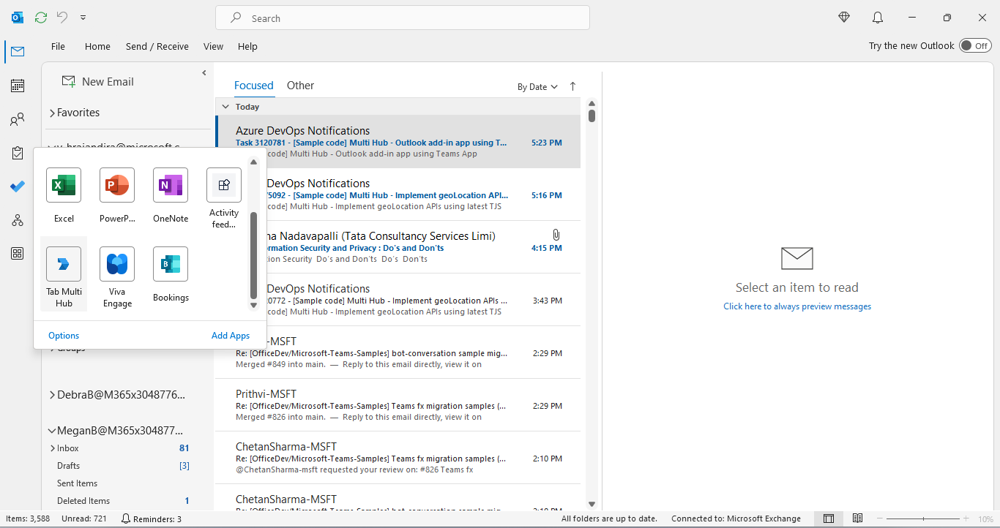
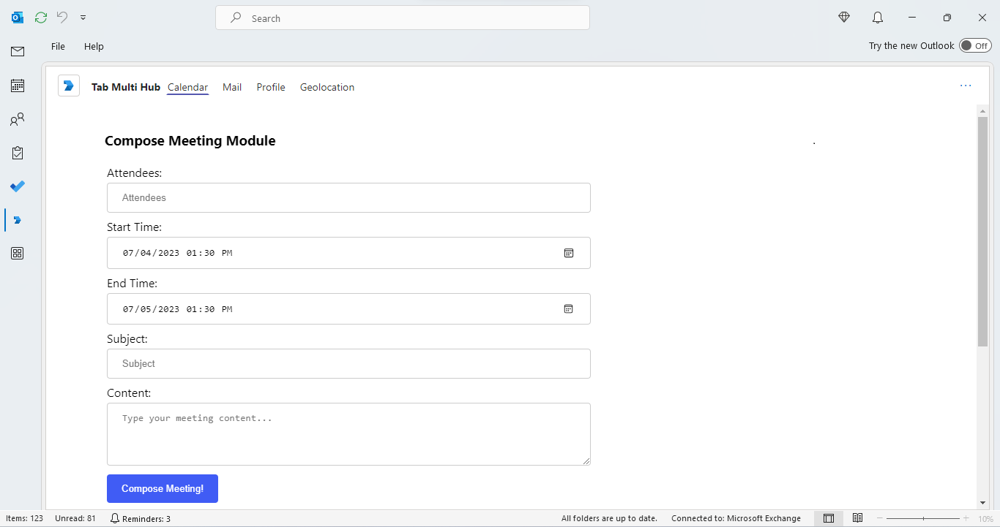
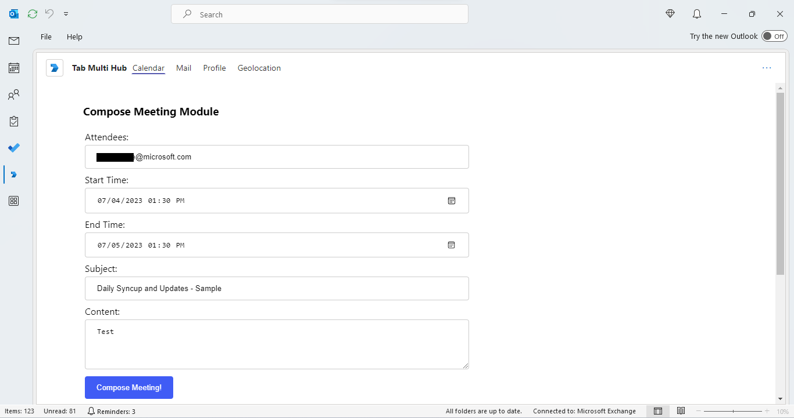
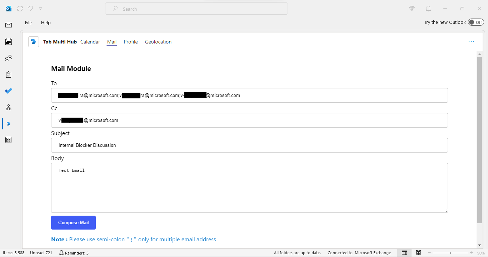
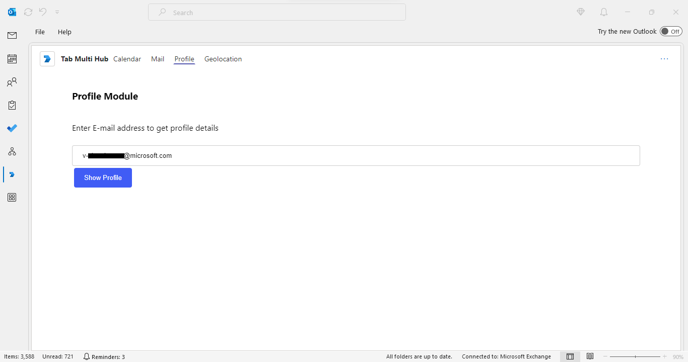
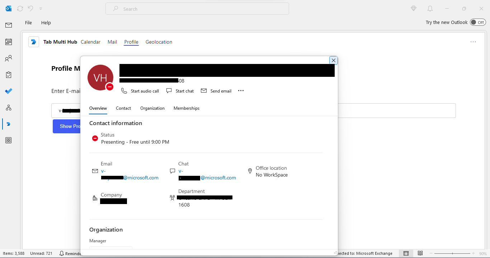
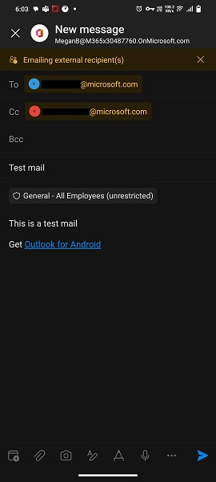
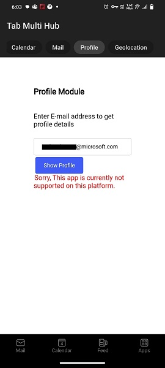

# Interact with Calendar, Mail, Profile, geolocation from Personal Tabs App

Interact with the user's calendar, mail, profile, geolocation from personal tabs app.

 ## Included Features
* Tabs
* Outlook Calendar, Mail, Profile, geolocation

## Interaction with app - Desktop


## Interaction with app - Mobile


## Prerequisites
-  [NodeJS](https://nodejs.org/en/)

-  [M365 developer account](https://docs.microsoft.com/en-us/microsoftteams/platform/concepts/build-and-test/prepare-your-o365-tenant) or access to a Teams account with the appropriate permissions to install an app.
- [Ngrok](https://ngrok.com/download) (For local environment testing) Latest (any other tunneling software can also be used)
  
- [Teams](https://teams.microsoft.com) Microsoft Teams is installed and you have an account

### 1. Register you app with Azure AD

1. Register a new application in the [Azure Active Directory – App Registrations](https://go.microsoft.com/fwlink/?linkid=2083908) portal.
  2. Select **New Registration** and on the *register an application page*, set following values:
      * Set **name** to your app name.
      * Choose the **supported account types** (any account type will work)
      * Leave **Redirect URI** empty.
      * Choose **Register**.
  3. On the overview page, copy and save the **Application (client) ID, Directory (tenant) ID**. You’ll need those later when updating your Teams application manifest and in the .env.
  4. Under **Manage**, select **Expose an API**. 
  5. Select the **Set** link to generate the Application ID URI in the form of `api://{base-url}/{AppID}`. Insert your fully qualified domain name (with a forward slash "/" appended to the end) between the double forward slashes and the GUID. The entire ID should have the form of: `api://fully-qualified-domain-name/{AppID}`
      * ex: `api://%ngrokDomain%.ngrok-free.app/00000000-0000-0000-0000-000000000000`.
  6. Select the **Add a scope** button. In the panel that opens, enter `access_as_user` as the **Scope name**.
  7. Set **Who can consent?** to `Admins and users`
  8. Fill in the fields for configuring the admin and user consent prompts with values that are appropriate for the `access_as_user` scope:
      * **Admin consent title:** Teams can access the user’s profile.
      * **Admin consent description**: Allows Teams to call the app’s web APIs as the current user.
      * **User consent title**: Teams can access the user profile and make requests on the user's behalf.
      * **User consent description:** Enable Teams to call this app’s APIs with the same rights as the user.
  9. Ensure that **State** is set to **Enabled**
  10. Select **Add scope**
      * The domain part of the **Scope name** displayed just below the text field should automatically match the **Application ID** URI set in the previous step, with `/access_as_user` appended to the end:
          * `api://[ngrokDomain].ngrok-free.app/00000000-0000-0000-0000-000000000000/access_as_user.
  11. In the **Authorized client applications** section, identify the applications that you want to authorize for your app’s web application. Each of the following IDs needs to be entered:
         * `1fec8e78-bce4-4aaf-ab1b-5451cc387264` (Teams desktop, mobile)
         * `5e3ce6c0-2b1f-4285-8d4b-75ee78787346` (Teams web)
         * `4765445b-32c6-49b0-83e6-1d93765276ca` (Microsoft 365 web)
         * `0ec893e0-5785-4de6-99da-4ed124e5296c` (Microsoft 365 desktop)  
         * `d3590ed6-52b3-4102-aeff-aad2292ab01c` (Microsoft 365 mobile)  
         * `bc59ab01-8403-45c6-8796-ac3ef710b3e3` (Outlook web)  
         * `27922004-5251-4030-b22d-91ecd9a37ea4` (Outlook mobile)  
  12. Navigate to **API Permissions**, and make sure to add the follow permissions:
  -   Select Add a permission
  -   Select Microsoft Graph -\> Delegated permissions.
      - `User.Read` (enabled by default)
      - `Calendars.Read` 
      - `Calendars.ReadBasic` 
      - `Calendars.ReadWrite` 
  -   Click on Add permissions. Please make sure to grant the admin consent for the required permissions.
  13. Navigate to **Authentication**
      If an app hasn't been granted IT admin consent, users will have to provide consent the first time they use an app.
  - Set a redirect URI:
      * Select **Add a platform**.
      * Select **Single-page application**.
      * Enter the **redirect URI** for the app in the following format: `https://{Base_Url}/auth-end`.
  14.  Navigate to the **Certificates & secrets**. In the Client secrets section, click on "+ New client secret". Add a description(Name of the secret) for the secret and select “Never” for Expires. Click "Add". Once the client secret is created, copy its value, it need to be placed in the .env.
    
### 2. Setup NGROK
1. Run ngrok - point to port 3978

    ```bash
    ngrok http 3978 --host-header="localhost:3978"
    ```
2. Setup for code
 Clone the repository

    ```bash
    git clone https://github.com/OfficeDev/Microsoft-Teams-Samples.git
    ```
    
3. Open .env file from this path folder `samples/tab-multi-hub/ts/api-server` and update 
   - `{{CLIENT_ID}}` - Generated from Step 1 (Application (client) ID)is the application app id
   - `{{CLIENT_SECRET}}` - Generated from Step 1.14, also referred to as Client secret

4. Open .env file from this path folder `samples/tab-multi-hub/ts` and update 
   - `{{REACT_APP_AZURE_APP_REGISTRATION_ID}}` - Generated from Step 1 (Application (client) ID)is the application app id
   - `{{REACT_APP_BASE_URL}}` - Your application's base url. E.g. https://12345.ngrok-free.app if you are using ngrok.
     
5. We have two different solutions to run, so follow below steps:
 
- In a terminal, navigate to `samples/tab-multi-hub/ts/api-server` folder, Open your local terminal and run the below command to install node modules. You can do the same in Visual studio code terminal by opening the project in Visual studio code

    ```bash
    npm install
    ```

    ```bash
    npm start
    ```
- The server will start running on 5000 port

- In a different terminal, navigate to `samples/tab-multi-hub/ts` folder, Open your local terminal and run the below command to install node modules. You can do the same in Visual studio code terminal by opening the project in Visual studio code 

    ```bash
    npm install
    ```

    ```bash
    npm start
    ```
- The client will start running on 3978 port

### 3. Setup Manifest for Teams

- **This step is specific to Teams.**
    **Edit** the `manifest.json` contained in the `Manifest/` folder to replace with your MicrosoftAppId (that was created in step1.1 and is the same value of MicrosoftAppId in `.env` file) *everywhere* you see the place holder string `{{Microsoft-App-Id}}` (depending on the scenario the Microsoft App Id may occur multiple times in the `manifest.json`)
    **Edit** the `manifest.json` for `validDomains` and replace `{{domain-name}}` with base Url of your domain. E.g. if you are using ngrok it would be `https://1234.ngrok-free.app` then your domain-name will be `1234.ngrok-free.app`.
    **Zip** up the contents of the `Manifest/` folder to create a `manifest.zip` or `Manifest_Hub/` folder to create a `manifest_Hub.zip`
    **Upload** the `manifest.zip` to Teams (in the left-bottom *Apps* view, click "Upload a custom app")

## Running the sample  - Desktop

**Add/upload the app in Microsoft Teams:**


**On the side bar, select More Apps. Your sideloaded app title appears among your installed apps:**



**Select your app icon to launch and preview your app running in Outlook on the desktop:**



**Add Details for Compose Meeting:**



**Click ComposeMeeting:**


**Click View:**


**App In Outlook:**


**App In Outlook with input values:**



**Compose Mail From Outlook Personal Tab:**


**Profile UI:**


**Enter any Email to get a profile card at a specified position to show profile information about that persona:**



**User Profile Details:**



## Office on the web

- To preview your app running in Office on the web.

- Log into office.com with test tenant credentials

**Select the Apps icon on the side bar. Your sideloaded app title appears among your installed apps:**


**Select geo location tab:**


**Click the button to get your current geolocation:**


**Note:** Similarly, you can test your application in the Office 365 desktop app as well.

## Running the sample  - Mobile

**On the side bar, select More Apps. Your sideloaded app title appears among your installed apps:**


**Select your app icon to launch and preview your app running in Outlook on the desktop and add details for Compose Meeting:**


**Click ComposeMeeting:**


**Calendar Tab UI:**


**Email Tab UI:**


**Compose Mail From Outlook Personal Tab:**



**Profile Module:**


**This app is currently not supported on this platform:**



**Select geo location tab:**


**Click the button to get your current geolocation:**


## Further Reading.
  
- [TeamsJS capability support across Microsoft 365](https://learn.microsoft.com/en-us/microsoftteams/platform/m365-apps/teamsjs-support-m365)
- [Extend Teams apps across Microsoft 365](https://learn.microsoft.com/microsoftteams/platform/m365-apps/overview)


