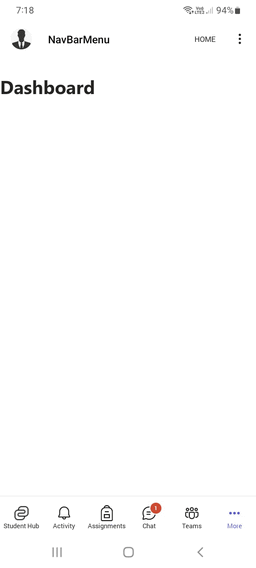
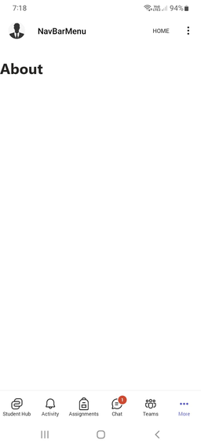

# Teams Personal Tab Navbar-Menu Sample TS

Add multiple actions to the upper right NavBar and build an overflow menu for extra actions in an app.

**Note:** NaveBar menu is only supported in Mobile Clients.

 ## Included Features
* Tabs
* NavBar Menu

## Interaction with app - Mobile



 ## Prerequisites

- Microsoft Teams is installed and you have an account (not a guest account)
-  [NodeJS](https://nodejs.org/en/)
-  [ngrok](https://ngrok.com/) or equivalent tunneling solution

## Setup

1. Setup NGROK

- Run ngrok - point to port 3978

    ```bash
    ngrok http 3978 --host-header="localhost:3978"
    ```
2. Setup for code
   - Clone the repository

    ```bash
    git clone https://github.com/OfficeDev/Microsoft-Teams-Samples.git
    ```

  - In a terminal, navigate to `samples/tab-navbar-menu/ts`
   
  - Install modules

      `npm install`

      `npm start`
      
   - The client will start running on 3978 port 

4. Setup Manifest for Teams
- __*This step is specific to Teams.*__
    - **Edit** the `manifest.json` contained in the ./AppPackage folder to replace your GUID and you see the place holder string `{{GUID}}` in the `manifest.json`
    - **Edit** the `manifest.json` for `validDomains` and replace `{{domain-name}}` with base Url of your domain. E.g. if you are using ngrok it would be `https://1234.ngrok-free.app` then your domain-name will be `1234.ngrok-free.app`.
    - **Zip** up the contents of the `AppPackage` folder to create a `manifest.zip` (Make sure that zip file does not contains any subfolder otherwise you will get error while uploading your .zip package)

- Upload the manifest.zip to Teams (in the Apps view click "Upload a custom app")
   - Go to Microsoft Teams. From the lower left corner, select Apps
   - From the lower left corner, choose Upload a custom App
   - Go to your project directory, the ./AppPackage folder, select the zip folder, and choose Open.
   - Select Add in the pop-up dialog box. Your app is uploaded to Teams.
   **Note** The navbar menu app is supported only personal scopes.
## Running the sample

**Install App:**


**MainPage UI:**


**Clik 3 small dots (Includes other app options and information):**


**Click About Menu:**



**Clik 3 small dots (Includes other app options and information):**


**Click Contact Menu:**


**Clik 3 small dots (Includes other app options and information):**


## Further Reading
[Configure and add multiple actions in NavBar](https://learn.microsoft.com/en-us/microsoftteams/platform/concepts/design/personal-apps?view=msteams-client-js-1.12.1#configure-and-add-multiple-actions-in-navbar)


