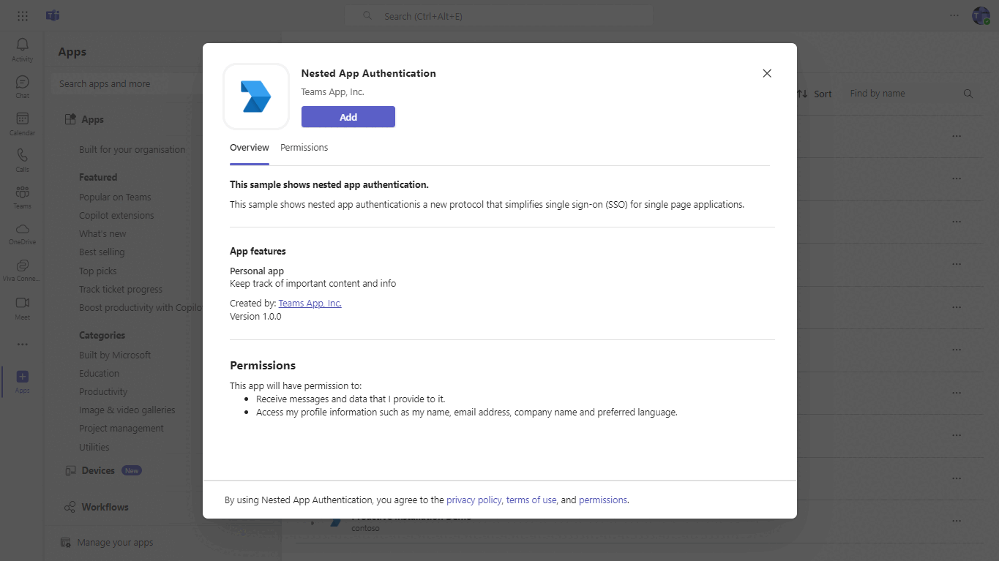
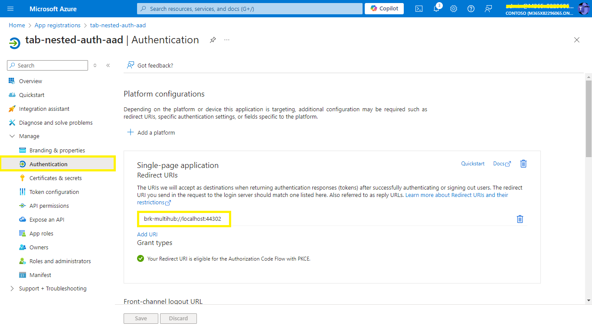
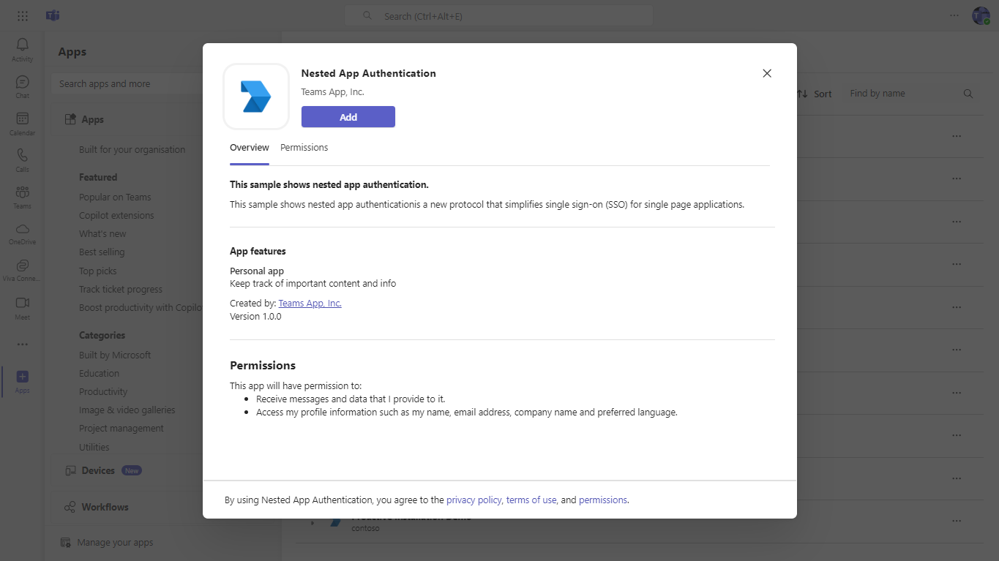
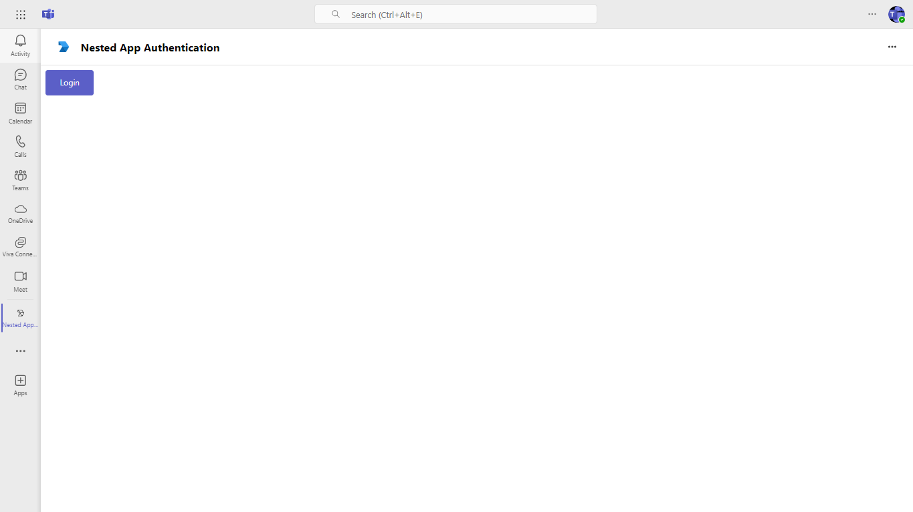
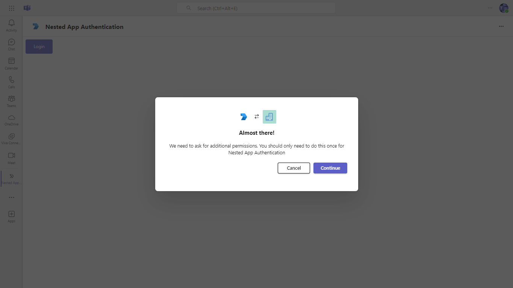
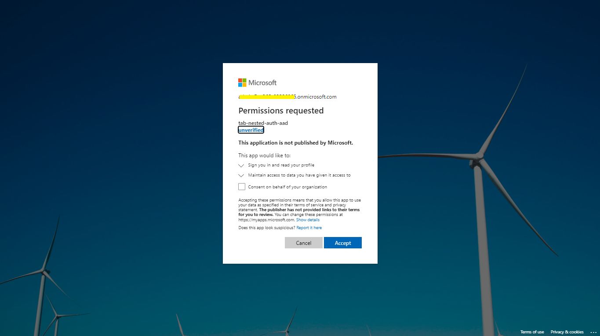
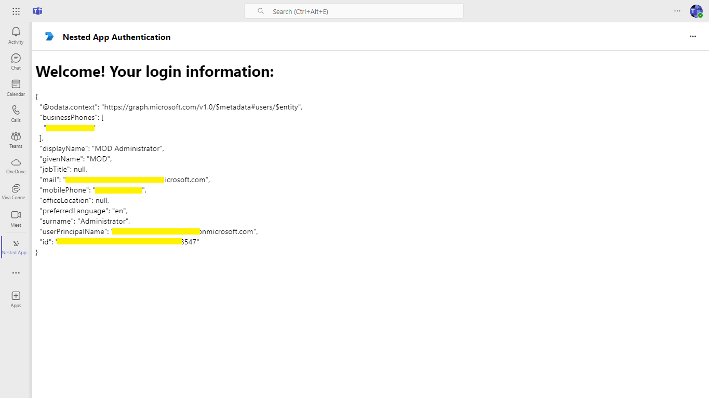
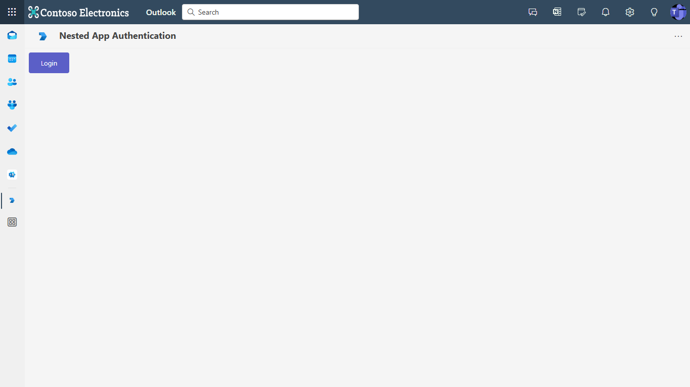
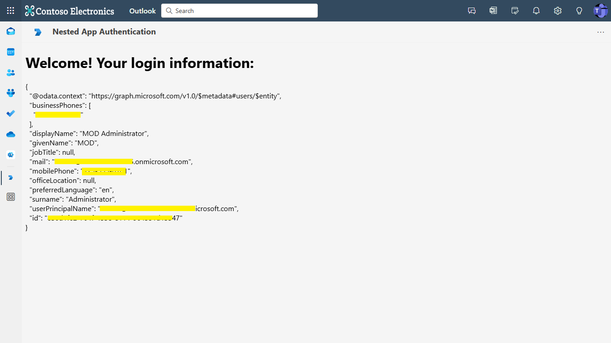

## Nested app authentication

Nested app authentication (NAA) is a new authentication protocol for single page applications embedded in host environments like Teams, Outlook, and Microsoft 365, simplifying the authentication process to facilitate single sign-on (SSO) across nested applications and offering several advantages over the On-Behalf-Of (OBO) flow.

**Interaction with app**


## Run the app (Using Teams Toolkit for Visual Studio)

The simplest way to run this sample in Teams is to use Teams Toolkit for Visual Studio.
1. Install Visual Studio 2022 **Version 17.10 Preview 4  or higher** [Visual Studio](https://visualstudio.microsoft.com/downloads/)
1. Install Teams Toolkit for Visual Studio [Teams Toolkit extension](https://learn.microsoft.com/en-us/microsoftteams/platform/toolkit/toolkit-v4/install-teams-toolkit-vs?pivots=visual-studio-v17-7)
1. In the debug dropdown menu of Visual Studio, select default startup project > **Microsoft Teams (browser)**
1. In Visual Studio, right-click your **TeamsApp** project and **Select Teams Toolkit > Prepare Teams App Dependencies**
1. Using the extension, sign in with your Microsoft 365 account where you have permissions to upload custom apps.
1. Select **Debug > Start Debugging** or **F5** to run the menu in Visual Studio.
1. In the browser that launches, select the **Add** button to install the app to Teams.
> If you do not have permission to upload custom apps (sideloading), Teams Toolkit will recommend creating and using a Microsoft 365 Developer Program account - a free program to get your own dev environment sandbox that includes Teams.

## Setup

  1. Register a new application in the [Microsoft Entra ID – App Registrations](https://go.microsoft.com/fwlink/?linkid=2083908) portal.
  2. Select **New Registration** and on the *register an application page*, set following values:
      * Set **name** to your app name.
      * Choose the **supported account types** (any account type will work)
      * Leave **Redirect URI** empty.
      * Choose **Register**.
  3. On the overview page, copy and save the **Application (client) ID, Directory (tenant) ID**. You’ll need those later when updating your Teams application manifest and in the `appsettings.json` files.
  4. Navigate to **Authentication**
      If an app hasn't been granted IT admin consent, users will have to provide consent the first time they use an app.
  - Set a redirect URI:
      * Select **Add a platform**.
      * Select **Single-page application**.
      * Enter the **redirect URI** for the app in the following format: `brk-<broker_application_id>://<your_domain>`.

      
      
  5. Navigate to **API Permissions**, and make sure to add the follow permissions:
    -   Select Add a permission
    -   Select Microsoft Graph -\> Delegated permissions.
        * User.Read (enabled by default)
    -   Click on Add permissions. Please make sure to grant the admin consent for the required permissions.

  6.  Navigate to the **Certificates & secrets**. In the Client secrets section, click on "+ New client secret". Add a description(Name of the secret) for the secret and select “Never” for Expires. Click "Add". Once the client secret is created, copy its value, it need to be placed in the appsettings.json.

2. Setup NGROK
 - Run ngrok - point to port 3978

   ```bash
   ngrok http 3978 --host-header="localhost:3978"
   ```  

   Alternatively, you can also use the `dev tunnels`. Please follow [Create and host a dev tunnel](https://learn.microsoft.com/en-us/azure/developer/dev-tunnels/get-started?tabs=windows) and host the tunnel with anonymous user access command as shown below:

   ```bash
   devtunnel host -p 3978 --allow-anonymous
   ```

3. Clone the repository

    ```bash
    git clone https://github.com/OfficeDev/Microsoft-Teams-Samples.git
    ```
    
4. Run the app from a terminal or from Visual Studio, choose option A or B.

    A) From a terminal, navigate to `/samples/tab-nested-auth/csharp`

    ```bash
    # run the app
    dotnet run
    ```
    B) Or from Visual Studio

    - Launch Visual Studio
    - File -> Open -> Project/Solution
    - Navigate to `/samples/tab-nested-auth/csharp` folder
    - Select `TabNestedAuth.sln` file
    - Press `F5` to run the project
    
5. Modify the `/appsettings.json` and fill in the following details:
  - `{{AzureAD Client Id}}` - Generated from Step 1 while doing Microsoft Entra ID app registration in Azure portal.

6. Setup Manifest for Teams
- __*This step is specific to Teams.*__
    - **Edit** the `manifest.json` contained in the ./appPackage folder to replace your Microsoft App Id (that was created when you registered your app registration earlier) *everywhere* you see the place holder string `{{Microsoft-App-Id}}` (depending on the scenario the Microsoft App Id may occur multiple times in the `manifest.json`)
    - **Edit** the `manifest.json` for `validDomains` and replace `{{domain-name}}` with base Url of your domain. E.g. if you are using ngrok it would be `https://1234.ngrok-free.app` then your domain-name will be `1234.ngrok-free.app` and if you are using dev tunnels then your domain will be like: `12345.devtunnels.ms`.
    - **Zip** up the contents of the `appPackage` folder to create a `manifest.zip` (Make sure that zip file does not contains any subfolder otherwise you will get error while uploading your .zip package)

- Upload the manifest.zip to Teams (in the Apps view click "Upload a custom app")
   - Go to Microsoft Teams. From the lower left corner, select Apps
   - From the lower left corner, choose Upload a custom App
   - Go to your project directory, the ./appPackage folder, select the zip folder, and choose Open.
   - Select Add in the pop-up dialog box. Your app is uploaded to Teams.
    
## Running the sample

You can interact with Teams Tab meeting sidepanel.

**Install app:**


**Click Login:**








## Outlook on the web
In the debug dropdown menu of Visual Studio, select default startup project > **Outlook (browser)**

## Running the sample

**Click Login:**


**Login Details:**


## Further reading

- [Nested app authentication](https://review.learn.microsoft.com/en-us/microsoftteams/platform/concepts/authentication/nested-authentication?branch=pr-en-us-10768)

- [SPA Redirect URL](https://learn.microsoft.com/en-us/office/dev/add-ins/develop/enable-nested-app-authentication-in-your-add-in#add-a-trusted-broker-through-spa-redirect)


