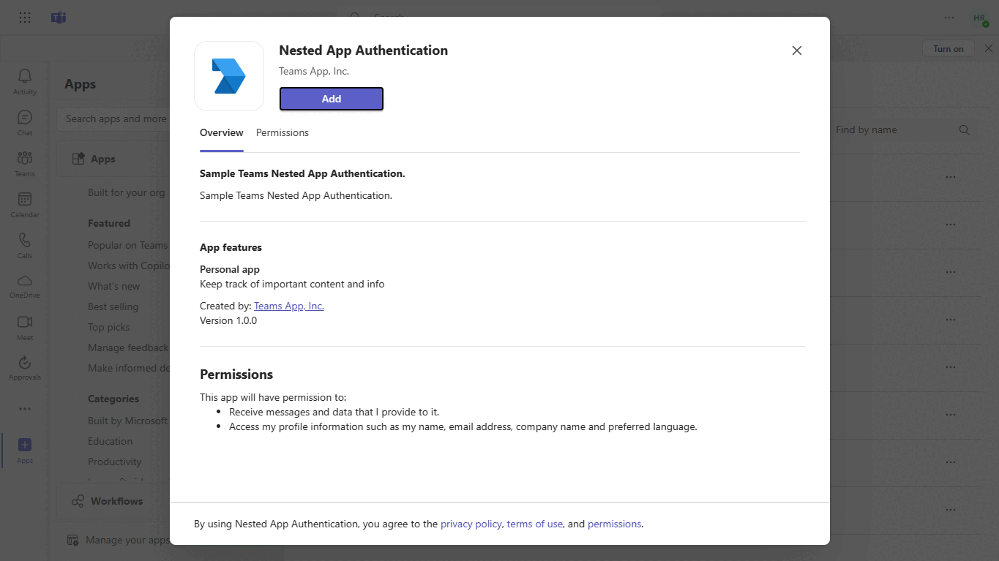
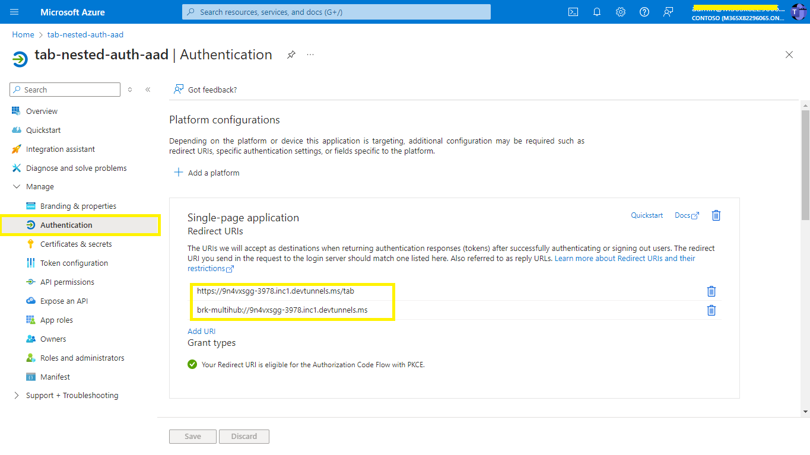
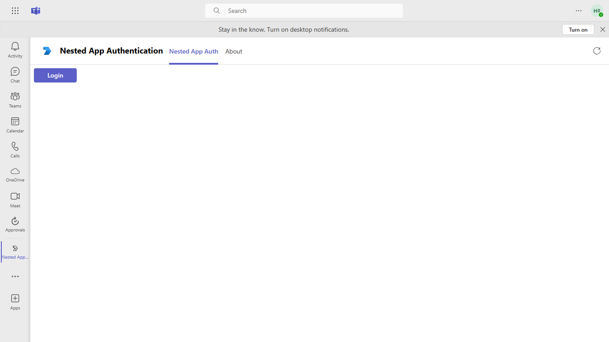
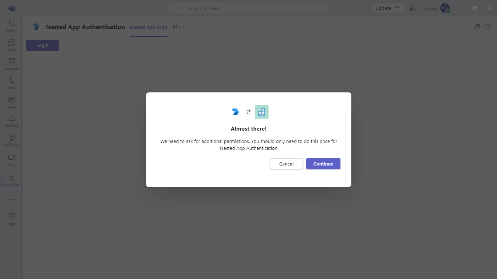
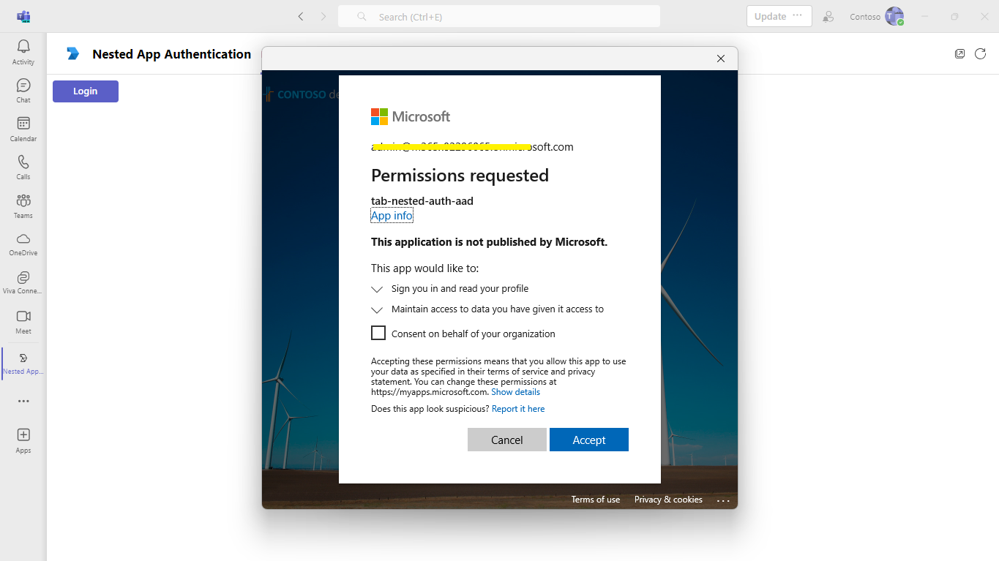
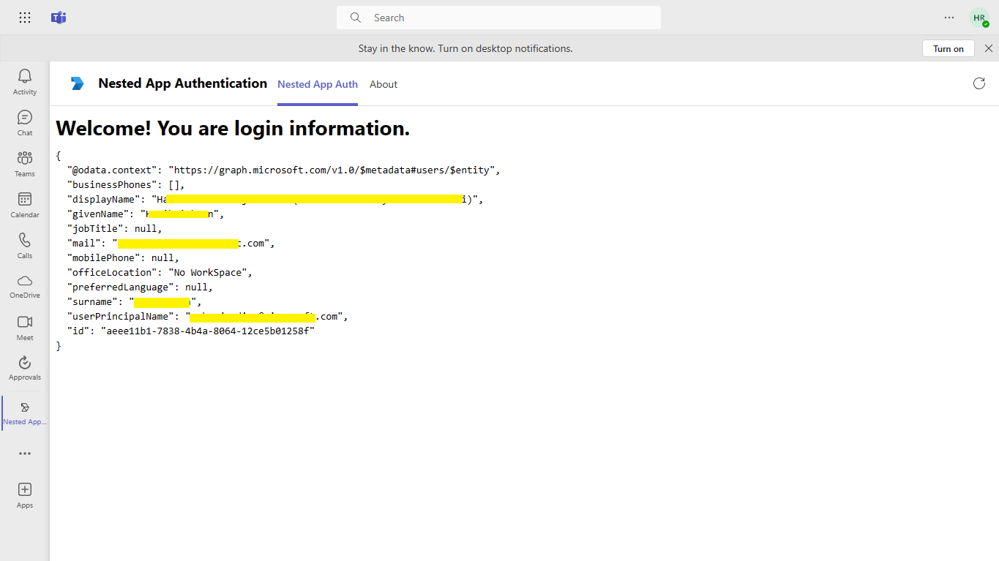
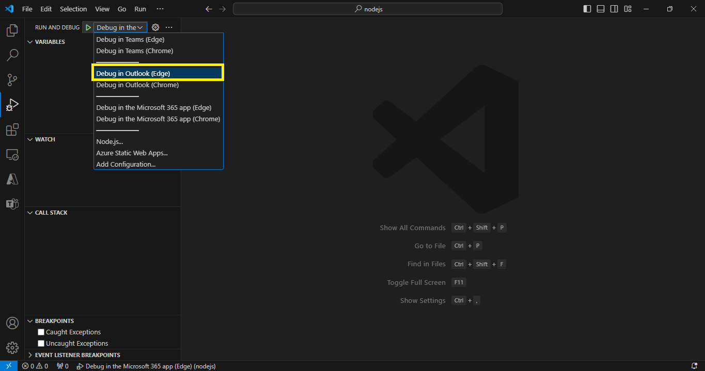
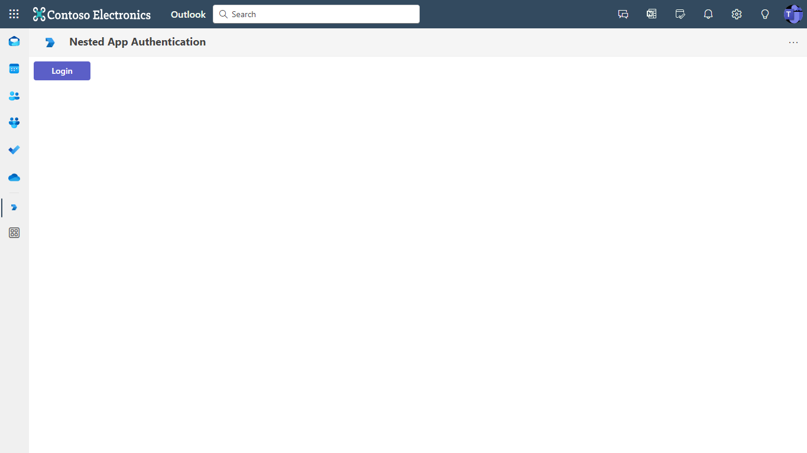
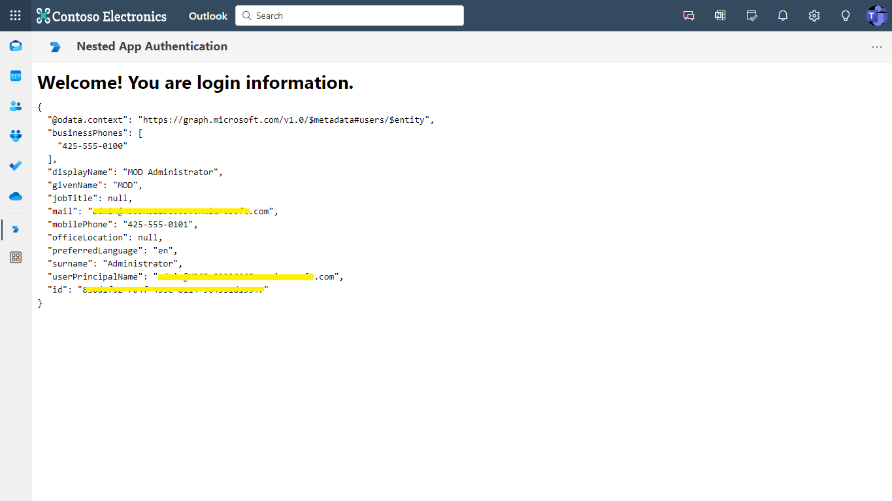

## Nested app authentication

Nested app authentication (NAA) is a new authentication protocol for single page applications embedded in host environments like Teams, Outlook, and Microsoft 365, simplifying the authentication process to facilitate single sign-on (SSO) across nested applications and offering several advantages over the On-Behalf-Of (OBO) flow.

**Interaction with app**


## Try it yourself - experience the App in your Microsoft Teams client
Please find below demo manifest which is deployed on Microsoft Azure and you can try it yourself by uploading the app package (.zip file link below) to your teams and/or as a personal app. (Uploading must be enabled for your tenant, [see steps here](https://docs.microsoft.com/microsoftteams/platform/concepts/build-and-test/prepare-your-o365-tenant#enable-custom-teams-apps-and-turn-on-custom-app-uploading)).

**Nested app authentication:** [Manifest](/samples/tab-nested-auth/csharp/demo-manifest/tab-nested-auth.zip)

## Prerequisites

- [NodeJS](https://nodejs.org/en/)
- [dev tunnel](https://learn.microsoft.com/en-us/azure/developer/dev-tunnels/get-started?tabs=windows) or [ngrok](https://ngrok.com/) latest version or equivalent tunnelling solution
- [VS Code](https://code.visualstudio.com/)
- [Microsoft 365 Agents Toolkit for VS Code](https://marketplace.visualstudio.com/items?itemName=TeamsDevApp.ms-teams-vscode-extension) or [TeamsFx CLI](https://learn.microsoft.com/microsoftteams/platform/toolkit/teamsfx-cli?pivots=version-one)

## Run the app (Using Microsoft 365 Agents Toolkit for Visual Studio Code)

The simplest way to run this sample in Teams is to use Microsoft 365 Agents Toolkit for Visual Studio Code.

1. Ensure you have downloaded and installed [Visual Studio Code](https://code.visualstudio.com/docs/setup/setup-overview)
1. Install the [Microsoft 365 Agents Toolkit extension](https://marketplace.visualstudio.com/items?itemName=TeamsDevApp.ms-teams-vscode-extension)
1. Select **File > Open Folder** in VS Code and choose this samples directory from the repo
1. Using the extension, sign in with your Microsoft 365 account where you have permissions to upload custom apps
1. Select **Debug > Start Debugging** or **F5** to run the app in a Teams web client.
1. In the browser that launches, select the **Add** button to install the app to Teams.

> If you do not have permission to upload custom apps (uploading), Microsoft 365 Agents Toolkit will recommend creating and using a Microsoft 365 Developer Program account - a free program to get your own dev environment sandbox that includes Teams.

### Setup Register you app with Azure AD.

  1. Register a new application in the [Microsoft Entra ID – App Registrations](https://go.microsoft.com/fwlink/?linkid=2083908) portal.
  2. Select **New Registration** and on the *register an application page*, set following values:
      * Set **name** to your app name.
      * Choose the **supported account types** (any account type will work)
      * Leave **Redirect URI** empty.
      * Choose **Register**.
  3. On the overview page, copy and save the **Application (client) ID, Directory (tenant) ID**. You’ll need those later when updating your Teams application manifest and in the `Msal.js` files.
  4. Navigate to **Authentication**
      If an app hasn't been granted IT admin consent, users will have to provide consent the first time they use an app.
  - Set a redirect URI:
      * Select **Add a platform**.
      * Select **Single-page application**.
      * Enter the **redirect URI** for the app in the following format: `https://{Base_Url}/tab` and `brk-<broker_application_id>://<your_domain>`.

      
      
  5. Navigate to **API Permissions**, and make sure to add the follow permissions:
    -   Select Add a permission
    -   Select Microsoft Graph -\> Delegated permissions.
        * User.Read (enabled by default)
    -   Click on Add permissions. Please make sure to grant the admin consent for the required permissions.

  6.  Navigate to the **Certificates & secrets**. In the Client secrets section, click on "+ New client secret". Add a description(Name of the secret) for the secret and select “Never” for Expires. Click "Add". Once the client secret is created, copy its value, it need to be placed in the .env.

## Setup 

> Note these instructions are for running the sample on your local machine.

1. Run ngrok - point to port 3978

   ```bash
   ngrok http 3978 --host-header="localhost:3978"
   ```  

   Alternatively, you can also use the `dev tunnels`. Please follow [Create and host a dev tunnel](https://learn.microsoft.com/en-us/azure/developer/dev-tunnels/get-started?tabs=windows) and host the tunnel with anonymous user access command as shown below:

   ```bash
   devtunnel host -p 3978 --allow-anonymous
   ```

2. Clone the repository

    ```bash
    git clone https://github.com/OfficeDev/Microsoft-Teams-Samples.git
    ```
    
3. In a different terminal, navigate to `samples/tab-nested-auth/nodejs` folder, Open your local terminal and run the below command to install node modules. You can do the same in Visual studio code terminal by opening the project in Visual studio code 

    ```bash
    npm install
    ```

    ```bash
    npm start
    ```
- The client will start running on 3978 port

4. Open Msal.js file from this path folder `samples/tab-nested-auth/nodejs/src/components` and update:
   - `{{clientId}}` - Generated from Step 1 (Application (client) ID)is the application app id
   
**This step is specific to Teams:**

- **Edit** manifest.json contained in the AppManifest folder to replace the placeholder `{{TEAMS_APP_ID}}` with your actual **Microsoft Teams App Id** (the App Id generated when you registered the app in Azure AD). This placeholder may appear in multiple places.

- **Edit** the manifest.json to replace `{{AAD_APP_CLIENT_ID}}` with your **Azure AD App Client Id**

- **Edit**  the manifest.json to replace `{{TAB_DOMAIN}}` with your app's base domain.
E.g., if you're using ngrok, and the URL is `https://1234.ngrok-free.app`, then the domain is `1234.ngrok-free.app`.

- **Edit** the webApplicationInfo.nestedAppAuthInfo section of the manifest, make sure the following structure is present to enable **Nested App Authentication (NAA).** Set the claims field to specify client capabilities (e.g., CAE support). Do not use an empty string (""). If no capabilities are required, use an empty object ({}).
   ```bash
    "nestedAppAuthInfo": [
    {
      "redirectUri": "brk-multihub://${{TAB_DOMAIN}}",
      "scopes": ["openid", "profile", "offline_access"],
      "claims": "{\"access_token\":{\"xms_cc\":{\"values\":[\"CP1\"]}}}"
    }
    ```
- **Zip** up the contents of the `AppManifest` folder to create a `manifest.zip` (Make sure that zip file does not contains any subfolder otherwise you will get error while uploading your .zip package)

- **Upload** the `manifest.zip` to Teams (In Teams Apps/Manage your apps click "Upload an app". Browse to and Open the .zip file. At the next dialog, click the Add button.)

- Add the app to personal static tabs.x

## Running the sample

You can interact with Teams Tab meeting sidepanel.

**Install app:**


**Click Login:**








## Outlook on the web
To debug the app
1. Open the folder in Visual Studio Code with Microsoft 365 Agents Toolkit extension installed.
1. Open Debug View (`Ctrl+Shift+D`) and select "Debug in Outlook (Edge)" in dropdown list.
1. Press "F5" to debug the app in the Outlook app in a browser window.



## Running the sample

**Click Login:**


**Login Details:**


## Further reading

- [Nested app authentication](https://review.learn.microsoft.com/en-us/microsoftteams/platform/concepts/authentication/nested-authentication?branch=pr-en-us-10768)

- [SPA Redirect URL](https://learn.microsoft.com/en-us/office/dev/add-ins/develop/enable-nested-app-authentication-in-your-add-in#add-a-trusted-broker-through-spa-redirect)

