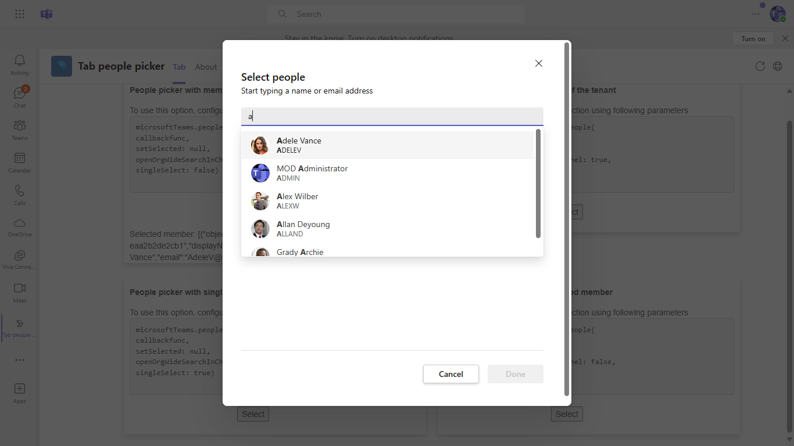

## Interaction with app


## Prerequisites

- [.NET Core SDK](https://dotnet.microsoft.com/download) version 3.1

  ```bash
  # determine dotnet version
  dotnet --version
  ```

- [ngrok](https://ngrok.com/) or equivalent tunnelling solution
 ```bash
    ngrok http --host-header=rewrite 3978
    ```

## Setup
  
- Clone the repository 
   ```bash
   git clone https://github.com/OfficeDev/microsoft-teams-samples.git
   ```

- Build your solution

  - Launch Visual Studio
  - File -> Open -> Project/Solution
  - Navigate to `samples/tab-people-picker/csharp/TabPeoplePicker/` folder
  - Select `TabPeoplePicker/.csproj` file
  - Press `F5` to run the project
  
 -Register a new application in the [Azure Active Directory – App Registrations](https://go.microsoft.com/fwlink/?linkid=2083908) portal.
 
- Setup for Bot

   In Azure portal, create a [Azure Bot resource](https://docs.microsoft.com/en-us/azure/bot-service/bot-service-quickstart-registration).
    - For bot handle, make up a name.
    - Select "Use existing app registration" (Create the app registration in Azure Active Directory beforehand.)
    - __*If you don't have an Azure account*__ create an [Azure free account here](https://azure.microsoft.com/en-us/free/)
    
   In the new Azure Bot resource in the Portal, 
    - Ensure that you've [enabled the Teams Channel](https://learn.microsoft.com/en-us/azure/bot-service/channel-connect-teams?view=azure-bot-service-4.0)
    - In Settings/Configuration/Messaging endpoint, enter the current `https` URL you were given by running ngrok. Append with the path `/api/messages`

- Config changes
   - Press F5 to run the project
   - Update the ngrok in manifest
   - Zip all three files present in manifest folder

- [Upload app manifest file](https://docs.microsoft.com/en-us/microsoftteams/platform/concepts/deploy-and-publish/apps-upload#load-your-package-into-teams) (zip file) to your team

## Running the sample

This is an tab app which shows the feature of client sdk people picker.





## Further Reading
[Tab-people-picker](https://learn.microsoft.com/en-us/microsoftteams/platform/concepts/device-capabilities/people-picker-capability?tabs=Samplemobileapp%2Cteamsjs-v2)

