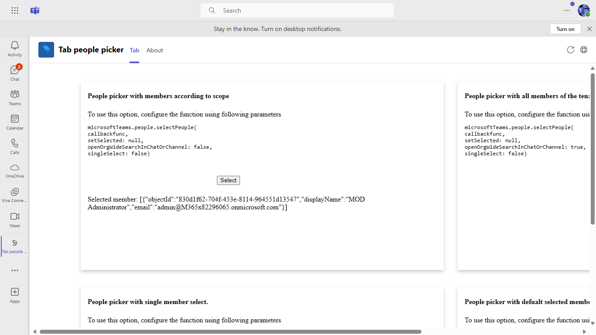

# Tab people picker

This sample shows tab capability with the feature of client sdk people picker.

## Interaction with app


## Prerequisites

 - Office 365 tenant. You can get a free tenant for development use by signing up for the [Office 365 Developer Program](https://developer.microsoft.com/en-us/microsoft-365/dev-program).

- To test locally, [NodeJS](https://nodejs.org/en/download/) must be installed on your development machine (version 16.14.2  or higher).

- [ngrok](https://ngrok.com/) or equivalent tunnelling solution

## Setup

### 1. Setup NGROK
1) Run ngrok - point to port 3978

    ```bash
    ngrok http -host-header=rewrite 3978
    
    ```

### 2. Setup for code    
1) Clone the repository

    ```bash
    git clone https://github.com/OfficeDev/Microsoft-Teams-Samples.git
    ```

2) In a terminal, navigate to `samples/tab-people-picker/nodejs`

3) Install modules

    ```bash
    npm install
    ```

4) Run your bot at the command line:

    ```bash
    npm start
    ```

### 3. Setup Manifest for Teams

- **This step is specific to Teams.**

    -  Edit the `manifest.json` contained in the `Manifest` folder to replace {{Manifest-id}} with any GUID and ngrok url *everywhere* you see the place holder string `{{base-url}}`
    -  Zip up the contents of the `Manifest` folder to create a `manifest.zip`
    -  Upload the `manifest.zip` to Teams (in the Apps view click "Upload a custom app")

## Running the sample

**Adding tab people picker UI:**


**Tab UI:**


**All Memberes Of Organisation Search:**


**Scope search:**


**Single Select:**


**Set Selected Search:**



## Further reading

- [Tab Pepole picker](https://learn.microsoft.com/en-us/microsoftteams/platform/concepts/device-capabilities/people-picker-capability?tabs=Samplemobileapp%2Cteamsjs-v2)
