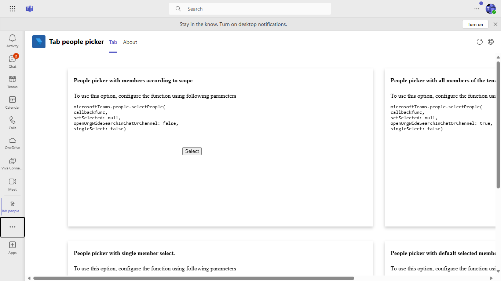
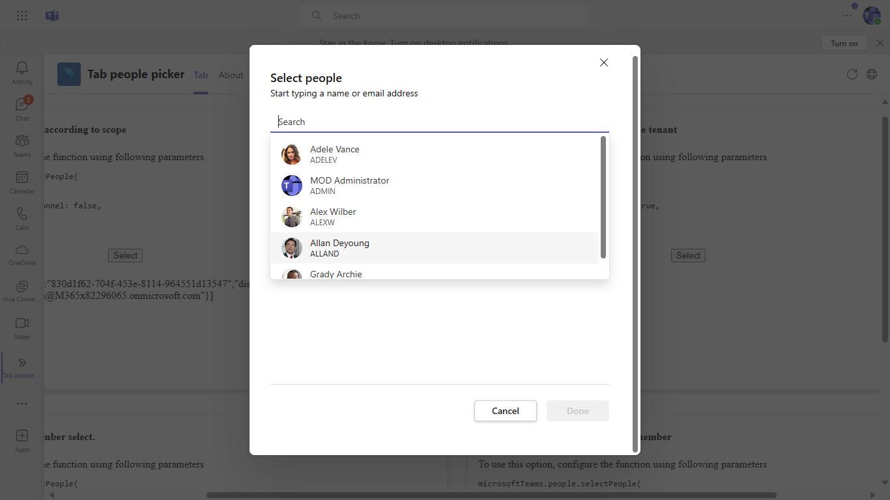

# Tab people picker Node.js

This is an tab app which shows the feature of people picker using teams js client sdk.

 ## Included Features
* Tabs
* People Picker in tabs

## Interaction with app


## Try it yourself - experience the App in your Microsoft Teams client
Please find below demo manifest which is deployed on Microsoft Azure and you can try it yourself by uploading the app package (.zip file link below) to your teams and/or as a personal app. (Sideloading must be enabled for your tenant, [see steps here](https://docs.microsoft.com/microsoftteams/platform/concepts/build-and-test/prepare-your-o365-tenant#enable-custom-teams-apps-and-turn-on-custom-app-uploading)).

**Tab people picker:** [Manifest](/samples/tab-people-picker/csharp/demo-manifest/Tab-People-Picker.zip)

## Prerequisites

 - Office 365 tenant. You can get a free tenant for development use by signing up for the [Office 365 Developer Program](https://developer.microsoft.com/en-us/microsoft-365/dev-program).

- To test locally, [NodeJS](https://nodejs.org/en/download/) must be installed on your development machine (version 16.14.2  or higher).

- [ngrok](https://ngrok.com/) or equivalent tunnelling solution

## Setup

1) Setup NGROK
Run ngrok - point to port 3978

    ```bash
    ngrok http 3978 --host-header="localhost:3978"
    
    ```

2) Setup for code    
- Clone the repository

    ```bash
    git clone https://github.com/OfficeDev/Microsoft-Teams-Samples.git
    ```

- In a terminal, navigate to `samples/tab-people-picker/nodejs`

- Install modules

    ```bash
    npm install
    ```

- Run your bot at the command line:

    ```bash
    npm start
    ```

## Setup Manifest for Teams

- **This step is specific to Teams.**

    -  Edit the `manifest.json` contained in the `Manifest` folder to replace {{Manifest-id}} with any GUID
    - `{{base-url}}` with base Url domain. E.g. if you are using ngrok it would be `https://1234.ngrok-free.app` then your domain-name will be `1234.ngrok-free.app`. Replace *everywhere* you see the place holder string `{{base-url}}`
       Note => Update `validDomains` as per your application domain, if needed.

    -  Zip up the contents of the `Manifest` folder to create a `manifest.zip`
    -  Upload the `manifest.zip` to Teams (in the Apps view click "Upload a custom app")

## Running the sample

**Adding tab people picker UI:**


**Tab UI:**



**All Memberes Of Organisation Search:**



**Scope search:**


**Single Select:**


**Set Selected Search:**


## Further reading

- [Tab Pepole picker](https://learn.microsoft.com/microsoftteams/platform/concepts/device-capabilities/people-picker-capability?tabs=Samplemobileapp%2Cteamsjs-v2)

