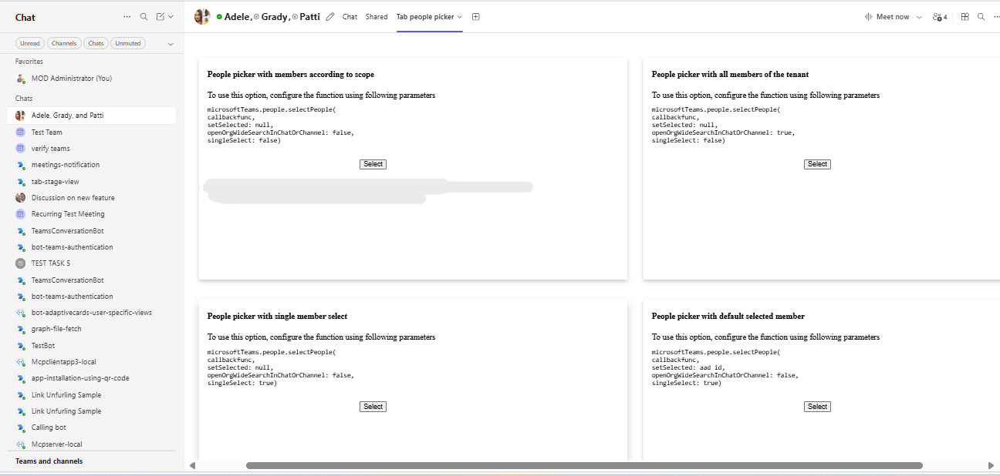

# Tab People Picker - Python

This sample application demonstrates the People Picker feature within a Microsoft Teams tab, utilizing the Teams JavaScript client SDK to facilitate seamless user selection from an organization's member list. With capabilities for both scoped and organization-wide searches, along with intuitive single-select functionality, this app enhances collaboration by simplifying the process of connecting with colleagues in Teams.

## Included Features
* Tabs
* People Picker in tabs

## Interaction with app


*People Picker functionality showcasing various selection modes*


## Try it yourself - experience the App in your Microsoft Teams client
Please find below demo manifest which is deployed on Microsoft Azure and you can try it yourself by uploading the app package (.zip file link below) to your teams and/or as a personal app. (Sideloading must be enabled for your tenant, [see steps here](https://docs.microsoft.com/microsoftteams/platform/concepts/build-and-test/prepare-your-o365-tenant#enable-custom-teams-apps-and-turn-on-custom-app-uploading)).

**Tab people picker:** [Manifest](/samples/tab-people-picker/python/appManifest/appManifest.local.zip)

## Prerequisites

- **Office 365 tenant** - You can get a free tenant for development use by signing up for the [Office 365 Developer Program](https://developer.microsoft.com/en-us/microsoft-365/dev-program).

- **Python 3.7+** - [Python](https://python.org/downloads/) must be installed on your development machine (version 3.7 or higher).

- **Dev tunnel or ngrok** - [dev tunnel](https://learn.microsoft.com/en-us/azure/developer/dev-tunnels/get-started?tabs=windows) or [ngrok](https://ngrok.com/) latest version or equivalent tunneling solution for local development.

- **Microsoft 365 Agents Toolkit for VS Code** - [Microsoft 365 Agents Toolkit for VS Code](https://marketplace.visualstudio.com/items?itemName=TeamsDevApp.ms-teams-vscode-extension) or [TeamsFx CLI](https://learn.microsoft.com/microsoftteams/platform/toolkit/teamsfx-cli?pivots=version-one)

## Run the app (Using Microsoft 365 Agents Toolkit for Visual Studio Code)

The simplest way to run this sample in Teams is to use Microsoft 365 Agents Toolkit for Visual Studio Code.

1. Ensure you have downloaded and installed [Visual Studio Code](https://code.visualstudio.com/docs/setup/setup-overview)
2. Install the [Microsoft 365 Agents Toolkit extension](https://marketplace.visualstudio.com/items?itemName=TeamsDevApp.ms-teams-vscode-extension)
3. Select **File > Open Folder** in VS Code and choose this samples directory from the repo
4. Using the extension, sign in with your Microsoft 365 account where you have permissions to upload custom apps
5. Select **Debug > Start Debugging** or **F5** to run the app in a Teams web client.
6. In the browser that launches, select the **Add** button to install the app to Teams.

> If you do not have permission to upload custom apps (sideloading), Microsoft 365 Agents Toolkit will recommend creating and using a Microsoft 365 Developer Program account - a free program to get your own dev environment sandbox that includes Teams.

## Setup for Local Development

### 1. Setup Tunnel Service

Choose one of the following options to expose your local server:

#### Option A: Using ngrok
```bash
ngrok http 3978 --host-header="localhost:3978"
```

#### Option B: Using dev tunnels
Follow [Create and host a dev tunnel](https://learn.microsoft.com/en-us/azure/developer/dev-tunnels/get-started?tabs=windows) and host the tunnel with anonymous user access:

```bash
devtunnel host -p 3978 --allow-anonymous
```

### 2. App Registration

### Register your application with Azure AD

1. Register a new application in the [Microsoft Entra ID – App Registrations](https://go.microsoft.com/fwlink/?linkid=2083908) portal.
2. Select **New Registration** and on the *register an application page*, set following values:
    * Set **name** to your app name.
    * Choose the **supported account types** (any account type will work)
    * Leave **Redirect URI** empty.
    * Choose **Register**.
3. On the overview page, copy and save the **Application (client) ID, Directory (tenant) ID**. You'll need those later when updating your Teams application manifest and in the appsettings.json.
4. Navigate to **API Permissions**, and make sure to add the follow permissions:
    * Select Add a permission
    * Select Microsoft Graph -> Delegated permissions.
    * `User.Read` (enabled by default)
    * Click on Add permissions. Please make sure to grant the admin consent for the required permissions.

### 3. Setup Code Environment

1. **Clone the repository**
   ```bash
   git clone https://github.com/OfficeDev/Microsoft-Teams-Samples.git
   ```

2. **Navigate to the sample directory**
   ```bash
   cd Microsoft-Teams-Samples/samples/tab-people-picker/python
   ```

3. **Install Python dependencies**
   ```bash
   pip install -r requirements.txt
   ```

4. **Run the Flask application**
   ```bash
   python app.py
   ```

   Your app will be running at `http://localhost:3978`

## Setup Manifest for Teams

**This step is specific to Teams deployment:**

1. **Edit the manifest.json file**
   - Navigate to the `appManifest` folder
   - Edit `manifest.json` and replace:
     - `${{TEAMS_APP_ID}}` with a unique GUID (you can generate one at [GUID Generator](https://www.guidgenerator.com/))
     - `${{BOT_DOMAIN}}` with your tunnel domain
       - For ngrok: `1234.ngrok-free.app` (replace 1234 with your ngrok subdomain)
       - For dev tunnels: `12345.devtunnels.ms` (replace 12345 with your tunnel subdomain)

2. **Update validDomains**
   - Ensure the `validDomains` section includes your tunnel domain

3. **Create app package**
   - Zip up the contents of the `appManifest` folder to create a `manifest.zip`
   - Upload the `manifest.zip` to Teams (in the Apps view, click "Upload a custom app")

## Screenshots

**Tab Installation:**


**Main Tab Interface:**


**Scoped Search Functionality:**


**Single Select Mode:**


**Selected User Display:**


## Further Reading

- [Teams Tab People Picker Capability](https://learn.microsoft.com/microsoftteams/platform/concepts/device-capabilities/people-picker-capability?tabs=Samplemobileapp%2Cteamsjs-v2)


