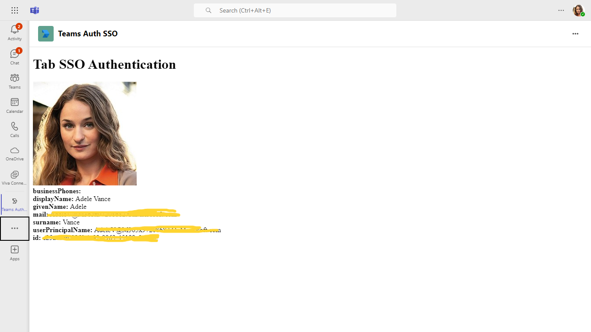

# Teams Tab SSO Authentication

This sample illustrates how to implement SSO authentication for Teams Tab.

## Interaction with app

  
  
 
## Prerequisites

- [.NET Core SDK](https://dotnet.microsoft.com/download) version 3.1

  determine dotnet version
  ```bash
  dotnet --version
  ```
- [Ngrok](https://ngrok.com/download) (For local environment testing) Latest (any other tunneling software can also be used)
  
- [Teams](https://teams.microsoft.com) Microsoft Teams is installed and you have an account
    
## Setup

### Register your Teams Auth SSO with Azure AD

1. Register a new application in the [Azure Active Directory – App Registrations](https://go.microsoft.com/fwlink/?linkid=2083908) portal.
 - Select **New Registration** and on the *register an application page*, set following values:
    * Set **name** to your app name.
    * Choose the **supported account types** (any account type will work)
    * Leave **Redirect URI** empty.
    * Choose **Register**.
 - On the overview page, copy and save the **Application (client) ID, Directory (tenant) ID**. You’ll need those later when updating your Teams application manifest and in the appsettings.json.
 -  Under **Manage**, select **Expose an API**. 
 - Select the **Set** link to generate the Application ID URI in the form of `api://{AppID}`. Insert your fully qualified domain name (with a forward slash "/" appended to the end) between the double forward slashes and the GUID. The entire ID should have the form of: `api://fully-qualified-domain-name/{AppID}`
    * ex: `api://%ngrokDomain%.ngrok.io/00000000-0000-0000-0000-000000000000`.
 - Select the **Add a scope** button. In the panel that opens, enter `access_as_user` as the **Scope name**.
 - Set **Who can consent?** to `Admins and users`
 - Fill in the fields for configuring the admin and user consent prompts with values that are appropriate for the `access_as_user` scope:
    * **Admin consent title:** Teams can access the user’s profile.
    * **Admin consent description**: Allows Teams to call the app’s web APIs as the current user.
    * **User consent title**: Teams can access the user profile and make requests on the user's behalf.
    * **User consent description:** Enable Teams to call this app’s APIs with the same rights as the user.
  - Ensure that **State** is set to **Enabled**
  - Select **Add scope**
    * The domain part of the **Scope name** displayed just below the text field should automatically match the **Application ID** URI set in the previous step, with `/access_as_user` appended to the end:
        * `api://[ngrokDomain].ngrok.io/00000000-0000-0000-0000-000000000000/access_as_user.
  - In the **Authorized client applications** section, identify the applications that you want to authorize for your app’s web application. Each of the following IDs needs to be entered:
    * `1fec8e78-bce4-4aaf-ab1b-5451cc387264` (Teams mobile/desktop application)
    * `5e3ce6c0-2b1f-4285-8d4b-75ee78787346` (Teams web application)
  - Navigate to **API Permissions**, and make sure to add the follow permissions:
    -   Select Add a permission
    -   Select Microsoft Graph -\> Delegated permissions.
    * User.Read (enabled by default)    
    - Click on Add permissions. Please make sure to grant the admin consent for the required permissions.
    - Navigate to **Authentication**
    If an app hasn't been granted IT admin consent, users will have to provide consent the first time they use an app.
    Set a redirect URI:
    * Select **Add a platform**.
    * Select **web**.
    * Enter the **redirect URI** for the app in the following format: `https://%ngrokDomain%.ngrok.io/Auth/End`. This will be the page where a successful implicit grant flow will redirect the user.
    
    Enable implicit grant by checking the following boxes:  
    ✔ ID Token  
    ✔ Access Token  
   - Navigate to the **Certificates & secrets**. In the Client secrets section, click on "+ New client secret". Add a description      (Name of the secret) for the secret and select “Never” for Expires. Click "Add". Once the client secret is created, copy its value, it need to be placed in the appsettings.json.

 2. Setup for Bot

    In Azure portal, create a [Azure Bot resource](https://docs.microsoft.com/en-us/azure/bot-service/bot-service-quickstart-registration).
     - For bot handle, make up a name.
     - Select "Use existing app registration" (Create the app registration in Azure Active Directory beforehand.)
     - __*If you don't have an Azure account*__ create an [Azure free account here](https://azure.microsoft.com/en-us/free/)

    In the new Azure Bot resource in the Portal, 
     - Ensure that you've [enabled the Teams Channel](https://learn.microsoft.com/en-us/azure/bot-service/channel-connect-teams?view=azure-bot-service-4.0)
     - In Settings/Configuration/Messaging endpoint, enter the current `https` URL you were given by running ngrok.

3. Setup NGROK
  - Run ngrok - point to port 3978

   ```bash
   # ngrok http -host-header=rewrite 3978
   ```

4. Setup for code

- Clone the repository

    ```bash
    git clone https://github.com/OfficeDev/Microsoft-Teams-Samples.git
    ```

- Modify the `/appsettings.json` and fill in the following details:
  - `{{YOUR-TENANT-ID}}` - Generated from Step 1 while doing AAd app registration in Azure portal Directory (tenant) ID.
  - `{{YOUR-MICROSOFT-APP-ID}}` - Generated from Step 1 while doing AAd app registration in Azure portal.
  - `{{ YOUR-CLIENT-SECRET}}` - Generated from Step 1, also referred to as Client secret
  - `{{ ApplicationIdURI }}` - Your application's ApplicationIdURI. E.g. api://%ngrokDomain%.ngrok.io/00000000-0000-0000-0000-000000000000.,
  
  - Run app in visual studio.
   - If you are using Visual Studio
  - Launch Visual Studio
  - File -> Open -> Project/Solution
  - Navigate to `samples/tab-personal-sso-quickstart/csharp_dotnetcore` folder
  - Select `PersonalTabSSO.csproj` file

5. Setup Manifest for Teams
- __*This step is specific to Teams.*__
    - **Edit** the `manifest.json` contained in the ./AppPackage folder to replace your Microsoft App Id (that was created when you registered your app registration earlier) *everywhere* you see the place holder string `{{Microsoft-App-Id}}` (depending on the scenario the Microsoft App Id may occur multiple times in the `manifest.json`)
    - **Edit** the `manifest.json` for `validDomains` and replace `{{domain-name}}` with base Url of your domain. E.g. if you are using ngrok it would be `https://1234.ngrok.io` then your domain-name will be `1234.ngrok.io`.
    - **Edit** the `manifest.json` for `webApplicationInfo` resource `"api://<<YOUR-NGROK-DOMAIN>>/<<YOUR-MICROSOFT-APP-ID>>"` with MicrosoftAppId. E.g. `"api://1234.ngrok.io/00000000-0000-0000-0000-000000000000"`.
    - **Zip** up the contents of the `AppPackage` folder to create a `manifest.zip` (Make sure that zip file does not contains any subfolder otherwise you will get error while uploading your .zip package)

- Upload the manifest.zip to Teams (in the Apps view click "Upload a custom app")
   - Go to Microsoft Teams. From the lower left corner, select Apps
   - From the lower left corner, choose Upload a custom App
   - Go to your project directory, the ./AppPackage folder, select the zip folder, and choose Open.
   - Select Add in the pop-up dialog box. Your app is uploaded to Teams.

1) Run your app, either from Visual Studio with `F5` or using `dotnet run` in the appropriate folder.

## Running the sample.

**Install App:**


**Tab SSO Authentication UI:**


## Interacting with the app in Teams

In Teams, Once the app is succefully installed, it can be opened and the tab should show the logged in user's profile.

## Further Reading
[Tab-personal-quickStart](https://learn.microsoft.com/en-us/microsoftteams/platform/tabs/how-to/authentication/tab-sso-overview)
- [Bot Framework Documentation](https://docs.botframework.com)
- [Bot Basics](https://docs.microsoft.com/azure/bot-service/bot-builder-basics?view=azure-bot-service-4.0)
- [Azure Portal](https://portal.azure.com)
- [Add Authentication to Your Bot Via Azure Bot Service](https://docs.microsoft.com/en-us/azure/bot-service/bot-builder-authentication?view=azure-bot-service-4.0&tabs=csharp)
- [Activity processing](https://docs.microsoft.com/en-us/azure/bot-service/bot-builder-concept-activity-processing?view=azure-bot-service-4.0)
- [Azure Bot Service Introduction](https://docs.microsoft.com/azure/bot-service/bot-service-overview-introduction?view=azure-bot-service-4.0)
- [Azure Bot Service Documentation](https://docs.microsoft.com/azure/bot-service/?view=azure-bot-service-4.0)
- [.NET Core CLI tools](https://docs.microsoft.com/en-us/dotnet/core/tools/?tabs=netcore2x)
- [Azure CLI](https://docs.microsoft.com/cli/azure/?view=azure-cli-latest)
- [Azure Portal](https://portal.azure.com)
- [Language Understanding using LUIS](https://docs.microsoft.com/en-us/azure/cognitive-services/luis/)
- [Channels and Bot Connector Service](https://docs.microsoft.com/en-us/azure/bot-service/bot-concepts?view=azure-bot-service-4.0)
- [Microsoft Teams Developer Platform](https://docs.microsoft.com/en-us/microsoftteams/platform/)
