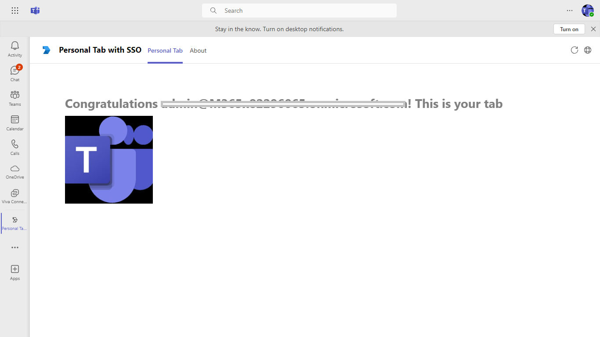

# Teams Tab SSO Authentication

Tabs are Teams-aware webpages embedded in Microsoft Teams. Personal tabs are scoped to a single user. They can be pinned to the left navigation bar for easy access.

 ## Prerequisites

- Microsoft Teams is installed and you have an account (not a guest account)
-  [NodeJS](https://nodejs.org/en/)
-  [ngrok](https://ngrok.com/) or equivalent tunneling solution
-  [M365 developer account](https://docs.microsoft.com/en-us/microsoftteams/platform/concepts/build-and-test/prepare-your-o365-tenant) or access to a Teams account with the appropriate permissions to install an app.

## Setup.
1) Register a new application in the [Azure Active Directory – App Registrations](https://go.microsoft.com/fwlink/?linkid=2083908) portal.

2) Setup for Bot

   In Azure portal, create a [Azure Bot resource](https://docs.microsoft.com/en-us/azure/bot-service/bot-service-quickstart-registration).
    - For bot handle, make up a name.
    - Select "Use existing app registration" (Create the app registration in Azure Active Directory beforehand.)
    - __*If you don't have an Azure account*__ create an [Azure free account here](https://azure.microsoft.com/en-us/free/)
    
   In the new Azure Bot resource in the Portal, 
    - Ensure that you've [enabled the Teams Channel](https://learn.microsoft.com/en-us/azure/bot-service/channel-connect-teams?view=azure-bot-service-4.0)
    - In Settings/Configuration/Messaging endpoint, enter the current `https` URL you were given by running ngrok. Append with the path `/api/messages`

-  [Create an Azure AD App registration to support SSO and the User.Read Graph API](https://aka.ms/teams-toolkit-sso-appreg)

## ngrok

Teams needs to access your tab from a publically accessible URL. If you are running your app in localhost, you will need to use a tunneling service like ngrok.

-  Run ngrok and point it to localhost:
-  `ngrok http https://localhost:3978`

Note: It may be worth purchasing a basic subscription to ngrok so you can get a fixed subdomain ( see the --subdomain ngrok parameter)

**IMPORTANT**: If you don't have a paid subscription to ngrok, you will need to update your Azure AD app registration application ID URI and redirect URL ( See steps 5 and 13 [here](https://docs.microsoft.com/en-us/microsoftteams/platform/tabs/how-to/authentication/auth-aad-sso#steps) ) everytime you restart ngrok.

## Build and Run

In the root directory, execute:

`npm install`

`npm start`

## Deploy to Teams
Start debugging the project by hitting the `F5` key or click the debug icon in Visual Studio Code and click the `Start Debugging` green arrow button.

### NOTE: First time debug step
On the first time running and debugging your app you need allow the localhost certificate.  After starting debugging when Chrome is launched and you have installed your app it will fail to load.

- Open a new tab `in the same browser window that was opened`
- Navigate to `https://localhost:3000/tab`
- Click the `Advanced` button
- Select the `Continue to localhost`
- You may also need to enable popups in the browser to see the auth consent page.

## Running the sample.

### NOTE: Debugging
Ensure you have the Debugger for Chrome/Edge extension installed for Visual Studio Code from the marketplace.

## Further Reading.
[Tab-personal-quickStart](https://learn.microsoft.com/en-us/microsoftteams/platform/tabs/how-to/authentication/tab-sso-overview)

