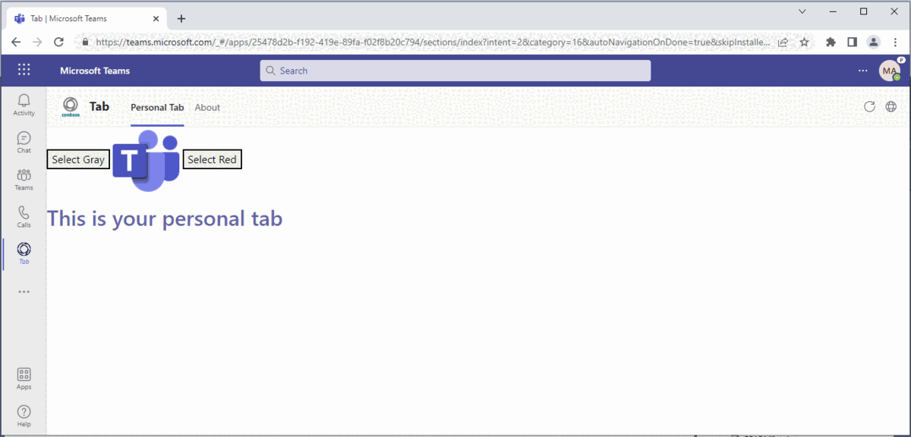
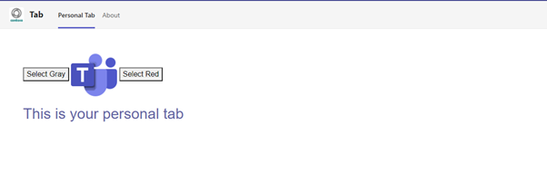
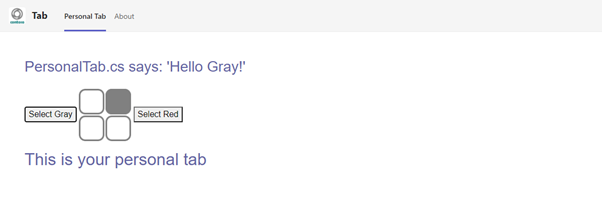
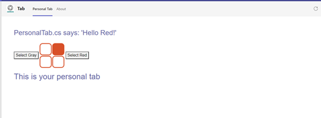
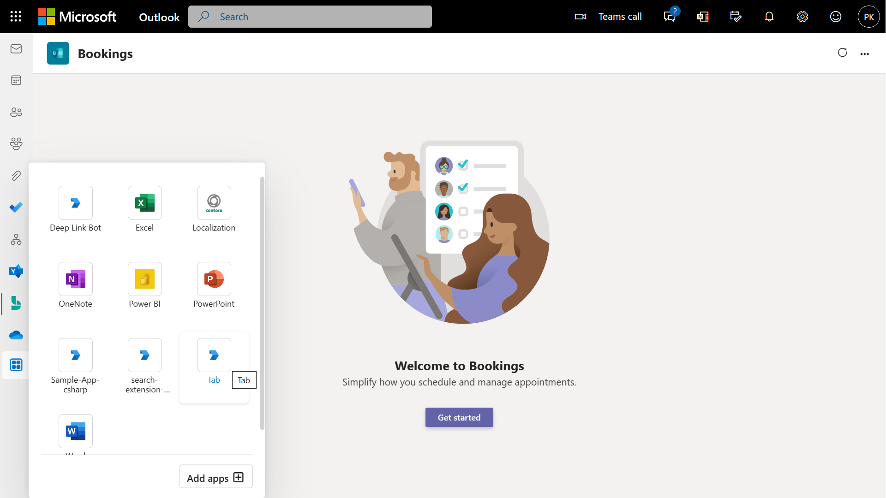
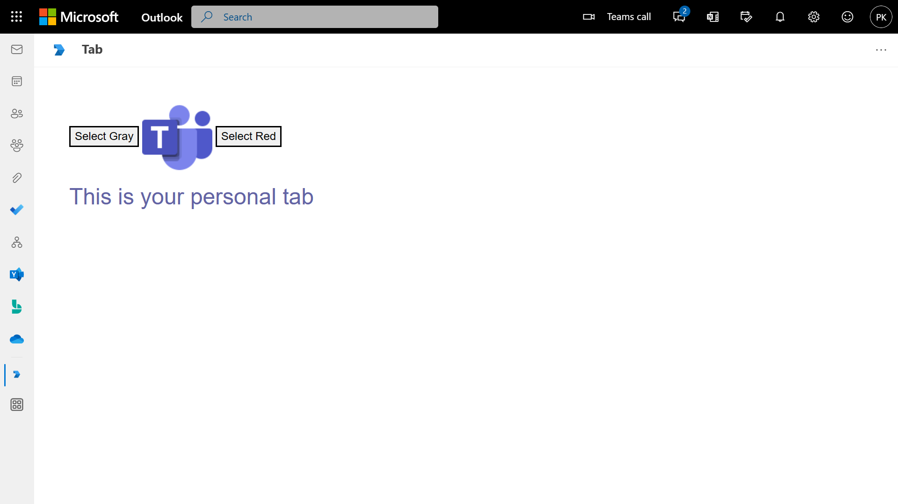
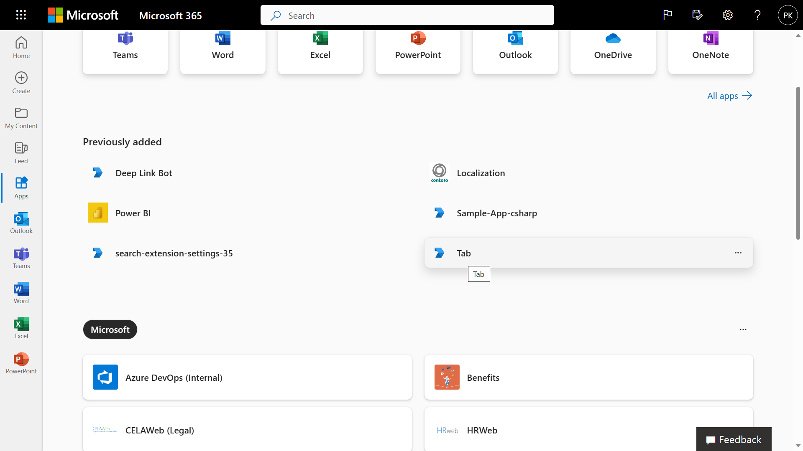
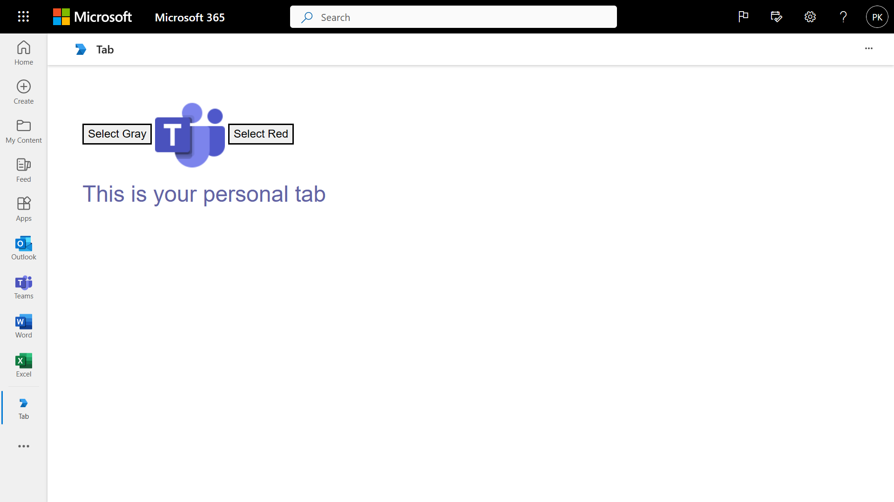

# Personal Tab with ASP. NET Core MVC

In this quickstart we'll walk-through creating a custom personal tab with C# and ASP. Net Core MVC. We'll also use App Studio for Microsoft Teams to finalize your app manifest and deploy your tab to Teams.

 ## Included Features
* Tabs

## Interaction with app



## Try it yourself - experience the App in your Microsoft Teams client
Please find below demo manifest which is deployed on Microsoft Azure and you can try it yourself by uploading the app package (.zip file link below) to your teams and/or as a personal app. (Sideloading must be enabled for your tenant, [see steps here](https://docs.microsoft.com/microsoftteams/platform/concepts/build-and-test/prepare-your-o365-tenant#enable-custom-teams-apps-and-turn-on-custom-app-uploading)).

**Personal Tab:** [Manifest](/samples/tab-personal/mvc-csharp/demo-manifest/tab-personal.zip)

## Prerequisites

- [.NET Core SDK](https://dotnet.microsoft.com/download) version 6.0

  determine dotnet version
  ```bash
  dotnet --version
  ```
- [Ngrok](https://ngrok.com/download) (For local environment testing) Latest (any other tunneling software can also be used)
  
- [Teams](https://teams.microsoft.com) Microsoft Teams is installed and you have an account

## Setup

1. Run ngrok - point to port 3978
   ```ngrok http 3978 --host-header="localhost:3978"```

2. Clone the repository
   ```bash
   git clone https://github.com/OfficeDev/Microsoft-Teams-Samples.git
   ```

3. If you are using Visual Studio
 - Launch Visual Studio
 - File -> Open -> Project/Solution
 - Navigate to ```samples\tab-personal\mvc-csharp``` folder
 - Select ```PersonalTabMVC.sln``` file and open the solution

4. Modify the `manifest.json` in the `/AppManifest` or `/Manifest_Hub` folder and replace the following details:
   - <<Guid>> with any random GUID.
   - `<<Base-url>>` with base Url domain. E.g. if you are using ngrok it would be `https://1234.ngrok-free.app` then your domain-name will be `1234.ngrok-free.app`.
   - `validDomains` with base Url domain. E.g. if you are using ngrok it would be `https://1234.ngrok-free.app` then your domain-name will be `1234.ngrok-free.app`.

5. Upload the manifest.zip to Teams (in the Apps view click "Upload a custom app")
   - Go to Microsoft Teams. From the lower left corner, select Apps
   - From the lower left corner, choose Upload a custom App
   - Go to your project directory, the ./AppManifest or ./Manifest_Hub folder, select the zip folder, and choose Open.

  **Note:** If you want to test your app across multi hub like: Outlook/Office.com, please update the `manifest.json` in the `/Manifest_Hub` folder with the required values.

## Running the sample








## Outlook on the web

- To view your app in Outlook on the web.

- Go to [Outlook on the web](https://outlook.office.com/mail/)and sign in using your dev tenant account.

**On the side bar, select More Apps. Your sideloaded app title appears among your installed apps**



**Select your app icon to launch and preview your app running in Outlook on the web**



**Click on 'Select Gray' button application will perform like below **


**Click on 'Select Red' button application will perform like below **


**Note:** Similarly, you can test your application in the Outlook desktop app as well.

## Office on the web

- To preview your app running in Office on the web.

- Log into office.com with test tenant credentials

**Select the Apps icon on the side bar. Your sideloaded app title appears among your installed apps**



**Select your app icon to launch your app in Office on the web**

 

**Click on 'Select Gray' button application will perform like below **


**Click on 'Select Red' button application will perform like below **


**Note:** Similarly, you can test your application in the Office 365 desktop app as well.

## Fruther Reading
[Tab-personal](https://learn.microsoft.com/en-us/microsoftteams/platform/tabs/what-are-tabs)
[Create a Custom Personal Tab with ASP. NET Core MVC](https://learn.microsoft.com/en-us/microsoftteams/platform/tabs/how-to/create-personal-tab?pivots=mvc-csharp)


[Tab-personal](https://learn.microsoft.com/microsoftteams/platform/tabs/what-are-tabs)
[Create a Custom Personal Tab with ASP. NET Core MVC](https://learn.microsoft.com/microsoftteams/platform/tabs/how-to/create-personal-tab?pivots=mvc-csharp)


