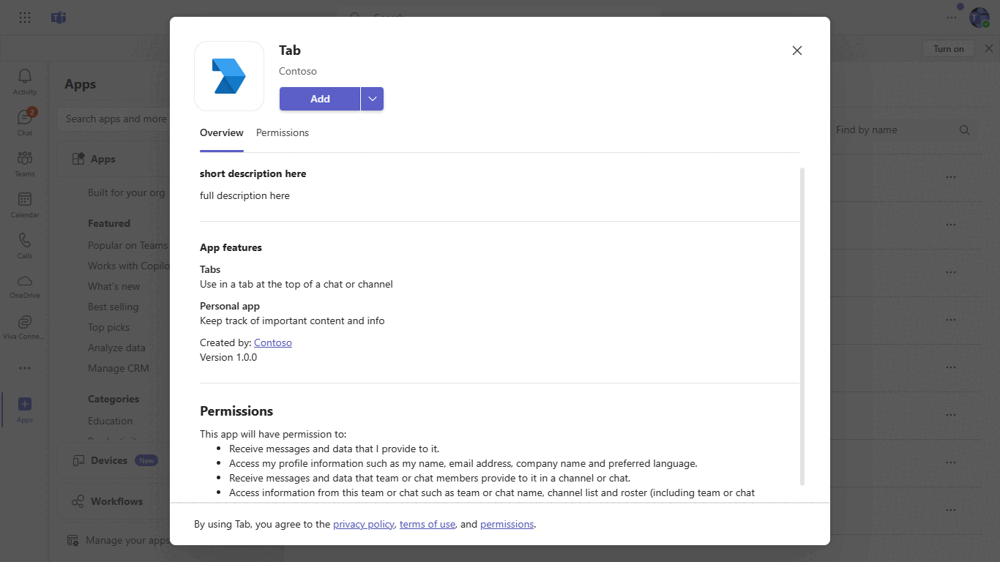

# Personal Tab with ASP. NET Core MVC

In this quickstart we'll walk-through creating a custom personal tab with C# and ASP. Net Core MVC. We'll also use App Studio for Microsoft Teams to finalize your app manifest and deploy your tab to Teams.

## Interaction with app



## Prerequisites

- [.NET Core SDK](https://dotnet.microsoft.com/download) version 3.1

  determine dotnet version
  ```bash
  dotnet --version
  ```
- [Ngrok](https://ngrok.com/download) (For local environment testing) Latest (any other tunneling software can also be used)
  
- [Teams](https://teams.microsoft.com) Microsoft Teams is installed and you have an account

## Setup

For complete instructions on running this sample see:

[Create a Custom Personal Tab with ASP. NET Core MVC](https://learn.microsoft.com/en-us/microsoftteams/platform/tabs/how-to/create-personal-tab?pivots=mvc-csharp)

## Running the sample


## Fruther Reading
[Tab-personal](https://learn.microsoft.com/en-us/microsoftteams/platform/tabs/what-are-tabs)


