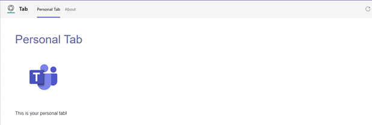

# Personal Tab with ASP.NET Core

In this quickstart we'll walk-through creating a custom personal tab with C# and ASP.Net Core Razor pages. We'll also use App Studio for Microsoft Teams to finalize your app manifest and deploy your tab to Teams.

## Running the sample

For complete instructions on running this sample see:

[Create a Custom Personal Tab with ASP.NET Core](https://docs.microsoft.com/en-us/microsoftteams/platform/tabs/quickstarts/create-personal-tab-dotnet-core)
