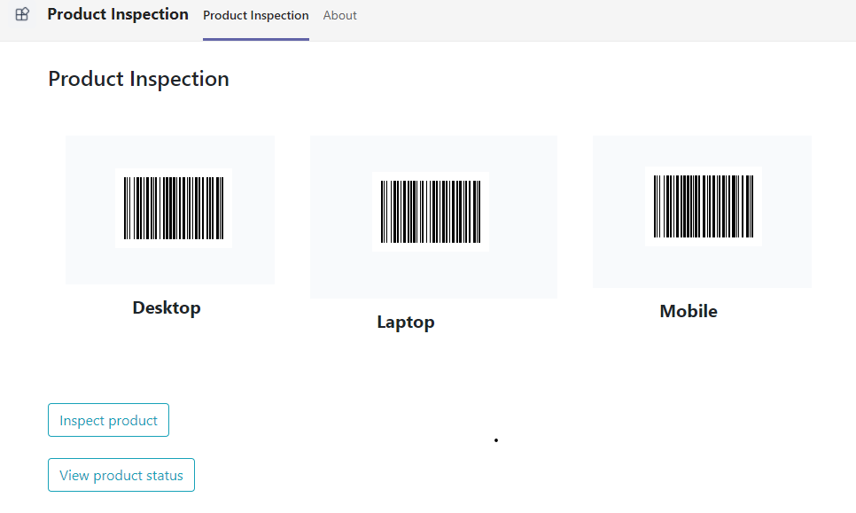

# Product Inspection

This sample app demonstrate a feature where user can scan a product, capture a image and mark it as approved/rejected.


   


   


   

## Prerequisites

- [.NET Core SDK](https://dotnet.microsoft.com/download) version 3.1

  ```bash
  # determine dotnet version
  dotnet --version
  ```

- [ngrok](https://ngrok.com/) or equivalent tunnelling solution

## To try this sample
  
- Clone the repository 
   ```bash
   git clone https://github.com/OfficeDev/microsoft-teams-samples.git
   ```

- Build your solution

  - Launch Visual Studio
  - File -> Open -> Project/Solution
  - Navigate to `samples/tab-product-inspection/csharp/ProductInspection` folder
  - Select `ProductInspection.csproj` file
  - Press `F5` to run the project

- Setup ngrok
  ```bash
  ngrok http -host-header=rewrite 3978
  ```

- Config changes
   - Press F5 to run the project
   - Update the ngrok in manifest
   - Zip all three files present in manifest folder

- [Upload app manifest file](https://docs.microsoft.com/en-us/microsoftteams/platform/concepts/deploy-and-publish/apps-upload#load-your-package-into-teams) (zip file) to your team