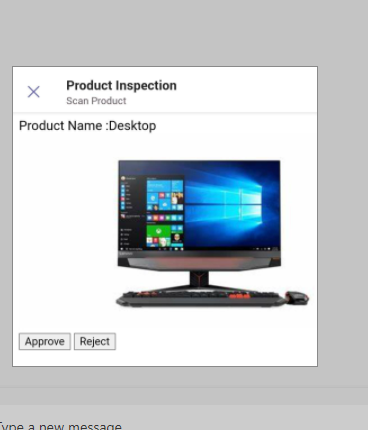
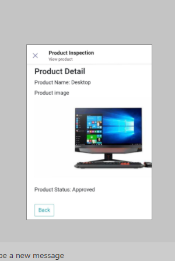

# Product Inspection

This sample app demonstrate a feature where user can scan a product, capture a image and mark it as approved/rejected.

   

   

   

## Prerequisites

- [NodeJS](https://nodejs.org/en/)
- [ngrok](https://ngrok.com/) or equivalent tunnelling solution

## To try this sample

1) Clone the repository

    ```bash
    git clone https://github.com/OfficeDev/Microsoft-Teams-Samples.git
    ```

1) In a terminal, navigate to `samples/tab-product-inspection/nodejs`

1) Install modules

    ```bash
    npm install
    ```

1) Run ngrok - point to port 3978

    ```bash
    ngrok http -host-header=rewrite 3978
    ```

1) Run your bot at the command line:

    ```bash
    npm start
    ```

1) __*This step is specific to Teams.*__
    - **Edit** the `manifest.json` contained in the  `Manifest` folder to replace your Microsoft App Id (that was created when you registered your bot earlier) *everywhere* you see the place holder string `<<Manifest-id>>` (depending on the scenario the Microsoft App Id may occur multiple times in the `manifest.json`)and ngrok url *everywhere* you see the place holder string `<<base-url>>`
    - **Zip** up the contents of the `Manifest` folder to create a `manifest.zip`
    - **Upload** the `manifest.zip` to Teams (in the Apps view click "Upload a custom app")
