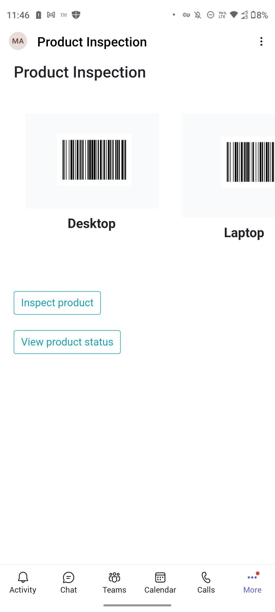
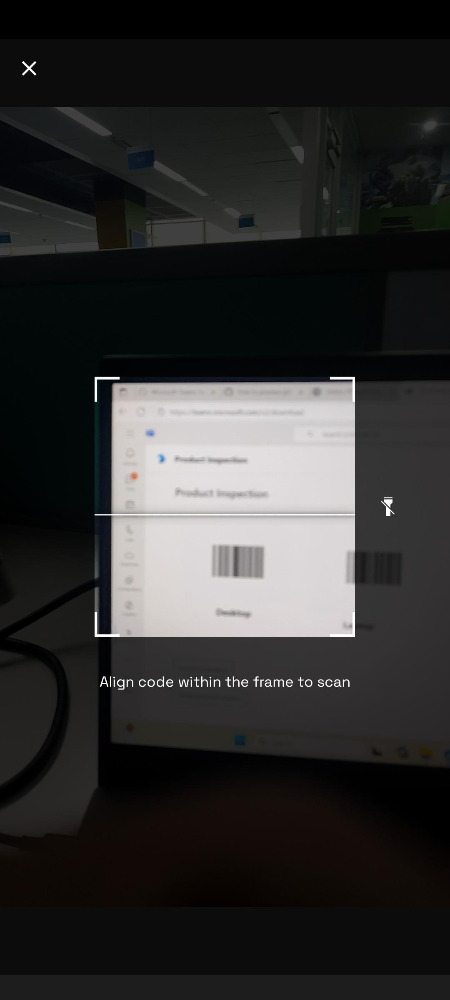
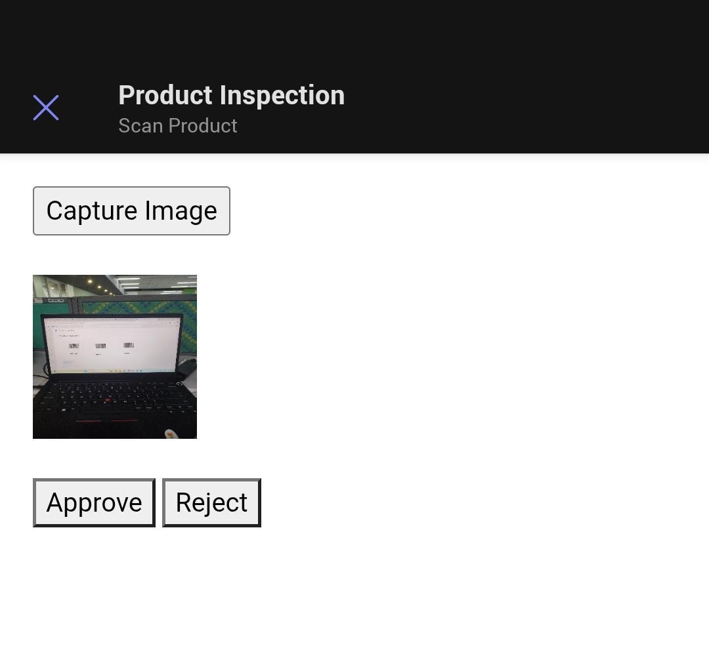
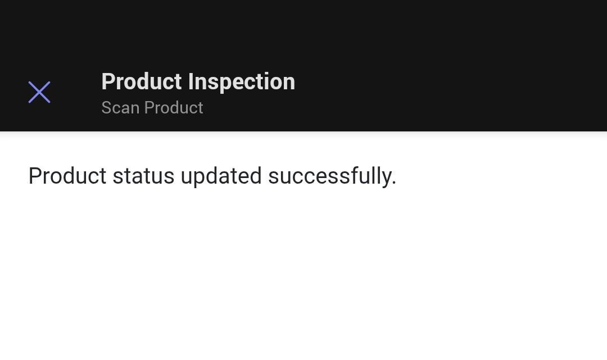
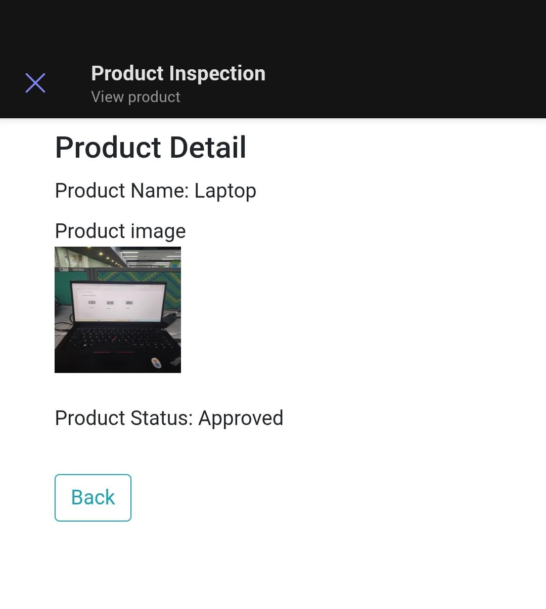

# Tab Product Inspection (Python)

This sample application provides a streamlined product inspection process in Microsoft Teams, allowing users to scan barcodes, capture images, and easily mark products as approved or rejected. With essential features like media device permissions and interactive tabs, it enhances productivity and collaboration in product management.

## Included Features
* Tabs
* Device Permissions (media)
* Barcode Scanning
* Image Capture

## Prerequisites

- Microsoft Teams is installed and you have an account (not a guest account)
- [Python](https://www.python.org/downloads/) version 3.6 or higher
- [dev tunnel](https://learn.microsoft.com/en-us/azure/developer/dev-tunnels/get-started?tabs=windows) or [ngrok](https://ngrok.com/) latest version or equivalent tunneling solution
- [M365 developer account](https://docs.microsoft.com/microsoftteams/platform/concepts/build-and-test/prepare-your-o365-tenant) or access to a Teams account with the required permissions
- [Microsoft 365 Agents Toolkit for VS Code](https://marketplace.visualstudio.com/items?itemName=TeamsDevApp.ms-teams-vscode-extension) or [TeamsFx CLI](https://learn.microsoft.com/microsoftteams/platform/toolkit/teamsfx-cli?pivots=version-one)

## Run the app (Using Microsoft 365 Agents Toolkit for Visual Studio Code)

The simplest way to run this sample in Teams is to use Microsoft 365 Agents Toolkit for Visual Studio Code.

1. Ensure you have downloaded and installed [Visual Studio Code](https://code.visualstudio.com/docs/setup/setup-overview)
2. Install the [Microsoft 365 Agents Toolkit extension](https://marketplace.visualstudio.com/items?itemName=TeamsDevApp.ms-teams-vscode-extension) and [Python Extension](https://marketplace.visualstudio.com/items?itemName=ms-python.python)
3. Select **File > Open Folder** in VS Code and choose this sample's directory from the repo
4. Press **CTRL+Shift+P** to open the command box and enter **Python: Create Environment** to create and activate your desired virtual environment. Select `requirements.txt` as dependencies to install.
5. Using the extension, sign in with your Microsoft 365 account where you have permissions to upload custom apps
6. Select **Debug > Start Debugging** or **F5** to run the app in a Teams web client.
7. In the browser that launches, select the **Add** button to install the app to Teams.

> If you do not have permission to upload custom apps (sideloading), Microsoft 365 Agents Toolkit will recommend creating and using a Microsoft 365 Developer Program account - a free program to get your own dev environment sandbox that includes Teams.

## Run the app (Manual Setup)

1. Clone the repository

    ```bash
    git clone https://github.com/OfficeDev/Microsoft-Teams-Samples.git
    ```

2. Run ngrok or dev tunnel - point to port 3978

    ```bash
    ngrok http 3978 --host-header="localhost:3978"
    ```

    Or using dev tunnels:

    ```bash
    devtunnel host -p 3978 --allow-anonymous
    ```

3. App Registration

### Register your application with Azure AD

1. Register a new application in the [Microsoft Entra ID – App Registrations](https://go.microsoft.com/fwlink/?linkid=2083908) portal.
2. Select **New Registration** and on the *register an application page*, set following values:
    * Set **name** to your app name.
    * Choose the **supported account types** (any account type will work)
    * Leave **Redirect URI** empty.
    * Choose **Register**.
3. On the overview page, copy and save the **Application (client) ID, Directory (tenant) ID**. You'll need those later when updating your Teams application manifest and in the appsettings.json.
4. Navigate to **API Permissions**, and make sure to add the follow permissions:
    * Select Add a permission
    * Select Microsoft Graph -> Delegated permissions.
    * `User.Read` (enabled by default)
    * Click on Add permissions. Please make sure to grant the admin consent for the required permissions.

4. In a terminal, navigate to `samples/tab-product-inspection/python`

5. Activate your desired virtual environment

6. Install dependencies

    ```bash
    pip install -r requirements.txt
    ```

7. Update your configuration (e.g., `config.py` or `.env`) with your Microsoft App Id and App Password.

8. Update the manifest:

    - Edit the `manifest.json` in the `appManifest` folder to replace your Microsoft App Id everywhere you see the placeholder string (e.g., `{{Microsoft-App-Id}}`).
    - Edit the `manifest.json` for `validDomains` and replace `{{domain-name}}` with the base URL of your domain (e.g., `1234.ngrok-free.app` or `12345.devtunnels.ms`).
    - Zip the contents of the `appManifest` folder to create a `manifest.zip` (ensure the zip file does not contain any subfolders).

9. Upload the manifest.zip to Teams:

    - Go to Microsoft Teams. From the lower left corner, select Apps
    - Choose "Upload a custom App"
    - Select the zipped manifest and upload

10. Run your app:

    ```bash
    python app.py
    ```

## Running the sample

Interact with Product Inspection by clicking on the App icon.

1. Once the app is clicked, Product Inspection appears with the default product list.

   
   
2. Click "Inspect product" to open the scanner. 

    

3. Scan the product barcode and approve or reject the product.
    
    

    

4. Click "View product status" to scan a product barcode and view its details.

   

## Outlook and Office on the web

- You can also test your app in [Outlook on the web](https://outlook.office.com/mail/) and [Office.com](https://www.office.com/).
- Sideload the app as described above, then select your app icon from the sidebar to launch and preview your app.

## Further Reading

- [Product inspection](https://learn.microsoft.com/power-apps/teams/inspection)
- [Extend Teams apps across Microsoft 365](https://learn.microsoft.com/microsoftteams/platform/m365-apps/overview)
- [Teams tabs](https://learn.microsoft.com/microsoftteams/platform/tabs/what-are-tabs)
- [Integrate media Capabilities inside your app](https://learn.microsoft.com/microsoftteams/platform/concepts/device-capabilities/media-capabilities?tabs=mobile)

