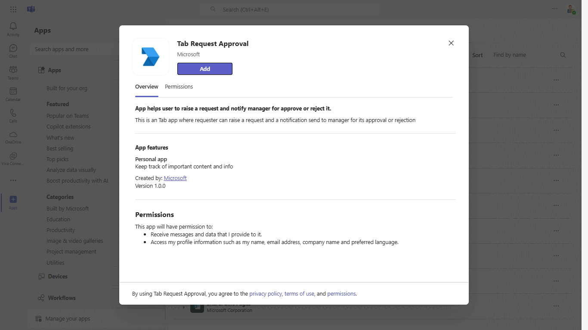
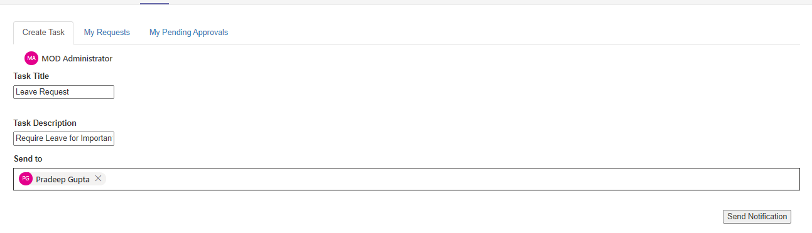
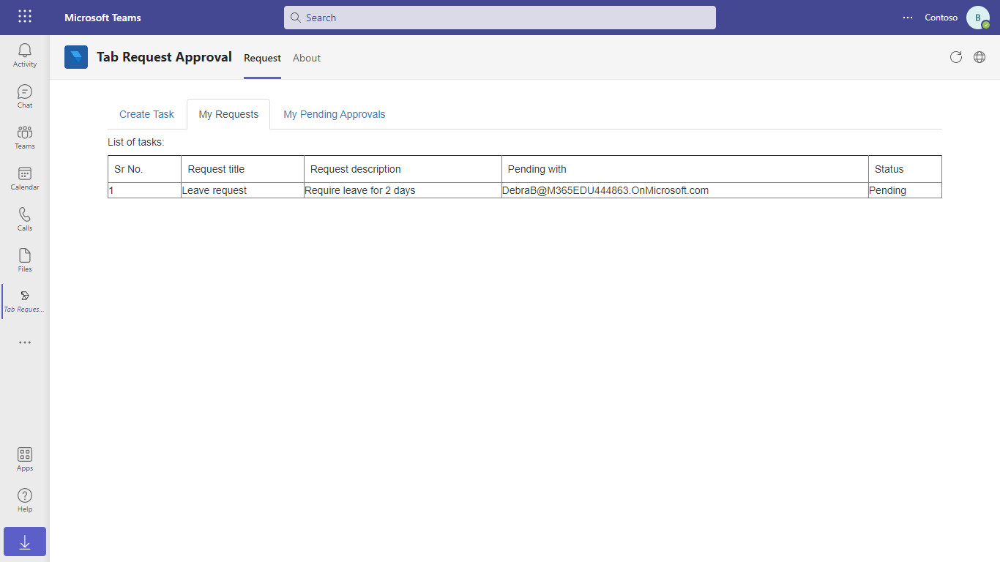
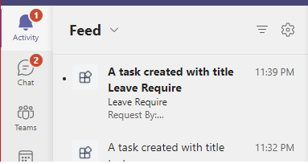
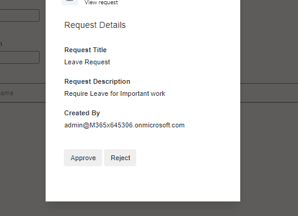

# Send task approvals using activity feed notification (Graph APIs)

This sample shows a feature where:
1. Requester : Can request for any task approval from manager by sending activity feed notification and can see his request status.
2. Manager : Can see the pending approval request raised by user on the click of activity feed notification and can approve or reject the request.

## Included Features
* Teams SSO (tabs)
* Activity Feed Notifications
* Graph API

## Interaction with app



## Try it yourself - experience the App in your Microsoft Teams client
Please find below demo manifest which is deployed on Microsoft Azure and you can try it yourself by uploading the app package (.zip file link below) to your teams and/or as a personal app. (Sideloading must be enabled for your tenant, [see steps here](https://docs.microsoft.com/microsoftteams/platform/concepts/build-and-test/prepare-your-o365-tenant#enable-custom-teams-apps-and-turn-on-custom-app-uploading)).

**Send task approvals using activity feed notification:** [Manifest](/samples/tab-request-approval/csharp/demo-manifest/Tab-Request-Approval.zip)

## Prerequisites

- [.NET Core SDK](https://dotnet.microsoft.com/download) version 6.0

  determine dotnet version
  ```bash
  dotnet --version
  ```

- [Ngrok](https://ngrok.com/download) (For local environment testing) Latest (any other tunneling software can also be used)
  
  run ngrok locally
  ```bash
  ngrok http 3978 --host-header="localhost:3978"
  ```

- [Teams](https://teams.microsoft.com) Microsoft Teams is installed and you have an account

## Setup

### Register your Teams Auth SSO with Azure AD

1. Register a new application in the [Azure Active Directory – App Registrations](https://go.microsoft.com/fwlink/?linkid=2083908) portal.
2. Select **New Registration** and on the *register an application page*, set following values:
    * Set **name** to your app name.
    * Choose the **supported account types** (any account type will work)
    * Leave **Redirect URI** empty.
    * Choose **Register**.
3. On the overview page, copy and save the **Application (client) ID, Directory (tenant) ID**. You’ll need those later when updating your Teams application manifest and in the appsettings.json.
4. Under **Manage**, select **Expose an API**. 
5. Select the **Set** link to generate the Application ID URI in the form of `api://{AppID}`. Insert your fully qualified domain name (with a forward slash "/" appended to the end) between the double forward slashes and the GUID. The entire ID should have the form of: `api://fully-qualified-domain-name/{AppID}`
    * ex: `api://%ngrokDomain%.ngrok-free.app/00000000-0000-0000-0000-000000000000`.
6. Select the **Add a scope** button. In the panel that opens, enter `access_as_user` as the **Scope name**.
7. Set **Who can consent?** to `Admins and users`
8. Fill in the fields for configuring the admin and user consent prompts with values that are appropriate for the `access_as_user` scope:
    * **Admin consent title:** Teams can access the user’s profile.
    * **Admin consent description**: Allows Teams to call the app’s web APIs as the current user.
    * **User consent title**: Teams can access the user profile and make requests on the user's behalf.
    * **User consent description:** Enable Teams to call this app’s APIs with the same rights as the user.
9. Ensure that **State** is set to **Enabled**

10. Select **Add scope**
    * The domain part of the **Scope name** displayed just below the text field should automatically match the **Application ID** URI set in the previous step, with `/access_as_user` appended to the end:
        * `api://[ngrokDomain].ngrok-free.app/00000000-0000-0000-0000-000000000000/access_as_user.

11. In the **Authorized client applications** section, identify the applications that you want to authorize for your app’s web application. Each of the following IDs needs to be entered:
    * `1fec8e78-bce4-4aaf-ab1b-5451cc387264` (Teams mobile/desktop application)
    * `5e3ce6c0-2b1f-4285-8d4b-75ee78787346` (Teams web application)

12. Navigate to **API Permissions**, and make sure to add the follow permissions:
-   Select Add a permission
-   Select Microsoft Graph -\> Delegated permissions.
    - `User.Read` (enabled by default)
    - `Directory.Read.All`
    - `Directory.ReadWrite.All`
    - `ChatMessage.Send`
    - `Chat.ReadWrite`
    - `TeamsActivity.Send`
    - `TeamsAppInstallation.ReadWriteForUser`
    - `TeamsAppInstallation.ReadWriteSelfForUser`
    - `TeamsAppInstallation.ReadForUser`.

-   Select Microsoft Graph -\> Application permissions.
    - `TeamsActivity.Send`
    - `Directory.Read.All`
    - `TeamsAppInstallation.ReadWriteForUser.All`
    - `TeamsAppInstallation.ReadWriteSelfForUser.All`
    - `TeamsAppInstallation.ReadForUser.All`.

-   Click on Add permissions. Please make sure to grant the admin consent for the required permissions.
13. Navigate to **Authentication**
    If an app hasn't been granted IT admin consent, users will have to provide consent the first time they use an app.
    Set a redirect URI:
    * Select **Add a platform**.
    * Select **web**.
    * Enter the **redirect URI** for the app in the following format: `https://{Base_Url}/Auth/End`, `https://{Base_Url}/Auth/Start`. This will be the page where a successful implicit grant flow will redirect the user.
	Again
	* Select **Single page application**.
	* Enter the **redirect URI** for the app in the following format: `https://{Base_Url}/TabAuth`
    Enable implicit grant by checking the following boxes:  
    ✔ ID Token
    ✔ Access Token
14.  Navigate to the **Certificates & secrets**. In the Client secrets section, click on "+ New client secret". Add a description(Name of the secret) for the secret and select “Never” for Expires. Click "Add". Once the client secret is created, copy its value, it need to be placed in the appsettings.json.

16. Clone the repository
   ```bash
   git clone https://github.com/OfficeDev/Microsoft-Teams-Samples.git
   ```
17. Open the code in Visual Studio
   - File -> Open -> Project/Solution
   - Navigate to folder where repository is cloned then `samples/tab-request-approval/csharp/TabRequestApproval.sln`
    
18. Run ngrok - point to port 3978

    ```bash
    # ngrok http 3978 --host-header="localhost:3978"
    ```
 
19. Setup and run the bot from Visual Studio: 
   Modify the `appsettings.json` and fill in the following details:
   - `MicrosoftAppId` - Generated from Step 3 (Application (client) ID)is the application app id
   - `TenantId` - Generated from Step 3(Directory (tenant) ID) is the tenant id
   - `MicrosoftAppPassword` - Generated from Step 14, also referred to as Client secret
   - `{Base_URL}` - Your application's base url. E.g. https://12345.ngrok-free.app if you are using ngrok.
   - Press `F5` to run the project
	 
20. Modify the `manifest.json` in the `/AppPackage` folder and replace the following details:
   - `{{Microsoft-App-Id}}` with Application id generated from Step 3
   - `{Base_URL}` - Your application's base url. E.g. https://12345.ngrok-free.app if you are using ngrok.
   - `{{domain-name}}` with base Url domain. E.g. if you are using ngrok it would be `https://1234.ngrok-free.app` then your domain-name will be `1234.ngrok-free.app`.

21. Zip the contents of `AppPackage` folder into a `manifest.zip`, and use the `manifest.zip` to deploy in app store or add to Teams using step 19.

22. Upload the manifest.zip to Teams (in the Apps view click "Upload a custom app")
   - Go to Microsoft Teams and then go to side panel, select Apps
   - Choose Upload a custom App
   - Go to your project directory, the ./AppPackage folder, select the zip folder, and choose Open.
   - Select Add in the pop-up dialog box. Your app is uploaded to Teams.    

**Note:** App should be installed for user's manager also to get task approval notification.

**Note**: If you are facing any issue in your app, please uncomment [this](https://github.com/OfficeDev/Microsoft-Teams-Samples/blob/main/samples/tab-request-approval/csharp/TabRequestApproval/AdapterWithErrorHandler.cs#L26) line and put your debugger for local debug.

## Running the sample

User Persona:

- Send request to the manger for task approval.



- Request status



Manager Persona:

- Activity feed notification of approval request.



- Pending task approval request.




## Further reading

- [Create Personal Tabs](https://learn.microsoft.com/en-us/microsoftteams/platform/tabs/how-to/create-personal-tab?pivots=mvc-csharp)
- [Send Notification to User in Chat](https://docs.microsoft.com/graph/api/chat-sendactivitynotification?view=graph-rest-beta)
- [Send Notification to User in Team](https://docs.microsoft.com/graph/api/team-sendactivitynotification?view=graph-rest-beta&tabs=http)
- [Send Notification to User](https://docs.microsoft.com/graph/api/userteamwork-sendactivitynotification?view=graph-rest-beta&tabs=http)


