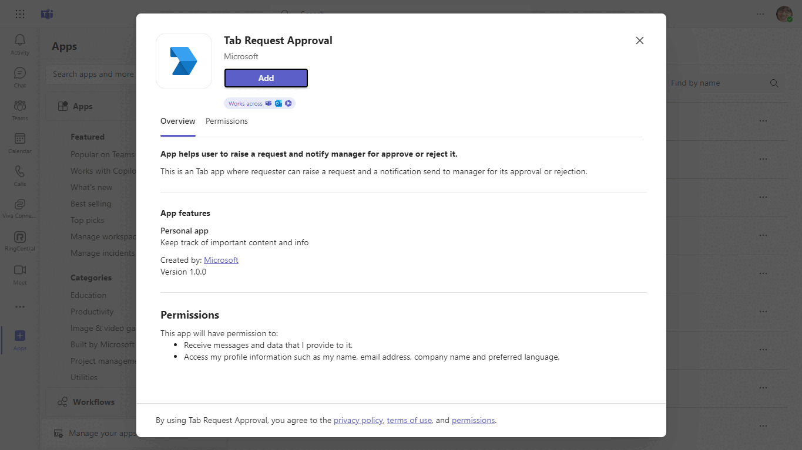

# Send task approval request using activity feed notification (Graph APIs).

This sample has been created using [Microsoft Graph](https://docs.microsoft.com/graph/overview?view=graph-rest-beta), it shows how to trigger a Activity feed notification from your Tab, it triggers the feed notification for User, Chat and Team scope and send back to conversation.

## Included Features
* Teams SSO (tabs)
* Activity Feed Notifications
* Graph API

- **Interaction with app**


## Try it yourself - experience the App in your Microsoft Teams client
Please find below demo manifest which is deployed on Microsoft Azure and you can try it yourself by uploading the app package (.zip file link below) to your teams and/or as a personal app. (Sideloading must be enabled for your tenant, [see steps here](https://docs.microsoft.com/microsoftteams/platform/concepts/build-and-test/prepare-your-o365-tenant#enable-custom-teams-apps-and-turn-on-custom-app-uploading)).

**Send task approvals using activity feed notification:** [Manifest](/samples/tab-request-approval/csharp/demo-manifest/Tab-Request-Approval.zip)

## Prerequisites

- Microsoft Teams is installed and you have an account (not a guest account)
- [NodeJS](https://nodejs.org/en/)
- [ngrok](https://ngrok.com/) or equivalent tunnelling solution
- [M365 developer account](https://docs.microsoft.com/microsoftteams/platform/concepts/build-and-test/prepare-your-o365-tenant) or access to a Teams account with the appropriate permissions to install an app.

### Register your Teams Auth SSO with Azure AD

1. Register a new application in the [Azure Active Directory – App Registrations](https://go.microsoft.com/fwlink/?linkid=2083908) portal.
2. Select **New Registration** and on the *register an application page*, set following values:
    * Set **name** to your app name.
    * Choose the **supported account types** (any account type will work)
    * Leave **Redirect URI** empty.
    * Choose **Register**.
3. On the overview page, copy and save the **Application (client) ID, Directory (tenant) ID**. You’ll need those later when updating your Teams application manifest and in the appsettings.json.
4. Under **Manage**, select **Expose an API**. 
5. Select the **Set** link to generate the Application ID URI in the form of `api://fully-qualified-domain-name/{AppID}`. Insert your fully qualified domain name (with a forward slash "/" appended to the end) between the double forward slashes and the GUID. The entire ID should have the form of: `api://fully-qualified-domain-name/{AppID}`
    * ex: `api://%ngrokDomain%.ngrok-free.app/00000000-0000-0000-0000-000000000000`.
6. Select the **Add a scope** button. In the panel that opens, enter `access_as_user` as the **Scope name**.
7. Set **Who can consent?** to `Admins and users`
8. Fill in the fields for configuring the admin and user consent prompts with values that are appropriate for the `access_as_user` scope:
    * **Admin consent title:** Teams can access the user’s profile.
    * **Admin consent description**: Allows Teams to call the app’s web APIs as the current user.
    * **User consent title**: Teams can access the user profile and make requests on the user's behalf.
    * **User consent description:** Enable Teams to call this app’s APIs with the same rights as the user.
9. Ensure that **State** is set to **Enabled**
10. Select **Add scope**
    * The domain part of the **Scope name** displayed just below the text field should automatically match the **Application ID** URI set in the previous step, with `/access_as_user` appended to the end:
        * `api://[ngrokDomain].ngrok-free.app/00000000-0000-0000-0000-000000000000/access_as_user.
11. In the **Authorized client applications** section, identify the applications that you want to authorize for your app’s web application. Each of the following IDs needs to be entered:
    * `1fec8e78-bce4-4aaf-ab1b-5451cc387264` (Teams mobile/desktop application)
    * `5e3ce6c0-2b1f-4285-8d4b-75ee78787346` (Teams web application)
12. Navigate to **API Permissions**, and make sure to add the follow permissions:
-   Select Microsoft Graph -\> Delegated permissions.
    - `User.Read` (enabled by default)
    - `Directory.Read.All`
    - `Directory.ReadWrite.All`
    - `ChatMessage.Send`
    - `Chat.ReadWrite`
    - `TeamsActivity.Send`
    - `TeamsAppInstallation.ReadWriteForUser`
    - `TeamsAppInstallation.ReadWriteSelfForUser`
    - `TeamsAppInstallation.ReadForUser`.

-   Select Microsoft Graph -\> Application permissions.
    - `TeamsActivity.Send`
    - `Directory.Read.All`
    - `TeamsAppInstallation.ReadWriteForUser.All`
    - `TeamsAppInstallation.ReadWriteSelfForUser.All`
    - `TeamsAppInstallation.ReadForUser.All`.

-   Click on Add permissions. Please make sure to grant the admin consent for the required permissions.
13. Navigate to **Authentication**
    If an app hasn't been granted IT admin consent, users will have to provide consent the first time they use an app.
    Set a redirect URI:
    * Select **Add a platform**.
    * Select **web**.
    * Enter the **redirect URI** for the app in the following format: `https://{Base_Url}/auth-end`, `https://{Base_Url}/auth-start`. This will be the page where a successful implicit grant flow will redirect the user. Eg for ngrok url `https://1234.ngrok-free.app` the `Base_Url` will be `1234.ngrok-free.app`
    Again
	* Select **Single page application**.
	* Enter the **redirect URI** for the app in the following format: `https://{Base_Url}/tabAuth`
	
    Enable implicit grant by checking the following boxes:  
    ✔ ID Token  
    ✔ Access Token  
14.  Navigate to the **Certificates & secrets**. In the Client secrets section, click on "+ New client secret". Add a description(Name of the secret) for the secret and select “Never” for Expires. Click "Add". Once the client secret is created, copy its value, it need to be placed in the .env file.

### 2. Setup NGROK
1) Run ngrok - point to port 3978

```bash
# ngrok http 3978 --host-header="localhost:3978"
```

### 3. Setup for code
1) Clone the repository

    ```bash
    git clone https://github.com/OfficeDev/Microsoft-Teams-Samples.git
    ```

2) In the folder where repository is cloned navigate to `samples/tab-request-approval/nodejs`

3) Install node modules

   Inside node js folder, open your local terminal and run the below command to install node modules. You can do the same in Visual studio code terminal by opening the project in Visual studio code 

    ```bash
    npm install
    ```

4) Open the `.env` configuration file in your project folder (or in Visual Studio Code) and update the `ClientId` and `ClientSecret`, `TenantId` with your tenant id. For e.g., your ngrok url. (Note the ClientId is the AppId created in step 1 (Setup for Bot), the ClientSecret is referred to as the "client secret" in step 1 (Setup for Bot) and you can always create a new client secret anytime.)

5) Run your app

    ```bash
    npm start
    ```

### 4. Setup Manifest for Teams
1) __*This step is specific to Teams.*__
    - **Edit** the `manifest.json` contained in the  `appPackage` folder to replace your Microsoft App Id (that was created when you registered your app earlier) *everywhere* you see the place holder string `<<YOUR-MICROSOFT-APP-ID>>` (depending on the scenario the Microsoft App Id may occur multiple times in the `manifest.json`)
    - **Edit** the `manifest.json` for `staticTab` inside `contenrUrl` . Replace `<<BASE-URL-DOMAIN>>` with base Url domain. E.g. if you are using ngrok it would be `https://1234.ngrok-free.app` then your base url domain will be `1234.ngrok-free.app`. Replace the same value for `<<BASE-URL-DOMAIN>>` inside `validDomains` section.
    - **Zip** up the contents of the `appPackage` folder to create a `manifest.zip` (Make sure that zip file does not contains any subfolder otherwise you will get error while uploading your .zip package)
    - **Upload** the `manifest.zip` to Teams (In Teams Apps/Manage your apps click "Upload an app". Browse to and Open the .zip file. At the next dialog, click the Add button.)
    - Add the app to personal/team/groupChat scope (Supported scopes)

**Note:** App should be installed for user's manager also to get task approval notification.

**Note**: If you are facing any issue in your app, please uncomment [this](https://github.com/OfficeDev/Microsoft-Teams-Samples/blob/main/samples/msteams-application-resourcehub/Source/microsoft-teams-apps-selfhelp/Bot/AdapterWithErrorHandler.cs#L26) line and put your debugger for local debug.

## Running the sample

This sample shows a feature where:
1. Requester : Can request for any task approval from manager by sending activity feed notification and can see his request status.
2. Manager : Can see the pending approval request raised by user on the click of activity feed notification and can approve or reject the request.

User Persona:

- Send request to the manger for task approval.

  

  

Manager Persona:

- Activity feed notification of approval request.

  

- On click of notification a task module will open, redirecting the user to the request.

  

## Further reading

- [Create Personal Tabs](https://learn.microsoft.com/en-us/microsoftteams/platform/tabs/how-to/create-personal-tab?pivots=node-java-script)
- [Send Notification to User in Chat](https://docs.microsoft.com/graph/api/chat-sendactivitynotification?view=graph-rest-beta)
- [Send Notification to User in Team](https://docs.microsoft.com/graph/api/team-sendactivitynotification?view=graph-rest-beta&tabs=http)
- [Send Notification to User](https://docs.microsoft.com/graph/api/userteamwork-sendactivitynotification?view=graph-rest-beta&tabs=http)


