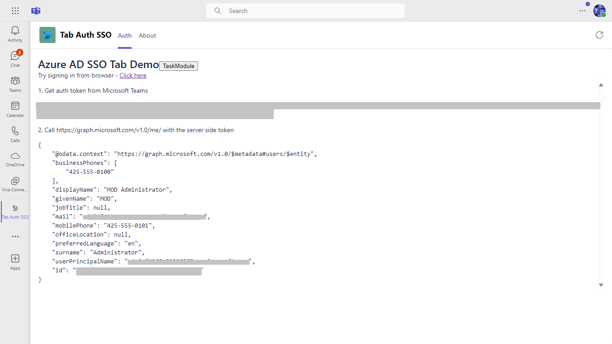
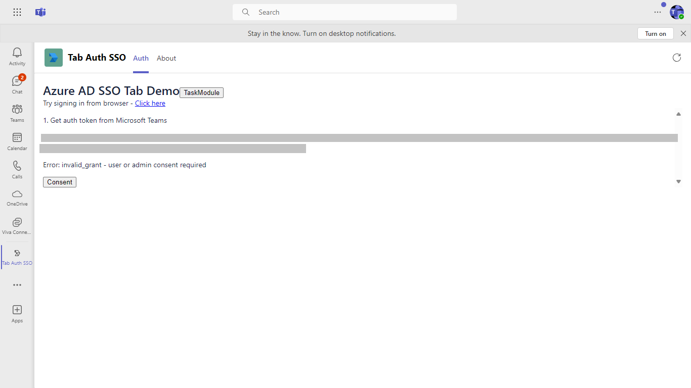
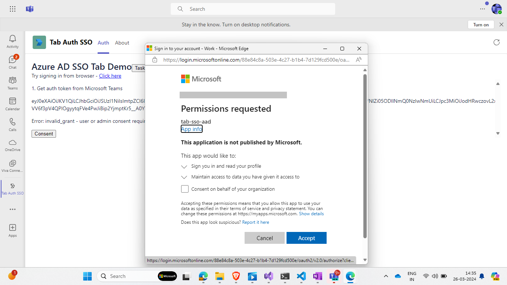
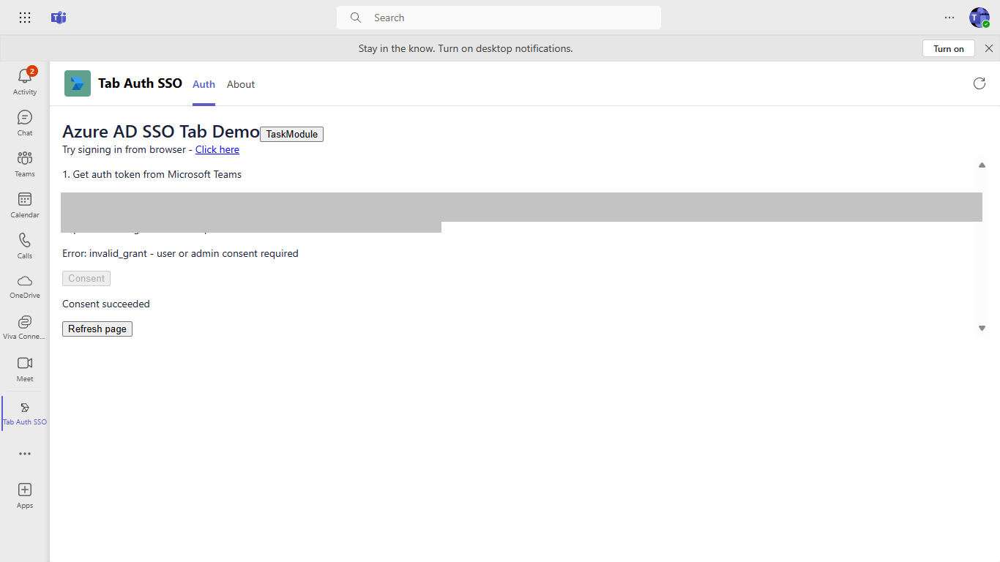

# Tabs Azure AD SSO Sample using NodeJS

This sample shows how to implement Azure AD single sign-on support for tabs. It will:

1. Obtain an access token for the logged-in user using SSO

2. Call a web service - also part of this project - to exchange this access token for one with User.Read permission

3. Call Graph and retrieve the user's profile

## Prerequisites

You will need:

1. A global administrator account for an Office 365 tenant. Testing in a production tenant is not recommended! You can get a free tenant for development use by signing up for the [Office 365 Developer Program](https://developer.microsoft.com/en-us/microsoft-365/dev-program).

1. To test locally, [NodeJS](https://nodejs.org/en/download/) must be installed on your development machine.

1. To test locally, you'll need [Ngrok](https://ngrok.com/) installed on your development machine.
Make sure you've downloaded and installed Ngrok on your local machine. ngrok will tunnel requests from the Internet to your local computer and terminate the SSL connection from Teams.

> NOTE: The free ngrok plan will generate a new URL every time you run it, which requires you to update your Azure AD registration, the Teams app manifest, and the project configuration. A paid account with a permanent ngrok URL is recommended.

## Step 1: Register an Azure AD Application

Your tab needs to run as a registered Azure AD application in order to obtain an access token from Azure AD. In this step you'll register the app in your tenant and give Teams permission to obtain access tokens on its behalf.

1. Create an [AAD application](https://docs.microsoft.com/en-us/microsoftteams/platform/tabs/how-to/authentication/auth-aad-sso#1-create-your-aad-application-in-azure) in Azure. You can do this by visiting the "Azure AD app registration" portal in Azure.

    * Set your application URI to the same URI you've created in Ngrok. 
        * Ex: `api://contoso.ngrok.io/{appId}`
        using the application ID that was assigned to your app
    * Setup your redirect URIs. This will allow Azure AD to return authentication results to the correct URI.
        * Visit `Manage > Authentication`. 
        * Create a redirect URI in the format of: `https://contoso.ngrok.io/auth-end`.
        * Enable Implicit Grant by selecting `Access Tokens` and `ID Tokens`.
    * Setup a client secret. You will need this when you exchange the token for more API permissions from your backend.
        * Visit `Manage > Certificates & secrets`
        * Create a new client secret.
    * Setup your API permissions. This is what your application is allowed to request permission to access.
        * Visit `Manage > API Permissions`
        * Make sure you have the following Graph permissions enabled: `email`, `offline_access`, `openid`, `profile`, and `User.Read`.
        * Our SSO flow will give you access to the first 4 permissions, and we will have to exchange the token server-side to get an elevated token for the `profile` permission (for example, if we want access to the user's profile photo).

    * Expose an API that will give the Teams desktop, web and mobile clients access to the permissions above
        * Visit `Manage > Expose an API`
        * Add a scope and give it a scope name of `access_as_user`. Your API url should look like this: `api://contoso.ngrok.io/{appID}/access_as_user`. In the "who can consent" step, enable it for "Admins and users". Make sure the state is set to "enabled".
        * Next, add two client applications. This is for the Teams desktop/mobile clients and the web client.
            * 5e3ce6c0-2b1f-4285-8d4b-75ee78787346
            * 1fec8e78-bce4-4aaf-ab1b-5451cc387264

## Update the app manifest and config.js file

1. Update the `manifest.json` file as follows:

    * Generate a new unique ID for the application and replace the id field with this GUID. On Windows, you can generate a new GUID in PowerShell with this command:
    ~~~ powershell
     [guid]::NewGuid()
    ~~~
    * Ensure the package name is unique within the tenant where you will run the app
    * Replace `{ngrokSubdomain}` with the subdomain you've assigned to your Ngrok account in step #1 above.
    * Update your `webApplicationInfo` section with your Azure AD application ID that you were assigned in step #2 above.

2. Update your `config/default.json` file
    * Replace the `tab.id` property with you Azure AD application ID
    * Replace the `tab.password` property with the "client secret" you were assigned in step #2
    * If you want to use a port other than 3333, fill that in here (and in your ngrok command)

## Running the app locally

1. Run Ngrok to expose your local web server via a public URL. Make sure to point it to your Ngrok URI. For example, if you're using port 3333 locally, run: 
    * Win: `./ngrok http 3333 -host-header=localhost:3333 -subdomain="contoso"`
    * Mac: `/ngrok http 3333 -host-header=localhost:3333 -subdomain="contoso"`

Leave this running while you're running the application locally, and open another command prompt for the steps which follow.

2. Install the neccessary NPM packages and start the app
    * `npm install`
    * `npm start`

Thhe app should start running on port 3333 or the port you configured

## Packaging and installing your app to Teams

1. Package your manifest 
    * `gulp generate-manifest`
    * This will create a zip file in the manifest folder
2. Install in Teams
    * Open Teams and visit the app store. Depending on the version of Teams, you may see an "App Store" button in the bottom left of Teams or you can find the app store by visiting `Apps > More Apps` in the left-hand app rail.
    * Install the app by clicking on the `Upload a custom app` link in the bottom left-hand side of the app store.
    * Upload the manifest zip file created in step #1

## Trying out the app

1. Once you've installed the app, it should automatically open for you. Visit the `Auth Tab` to begin testing out the authentication flow.
2. Follow the onscreen prompts. The authentication flow will print the output to your screen.

 * The first time you run the app it should get an access token from Microsoft Teams, but it won't be able to get one from the server unless the user or an administrator consents. If this is necessary, you will see a consent button.

 

 * Click the consent button and a pop-up window will display the consent dialog from Azure AD.

 * Once you've granted all the permissions, the page will use the access token it received to make a Graph API call.

 

 * Once you've granted all the permissions, you can revisit this tab and you will notice that you will automatically be logged in.

* The SSO even works on mobile devices.

## Testing the consent process

If you need to remove all consents for the application for test purposes, simply delete its service principal in the Azure AD portal. It may take a few minutes for cached values to time out. The service principal is created automatically the first time someone consents.

# App structure

## Routes

Compared to the Hello World sample, this app has four additional routes:
1. `/ssoDemo` renders the tab UI. 
    * This is the tab called `Auth Tab` in personal app inside Teams. The purpose of this page is primarily to execute the `auth.js` file that handles initiates the authentication flow.
    * This tab can also be added to Teams channels
2. `/getProfileOnBehalfOf` does not render anything but instead is the server-side route for initiating the [on-behalf-of flow](https://docs.microsoft.com/en-us/azure/active-directory/develop/v1-oauth2-on-behalf-of-flow). 
    * It takes the token it receives from the `/ssoDemo` page and attemps to exchange it for a new token that has elevated permissions to access the `profile` Graph API (which is usually used to retrieve the users profile photo).
    * If it fails (because the user hasn't granted permission to access the `profile` API), it returns an error to the `/ssoDemo` page. This error is used to display the "Consent" button which uses the Teams SDK to open the `/auth/start` page in a pop-up window.
3. `/auth/start` and `/auth/end` routes are used if the user needs to grant further permissions. This experience happens in a seperate window. 
    * The `/auth/start` page merely creates a valid AAD authorization endpoint and redirects to that AAD consent page.
    * Once the user has consented to the permissions, AAD redirects the user back to `/auth/end`. This page is responsible for returning the results back to the `/auth` page by calling the `notifySuccess` API.
    * This workflow is only neccessary if you want authorization to use additional Graph APIs. Most apps will find this flow unnesseccary if all they want to do is authenticate the user.
    * This workflow is the same as our standard [web-based authentication flow](https://docs.microsoft.com/en-us/microsoftteams/platform/tabs/how-to/authentication/auth-tab-aad#navigate-to-the-authorization-page-from-your-popup-page) that we've always had in Teams before we had single sign-on support. It just so happens that it's a great way to request additional permissions from the user, so it's left in this sample as an illustration of what that flow looks like.

## ssoDemo.js

This Javascript file is served from the `/ssoDemo` page and handles most of the client-side authentication workflow. This file is broken into three main functions:

1. getClientSideToken() -
This function asks Teams for an authentication token from AAD. The token is displayed so you can try it in Postman.

2. getServerSideToken() -
This function sends the token to the backend to exchange for elevated permissions using AAD's [on-behalf-of flow](https://docs.microsoft.com/en-us/azure/active-directory/develop/v1-oauth2-on-behalf-of-flow). In this case, it sends the token to the `/auth/token` route.

3. useServerSideToken() -
This function uses the token to call the Microsoft Graph and display the resulting JSON.

4. requestConsent() - 
This function launches the consent pop-up

Inline code runs these in sequence, running requestConsent only if an `invalid_grant` error is received from the server.

# Additional reading

 For how to get started with Microsoft Teams development see [Get started on the Microsoft Teams platform with Node.js and App Studio](https://docs.microsoft.com/en-us/microsoftteams/platform/get-started/get-started-nodejs-app-studio).

For further information on Single Sign-On and how it works, visit our [Single Sign-On documentation](https://docs.microsoft.com/en-us/microsoftteams/platform/tabs/how-to/authentication/auth-aad-sso)

# Contributing

This project welcomes contributions and suggestions.  Most contributions require you to agree to a
Contributor License Agreement (CLA) declaring that you have the right to, and actually do, grant us
the rights to use your contribution. For details, visit https://cla.microsoft.com.

When you submit a pull request, a CLA-bot will automatically determine whether you need to provide
a CLA and decorate the PR appropriately (e.g., label, comment). Simply follow the instructions
provided by the bot. You will only need to do this once across all repos using our CLA.

This project has adopted the [Microsoft Open Source Code of Conduct](https://opensource.microsoft.com/codeofconduct/).
For more information see the [Code of Conduct FAQ](https://opensource.microsoft.com/codeofconduct/faq/) or
contact [opencode@microsoft.com](mailto:opencode@microsoft.com) with any additional questions or comments.

