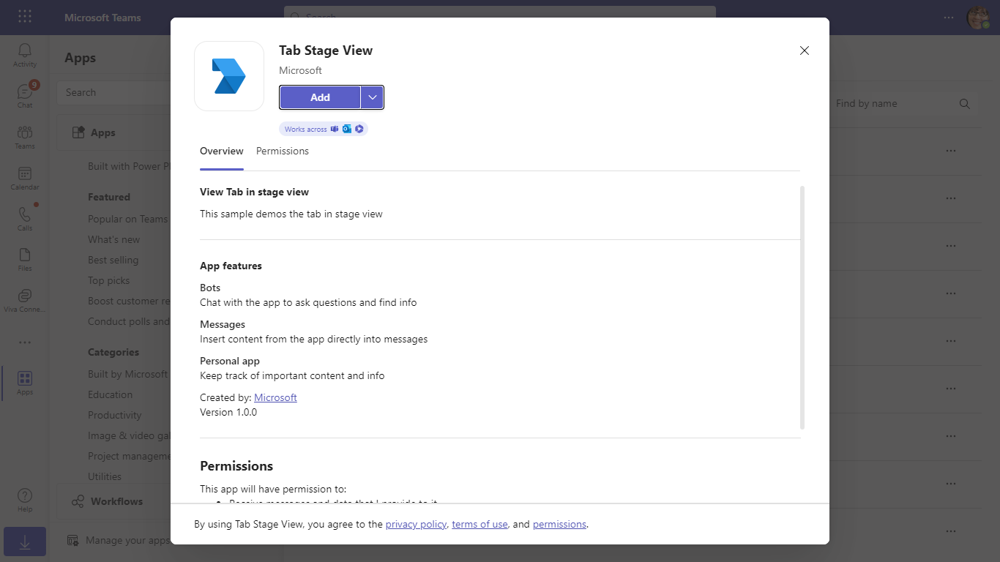
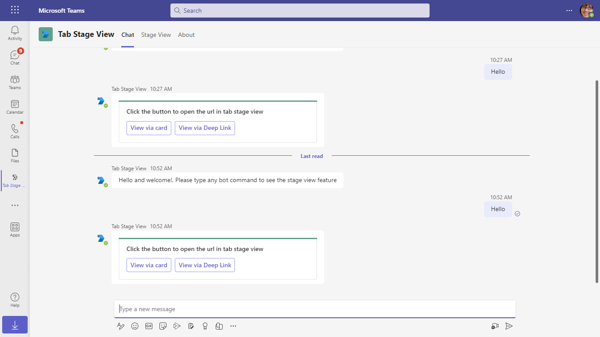
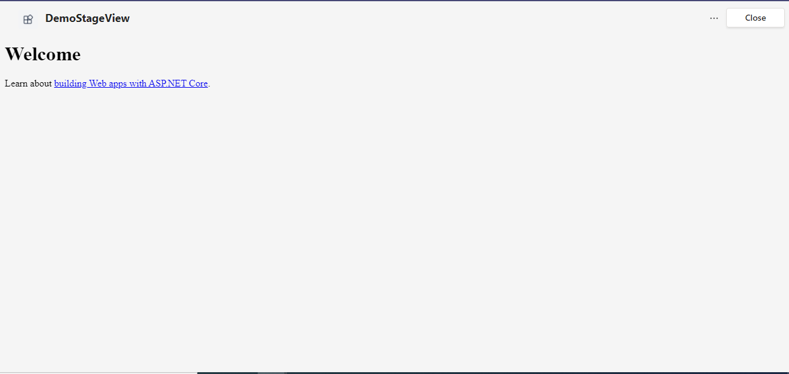
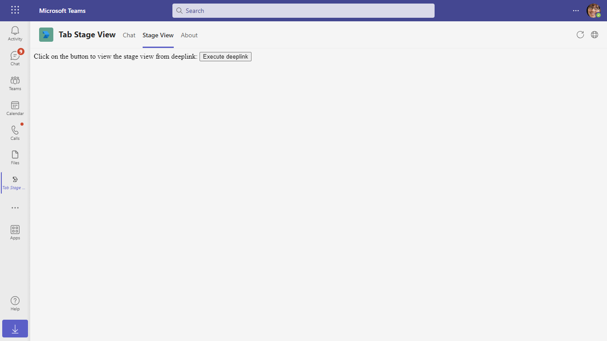

# Stage View

This App talks about the Teams tab in stage view with CSharp.
For reference please check [Tabs link unfurling and Stage View](https://docs.microsoft.com/microsoftteams/platform/tabs/tabs-link-unfurling)

## Included Features
* Bots
* Stage View (tabs)

## Interaction with app


## Try it yourself - experience the App in your Microsoft Teams client
Please find below demo manifest which is deployed on Microsoft Azure and you can try it yourself by uploading the app manifest (.zip file link below) to your teams and/or as a personal app. (Sideloading must be enabled for your tenant, [see steps here](https://docs.microsoft.com/microsoftteams/platform/concepts/build-and-test/prepare-your-o365-tenant#enable-custom-teams-apps-and-turn-on-custom-app-uploading)).

**Stage View:** [Manifest](/samples/tab-stage-view/csharp/demo-manifest/tab-stage-view.zip)

## Prerequisites

- [.NET Core SDK](https://dotnet.microsoft.com/download) version 6.0

  determine dotnet version
  ```bash
  dotnet --version
  ```
- [dev tunnel](https://learn.microsoft.com/en-us/azure/developer/dev-tunnels/get-started?tabs=windows) or [Ngrok](https://ngrok.com/download) (For local environment testing) latest version (any other tunneling software can also be used)
  
- [Teams](https://teams.microsoft.com) Microsoft Teams is installed and you have an account

## Setup

1. Register a new application in the [Microsoft Entra ID – App Registrations](https://go.microsoft.com/fwlink/?linkid=2083908) portal.

2. Setup for Bot
 - Register a Microsoft Entra ID aap registration in Azure portal.
 - Also, register a bot with Azure Bot Service, following the instructions [here](https://docs.microsoft.com/azure/bot-service/bot-service-quickstart-registration?view=azure-bot-service-3.0).
 - Ensure that you've [enabled the Teams Channel](https://docs.microsoft.com/azure/bot-service/channel-connect-teams?view=azure-bot-service-4.0)
 - While registering the bot, use `https://<your_tunnel_domain>/api/messages` as the messaging endpoint.

    > NOTE: When you create your app registration, you will create an App ID and App password - make sure you keep these for later.

3. Setup NGROK
 - Run ngrok - point to port 3978

   ```bash
   ngrok http 3978 --host-header="localhost:3978"
   ```  

   Alternatively, you can also use the `dev tunnels`. Please follow [Create and host a dev tunnel](https://learn.microsoft.com/en-us/azure/developer/dev-tunnels/get-started?tabs=windows) and host the tunnel with anonymous user access command as shown below:

   ```bash
   devtunnel host -p 3978 --allow-anonymous
   ```

4. Setup for code

- Clone the repository

    ```bash
    git clone https://github.com/OfficeDev/Microsoft-Teams-Samples.git
    ```

- Modify the `/appsettings.json` and fill in the following details:
  - `{{Bot Id}}` - Generated from Step 1 while doing Microsoft Entra ID app registration in Azure portal.
  - `{{ Bot Password}}` - Generated from Step 1, also referred to as Client secret
  - `{{ Application Base URL }}` - Your application's base url. E.g. https://12345.ngrok-free.app if you are using ngrok and if you are using dev tunnels, your URL will be like: https://12345.devtunnels.ms.
 
- In a terminal, navigate to `TabInStageView`

    ```bash
    # change into project folder
    cd # TabInStageView
    ```

- Run the bot from a terminal or from Visual Studio, choose option A or B.

  A) From a terminal

  ```bash
  # run the bot
  dotnet run
  ```

  B) Or from Visual Studio

  - Launch Visual Studio
  - File -> Open -> Project/Solution
  - Navigate to `TabInStageView` folder
  - Select `TabInStageView.csproj` file
  - Press `F5` to run the project
  
5. Setup Manifest for Teams
- __*This step is specific to Teams.*__
    - **Edit** the `manifest.json` contained in the ./AppManifest folder to replace your Microsoft App Id (that was created when you registered your app registration earlier) *everywhere* you see the place holder string `{{Microsoft-App-Id or Bot-id}}` (depending on the scenario the Microsoft App Id may occur multiple times in the `manifest.json`)
    - **Edit** the `manifest.json` for `validDomains` and replace `{{domain-name}}` with base Url of your domain. E.g. if you are using ngrok it would be `https://1234.ngrok-free.app` then your domain-name will be `1234.ngrok-free.app` and if you are using dev tunnels then your domain will be like: `12345.devtunnels.ms`.
    **Note:** If you want to test your app across multi hub like: Outlook/Office.com, please update the `manifest.json` in the `TabInStageView\AppManifest_Hub` folder with the required values.
    - **Zip** up the contents of the `Manifest` folder to create a `Manifest.zip` or `AppManifest_Hub` folder to create a `AppManifest_Hub.zip` (Make sure that zip file does not contains any subfolder otherwise you will get error while uploading your .zip package)

- Upload the manifest.zip to Teams (in the Apps view click "Upload a custom app")
   - Go to Microsoft Teams. From the lower left corner, select Apps
   - From the lower left corner, choose Upload a custom App
   - Go to your project directory, the ./AppManifest folder, select the zip folder, and choose Open.
   - Select Add in the pop-up dialog box. Your app is uploaded to Teams.

**Note**: If you are facing any issue in your app, please uncomment [this](https://github.com/OfficeDev/Microsoft-Teams-Samples/blob/main/samples/tab-stage-view/csharp/TabInStageView/AdapterWithErrorHandler.cs#L26) line and put your debugger for local debug.

## Interacting with the bot in Teams
    You can use this tab by following the below steps:
    - In the navigation bar located at the far left in Teams, select the ellipses ●●● and choose your app from the list.

## Running the sample
- In the navigation bar located at the far left in Teams, select the ellipses ●●● and choose your app from the list.

**Install App:**



**Welcome message with feature explanation and Adaptive Card with actions:**


**Open the URL in tab stage view:**



**Opening Collaborative Stage View**. Please refer [Collaborative Stage view](https://review.learn.microsoft.com/en-us/microsoftteams/platform/tabs/tabs-link-unfurling?branch=pr-en-us-7891#collaborative-stage-view) for more details


**Opening stage view from Adaptive card via deep link:**




**Opening stage view from unfurling link. If you copy and paste a link from https://tabstageview.com/card into the compose message area the link will unfurl.**


**Tab with execute deep link action to open stage view:**

  


## Outlook on the web

- To view your app in Outlook on the web.

- Go to [Outlook on the web](https://outlook.office.com/mail/)and sign in using your dev tenant account.

**On the side bar, select More Apps. Your sideloaded app title appears among your installed apps**


**Select your app icon to launch and preview your app running in Outlook on the web**


**After opening Outlook web, click the "New mail" button.**


**On the tool bar on top, select Apps icon. Your sideloaded app title appears among your installed apps**


**Opening the stage view from unfurling link. If you copy and paste a link from https://tabstageview.com/card into the compose message area the link will unfurl.**


**Note:** Similarly, you can test your application in the Outlook desktop app as well.

## Office on the web

- To preview your app running in Office on the web.

- Log into office.com with test tenant credentials

**Select the Apps icon on the side bar. Your sideloaded app title appears among your installed apps**


**Select your app icon to launch your app in Office on the web**

 

**Note:** Similarly, you can test your application in the Office 365 desktop app as well.

## Deploy the bot to Azure

To learn more about deploying a bot to Azure, see [Deploy your bot to Azure](https://aka.ms/azuredeployment) for a complete list of deployment instructions.

## Further reading

- [Tabs](https://learn.microsoft.com/microsoftteams/platform/tabs/what-are-tabs)
- [Stage view](https://learn.microsoft.com/microsoftteams/platform/tabs/tabs-link-unfurling#stage-view)

