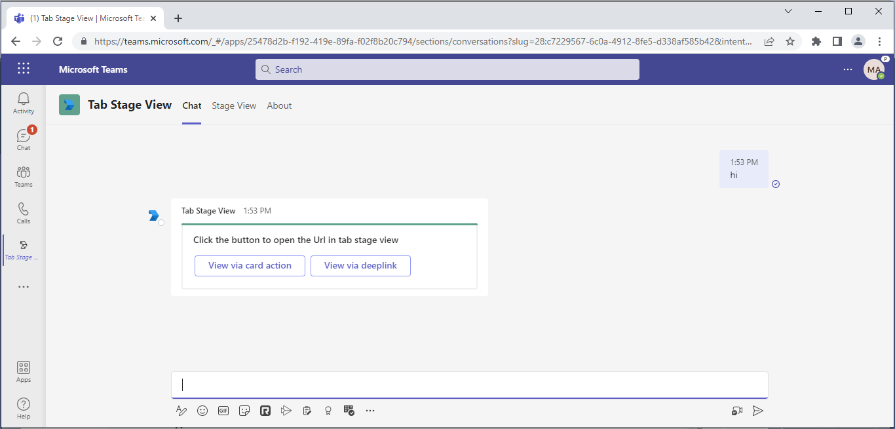
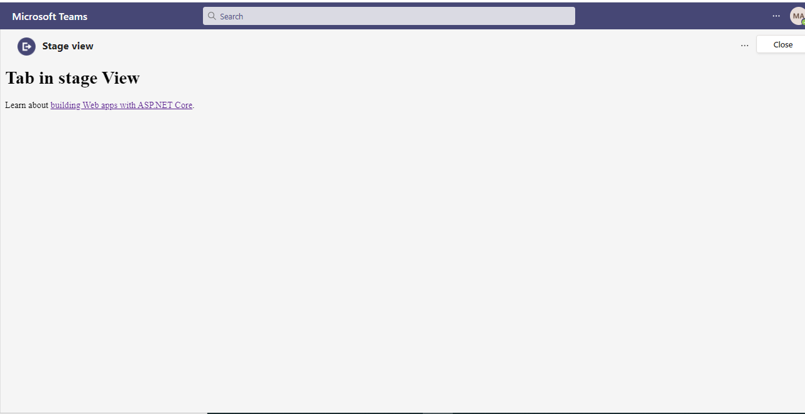

# Stage View

This App talks about the Teams tab in stage view with CSharp.
For reference please check [Tabs link unfurling and Stage View](https://docs.microsoft.com/en-us/microsoftteams/platform/tabs/tabs-link-unfurling)


## Prerequisites

- [.NET Core SDK](https://dotnet.microsoft.com/download) version 3.1

  ```bash
  # determine dotnet version
  dotnet --version
  ```
- Publicly addressable https url or tunnel such as [ngrok](https://ngrok.com/) or [Tunnel Relay](https://github.com/OfficeDev/microsoft-teams-tunnelrelay) 

## Setup

1. Run ngrok - point to port 3978

```bash
# ngrok http -host-header=rewrite 3978
```

2. Create a Bot Registration
   In Azure portal, create a [Bot Framework registration resource](https://docs.microsoft.com/en-us/azure/bot-service/bot-builder-authentication?view=azure-bot-service-4.0&tabs=csharp%2Caadv2#create-the-resource).

   - Ensure that you've [enabled the Teams Channel](https://docs.microsoft.com/en-us/azure/bot-service/channel-connect-teams?view=azure-bot-service-4.0)

3. Modify the `manifest.json` in the `/AppPackage` folder and replace the following details
   - `<<MANIFEST-ID>>` with some unique GUID   
   - `<<BASE-URL>>` with your application's base url, e.g. https://1234.ngrok.io
   - `{{BOT-ID}}` with the id from step 2.
   - `<<VALID DOMAIN>>` with your app domain e.g. *.ngrok.io

4. Zip the contents of `AppPackage` folder into a `manifest.zip`, and use the `manifest.zip` to deploy in app store or add to Teams as in step 7.

5. Modify the `/appsettings.json` and fill in the `{{ Bot Id }}` and `{{ Bot Password }}` with the id from step 2.

6. Add `{{ Application Base URL }}`in appsetting.json with ngrok tunnel url or deployed application base url. 

7. Upload the manifest.zip to Teams (in the Apps view click "Upload a custom app")
   - Go to Microsoft Teams. From the lower left corner, select Apps
   - From the lower left corner, choose Upload a custom App
   - Go to your project directory, the ./appPackage folder, select the zip folder, and choose Open.
   - Select Add in the pop-up dialog box. Your tab is uploaded to Teams.
    
## To try this sample

- In a terminal, navigate to `TabInStageView`

    ```bash
    # change into project folder
    cd # TabInStageView
    ```

- Run the bot from a terminal or from Visual Studio, choose option A or B.

  A) From a terminal

  ```bash
  # run the bot
  dotnet run
  ```

  B) Or from Visual Studio

  - Launch Visual Studio
  - File -> Open -> Project/Solution
  - Navigate to `TabInStageView` folder
  - Select `TabInStageView.csproj` file
  - Press `F5` to run the project

## Interacting with the bot in Teams
    You can use this tab by following the below steps:
    - In the navigation bar located at the far left in Teams, select the ellipses ●●● and choose your app from the list.

## Features of this sample

- Welcome message with feature explanation.


- Opening stage view in tab with Adaptive card action.



- Opening stage view from Adaptive Card Action.



- Opening stage view from Adaptive card via deep link.


- Tab with execute deep link action to open stage view.


## Deploy the bot to Azure

To learn more about deploying a bot to Azure, see [Deploy your bot to Azure](https://aka.ms/azuredeployment) for a complete list of deployment instructions.

## Further reading

- [Bot Framework Documentation](https://docs.botframework.com)
- [Bot Basics](https://docs.microsoft.com/azure/bot-service/bot-builder-basics?view=azure-bot-service-4.0)
- [Activity processing](https://docs.microsoft.com/en-us/azure/bot-service/bot-builder-concept-activity-processing?view=azure-bot-service-4.0)
- [Azure Bot Service Introduction](https://docs.microsoft.com/azure/bot-service/bot-service-overview-introduction?view=azure-bot-service-4.0)
- [Azure Bot Service Documentation](https://docs.microsoft.com/azure/bot-service/?view=azure-bot-service-4.0)
- [.NET Core CLI tools](https://docs.microsoft.com/en-us/dotnet/core/tools/?tabs=netcore2x)
- [Azure CLI](https://docs.microsoft.com/cli/azure/?view=azure-cli-latest)
- [Azure Portal](https://portal.azure.com)
- [Language Understanding using LUIS](https://docs.microsoft.com/en-us/azure/cognitive-services/luis/)
- [Channels and Bot Connector Service](https://docs.microsoft.com/en-us/azure/bot-service/bot-concepts?view=azure-bot-service-4.0)

